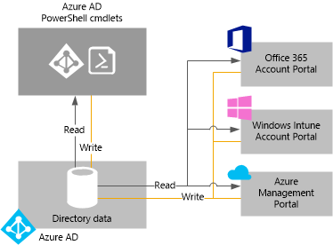

# Manage your Azure AD directory

## What is an Azure AD tenant?
In Azure Active Directory (Azure AD), a tenant is a dedicated instance of an Azure AD directory that your organization receives when it signs up for a Microsoft cloud service such as Azure or Office 365. Each Azure AD directory is distinct and separate from other Azure AD directories. Just like a corporate office building is a secure asset specific to only your organization, an Azure AD directory was also designed to be a secure asset for use by only your organization. The Azure AD architecture isolates customer data and identity information so that users and administrators of one Azure AD directory cannot accidentally or maliciously access data in another directory.

## How can I get an Azure AD directory?
Azure AD provides the core directory and identity management capabilities behind most of Microsoft’s cloud services, including:

- Azure
- Microsoft Office 365
- Microsoft Dynamics CRM Online
- Microsoft Intune

You get an Azure AD directory when you sign up for any of these Microsoft cloud services. You can create additional directories as needed. For example, you might maintain your first directory as a production directory and then create another directory for testing or staging.

### Using the Azure AD directory that comes with a new Azure subscription

We recommend that you use the administrator account you used for your first service when you sign up for other Microsoft services. The information that you provide the first time you sign up for a Microsoft service is used to create a new Azure AD directory instance for your organization. If you use that directory to authenticate sign-in attempts when you subscribe to other Microsoft services, they can use the existing user accounts, policies, settings, or on-premises directory integration you configure in your default directory.

For example, if you originally signed up for a Microsoft Intune subscription and completed the steps necessary to further integrate your on-premises Active Directory with your Azure AD directory by deploying directory synchronization and/or single sign-on servers, you can sign up for another Microsoft cloud service such as Office 365 which can also leverage the same directory integration benefits you now use with Microsoft Intune.

For more information about integrating your on-premises directory with Azure AD, see [Directory integration](./connect/active-directory-aadconnect.md).

### Associate an existing Azure AD directory with a new Azure subscription
You can associate a new Azure subscription with the same directory that authenticates sign-in for an existing Office 365 or Microsoft Intune subscription. For more information on that scenario, see [Manage the directory for your Office 365 subscription in Azure](active-directory-how-subscriptions-associated-directory.md#manage-the-directory-for-your-office-365-subscription-in-azure).

### Create an Azure AD directory by signing up for a Microsoft cloud service as an organization
If you don’t yet have a subscription to a Microsoft cloud service, you can use one of the following links to sign up. Signing up for your first service creates an Azure AD directory automatically.

- [Azure](https://account.windowsazure.cn/organization)
- [Office 365](http://products.office.com/business/compare-office-365-for-business-plans/)
- [Microsoft Intune](https://portal.office.com/Signup/Signup.aspx?OfferId=40BE278A-DFD1-470a-9EF7-9F2596EA7FF9&dl=INTUNE_A&ali=1#0%20)

### Manage an Azure-provisioned Default directory
Today, a directory is automatically created when you sign up for Azure and your subscription is associated with that directory. But if you originally signed up for Azure before October 2013, a directory was not automatically created. In that case, Azure may have “backfilled” for your account by provisioning a Default directory for it. Your subscription was then associated with that Default directory.

Backfilling of directories was done in October 2013 as part of an overall improvement to the security model for Azure. It helps offer organizational identity features to all Azure customers and ensures that all Azure resources are accessed in the context of a user in directory. You cannot use Azure without a directory. To achieve that, any user who was signed up prior to July 7, 2013 but did not have a directory had to have one created. If you had already created a directory, then your subscription was associated with that directory.

There are no costs for using Azure AD. The directory is a free resource. There is an additional Azure Active Directory Premium tier that is licensed separately and provides additional features such as company branding and self-service password reset.

To change the display name of your directory, click the directory in the portal and click **Configure**. As explained later in this topic, you can add a new directory or delete a directory that you no longer need. To associate your subscription with a different directory, click the **Settings** extension in the left navigation, and at the bottom of the **Subscriptions** page, click **Edit Directory**. You can also create a custom domain using a DNS name that you have registered instead of the default *.partner.onmschina.cn domain, which may be preferable with a service such as SharePoint Online.

## How can I manage directory data
As an administrator of one or more Microsoft cloud service subscriptions, you can either use the Azure Management Portal, the Microsoft Intune account portal, or the Office 365 Admin Center to manage your organizations directory data. You can also download and run [Azure Active Directory Module for Windows PowerShell](https://msdn.microsoft.com/library/azure/jj151815.aspx) cmdlets to help you manage data stored in Azure AD.

From either of these portals (or cmdlets), you can:

- Create and manage user and group accounts
- Manage related cloud service(s) your organization subscribes to
- Set up on-premises integration with your directory service

The Azure Management Portal, Office 365 Admin Center, Microsoft Intune account portal and the Azure AD cmdlets all read from and write to a single shared instance of Azure AD that is associated with your organization’s directory, as shown in the following illustration. In this way, portals (or cmdlets) act as a front-end interface that pull in and/or modify your directory data.

When you change your organization's data using any of the portals or cmdlets while signed in under the context of one of these services, the changes are also shown in the other portals the next time you sign in. This data is shared across the Microsoft cloud services to which you subscribe.

For example, if you use the Office 365 Admin Center to block a user from signing in, that action blocks the user from signing in to any other service to which your organization is currently subscribed to. If you view the same user account in the Microsoft Intune account portal, you also see that the user is blocked.

## How can I add and manage multiple directories?
You can add an Azure AD directory in the Azure Management Portal. Select the **Active Directory** extension on the left and click **Add**.

You can manage each directory as a fully independent resource: each directory is a peer, fully-featured, and logically independent of other directories that you manage; there is no parent-child relationship between directories. This independence between directories includes resource independence, administrative independence, and synchronization independence.

- **Resource independence**. If you create or delete a resource in one directory, it has no impact on any resource in another directory, with the partial exception of external users, described below. If you use a custom domain 'contoso.com' with one directory, it cannot be used with any other directory.
- **Administrative independence**.  If a non-administrative user of directory 'Contoso', creates a test directory 'Test' then:
  
  - The directory sync tool, to synchronize data with a single AD forest.
  - The administrators of directory 'Contoso' have no direct administrative privileges to directory 'Test' unless an administrator of 'Test' specifically grants them these privileges. Administrators of 'Contoso' can control access to directory 'Test' by virtue of their control of the user account which created 'Test.'
    
    And if you change (add or remove) an administrator role for a user in one directory, the change does not affect any administrator role that user may have in another directory.
- **Synchronization independence**. You can configure each Azure AD independently to get data synchronized from a single instance of either:
  
  - The directory sync tool, to synchronize data with a single AD forest
  - The Azure Active Directory Connector for Forefront Identity Manager, to synchronize data with one or more on-premises forests, and/or non-AD data sources.

Also note that unlike other Azure resources, your directories are not child resources of an Azure subscription. So if you cancel or allow your Azure subscription to expire, you can still access your directory data using Azure AD PowerShell, the Azure Graph API, or other interfaces such as the Office 365 Admin Center. You can also associate another subscription with the directory.

## How can I delete an Azure AD directory?
A global administrator can delete an Azure AD directory from the portal. When a directory is deleted, all resources contained in the directory are also deleted; so you should be sure you don’t need the directory before you delete it.

> [!NOTE]
> If the user is signed in with a work or school account, the user must not be attempting to delete his or her home directory. For example, if the user is signed in as joe@contoso.partner.onmschina.cn, that user cannot delete the directory that has contoso.partner.onmschina.cn as its default domain.
> 
> 

Azure AD requires that certain conditions are met to delete a directory. This reduces risk that deleting a directory negatively impacts users or applications, such as the ability of users to sign in to Office 365 or access resources in Azure. For example, if a directory for a subscription is unintentionally deleted, then users can't access the Azure resources for that subscription.

The following conditions are checked:

- The only user in the directory should be the global administrator who is to delete the directory. Any other users must be deleted before the directory can be deleted. If users are synchronized from on-premises, then sync must be turned off, and the users must be deleted in the cloud directory by using the Azure portal or Azure PowerShell cmdlets. There is no requirement to delete groups or contacts, such as contacts added from the Office 365 Admin Center.
- There can be no applications in the directory. Any applications must be deleted before the directory can be deleted.
- No multi-factor authentication providers can be linked to the directory.
- There can be no subscriptions for any Microsoft Online Services such as Azure, Office 365, or Azure AD Premium associated with the directory. For example, if a default directory was created for you in Azure, you cannot delete this directory if your Azure subscription still relies on this directory for authentication. Similarly, you can't delete a directory if another user has associated a subscription with it. 

## Next steps
- [Azure AD Forum](https://social.msdn.microsoft.com/Forums/home?forum=WindowsAzureAD)
- [Azure Multi-Factor Authentication Forum](https://social.msdn.microsoft.com/Forums/home?forum=windowsazureactiveauthentication)
- [Stack Overflow for Azure questions](http://stackoverflow.com/questions/tagged/azure)
- [Azure Active Directory PowerShell](https://docs.microsoft.com/powershell/azure/active-directory)
- [Assigning administrator roles in Azure AD](active-directory-assign-admin-roles.md)

<!--Update_Description: wording update -->   
