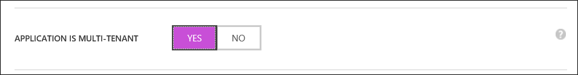
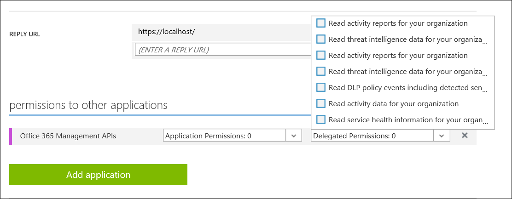

# Apps, permissions, and consent in Azure Active Directory
Within Azure Active Directory, you can add applications to your directory.  The applications can vary depending on the type of application.  To view applications in the Classic Management Portal, select a directory and choose applications.

## Types of apps

1. **Single-tenant apps**  
    - **Single-tenant apps** - Often referred to as line-of-business (LOB) apps. This is the case where someone within your organization develops their own app, and would like users in the organization to be able to sign in to the app.

    - **App Proxy apps** - When you expose an on-prem application with Azure AD App Proxy, a single-tenant app is registered in your tenant (in addition to the App Proxy service). This app is what represents your on-prem application for all cloud interactions (for example, authentication). (App Proxy requires Azure AD Basic or higher.)

2. **Multi-tenant apps**
    - **Multi-tenant apps which others can consent to** - similar to “single-tenant apps that your organization develops”. The main difference (besides the logic in the app itself) is that users from other tenants can also consent to and sign in to the app. 
    
    - **Multi-tenant apps others develop, which Contoso can consent to**. (Or “consented apps”, for short.) This is the flip side of “multi-tenant apps your organization develops”. When another organization develops a multi-tenant app, users of your organization can consent to the app and sign in to it.
    - **Microsoft first-party apps** - Apps that represent Microsoft services. Consent is driven by the fact that you sign up for the service. There is sometimes special UX and logic for certain first-party apps that is often used when establishing policies around access to the app. 
    - **Pre-integrated apps** - Apps available in the Azure AD App Gallery, which you can add to your directory to provide single sign-on (and in some cases, provisioning) to popular SaaS apps.
    - **Azure AD single sign-on**: “Real” SSO, for apps that can be integrated with Azure AD, through a supported sign-in protocol such as SAML 2.0 or OpenID Connect. The wizard walks you through setting it up.
    - **Password single sign-on**: Azure AD securely stores the user’s credentials for the app, and the credentials are “injected” into the sign-in form by the Azure AD App Access browser extension. Also known as “password vaulting”.

## Permissions

When an app is registered, the user performing the app registration (that is, the developer) defines which permissions the app needs access to, and which resources. (The resources are, themselves, defined as other apps.) For example, someone building a mail reader app, would state that their app requires the “Access mailboxes as the signed-in user” permission in the “Office 365 Exchange Online” resource:

In order for one app (the client) to request a certain permission from another app (the resource), the developer of the resource app defines the permissions that exist. In our example, Microsoft, the owner of the “Office 365 Exchange Online” resource app, have defined a permission named “Access mailboxes as the signed-in user”.

When defining permissions, the app developer must define if the permission can be consented to, or if it requires admin consent. This allows developers to allow users to consent on their own to apps requesting only low-sensitivity permissions, but require admins to consent to more sensitive permissions. For example, the “Azure Active Directory” resource app, has been defined, so users can consent to apps, requesting limited read-only permissions.  However, admin consent is required for full read permissions, and all write permissions.

Because native clients are not authenticated, an app defined as a native client app can only request delegated permissions. This means that there must always be an actual user involved when obtaining a token. Web apps and web APIs (confidential clients), must always authenticate with Azure AD when getting an access token. Meaning they also have the possibility of requesting app-only permissions. For example, if one back-end service needs to authenticate to another back-end service. Applications requesting app-only permissions always require administrator consent.

Summarizing:

- An app (client) states the permissions it needs for other apps (resources).
- An app (resource) states what permissions are exposed to other apps (clients).
- A permission can be an app-only permission, or a delegated permission.
- A delegated permission can be marked as “allows user consent”, or “requires admin consent”.
- An app can behave as a client (by declaring that it needs permissions to a resource), as a resource (by declaring which permissions it exposes), or as both.

<!--Update_Description: update metadata properties -->  
