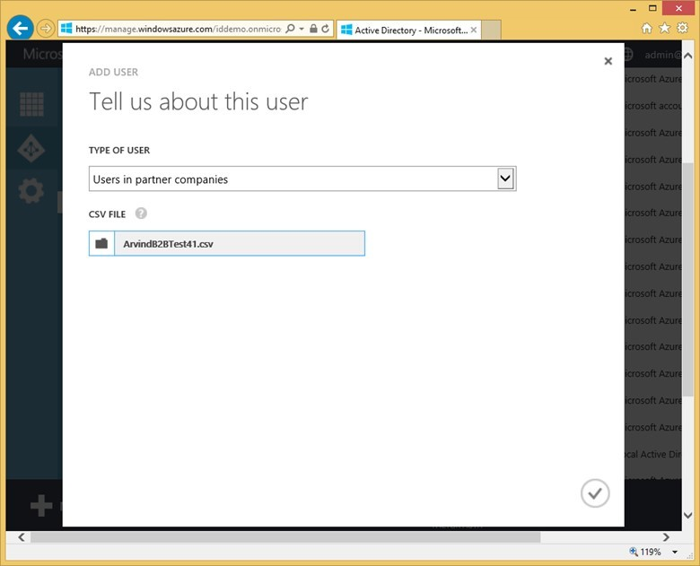

# Azure Active Directory B2B collaboration

Azure Active Directory (Azure AD) B2B collaboration lets you enable access to your corporate applications from partner-managed identities. You can create cross-company relationships by inviting and authorizing users from partner companies to access your resources. Complexity is reduced because each company federates once with Azure Active Directory and each user is represented by a single Azure AD account. Security is increased because access is revoked when partner users are terminated from their organizations, and unintended access via membership in internal directories is prevented. For business partners who don't already have Azure AD, B2B collaboration has a streamlined sign-up experience to provide Azure AD accounts to your business partners.

-   Your business partners use their own sign-in credentials, which frees you from managing an external partner directory, and from the need to remove access when users leave the partner organization.

-   You manage access to your apps independently of your business partner's account lifecycle. This means, for example, that you can revoke access without having to ask the IT department of your business partner to do anything.

## Capabilities

B2B collaboration simplifies management and improves security of partner access to corporate resources including SaaS apps such as Office 365, Salesforce, Azure Services, and every mobile, cloud and on-premises claims-aware application. B2B collaboration enables partners manage their own accounts and enterprises can apply security policies to partner access.

Azure Active Directory B2B collaboration is easy to configure with simplified sign-up for partners of all sizes even if they don’t have their own Azure Active Directory via an email-verified process. It is also easy to maintain with no external directories or per partner federation configurations.

## B2B collaboration process

1. Azure AD B2B collaboration allows a company administrator to invite and authorize a set of external users by uploading a comma-separated values (CSV) file of no more than 2000 lines to the B2B collaboration portal.

  

2. The portal will send email invitations to these external users.

3. The invited user will either sign in to an existing work account with Microsoft (managed in Azure AD), or get a new work account in Azure AD.

4. Once signed in, the user will be redirected to the app that was shared with them.

Invitations to consumer email addresses (for example, Gmail or [*comcast.net*](http://comcast.net/)) are not currently supported.

For more on how B2B collaboration works, check out [this video](http://aka.ms/aadshowb2b).

## Next steps
Browse our other articles on Azure AD B2B collaboration.

- [What is Azure AD B2B collaboration?](/documentation/articles/active-directory-b2b-what-is-azure-ad-b2b/)
- [How it works](/documentation/articles/active-directory-b2b-how-it-works/)
- [Detailed walkthrough](/documentation/articles/active-directory-b2b-detailed-walkthrough/)
- [CSV file format reference](/documentation/articles/active-directory-b2b-references-csv-file-format/)
- [External user token format](/documentation/articles/active-directory-b2b-references-external-user-token-format/)
- [External user object attribute changes](/documentation/articles/active-directory-b2b-references-external-user-object-attribute-changes/)
- [Current preview limitations](/documentation/articles/active-directory-b2b-current-preview-limitations/)
- [Article Index for Application Management in Azure Active Directory](./active-directory-apps-index.md)