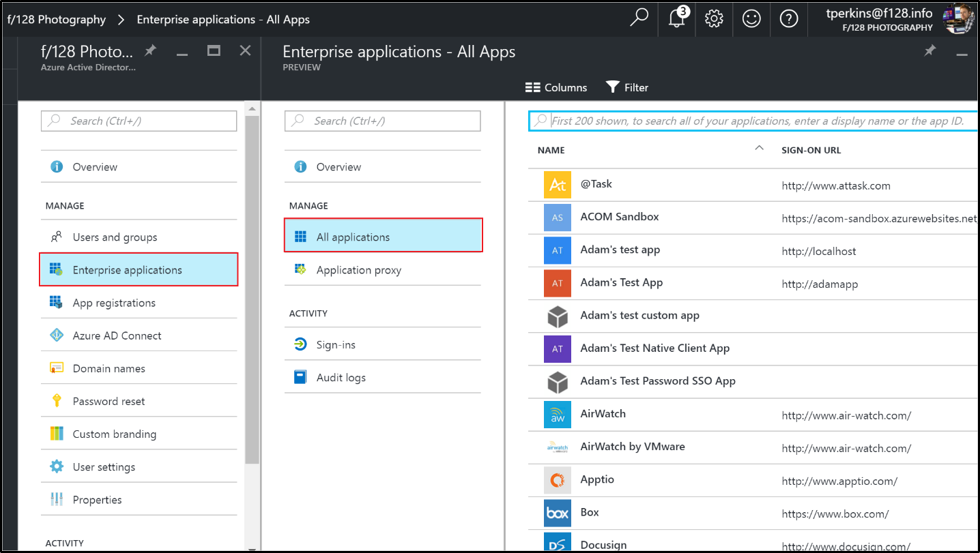
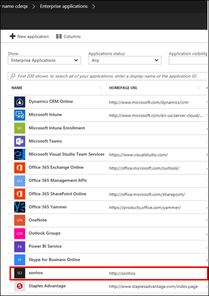
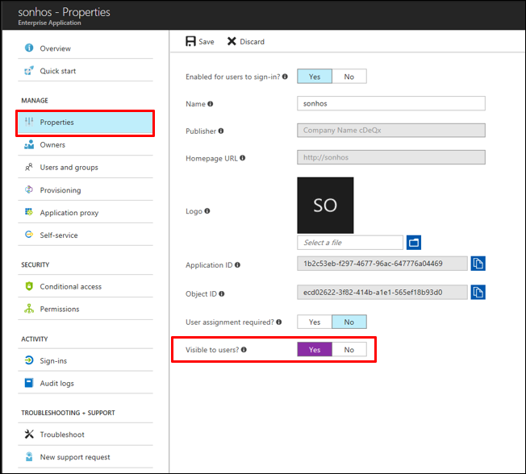

# Hide an application from user's experience in Azure Active Directory

If you have an application that you do not want to show on users’ access panels or Office 365 launchers, there are options to hide this app tile.  The following two options are available for hiding applications from user's app launchers.

### How do I hide a third-party app from user’s access panel and O365 app launchers?

1.	Sign in to the [Azure portal](https://portal.azure.cn) with an account that's a global admin for the directory.
2.	Select **All services**, enter **Azure Active Directory** in the text box, and then select **Enter**.
3.	On the **Azure Active Directory - *directoryname*** screen (that is, the Azure AD screen for the directory you are managing), select **Enterprise applications**.

4.	On the **Enterprise applications** screen, select **All applications**. You see a list of the apps you can manage.
5.	On the **Enterprise applications - All applications** screen, select an app. 

6.	On the ***appname*** screen (that is, the screen with the name of the selected app in the title), select Properties.
7.	On the ***appname* - Properties** screen, select **Yes** for **Visible to users?**.

8.	Select the **Save** command.

## Next steps
* [See all my groups](active-directory-groups-view-azure-portal.md)
* [Assign a user or group to an enterprise app](active-directory-coreapps-assign-user-azure-portal.md)
* [Remove a user or group assignment from an enterprise app](active-directory-coreapps-remove-assignment-azure-portal.md)
* [Change the name or logo of an enterprise app](active-directory-coreapps-change-app-logo-user-azure-portal.md)
