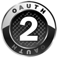

<properties
    pageTitle="Azure Active Directory developer's guide | Azure"
    description="This article provides a comprehensive guide to developer-oriented resources for Azure Active Directory."
    services="active-directory"
    documentationcenter="dev-center-name"
    author="bryanla"
    manager="mbaldwin"
    editor="" />
<tags
    ms.assetid="5c872c89-ef04-4f4c-98de-bc0c7460c7c2"
    ms.service="active-directory"
    ms.devlang="na"
    ms.topic="hero-article"
    ms.tgt_pltfrm="na"
    ms.workload="identity"
    ms.date="12/09/2016"
    wacn.date=""
    ms.author="mbaldwin" />

# Azure Active Directory developer's guide
## Overview
As an identity management as a service (IDMaaS) platform, Azure Active Directory (AD) provides developers an effective way to integrate identity management into their applications. The following articles provide overviews on implementation and key features of Azure AD. We suggest that you read them in order, or jump to [Getting started](#getting-started) if you're ready to dig in.

1. [The benefits of Azure AD integration](/documentation/articles/active-directory-how-to-integrate/): Discover why integration with Azure AD offers the best solution for secure sign-in and authorization.
2. [Azure AD authentication scenarios](/documentation/articles/active-directory-authentication-scenarios/): Take advantage of simplified authentication in Azure AD to provide sign-on to your application.
3. [Integrating applications with Azure AD](/documentation/articles/active-directory-integrating-applications/): Learn how to add, update, and remove applications from Azure AD, and about the branding guidelines for integrated apps.
4. [Azure AD Graph API](/documentation/articles/active-directory-graph-api/): Use the Azure AD Graph API to programmatically access Azure AD through REST API endpoints. The Azure AD Graph API is also accessible through [Microsoft Graph](https://graph.microsoft.io/). Microsoft Graph provides a unified API that enables access to multiple Microsoft cloud service APIs, through a single REST API endpoint, and with a single access token.
5. [Azure AD authentication libraries](/documentation/articles/active-directory-authentication-libraries/): Easily authenticate users to obtain access tokens by using Azure AD authentication libraries for .NET, JavaScript, Objective-C, Android, and more.

## Getting started
These tutorials are tailored for multiple platforms and can help you quickly start developing with Azure Active Directory. As a prerequisite, you must [get an Azure Active Directory tenant](/documentation/articles/active-directory-howto-tenant/).

### Mobile and PC application quick-start guides
|  |  |  |  |  |  |  |
|:---:|:---:|:---:|:---:|:---:|:---:|:---:|:---:|
| [iOS](/documentation/articles/active-directory-devquickstarts-ios/) |[Android](/documentation/articles/active-directory-devquickstarts-android/) |[.NET](/documentation/articles/active-directory-devquickstarts-dotnet/) |[Windows Universal](/documentation/articles/active-directory-devquickstarts-windowsstore/) |[Xamarin](/documentation/articles/active-directory-devquickstarts-xamarin/) |[Cordova](/documentation/articles/active-directory-devquickstarts-cordova/) |[Integrate directly with OAuth 2.0](/documentation/articles/active-directory-protocols-oauth-code/) |

### Web application quick-start guides
|  |  |  |  |  |  |
|:---:|:---:|:---:|:---:|:---:|:---:|
| [.NET](/documentation/articles/active-directory-devquickstarts-webapp-dotnet/) |[Java](/documentation/articles/active-directory-devquickstarts-webapp-java/) |[AngularJS](/documentation/articles/active-directory-devquickstarts-angular/) |[Javascript](https://github.com/Azure-Samples/active-directory-javascript-singlepageapp-dotnet-webapi) |[Node.js](/documentation/articles/active-directory-devquickstarts-openidconnect-nodejs/) |[Integrate directly with OpenID Connect](/documentation/articles/active-directory-protocols-openid-connect-code/) |

### Web API quick-start guides
|  |  |
|:---:|:---:|
| [.NET](/documentation/articles/active-directory-devquickstarts-webapi-dotnet/) |[Node.js](/documentation/articles/active-directory-devquickstarts-webapi-nodejs/) |

### Querying the directory quickstart guide
|  |
|:---:|
| [Graph API](/documentation/articles/active-directory-graph-api-quickstart/) |

## How-tos
These articles describe how to perform specific tasks by using Azure Active Directory:

- [Get an Azure AD tenant](/documentation/articles/active-directory-howto-tenant/)
- [Sign in any Azure AD user using the multi-tenant application pattern](/documentation/articles/active-directory-devhowto-multi-tenant-overview/)
- [Authenticate a service/daemon application using a certificate](https://github.com/Azure-Samples/active-directory-dotnet-daemon-certificate-credential/)
- Enable cross-app SSO using ADAL, on [Android](/documentation/articles/active-directory-sso-android/) and on [iOS](/documentation/articles/active-directory-sso-ios/) devices
- [Make your application AppSource Certified for Azure AD](/documentation/articles/active-directory-devhowto-appsource-certified/)
- [List your application in the Azure AD application gallery](/documentation/articles/active-directory-app-gallery-listing/)
- [Submit web apps for Office 365 to the Seller Dashboard](https://msdn.microsoft.com/office/office365/howto/submit-web-apps-seller-dashboard)
- [Register an application with Azure Active Directory using the Azure portal](/documentation/articles/active-directory-app-registration/)
- [Understand the Azure Active Directory application manifest](/documentation/articles/active-directory-application-manifest/)
- [Understand the branding guidelines for the sign-in and app acquisition buttons in your client application](/documentation/articles/active-directory-branding-guidelines/)
- [Preview: How to build apps that sign users in with both personal & work or school accounts](/documentation/articles/active-directory-appmodel-v2-overview/)
- [Preview: Configuring token lifetimes in Azure AD](/documentation/articles/active-directory-configurable-token-lifetimes/) using PowerShell. See [Policy operations](https://msdn.microsoft.com/zh-cn/library/azure/ad/graph/api/policy-operations) and the [Policy entity](https://msdn.microsoft.com/zh-cn/library/azure/ad/graph/api/entity-and-complex-type-reference#policy-entity) for details on configuring via the Azure AD Graph API.

## Reference
These articles provide a foundation reference for REST and authentication library APIs, protocols, errors, code samples, and endpoints.  

### Support
- [Tagged questions](http://stackoverflow.com/questions/tagged/azure-active-directory): Find Azure Active Directory solutions on Stack Overflow by searching for the tags [azure-active-directory](http://stackoverflow.com/questions/tagged/azure-active-directory) and [adal](http://stackoverflow.com/questions/tagged/adal).
- See the [Azure AD developer glossary](/documentation/articles/active-directory-dev-glossary/) for definitions of some of the commonly used terms related to application development and integration.

### Code
- [Azure Active Directory open-source libraries](http://github.com/AzureAD): The easiest way to find a library’s source is by using our [library list](/documentation/articles/active-directory-authentication-libraries/).
- [Azure Active Directory samples](https://github.com/azure-samples?query=active-directory): The easiest way to navigate the list of samples is by using the [index of code samples](/documentation/articles/active-directory-code-samples/).
- [Active Directory Authentication Library (ADAL) for .NET](https://github.com/AzureAD/azure-activedirectory-library-for-dotnet) - Reference documentation is available for both [the latest major version](https://docs.microsoft.com/active-directory/adal/microsoft.identitymodel.clients.activedirectory) and the [the previous major version](https://docs.microsoft.com/active-directory/adal/v2/microsoft.identitymodel.clients.activedirectory).

### Graph API
- [Graph API reference](https://msdn.microsoft.com/zh-cn/library/azure/hh974476.aspx): REST reference for the Azure Active Directory Graph API. [View the interactive Graph API reference experience](https://msdn.microsoft.com/Library/Azure/Ad/Graph/api/api-catalog).
- [Graph API permission scopes](https://msdn.microsoft.com/Library/Azure/Ad/Graph/howto/azure-ad-graph-api-permission-scopes): OAuth 2.0 permission scopes that are used to control the access that an app has to directory data in a tenant.

### Authentication and authorization protocols
- [Signing Key Rollover in Azure AD](/documentation/articles/active-directory-signing-key-rollover/): Learn about Azure AD’s signing key rollover cadence and how to update the key for the most common application scenarios.
- [OAuth 2.0 protocol: Using the authorization code grant](/documentation/articles/active-directory-protocols-oauth-code/): You can use the OAuth 2.0 protocol's authorization code grant, to authorize access to Web applications and Web APIs in your Azure Active Directory tenant.
- [OAuth 2.0 protocol: Understanding the implicit grant](/documentation/articles/active-directory-dev-understanding-oauth2-implicit-grant/): Learn more about the implicit authorization grant, and whether it's right for your application.
- [OAuth 2.0 protocol: Service to Service Calls Using Client Credentials](/documentation/articles/active-directory-protocols-oauth-service-to-service/): The OAuth 2.0 Client Credentials grant permits a web service (a confidential client) to use its own credentials to authenticate when calling another web service, instead of impersonating a user. In this scenario, the client is typically a middle-tier web service, a daemon service, or website.
- [OpenID Connect 1.0 protocol: Sign-in and authentication](/documentation/articles/active-directory-protocols-openid-connect-code/): The OpenID Connect 1.0 protocol extends OAuth 2.0 for use as an authentication protocol. A client application can receive an id_token to manage the sign-in process, or augment the authorization code flow to receive both an id_token and authorization code.
- [SAML 2.0 protocol reference](/documentation/articles/active-directory-saml-protocol-reference/): The SAML 2.0 protocol enables applications to provide a single sign-on experience to their users.
- [WS-Federation 1.2 protocol](http://docs.oasis-open.org/wsfed/federation/v1.2/os/ws-federation-1.2-spec-os.html): Azure Active Directory supports WS-Federation 1.2 as per the Web Services Federation Version 1.2 Specification. For more information about the federation metadata document, please see [Federation Metadata](/documentation/articles/active-directory-federation-metadata/).
- [Supported token and claim types](/documentation/articles/active-directory-token-and-claims/): You can use this guide to understand and evaluate the claims in the SAML 2.0 and JSON Web Tokens (JWT) tokens.

### Build
These overview presentations on developing apps by using Azure Active Directory feature speakers who work directly in the engineering team. The presentations cover fundamental topics, including IDMaaS, authentication, identity federation, and single sign-on.

## Social
- [Active Directory Team blog](http://blogs.technet.com/b/ad/): The latest developments in the world of Azure Active Directory.
- [Azure Active Directory Graph Team blog](http://blogs.msdn.com/b/aadgraphteam): Azure Active Directory information that's specific to the Graph API.
- [Cloud Identity](http://www.cloudidentity.com/blog/): Thoughts on identity management as a service, from a principal Azure Active Directory PM.  

## Windows Server on-premises development
For guidance on using Windows Server and Active Directory Federation Services (ADFS) development, see:

- [AD FS Scenarios for Developers](https://technet.microsoft.com/windows-server-docs/identity/ad-fs/overview/ad-fs-scenarios-for-developers): Provides an overview of AD FS components and how it works, with details on the supported authentication/authorization scenarios.
- [AD FS walkthroughs](https://technet.microsoft.com/windows-server-docs/identity/ad-fs/ad-fs-development): a list of walk-through articles, which provide step-by-step instructions on implementing the related authentication/authorization flows.
