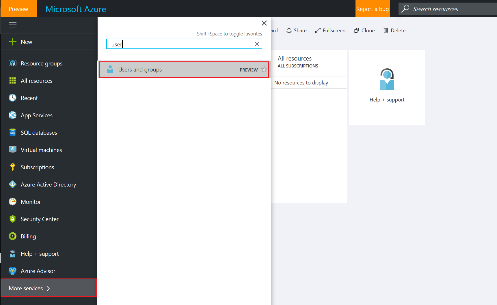

<properties
	pageTitle="Assign a user to administrator roles in Azure Active Directory preview | Azure"
	description="Explains how to change user administrative information in Azure Active Directory"
	services="active-directory"
	documentationCenter=""
	authors="curtand"
	manager="femila"
	editor=""/>

<tags
	ms.service="active-directory"
	ms.workload="identity"
	ms.tgt_pltfrm="na"
	ms.devlang="na"
	ms.topic="article"
	ms.date="09/12/2016"
	ms.author="curtand"
   	wacn.date=""/>

# Assign a user to administrator roles in Azure Active Directory preview

This article explains how to assign an administrative role to a user in Azure Active Directory (Azure AD) preview. [What's in the preview?](/documentation/articles/active-directory-preview-explainer/) For information about adding new users in your organization, see [Add new users to Azure Active Directory](/documentation/articles/active-directory-users-create-azure-portal/). Added users don't have administrator permissions by default, but you can assign roles to them at any time.

## Assign a role to a user

1.  Sign in to the [Azure portal](https://portal.azure.cn) with an account that's a global admin for the directory.

2.  Select **More services**, enter **Users and groups** in the text box, and then select **Enter**.

    

3.  On the **Users and groups** blade, select **All users**.

    

4. On the **Users and groups - All users** blade, select a user from the list.

5. On the blade for the selected user, select **Directory role**, and then assign the user to a role from the **Directory role** list. For more information about user and administrator roles, see [Assigning administrator roles in Azure AD](/documentation/articles/active-directory-assign-admin-roles/).

	  

6. Select **Save**.

## What's next

- [Add a user](/documentation/articles/active-directory-users-create-azure-portal/)
- [Reset a user's password in the new Azure portal](/documentation/articles/active-directory-users-reset-password-azure-portal/)
- [Change a user's work information](/documentation/articles/active-directory-users-work-info-azure-portal/)
- [Manage user profiles](/documentation/articles/active-directory-users-profile-azure-portal/)
- [Delete a user in your Azure AD](/documentation/articles/active-directory-users-delete-user-azure-portal/)
