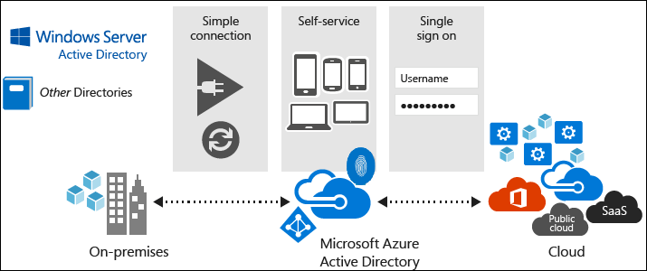

# What is Azure Active Directory?
Azure Active Directory (Azure AD) is Microsoft’s multi-tenant, cloud-based directory, and identity management service that combines core directory services, application access management, and identity protection into a single solution. Azure AD also offers a rich, standards-based platform that enables developers to deliver access control to their applications, based on centralized policy and rules.

- **For app developers.** Azure AD lets you focus on building your apps by letting you integrate with an identity management solution that's used by millions of organizations around the world.

- **For Office 365, Azure customers.** You're already using Azure AD. Each Office 365 and Azure tenant is actually an Azure AD tenant, letting you immediately start to manage your employee-access to your integrated cloud apps.

## How reliable is Azure AD?
The multi-tenant, geo-distributed, high availability design of Azure AD means that you can rely on it for your most critical business needs. Running out of 28 data centers around the world with automated failover, you’ll have the comfort of knowing that Azure AD is highly reliable and that even if a data center goes down, copies of your directory data are live in at least two more regionally dispersed data centers and available for instant access.

For more information about service level agreements, see [Service Level Agreements](https://www.azure.cn/support/legal/sla/).

## Choose an edition
All Microsoft Online business services rely on Azure Active Directory (Azure AD) for sign-in and other identity needs. If you subscribe to any of Microsoft Online business services (for example, Office 365 or Azure), you get Azure AD with access to all of the Free features. With the Azure Active Directory Free edition, you can manage users and groups, synchronize with on-premises directories, get single sign-on across Azure, Office 365, and thousands of popular SaaS applications like Salesforce, Workday, Concur, DocuSign, Box, ServiceNow, Dropbox, and more. 

To enhance your Azure Active Directory, you can add paid capabilities using the Azure Active Directory Basic, Premium P1, and Premium P2 editions. Azure Active Directory paid editions are built on top of your existing free directory, providing enterprise class capabilities spanning self-service, enhanced monitoring, security reporting, Multi-Factor Authentication (MFA), and secure access for your mobile workforce.

> [!NOTE]
> For the pricing options of these editions, see [Azure Active Directory Pricing](https://www.azure.cn/pricing/details/identity/). Azure Active Directory Premium P1, Premium P2, and Azure Active Directory Basic are not currently supported in China. For more information about Azure AD pricing, you can contact the Azure Active Directory Forum.
>

## How can I get started?

**If you are an IT admin:**

- [Try it out!](./index.md) - you can sign up for a trial today and deploy your first cloud solution using this link

**If you are a developer:**
 
- Check out the [Developers Guide](develop/active-directory-developers-guide.md) to Azure Active Directory

- [Start a trial](https://www.azure.cn/pricing/1rmb-trial/) - sign up for a trial today and  start integrating your apps with Azure AD

<!-- Update_Description: wording update -->

