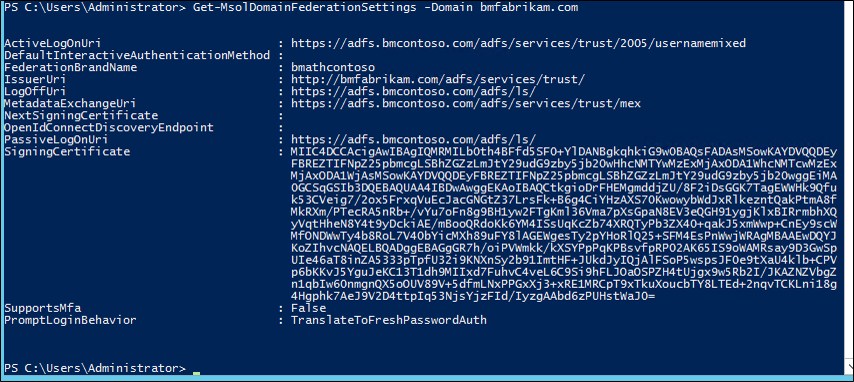
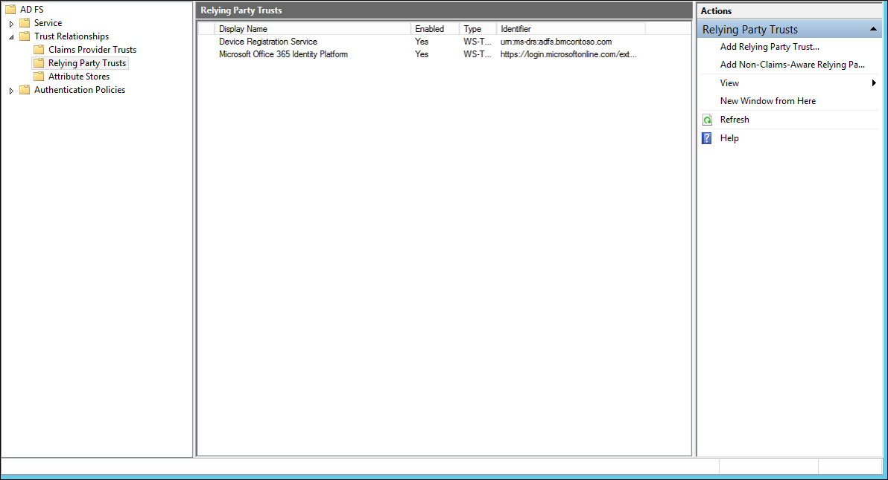
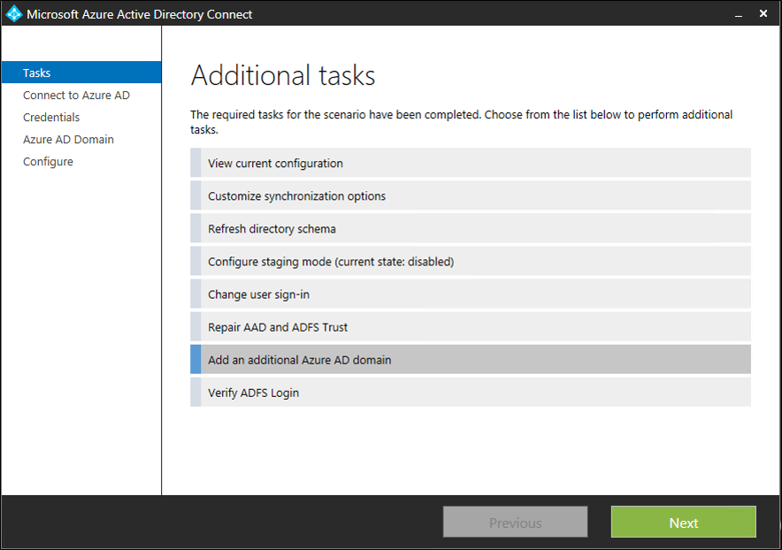
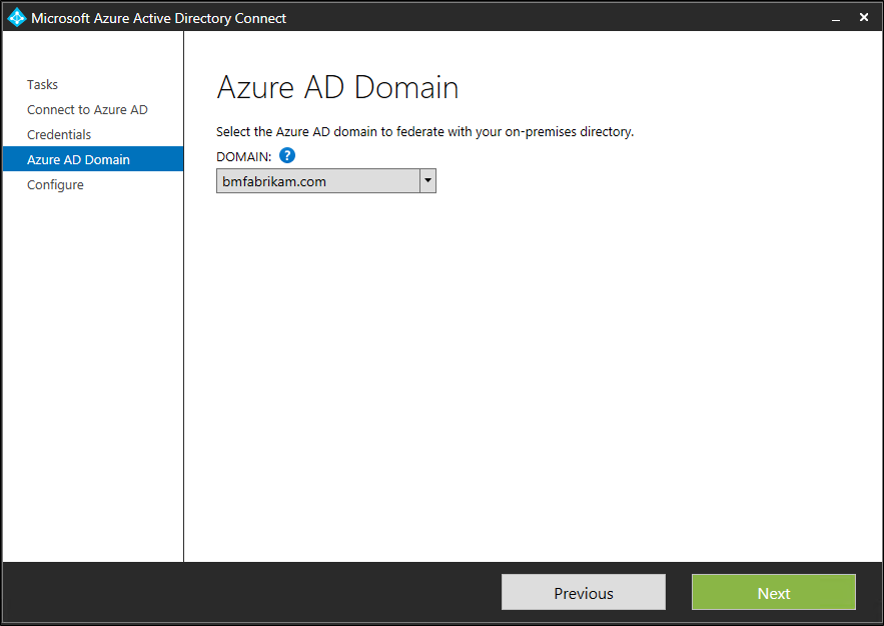
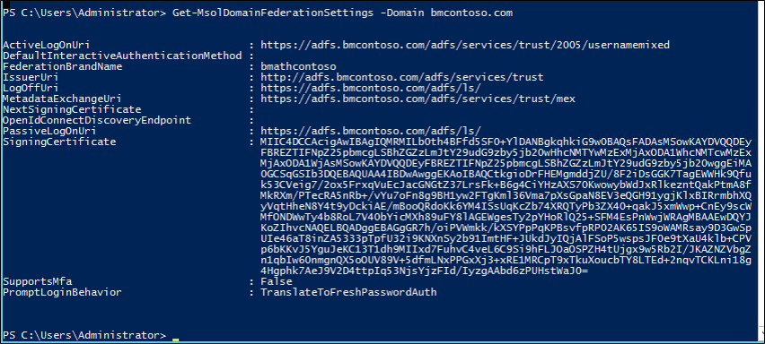
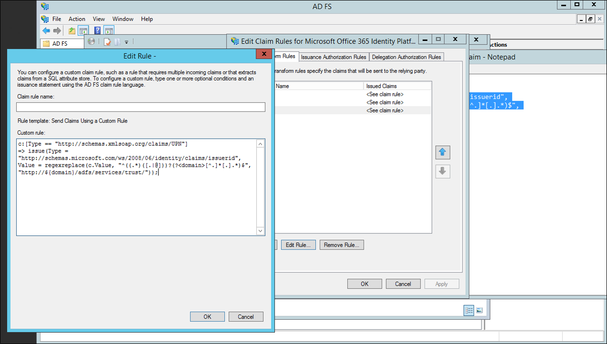

# Multiple Domain Support for Federating with Azure AD
The following documentation provides guidance on how to use multiple top-level domains and sub-domains when federating with Office 365 or Azure AD domains.

## Multiple top-level domain support
Federating multiple, top-level domains with Azure AD requires some additional configuration that is not required when federating with one top-level domain.

When a domain is federated with Azure AD, several properties are set on the domain in Azure.  One important one is IssuerUri.  This is a URI that is used by Azure AD to identify the domain that the token is associated with.  The URI doesn’t need to resolve to anything but it must be a valid URI.  By default, Azure AD sets this to the value of the federation service identifier in your on-premises AD FS configuration.

> [!NOTE]
> The federation service identifier is a URI that uniquely identifies a federation service.  The federation service is an instance of AD FS that functions as the security token service. 
> 
> 

You can vew IssuerUri by using the PowerShell command `Get-MsolDomainFederationSettings -DomainName <your domain>`.


A problem arises when we want to add more than one top-level domain.  For example, let's say you have setup federation between Azure AD and your on-premises environment.  For this document I am using bmcontoso.com.  Now I have added a second, top-level domain, bmfabrikam.com.


When we attempt to convert our bmfabrikam.com domain to be federated, we receive an error.  The reason for this is, Azure AD has a constraint that does not allow the IssuerUri property to have the same value for more than one domain.  


### SupportMultipleDomain Parameter
To workaround this, we need to add a different IssuerUri which can be done by using the `-SupportMultipleDomain` parameter.  This parameter is used with the following cmdlets:

- `New-MsolFederatedDomain`
- `Convert-MsolDomaintoFederated`
- `Update-MsolFederatedDomain`

This parameter makes Azure AD configure the IssuerUri so that it is based on the name of the domain.  This will be unique across directories in Azure AD.  Using the parameter allows the PowerShell command to complete successfully.


Looking at the settings of our new bmfabrikam.com domain you can see the following:



Note that `-SupportMultipleDomain` does not change the other endpoints which are still configured to point to our federation service on adfs.bmcontoso.com.

Another thing that `-SupportMultipleDomain` does is that it ensures that the AD FS system includes the proper Issuer value in tokens issued for Azure AD. It does this by taking the domain portion of the users UPN and setting this as the domain in the IssuerUri, i.e. https://{upn suffix}/adfs/services/trust. 

Thus during authentication to Azure AD or Office 365, the IssuerUri element in the user’s token is used to locate the domain in Azure AD.  If a match cannot be found the authentication will fail. 

For example, if a user’s UPN is bsimon@bmcontoso.com, the IssuerUri element in the token AD FS issues will be set to http://bmcontoso.com/adfs/services/trust. This will match the Azure AD configuration, and authentication will succeed.

The following is the customized claim rule that implements this logic:

```
c:[Type == "http://schemas.xmlsoap.org/claims/UPN"] => issue(Type = "http://schemas.microsoft.com/ws/2008/06/identity/claims/issuerid", Value = regexreplace(c.Value, ".+@(?<domain>.+)", "http://${domain}/adfs/services/trust/"));
```

> [!IMPORTANT]
> In order to use the -SupportMultipleDomain switch when attempting to add new or convert already added domains, you need to have setup your federated trust to support them originally.  
> 
> 

## How to update the trust between AD FS and Azure AD
If you did not setup the federated trust between AD FS and your instance of Azure AD, you may need to re-create this trust.  This is because, when it is originally setup without the `-SupportMultipleDomain` parameter, the IssuerUri is set with the default value.  In the screenshot below you can see the IssuerUri is set to https://adfs.bmcontoso.com/adfs/services/trust.

So now, if we have successfully added an new domain in the Azure AD portal and then attempt to convert it using `Convert-MsolDomaintoFederated -DomainName <your domain>`, we get the following error.


If you try to add the `-SupportMultipleDomain` switch we will receive the following error:


Simply trying to run `Update-MsolFederatedDomain -DomainName <your domain> -SupportMultipleDomain` on the original domain will also result in an error.


Use the steps below to add an additional top-level domain.  If you have already added a domain and did not use the `-SupportMultipleDomain` parameter start with the steps for removing and updating your original domain.  If you have not added a top-level domain yet you can start with the steps for adding a domain using PowerShell of Azure AD Connect.

Use the following steps to remove the Microsoft Online trust and update your original domain.

1. On your AD FS federation server open **AD FS Management.** 
2. On the left, expand **Trust Relationships** and **Relying Party Trusts**
3. On the right, delete the **Microsoft Office 365 Identity Platform** entry.
   
4. On a machine that has [Azure Active Directory Module for Windows PowerShell](https://msdn.microsoft.com/zh-cn/library/azure/jj151815.aspx) installed on it run the following: `$cred=Get-Credential`.  
5. Enter the username and password of a global administrator for the Azure AD domain you are federating with
6. In PowerShell enter `Connect-MsolService -Credential $cred`
7. In PowerShell enter `Update-MSOLFederatedDomain -DomainName <Federated Domain Name> -SupportMultipleDomain`.  This is for the original domain.  So using the above domains it would be:  `Update-MsolFederatedDomain -DomainName bmcontoso.com -SupportMultipleDomain`

Use the following steps to add the new top-level domain using PowerShell

1. On a machine that has [Azure Active Directory Module for Windows PowerShell](https://msdn.microsoft.com/zh-cn/library/azure/jj151815.aspx) installed on it run the following: `$cred=Get-Credential`.  
2. Enter the username and password of a global administrator for the Azure AD domain you are federating with
3. In PowerShell enter `Connect-MsolService -Credential $cred`
4. In PowerShell enter `New-MsolFederatedDomain -SupportMultipleDomain -DomainName`

Use the following steps to add the new top-level domain using Azure AD Connect.

1. Launch Azure AD Connect from the desktop or start menu
2. Choose “Add an additional Azure AD Domain”
   
3. Enter your Azure AD and Active Directory credentials
4. Select the second domain you wish to configure for federation.
   
5. Click Install

### Verify the new top-level domain
By using the PowerShell command `Get-MsolDomainFederationSettings -DomainName <your domain>`you can view the updated IssuerUri.  The screenshot below shows the federation settings were updated on our original domain http://bmcontoso.com/adfs/services/trust


And the IssuerUri on our new domain has been set to https://bmfabrikam.com/adfs/services/trust



## Support for Sub-domains
When you add a sub-domain, because of the way Azure AD handled domains, it will inherit the settings of the parent.  This means that the IssuerUri needs to match the parents.

So lets say for example that I have bmcontoso.com and then add corp.bmcontoso.com.  This means that the IssuerUri for a user from corp.bmcontoso.com will need to be **http://bmcontoso.com/adfs/services/trust.**  However the standard rule implemented above for Azure AD, will generate a token with an issuer as **http://corp.bmcontoso.com/adfs/services/trust.** which will not match the domain's required value and authentication will fail.

### How To enable support for sub-domains
In order to work around this the AD FS relying party trust for Microsoft Online needs to be updated.  To do this, you must configure a custom claim rule so that it strips off any sub-domains from the user’s UPN suffix when constructing the custom Issuer value. 

The following claim will do this:

```
c:[Type == "http://schemas.xmlsoap.org/claims/UPN"] => issue(Type = "http://schemas.microsoft.com/ws/2008/06/identity/claims/issuerid", Value = regexreplace(c.Value, "^.*@([^.]+\.)*?(?<domain>([^.]+\.?){2})$", "http://${domain}/adfs/services/trust/"));
```

>[!NOTE]
The last number in the regular expression set the how many parent domains there is in your root domain. Here i have bmcontoso.com so two parent domains are necessary. If three parent domains were to be kept (i.e.: corp.bmcontoso.com), then the number would have been three. Eventualy a range can be indicated, the match will always be made to match the maximum of domains. "{2,3}" will match two to three domains (i.e.: bmfabrikam.com and corp.bmcontoso.com).

Use the following steps to add a custom claim to support sub-domains.

1. Open AD FS Management
2. Right click the Microsoft Online RP trust and choose Edit Claim rules
3. Select the third claim rule, and replace 
   
4. Replace the current claim:

    ```
    c:[Type == "http://schemas.xmlsoap.org/claims/UPN"] => issue(Type = "http://schemas.microsoft.com/ws/2008/06/identity/claims/issuerid", Value = regexreplace(c.Value, ".+@(?<domain>.+)","http://${domain}/adfs/services/trust/"));
    ```

       with

        c:[Type == "http://schemas.xmlsoap.org/claims/UPN"] => issue(Type = "http://schemas.microsoft.com/ws/2008/06/identity/claims/issuerid", Value = regexreplace(c.Value, "^.*@([^.]+\.)*?(?<domain>([^.]+\.?){2})$", "http://${domain}/adfs/services/trust/"));

    

5. Click Ok.  Click Apply.  Click Ok.  Close AD FS Management.
