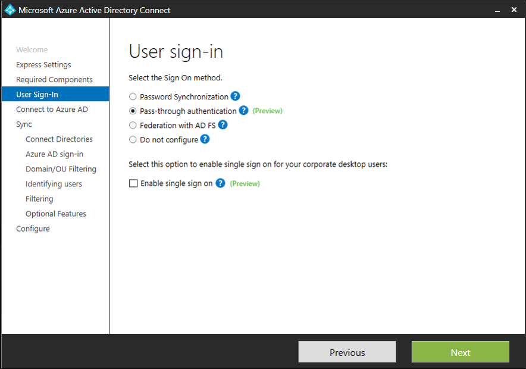
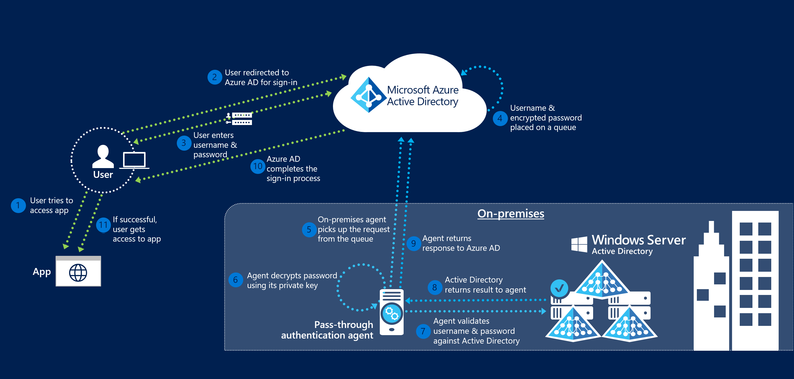

# Configure user sign-in with Azure Active Directory pass-through authentication

## What is Azure Active Directory pass-through authentication?

Allowing your users to use the same credentials (passwords) to sign in to both on-premises resources and cloud-based services benefits them and your organization. Users have one less password to remember, which provides a better user experience. It also reduces the chances that users will forget how to sign in. Your help-desk costs then decrease, because password-related issues typically consume the most support resources.

Many organizations use [Azure AD password synchronization](active-directory-aadconnectsync-implement-password-synchronization.md), a feature of [Azure AD Connect](active-directory-aadconnect.md) that synchronizes users' password hashes from on-premises Active Directory to Azure Active Directory (Azure AD), as a way to provide users with the same credentials across on-premises resources and cloud-based services. However, other organizations require that passwords, even in a hashed form, do not leave their internal organizational boundaries.

The Azure AD pass-through authentication feature provides a simple solution for these organizations. When users sign in to Azure AD, this feature ensures that users' passwords are directly validated against on-premises Active Directory. This feature also provides the following benefits:

- Easy to use
  - Password validation is performed without the need for complex on-premises deployments or network configuration.
  - The lightweight on-premises connector listens for and responds to password validation requests.
  - The on-premises connector automatically receives feature improvements and bug fixes.
  - It can be configured along with [Azure AD Connect](active-directory-aadconnect.md). The lightweight on-premises connector is installed on the same server as Azure AD Connect.
- Secure
  - On-premises passwords are never stored in the cloud in any form.
  - The lightweight on-premises connector makes only outbound connections from within your network. Therefore, there is no requirement to install the connector in a perimeter network, also known as a DMZ.
  - Pass-through authentication works seamlessly with Azure Multi-Factor Authentication.
- Reliable and scalable
  - Additional lightweight on-premises connectors can be installed on multiple servers to achieve high availability of sign-in requests.

You can combine pass-through authentication with the [seamless single sign-on](active-directory-aadconnect-sso.md) (SSO) feature. This way, when your users are on their corporate machines within your corporate network, they won't even need to type in their passwords to sign in to Azure AD--a truly integrated experience.

## What's available during preview?

>[!NOTE]
>Azure AD pass-through authentication is currently in preview. It is a free feature, and you don't need any paid editions of Azure AD to use it.

The following scenarios are fully supported during preview:

- All web browser-based applications
- Office 365 client applications that support [modern authentication](https://aka.ms/modernauthga)

The following scenarios are _not_ supported during preview:

- Legacy Office client applications and Exchange ActiveSync (that is, native email applications on mobile devices).  Organizations are encouraged to switch to modern authentication.

>[!IMPORTANT]
>As a workaround for scenarios that the pass-through authentication feature doesn't support today (legacy Office client applications, Exchange ActiveSync, and Azure AD Join for Windows 10 devices), password synchronization is also enabled by default when you enable pass-through authentication. Password synchronization acts as a fallback in these specific scenarios only. If you don't need this, you can turn off password synchronization on the [Optional features](active-directory-aadconnect-get-started-custom.md#optional-features) page in the Azure AD Connect wizard.

### Prerequisites

Before you can enable Azure AD pass-through authentication, you need to have the following in place:

- An Azure AD tenant for which you are a global administrator.

  >[!NOTE]
  >We highly recommended that the Global Administrator account be a cloud-only account. This way, you can manage the configuration of your tenant should your on-premises services fail or become unavailable. 

- Azure AD Connect version 1.1.486.0 or later. We recommend that you use the [latest version of Azure AD Connect](https://www.microsoft.com/download/details.aspx?id=47594).
- A server running Windows Server 2012 R2 or later on which to run Azure AD Connect.
  - This server must be a member of the same AD forest as the users whose passwords need to be validated.
  - Note that a pass-through authentication connector is installed on the same server as Azure AD Connect. Verify that the connector version is 1.5.58.0 or later.

    >[!NOTE]
    >Multi-forest environments are supported if there are forest trusts between the AD forests and if name suffix routing is correctly configured.

- If you want high availability, you will need additional servers running Windows Server 2012 R2 or later to install standalone connectors. (The connector version needs to be 1.5.58.0 or later.)
- If there is a firewall between any of the connectors and Azure AD:
	- If URL filtering is enabled, ensure that the connectors can communicate with the following URLs:
		-  \*.msappproxy.net
		-  \*.servicebus.chinacloudapi.cn
	- Ensure that the connectors also make direct IP connections to the [Azure data center IP ranges](https://www.microsoft.com/en-us/download/details.aspx?id=42064).
	- Ensure that the firewall does not perform SSL inspection, because the connectors use client certificates to communicate with Azure AD.
	- Ensure that the connectors can make outbound requests to Azure AD over ports 80 and 443.
      - If your firewall enforces rules according to originating users, open these ports for traffic coming from Windows services running as a network service.
      - The connectors make HTTP requests over port 80 for downloading SSL certificate revocation lists. This is also needed for the automatic update capability to function properly.
      - The connectors make HTTPS requests over port 443 for all other operations such as enabling and disabling the feature, registering connectors, downloading connector updates, and handling all user sign-in requests.

     >[!NOTE]
     >We have recently made improvements to reduce the number of ports required by the connectors to communicate with our service. If you are running older versions of Azure AD Connect and/or standalone connectors, you should continue to keep those additional ports (5671, 8080, 9090, 9091, 9350, 9352, 10100-10120) open.

### Enable Azure AD pass-through authentication

Azure AD pass-through authentication can be enabled via Azure AD Connect.

If you are performing a new installation of Azure AD Connect, choose the [custom installation path](active-directory-aadconnect-get-started-custom.md). At the **User sign-in** page, select **Pass-through authentication**. On successful completion, this installs a pass-through authentication connector on the same server as Azure AD Connect. In addition, it enables the pass-through authentication feature on your tenant.

If you have already installed Azure AD Connect, set it up by using the [express installation](active-directory-aadconnect-get-started-express.md) or the [custom installation](active-directory-aadconnect-get-started-custom.md) path, select **Change user sign-in page** on Azure AD Connect, and click **Next**. Then select **Pass-through authentication** to install a pass-through authentication connector on the same server as Azure AD Connect and enable the feature on your tenant.

>[!IMPORTANT]
>Azure AD pass-through authentication is a tenant-level feature. It affects user sign-in across all managed domains in your tenant. However, users from federated domains will continue to sign in by using Active Directory Federation Services (AD FS) or any other federation provider that you have previously configured. If you convert a domain from federated to managed, all users in that domain automatically start signing in by using pass-through authentication. Cloud-only users are not affected by pass-through authentication.

If you are planning to use pass-through authentication in a production deployment, we highly recommend that you install a second connector on a separate server (other than the one running Azure AD Connect and the first connector). Doing this ensures that you have high availability of sign-in requests. You can install as many additional connectors as you need. This is based on the peak and average number of sign-in requests that your tenant handles.

Follow these instructions to deploy a standalone connector.

#### Step 1: Download and install the connector

In this step, you download and install the connector software on your server.

1.	[Download](https://go.microsoft.com/fwlink/?linkid=837580) the latest connector. Verify that the connector version is 1.5.58.0 or later.
2.	Open the command prompt as an administrator.
3.	Run the following command. The **/q** option means "quiet installation"--the installation does not prompt you to accept the End User License Agreement:
`
AADApplicationProxyConnectorInstaller.exe REGISTERCONNECTOR="false" /q
`

>[!NOTE]
>You can install only a single connector per server.

#### Step 2: Register the connector with Azure AD for pass-through authentication

In this step, you register the installed connector on your server with our service and make it available to receive sign-in requests.

1.	Open a PowerShell window as an administrator.
2.	Navigate to **C:\Program Files\Microsoft AAD App Proxy Connector** and run the script as follows:
`.\RegisterConnector.ps1 -modulePath "C:\Program Files\Microsoft AAD App Proxy Connector\Modules\" -moduleName "AppProxyPSModule" -Feature PassthroughAuthentication`
3.	When prompted, enter the credentials of the Global Administrator account on your Azure AD tenant.

## How does Azure AD pass-through authentication work?

When a user attempts to sign in to Azure AD (and if pass-through authentication is enabled on the tenant), the following occurs:

1. The user enters their username and password into the Azure AD sign-in page. Our service places the username and password (encrypted by using a public key) on a queue for validation.
2. One of the available on-premises connectors makes an outbound call to the queue and retrieves the username and password.
3. The connector then validates the username and password against Active Directory by using standard Windows APIs (a similar mechanism to what is used by AD FS). Note that the username can be either the on-premises default username (usually `userPrincipalName`) or another attribute configured in Azure AD Connect (known as `Alternate ID`).
4. The on-premises domain controller then evaluates the request and returns a response (success or failure) to the connector.
5. The connector, in turn, returns this response back to Azure AD.
6. Azure AD then evaluates the response and responds to the user as appropriate. For example, it issues a token back to the application or asks for Multi-Factor Authentication.

The following diagram illustrates the various steps. All requests and responses are made over the HTTPS channel.

### Password writeback

In cases where you have configured [password writeback](../active-directory-passwords-update-your-own-password.md) on your tenant and for a specific user, if the user signs in by using pass-through authentication, they will be able to change or reset their passwords as before. The passwords are written back to on-premises Active Directory as expected.

However, if password writeback is not configured on your tenant or the user doesn't have a valid Azure AD license assigned to them, then the user will not be allowed to update their password in the cloud. This is true even if their password has expired. The user instead sees this message: "Your organization doesn't allow you to update your password on this site. Please update it according to the method recommended by your organization, or ask your admin if you need help."

## Next steps
- See how to enable the [Azure AD seamless SSO](active-directory-aadconnect-sso.md) feature on your tenant.
- Read our [troubleshooting guide](active-directory-aadconnect-troubleshoot-pass-through-authentication.md) to learn how to resolve common issues with Azure AD pass-through authentication.

## Feedback
Your feedback is important to us. Use the comments section if you have questions. Use our [UserVoice forum](https://feedback.azure.com/forums/169401-azure-active-directory/category/160611-directory-synchronization-aad-connect) for new feature requests.

