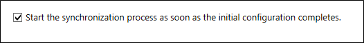
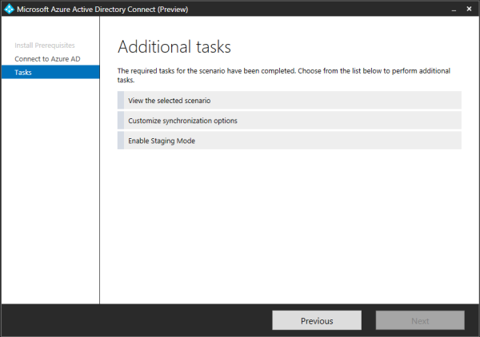

# Next steps and how to manage Azure AD Connect
Use the operational procedures in this article to customize Azure Active Directory (Azure AD) Connect to meet your organization's needs and requirements.  

## Add additional sync admins
By default, only the user who did the installation and local admins are able to manage the installed sync engine. For additional people to be able to access and manage the sync engine, locate the group named ADSyncAdmins on the local server and add them to this group.

## Start a scheduled synchronization task
If you need to run a synchronization task, you can do this by running through the Azure AD Connect wizard again.  You need to provide your Azure AD credentials.  In the wizard, select the **Customize synchronization options** task, and click **Next** to move through the wizard. At the end, ensure that the **Start the synchronization process as soon as the initial configuration completes** box is selected.

For more information on the Azure AD Connect sync Scheduler, see [Azure AD Connect Scheduler](active-directory-aadconnectsync-feature-scheduler.md).

## Additional tasks available in Azure AD Connect
After your initial installation of Azure AD Connect, you can always start the wizard again from the Azure AD Connect start page or desktop shortcut.  You will notice that going through the wizard again provides some new options in the form of additional tasks.  

The following table provides a summary of these tasks and a brief description of each task.

| Additional task | Description |
| --- | --- |
| **View the selected scenario** |View your current Azure AD Connect solution.  This includes general settings, synchronized directories, and sync settings. |
| **Customize synchronization options** |Change the current configuration like adding additional Active Directory forests to the configuration, or enabling sync options such as user, group, device, or password write-back. |
| **Enable Staging Mode** |Stage information that is not immediately synchronized and is not exported to Azure AD or on-premises Active Directory.  With this feature, you can preview the synchronizations before they occur. |

## Next steps
Learn more about [integrating your on-premises identities with Azure Active Directory](active-directory-aadconnect.md).

<!-- Update_Description: wording update -->