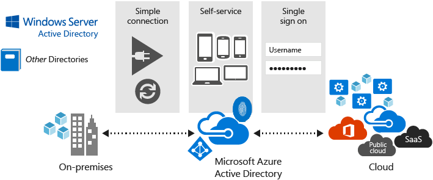

# Get started with Azure AD
Modern identity management requires scaleable, consistent reliablity to ensure the availablity of applications and services to only authenticated users. To adequately support the identity management needs of users, IT needs a way to provide access to approved, public software as a service (SaaS) apps, a way to host internal line of business apps, and even ways to enhance on-premises app development and usage. All of these requirements point to the need of a cloud-based identity management solution.      

Azure Active Directory (Azure AD) is Microsoft’s multi-tenant, cloud based directory and identity management service. Azure AD combines core directory services, advanced identity governance, and application access management. The multi-tenant, geo-distributed, high availability design of Azure AD means that you can rely on it for your most critical business needs.

The rest of this article tells you how to get started with Azure AD. 

## Add a custom domain name
Every Azure AD directory comes with an initial domain name in the form of *domainname*.partner.onmschina.cn. The initial domain name cannot be changed or deleted, but you can also [add your corporate domain name to Azure AD](add-custom-domain.md). For example, your organization probably has other domain names used to do business and users who sign in using your corporate domain name. Adding custom domain names to Azure AD allows you to assign user names in the directory that are familiar to your users, such as ‘alice@contoso.com.’ instead of 'alice@.partner.onmschina.cn'. The process is simple:

1. Add the custom domain name to your directory
2. Add a DNS entry for the domain name at the domain name registrar
3. Verify the custom domain name in Azure AD

### Verification step
After adding a custom domain, ensure that it has the **Verified** status displayed on the **Custom domain names** blade of the Azure AD portal.

## Add new users
You can [add new users to your organization's Azure AD](add-users-azure-active-directory.md) one at a time using the Azure portal or by synchronizing your on-premises Windows Server AD resource data. You can add cloud-based users directly from the Azure AD portal or synchronize on-premises user information.

To enable on-premises identity synchronization to Azure AD, you need to install and configure [Azure AD Connect](./connect/active-directory-aadconnect.md) on a server in your organization. This application handles synchronizing users and groups from your existing identity source to your Azure AD tenant.

### Verification step
After creating or synchronizing new users, make sure they are visible in Azure AD.

## Next steps
[Azure Active Directory service page](https://www.azure.cn/home/features/identity/)
[Azure Active Directory pricing information page](https://www.azure.cn/pricing/details/identity/)