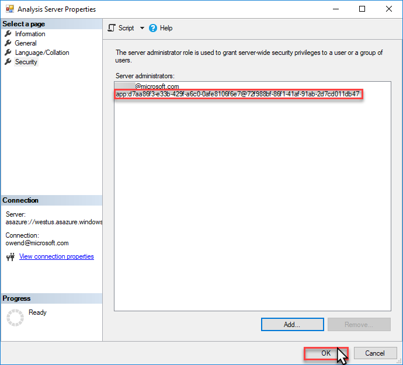

# Add a service principle to the server administrator role 

To automate unattended PowerShell tasks, a service principle must have **server administrator** privileges on the Analysis Services server being managed. This article describes how to add a service principle to the server administrators role on an Azure AS server.

## Before you begin
Before completing this task, you must have a service principle registered in Azure Active Directory.

[Create service principle - Azure portal](../azure-resource-manager/resource-group-create-service-principal-portal.md)   
[Create service principle - PowerShell](../azure-resource-manager/resource-group-authenticate-service-principal.md)

## Required permissions
To complete this task, you must have [server administrator](analysis-services-server-admins.md) permissions on the Azure AS server. 

## Add service principle to server administrators role

1. In SSMS, connect to your Azure AS server.
2. In **Server Properties** > **Security**, click **Add**.
3. In **Select a User or Group**, search for your registered app by name, select, and then click **Add**.

    

4. Verify the service principle account ID, and then click **OK**.

    

> [!NOTE]
> For server operations using AzureRm cmdlets, service principle running scheduler must also belong to the **Owner** role for the resource in [Azure Role-Based Access Control (RBAC)](../active-directory/role-based-access-control-what-is.md). 

## Related information

* [Download SQL Server PowerShell Module](https://docs.microsoft.com/sql/ssms/download-sql-server-ps-module)   
* [Download SSMS](https://docs.microsoft.com/sql/ssms/download-sql-server-management-studio-ssms)
<!-- Update_Description: new articles on analysis services to add server admin -->
<!--ms.date: 03/26/2018-->