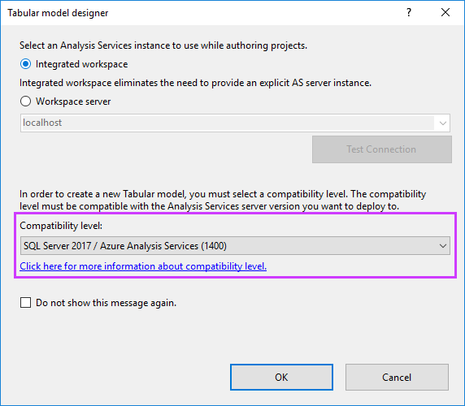

# Compatibility level for Analysis Services tabular models

*Compatibility level* refers to release-specific behaviors in the Analysis Services engine. Changes to the compatibility level typically coincide with major releases of SQL Server. These changes are also implemented in Azure Analysis Services to maintain parity between both platforms. Compatibility level changes also affect features available in your tabular models. For example, DirectQuery and tabular object metadata have different implementations depending on the compatibility level. 

Azure Analysis Services supports tabular models at the 1200 and 1400 compatibility levels.

The latest compatibility level is 1400. This level coincides with SQL Server 2017 Analysis Services. Major features in the 1400 compatibility level include:

*  New infrastructure for data connectivity and import into tabular models with support for TOM APIs and TMSL scripting. This new feature enables support for additional data sources such as Azure Blob storage.
*  Data transformation and data mashup capabilities by using Get Data and M expressions.
*  Measures support a Detail Rows property with a DAX expression. This property enables client tools like Microsoft Excel to drill down to detailed data from an aggregated report. For example, when users view total sales for a region and month, they can view the associated order details. 
*  Object-level security for table and column names, in addition to the data within them.
*  Enhanced support for ragged hierarchies.
*  Performance and monitoring improvements.

## Set compatibility level 
 When creating a new tabular model project in SSDT, you can specify the compatibility level on the **Tabular model designer** dialog. 

   

 If you select the **Do not show this message again** option, all subsequent projects use the compatibility level you specified as the default. You can change the default compatibility level in SSDT in **Tools** > **Options**.  

 To upgrade an existing tabular model project in SSDT, set  the **Compatibility Level** property in the model **Properties** window. Keep in-mind, upgrading the compatibility level is irreversible.

## Check compatibility level for a tabular model database in SQL Server Management Studio 
 In SSMS, right-click the database name > **Properties** > **Compatibility Level**.  

## Check supported compatibility level for a server in SSMS  
 In SSMS, right-click the server name>  **Properties** > **Supported Compatibility Level**.  

 This property specifies the highest compatibility level of a database that will run on the server (excluding preview). The supported compatibility level cannot be changed.  

## Next steps
  [Create a model in Azure portal](analysis-services-create-model-portal.md)   
  [Manage Analysis Services](analysis-services-manage.md)
  
<!--Update_Description: update meta properties -->