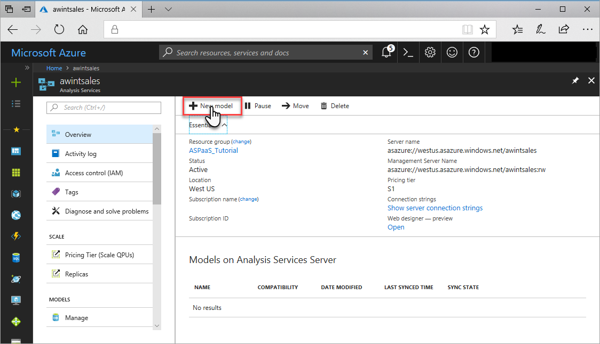
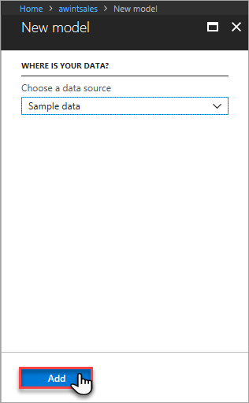
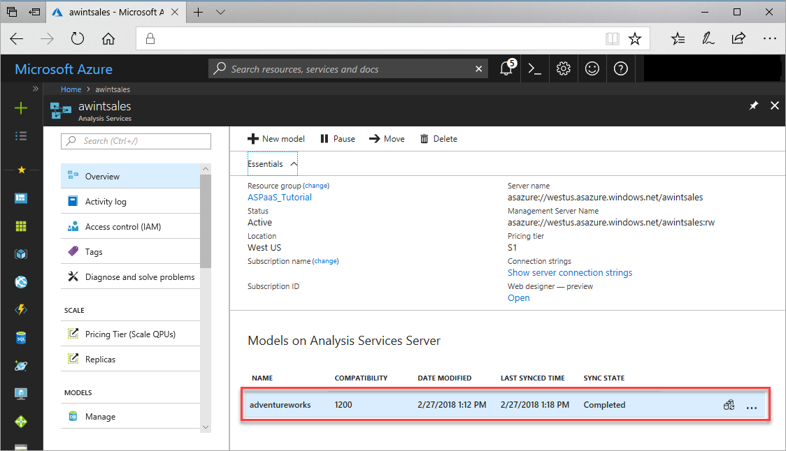

# Tutorial: Add a sample model

In this tutorial, you add a sample Adventure Works model to your server. The sample model is a completed version of the Adventure Works Internet Sales (1200) data modeling tutorial. A sample model is useful for testing model management, connecting with tools and client applications, and querying model data.

## Before you begin

To complete this tutorial, you need:

- An Azure Analysis Services server
- Server administrator permissions

## Sign in to the Azure portal

Sign in to the [Azure portal](https://portal.azure.cn/).

## Create a sample model

1. In server **Overview**, click **New model**.

    

2. In **New model** > **Choose a datasource**,  verify **Sample data** is selected, and then click **Add**.

    

3. In **Overview**, verify the `adventureworks` sample is created.

    

## Clean up resources

Your sample model is using cache memory resources. If you are not using your sample model for testing, you should remove it from your server.

> [!NOTE]
> These steps describe how to delete a model from a server by using SSMS. You can also delete a model by using the preview Web designer feature.

1. In SSMS > **Object Explorer**, click **Connect** > **Analysis Services**.

2. In **Connect to Server**, paste in the server name, then in **Authentication**, choose **Active Directory - Universal with MFA support**, enter your username, and then click **Connect**.

    

3. In **Object Explorer**, right-click the `adventureworks` sample database, and then click **Delete**.

    

## Next steps 

[Connect in Power BI Desktop](analysis-services-connect-pbi.md)   
[Manage database roles and users](analysis-services-database-users.md)
<!-- Update_Description: udpate meta properties-->