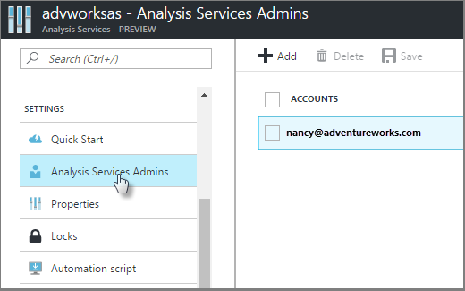

# Manage server administrators
Server administrators must be a valid user or group in the Azure Active Directory (Azure AD) for the tenant in which the server resides. You can use **Analysis Services Admins** in the control blade for your server in Azure portal, or Server Properties in SSMS to manage server administrators. 

## To add server administrators by using Azure portal
1. In the control blade for your server, click **Analysis Services Admins**.
2. In the **\<servername> - Analysis Services Admins** blade, click **Add**.
3. In the **Add Server Administrators** blade, select user accounts from your Azure AD or invite external users by email address.

    

## To add server administrators by using SSMS
1. Right-click the server > **Properties**.
2. In **Analysis Server Properties**, click **Security**.
3. Click **Add**, and then enter the email address for a user or group in your Azure AD.

    

## Next steps 
[Authentication and user permissions](analysis-services-manage-users.md)  
[Manage database roles and users](analysis-services-database-users.md)  
[Role-Based Access Control](../active-directory/role-based-access-control-what-is.md)

<!--Update_Description: update meta properties-->