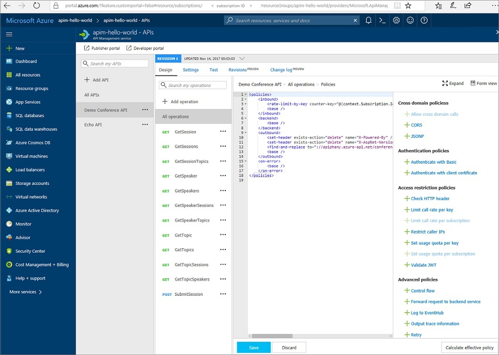
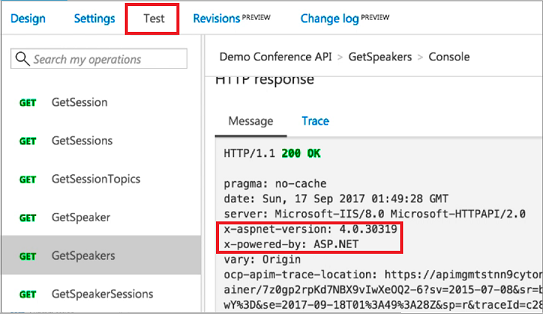
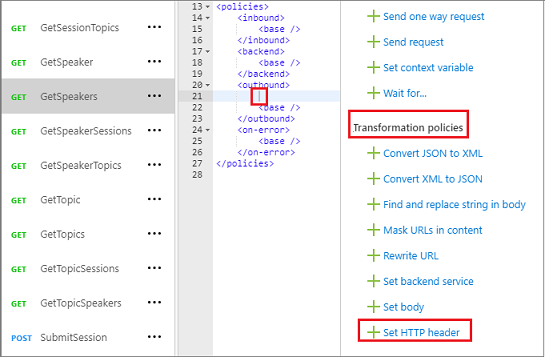
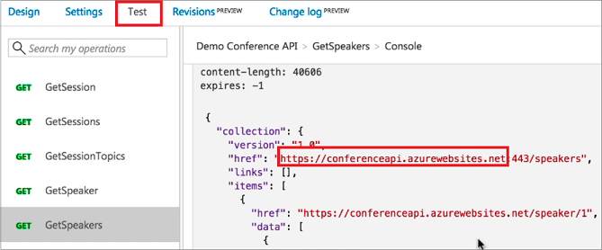
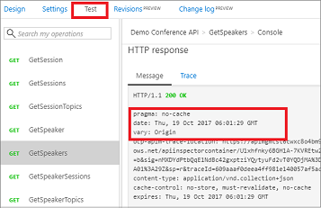
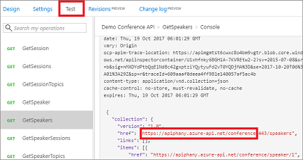
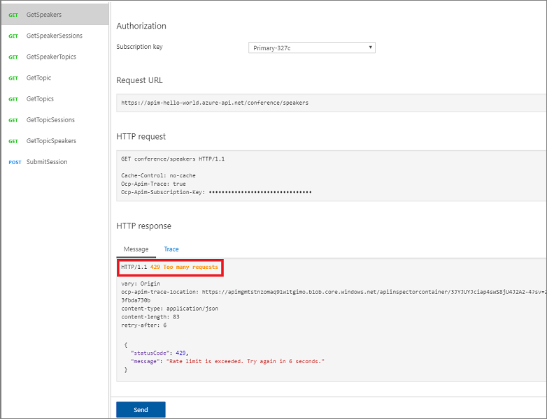

# Transform and protect your API 

The tutorial shows how to transform your API so it does not reveal a private backend info. For example, you might want to hide the info about technology stack that is running on the backend. You might also want to hide original URLs that appear in the body of API's HTTP response and instead redirect them to the APIM gateway.

This tutorial also shows you how easy it is to add protection for your backend API by configuring rate limit with Azure API Management. For example, you may want to limit a number of calls the API is called so it is not overused by developers. For more information, see [API Management policies](api-management-policies.md)

In this tutorial, you learn how to:

> [!div class="checklist"]
> * Transform an API to strip response headers
> * Replace original URLs in the body of the API response with APIM gateway URLs
> * Protect an API by adding rate limit policy (throttling)
> * Test the transformations

## Prerequisites

+ Complete the following quickstart: [Create an Azure API Management instance](get-started-create-service-instance.md).
+ Also, complete the following tutorial: [Import and publish your first API](import-and-publish.md).
 
[!INCLUDE [api-management-navigate-to-instance.md](../../includes/api-management-navigate-to-instance.md)]

## Transform an API to strip response headers

This section shows how to hide the HTTP headers that you do not want to show to your users. In this example, the following headers get deleted in the HTTP response:

* **X-Powered-By**
* **X-AspNet-Version**

### Test the original response

To see the original response:

1. Select the **API** tab.
2. Click **Demo Conference API** from your API list.
3. Select the **GetSpeakers** operation.
4. Click the **Test** tab, on the top of the screen.
5. Press the **Send** button, at the bottom of the screen. 

    As you can see the original response looks like this:

    

### Set the transformation policy

1. Browse to your APIM instance.
2. Select the **API** tab.
3. Click **Demo Conference API** from your API list.
4. Select **All operations**.
5. On the top of the screen, select **Design** tab.
6. In the **Outbound processing** window, click the triangle (next to the pencil).
7. Select **Code editor**.
    
     
     
9. Position the cursor inside the **&lt;outbound&gt;** element.
10. In the right window, under **Transformation policies**, click **+ Set HTTP header** twice (to insert two policy snippets).

    
    
11. Modify your **<outbound>** code to look like this:

        <set-header name="X-Powered-By" exists-action="delete" />
        <set-header name="X-AspNet-Version" exists-action="delete" />
                
## Replace original URLs in the body of the API response with APIM gateway URLs

This section shows how to hide original URLs that appear in the body of API's HTTP response and instead redirect them to the APIM gateway.

### Test the original response

To see the original response:

1. Select the **API** tab.
2. Click **Demo Conference API** from your API list.
3. Select the **GetSpeakers** operation.
4. Click the **Test** tab, on the top of the screen.
5. Press the **Send** button, at the bottom of the screen. 

    As you can see the original response looks like this:

    

### Set the transformation policy

1. Browse to your APIM instance.
2. Select the **API** tab.
3. Click **Demo Conference API** from your API list.
4. Select **All operations**.
5. On the top of the screen, select **Design** tab.
6. In the **Outbound processing** window, click the triangle (next to the pencil).
7. Select **Code editor**.
8. Position the cursor inside the **&lt;outbound&gt;** element.
9. In the right window, under **Transformation policies**, click **+ Find and replace string in body**.
10. Modify your **<find-and-replace** code (in the **<outbound>** element) to replace the URL to match your APIM gateway. For example:

        <find-and-replace from="://conferenceapi.azurewebsites.cn" to="://apiphany.azure-api.cn/conference"/>

## Protect an API by adding rate limit policy (throttling)

This section shows how to add protection for your backend API by configuring rate limits. For example, you may want to limit a number of calls the API is called so it is not overused by developers. In this example, the limit is set to 3 calls per 15 seconds for each subscription Id. After 15 seconds, a developer can retry calling the API.

1. Browse to your APIM instance.
2. Select the **API** tab.
3. Click **Demo Conference API** from your API list.
4. Select **All operations**.
5. On the top of the screen, select **Design** tab.
6. In the **Inbound processing** window, click the triangle (next to the pencil).
7. Select **Code editor**.
8. Position the cursor inside the **&lt;inbound&gt;** element.
9. In the right window, under **Access restriction policies**, click **+ Limit call rate per key**.
10. Modify your **<rate-limit-by-key** code (in the **<inbound>** element) to the following code:

        <rate-limit-by-key calls="3" renewal-period="15" counter-key="@(context.Subscription.Id)" />

## Test the transformations
        
At this point your polices code looks like this:

	<policies>
	    <inbound>
	        <rate-limit-by-key calls="3" renewal-period="15" counter-key="@(context.Subscription.Id)" />
	        <base />
	    </inbound>
	    <backend>
	        <base />
	    </backend>
	    <outbound>
	        <set-header name="X-Powered-By" exists-action="delete" />
	        <set-header name="X-AspNet-Version" exists-action="delete" />
	        <find-and-replace from="://conferenceapi.azurewebsites.cn" to="://apiphany.azure-api.cn/conference"/>
	        <base />
	    </outbound>
	    <on-error>
	        <base />
	    </on-error>
	</policies>

The rest of this section tests policy transformations that you set in this article.

### Test the stripped response headers

1. Browse to your APIM instance.
2. Select the **API** tab.
3. Click **Demo Conference API** from your API list.
4. Click the **GetSpeakers** operation.
5. Select the **Test** tab.
6. Press **Send**.

    As you can see the headers have been stripped:

    

### Test the replaced URL

1. Browse to your APIM instance.
2. Select the **API** tab.
3. Click **Demo Conference API** from your API list.
4. Click the **GetSpeakers** operation.
5. Select the **Test** tab.
6. Press **Send**.

    As you can see the URL has been replaced.

    

### Test the rate limit (throttling)

1. Browse to your APIM instance.
2. Select the **API** tab.
3. Click **Demo Conference API** from your API list.
4. Click the **GetSpeakers** operation.
5. Select the **Test** tab.
6. Press **Send** three times in a row.

	After sending the request 3 times, you get **429 Too many requests** response.
7. Wait 15 seconds or so and press **Send** again. This time you should get a **200 OK** response.

	

## Next steps

In this tutorial, you learned how to:

> [!div class="checklist"]
> * Transform an API to strip response headers
> * Replace original URLs in the body of the API response with APIM gateway URLs
> * Protect an API by adding rate limit policy (throttling)
> * Test the transformations

Advance to the next tutorial:

> [!div class="nextstepaction"]
> [Monitor your API](api-management-howto-use-azure-monitor.md)
