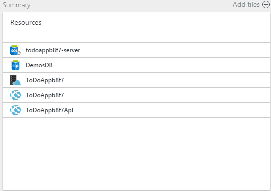
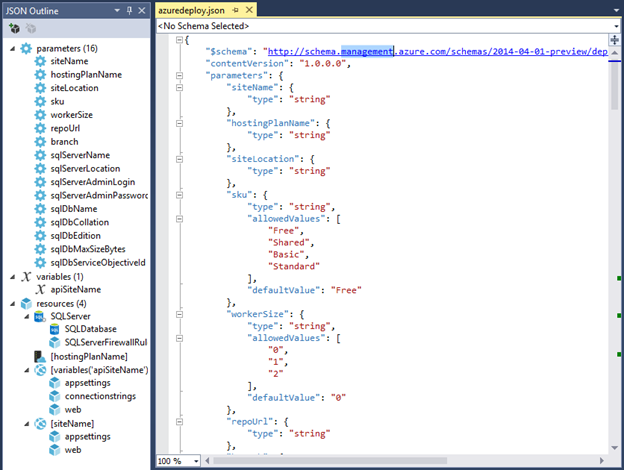
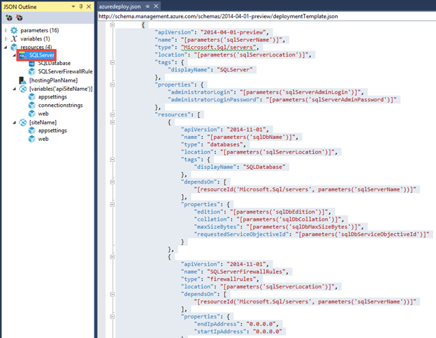

# Provision and deploy microservices predictably in Azure

[!INCLUDE [azure-sdk-developer-differences](../../includes/azure-sdk-developer-differences.md)]

This tutorial shows how to provision and deploy an application composed of [microservices](https://en.wikipedia.org/wiki/Microservices) in [Azure App Service](https://www.azure.cn/home/features/app-service/) as a single unit and in a predictable manner using JSON resource group templates and PowerShell scripting. 

When provisioning and deploying high-scale applications that are composed of highly decoupled microservices, repeatability and predictability are crucial to success. [Azure App Service](https://www.azure.cn/home/features/app-service/) enables you to create microservices that include web apps, mobile apps, and API apps. [Azure Resource Manager](../azure-resource-manager/resource-group-overview.md) enables you to manage all the microservices as a unit, together with resource dependencies such as database and source control settings. Now, you can also deploy such an application using JSON templates and simple PowerShell scripting. 

[!INCLUDE [app-service-web-to-api-and-mobile](../../includes/app-service-web-to-api-and-mobile.md)]

## What you will do
In the tutorial, you will deploy an application that includes:

* Two web apps (i.e. two microservices)
* A backend SQL Database
* App settings, connection strings, and source control
* Alerts, autoscaling settings

## Tools you will use
In this tutorial, you will use the following tools. Since it's not comprehensive discussion on tools, I'm going to stick to the end-to-end scenario and just give you a brief intro to each, and where you can find more information on it. 

### Azure Resource Manager templates (JSON)
Every time you create a web app in Azure App Service, for example, Azure Resource Manager uses a JSON template to create the entire resource group with the component resources. For information on how to download and use these templates, see [Using Azure PowerShell with Azure Resource Manager](../powershell-azure-resource-manager.md).

For more information on the Azure Resource Manager templates, see [Authoring Azure Resource Manager Templates](../azure-resource-manager/resource-group-authoring-templates.md)

### Azure SDK 2.6 for Visual Studio

[!INCLUDE [azure-sdk-developer-differences](../../includes/azure-visual-studio-login-guide.md)]

The newest SDK contains improvements to the Resource Manager template support in the JSON editor. You can use this to quickly create a resource group template from scratch or open an existing JSON template (such as a downloaded gallery template) for modification, populate the parameters file, and even deploy the resource group directly from an Azure Resource Group solution.

For more information, see [Azure SDK 2.6 for Visual Studio](https://azure.microsoft.com/blog/2015/04/29/announcing-the-azure-sdk-2-6-for-net/).

### Azure PowerShell 0.8.0 or later
Beginning in version 0.8.0, the Azure PowerShell installation includes the Azure Resource Manager module in addition to the Azure module. This new module enables you to script the deployment of resource groups.

For more information, see [Using Azure PowerShell with Azure Resource Manager](../powershell-azure-resource-manager.md)

### Deploy to Azure button
If you use GitHub for source control, you can put a [Deploy to Azure button](https://azure.microsoft.com/blog/2014/11/13/deploy-to-azure-button-for-azure-websites-2/) into your README.MD, which enables a turn-key deployment UI to Azure. While you can do this for any simple web app, you can extend this to enable deploying an entire resource group by putting an azuredeploy.json file in the repository root. This JSON file, which contains the resource group template, will be used by the Deploy to Azure button to create the resource group. For an example, see the [ToDoApp](https://github.com/azure-appservice-samples/ToDoApp) sample, which you will use in this tutorial.

## Get the sample resource group template
So now let's get right to it.

1. Please read [Agile software development with Azure App Service](app-service-agile-software-development.md)to know about how to deploy the [ToDoApp](https://github.com/azure-appservice-samples/ToDoApp) App Service sample.
6. Login to the Azure Portal Preview. Note that the web app is already connected to the GitHub repository under **External Project**. 

    
7. In the resource group blade, note that there are already two web apps and one SQL Database in the resource group.

    

Everything that you just saw in a few short minutes is a fully deployed two-microservice application, with all the components, dependencies, settings, database, and continuous publishing, set up by an automated orchestration in Azure Resource Manager. All this was done by two things:

* The Deploy to Azure button
* azuredeploy.json in the repo root

You can deploy this same application tens, hundreds, or thousands of times and have the exact same configuration every time. The repeatability and the predictability of this approach enables you to deploy high-scale applications with ease and confidence.

## Examine (or edit) AZUREDEPLOY.JSON
Now let's look at how the GitHub repository was set up. You will be using the JSON editor in the Azure .NET SDK, so if you haven't already installed [Azure .NET SDK 2.6](https://www.azure.cn/downloads/), do it now.

1. Clone the [ToDoApp](https://github.com/azure-appservice-samples/ToDoApp) repository using your favorite git tool. In the screenshot below, I'm doing this in the Team Explorer in Visual Studio 2013.

    
2. From the repository root, open azuredeploy.json in Visual Studio. If you don't see the JSON Outline pane, you need to install Azure .NET SDK.

    

I'm not going to describe every detail of the JSON format, but the [More Resources](#resources) section has links for learning the resource group template language. Here, I'm just going to show you the interesting features that can help you get started in making your own custom template for app deployment.

### Parameters
Take a look at the parameters section to see that most of these parameters are what the **Deploy to Azure** button prompts you to input. The site behind the **Deploy to Azure** button populates the input UI using the parameters defined in azuredeploy.json. These parameters are used throughout the resource definitions, such as resource names, property values, etc.

### Resources
In the resources node, you can see that 4 top-level resources are defined, including a SQL Server instance, an App Service plan, and two web apps. 

#### App Service plan
Let's start with a simple root-level resource in the JSON. In the JSON Outline, click the App Service plan named **[hostingPlanName]** to highlight the corresponding JSON code. 

Note that the `type` element specifies the string for an App Service plan (it was called a server farm a long, long time ago), and other elements and properties are filled in using the parameters defined in the JSON file, and this resource doesn't have any nested resources.

> [!NOTE]
> Note also that the value of `apiVersion` tells Azure which version of the REST API to use the JSON resource definition with, and it can affect how the resource should be formatted inside the `{}`. 
> 
> 

#### SQL Server
Next, click on the SQL Server resource named **SQLServer** in the JSON Outline.

Note the following about the highlighted JSON code:

* The use of parameters ensures that the created resources are named and configured in a way that makes them consistent with one another.
* The SQLServer resource has two nested resources, each has a different value for `type`.
* The nested resources inside `"resources": […]`, where the database and the firewall rules are defined, have a `dependsOn` element that specifies the resource ID of the root-level SQLServer resource. This tells Azure Resource Manager, "before you create this resource, that other resource must already exist; and if that other resource is defined in the template, then create that one first".

    > [!NOTE]
    > For detailed information on how to use the `resourceId()` function, see [Azure Resource Manager Template Functions](../azure-resource-manager/resource-group-template-functions.md).
    > 
    > 
* The effect of the `dependsOn` element is that Azure Resource Manager can know which resources can be created in parallel and which resources must be created sequentially. 

#### Web app
Now, let's move on to the actual web apps themselves, which are more complicated. Click the [variables('apiSiteName')] web app in the JSON Outline to highlight its JSON code. You'll notice that things are getting much more interesting. For this purpose, I'll talk about the features one by one:

##### Root resource
The web app depends on two different resources. This means that Azure Resource Manager will create the web app only after both the App Service plan and the SQL Server instance are created.

##### App settings
The app settings are also defined as a nested resource.

In the `properties` element for `config/appsettings`, you have two app settings in the format `"<name>" : "<value>"`.

* `PROJECT` is a [KUDU setting](https://github.com/projectkudu/kudu/wiki/Customizing-deployments) that tells Azure deployment which project to use in a multi-project Visual Studio solution. I will show you later how source control is configured, but since the ToDoApp code is in a multi-project Visual Studio solution, we need this setting.
* `clientUrl` is simply an app setting that the application code uses.

##### Connection strings
The connection strings are also defined as a nested resource.

In the `properties` element for `config/connectionstrings`, each connection string is also defined as a name:value pair, with the specific format of `"<name>" : {"value": "…", "type": "…"}`. For the `type` element, possible values are `MySql`, `SQLServer`, `SQLAzure`, and `Custom`.

> [!TIP]
> For a definitive list of the connection string types, run the following command in Azure PowerShell:
> \[Enum]::GetNames("Microsoft.WindowsAzure.Commands.Utilities.Websites.Services.WebEntities.DatabaseType")
> 
> 

##### Source control
The source control settings are also defined as a nested resource. Azure Resource Manager uses this resource to configure continuous publishing (see caveat on `IsManualIntegration` later) and also to kick off the deployment of application code automatically during the processing of the JSON file.

`RepoUrl` and `branch` should be pretty intuitive and should point to the Git repository and the name of the branch to publish from. Again, these are defined by input parameters. 

Note in the `dependsOn` element that, in addition to the web app resource itself, `sourcecontrols/web` also depends on `config/appsettings` and `config/connectionstrings`. This is because once `sourcecontrols/web` is configured, the Azure deployment process will automatically attempt to deploy, build, and start the application code. Therefore, inserting this dependency helps you make sure that the application has access to the required app settings and connection strings before the application code is run. 

> [!NOTE]
> Note also that `IsManualIntegration` is set to `true`. This property is necessary in this tutorial because you do not actually own the GitHub repository, and thus cannot actually grant permission to Azure to configure continuous publishing from [ToDoApp](https://github.com/azure-appservice-samples/ToDoApp) (i.e. push automatic repository updates to Azure). Even if you own the GitHub Repo, in Azure China, setting up GitHub Credential is not supported yet.
> 
> 

## Deploy the resource group template yourself
The **Deploy to Azure** button is great, but it allows you to deploy the resource group template in azuredeploy.json only if you have already pushed azuredeploy.json to GitHub. The Azure .NET SDK also provides the tools for you to deploy any JSON template file directly from your local machine. To do this, follow the steps below:

1. In Visual Studio, click **File** > **New** > **Project**.
2. Click **Visual C#** > **Cloud** > **Azure Resource Group**, then click **OK**.

    
3. In **Select Azure Template**, select **Blank Template** and click **OK**.
4. Drag azuredeploy.json into the **Template** folder of your new project.

    
5. From Solution Explorer, open the copied azuredeploy.json.
6. Just for the sake of the demonstration, let's add some standard Application Insight resources to our JSON file, by clicking **Add Resource**. If you're just interested in deploying the JSON file, skip to the deploy steps.

    
7. Select **Application Insights for Web Apps**, then make sure an existing App Service plan and web app is selected, and then click **Add**.

    

    You'll now be able to see several new resources that, depending on the resource and what it does, have dependencies on either the App Service plan or the web app. These resources are not enabled by their existing definition and you're going to change that.

    
8. In the JSON Outline, click **appInsights AutoScale** to highlight its JSON code. This is the scaling setting for your App Service plan.
9. In the highlighted JSON code, locate the `location` and `enabled` properties and set them as shown below.

    
10. In the JSON Outline, click **CPUHigh appInsights** to highlight its JSON code. This is an alert.
11. Locate the `location` and `isEnabled` properties and set them as shown below. Do the same for the other three alerts (purple bulbs).

    
12. You're now ready to deploy. Right-click the project and select **Deploy** > **New Deployment**.

    
13. Log into your Azure account if you haven't already done so.
14. Select an existing resource group in your subscription or create a new one, select **azuredeploy.json**, and then click **Edit Parameters**.

    

    You'll now be able to edit all the parameters defined in the template file in a nice table. Parameters that define defaults will already have their default values, and parameters that define a list of allowed values will be shown as dropdowns.

    
15. Fill in all the empty parameters, and use the [GitHub repo address for ToDoApp](https://github.com/azure-appservice-samples/ToDoApp.git) in **repoUrl**. Then, click **Save**.

    

    > [!NOTE]
    > Autoscaling is a feature offered in **Standard** tier or higher, and plan-level alerts are features offered in **Basic** tier or higher, you'll need to set the **sku** parameter to **Standard** or **Premium** in order to see all your new App Insights resources light up.
    > 
    > 
16. Click **Deploy**. If you selected **Save passwords**, the password will be saved in the parameter file **in plain text**. Otherwise, you'll be asked to input the database password during the deployment process.

That's it! Now you just need to go to the [Azure Portal Preview](https://portal.azure.cn/) to see the new alerts and autoscale settings added to your JSON deployed application.

Your steps in this section mainly accomplished the following:

1. Prepared the template file
2. Created a parameter file to go with the template file
3. Deployed the template file with the parameter file

The last step is easily done by a PowerShell cmdlet. To see what Visual Studio did when it deployed your application, open Scripts\Deploy-AzureResourceGroup.ps1. There's a lot of code there, but I'm just going to highlight all the pertinent code you need to deploy the template file with the parameter file.

The last cmdlet, `New-AzureResourceGroup`, is the one that actually performs the action. All this should demonstrate to you that, with the help of tooling, it is relatively straightforward to deploy your cloud application predictably. Every time you run the cmdlet on the same template with the same parameter file, you're going to get the same result.

## Summary
In DevOps, repeatability and predictability are keys to any successful deployment of a high-scale application composed of microservices. In this tutorial, you have deployed a two-microservice application to Azure as a single resource group using the Azure Resource Manager template. Hopefully, it has given you the knowledge you need in order to start converting your application in Azure into a template and can provision and deploy it predictably. 

## Next Steps
Find out how to [apply agile methodologies and continuously publish your microservices application with ease](app-service-agile-software-development.md).

##  More resources
* [Azure Resource Manager Template Language](../azure-resource-manager/resource-group-authoring-templates.md)
* [Authoring Azure Resource Manager Templates](../azure-resource-manager/resource-group-authoring-templates.md)
* [Azure Resource Manager Template Functions](../azure-resource-manager/resource-group-template-functions.md)
* [Deploy an application with Azure Resource Manager template](../azure-resource-manager/resource-group-template-deploy.md)
* [Using Azure PowerShell with Azure Resource Manager](../azure-resource-manager/powershell-azure-resource-manager.md)
* [Troubleshooting Resource Group Deployments in Azure](../azure-resource-manager/resource-manager-common-deployment-errors.md)