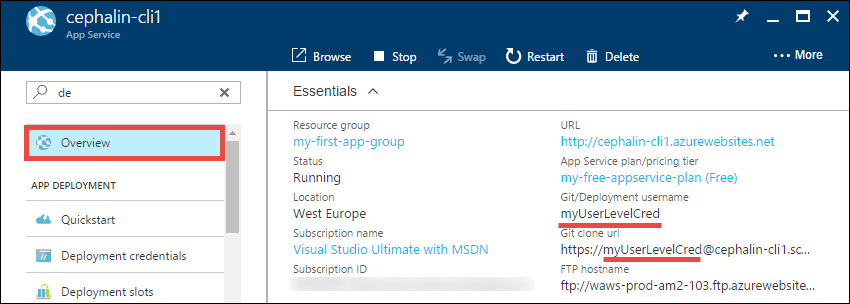
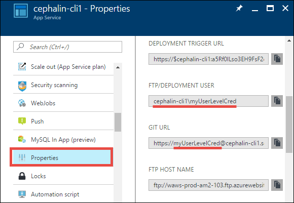
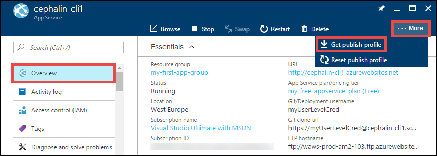
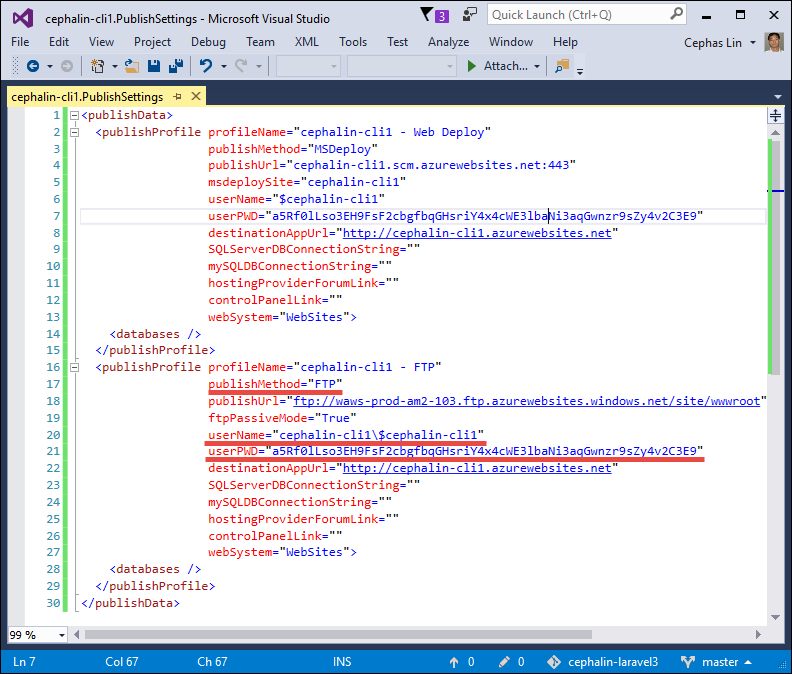

# Configure deployment credentials for Azure App Service
[Azure App Service](/app-service-web/app-service-changes-existing-services) supports two types of credentials for [local Git deployment](app-service-deploy-local-git.md) 
and [FTP/S deployment](app-service-deploy-ftp.md).

* **User-level credentials**: one set of credentials for the entire Azure account. It can be used to deploy to App Service for any app, in any subscription, that the Azure account has permission to access. These are the default
credentials set that can be set or reset from the [Azure Classic Management Portal](https://manage.windowsazure.cn) where each App Service app has an editing entry point under **Dashboard > quick glance**.

    > [!NOTE]
    > When you delegate access to Azure resources via Role Based Access Control (RBAC) or co-admin permissions, each Azure user that receives access to an app can use his/her personal user-level credentials until access is revoked. These deployment credentials should not be shared with other Azure users.
    >
    >

* **App-level credentials**: one set of credentials for each app. It can be used to deploy to that app only. The credentials
for each app is generated automatically at app creation, and is found in the app's publish profile. You cannot manually configure the credentials, but you can reset them for an app anytime.

## Set and reset user-level credentials

The user-levelcredentials are created by the Azure user. The user-leveldeployment credentials can be set or reset from the [Azure Classic Management Portal](https://manage.windowsazure.cn) where each App Service app has an editing entry point under **Dashboard > quick glance**. Regardless of the entry point, edits to these user-levelcredentials apply across the entire Azure account. These credentials are frequently used for FTP and Git deployment.

Once you have set your deployment credentials, in the [Azure portal preview](https://portal.azure.cn), you can find the *Git* deployment username in your app's **Overview**,

and and *FTP* deployment username in your app's **Properties**.

> [!NOTE]
> Azure does not show your user-level deployment password. If you forget the password, you can't retrieve it. However, you can reset your credentials in the [Azure Classic Management Portal](https://manage.windowsazure.cn).
>
>  

## Get and reset app-level credentials
For each app in App Service, its app-level credentials are stored in the XML publish profile.

To get the app-level credentials:

1. In the [Azure portal preview](https://portal.azure.cn), click App Service > **&lt;any_app>** > **Overview**.

2. Click **...More** > **Get publish profile**, and download starts for a .PublishSettings file.

    

3. Open the .PublishSettings file and find the `<publishProfile>` tag with the attribute `publishMethod="FTP"`. Then, get its `userName` and `password` attributes.
These are the app-level credentials.

    

    Similar to the user-level credentials, the FTP deployment username is in the format of `<app_name>\<username>`, and the Git deployment username is just `<username>` without the preceding `<app_name>\`.

To reset the app-level credentials:

1. In the [Azure portal preview](https://portal.azure.cn), click App Service > **&lt;any_app>** > **Overview**.

2. Click **...More** > **Reset publish profile**. Click **Yes** to confirm the reset.

    The reset action invalidates any previously-downloaded .PublishSettings files.

## Next steps

Find out how to use these credentials to deploy your app from [local Git](app-service-deploy-local-git.md) or using [FTP/S](app-service-deploy-ftp.md).