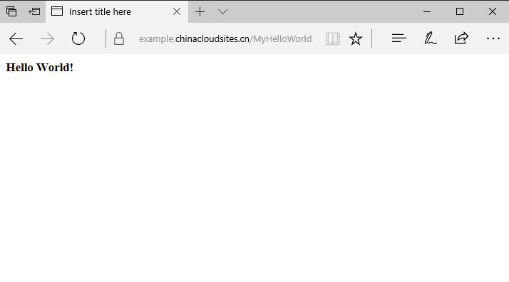
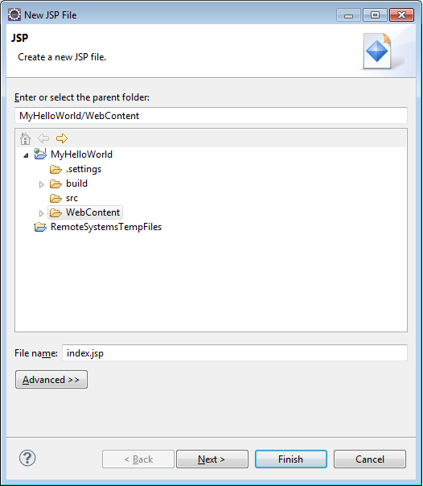
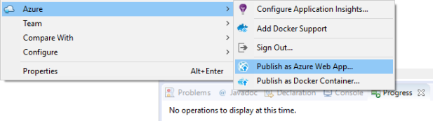

# Create a basic Azure web app using Eclipse
This tutorial shows how to create and deploy a basic Hello World application to Azure as a Web App by using the [Azure Toolkit for Eclipse]. A basic JSP example is shown for simplicity, but similar steps would be appropriate for a Java servlet, as far as Azure deployment is concerned.

When you have completed this tutorial, your application will look similar to the following illustration when you view it in a web browser:



## Prerequisites
* A Java Developer Kit (JDK), v 1.8 or later.
* Eclipse IDE for Java EE Developers, Luna or later. This can be downloaded from <http://www.eclipse.org/downloads/>.
* A distribution of a Java-based web server or application server, such as [Apache Tomcat] or [Jetty].
* An Azure subscription, which can be acquired from <https://www.azure.cn/pricing/1rmb-trial/> or <http://www.azure.cn/pricing/overview/>.
* The [Azure Toolkit for Eclipse]. For information about installing the Azure Toolkit, see [Installing the Azure Toolkit for Eclipse].

## To create a Hello World application
First, we'll start off with creating a Java project.

1. Start Eclipse, and at the menu click **File**, click **New**, and then click **Dynamic Web Project**. (If you don't see **Dynamic Web Project** listed as an available project after clicking **File** and **New**, then do the following: click **File**, click **New**, click **Project...**, expand **Web**, click **Dynamic Web Project**, and click **Next**.)
2. For purposes of this tutorial, name the project **MyWebApp**. Your screen will appear similar to the following:

    ![Creating a new Dynamic Web Project][02]
3. Click **Finish**.

4. Within Eclipse's Project Explorer view, expand **MyHelloWorld**. Right-click **WebContent**, click **New**, and then click **JSP File**.

5. In the **New JSP File** dialog, name the file **index.jsp**. Keep the parent folder as **MyHelloWorld/WebContent**, as shown in the following:

   

6. In the **Select JSP Template** dialog, for purposes of this tutorial select **New JSP File (html)** and click **Finish**.

7. When the index.jsp file opens in Eclipse, add in text to dynamically display **Hello World!** within the existing `<body>` element. Your updated `<body>` content should appear as the following:
   ```
   <body>
   <b><% out.println("Hello World!"); %></b>
   </body>
   ```
8. Save index.jsp.

## To deploy your application to an Azure Web App Container
There are several ways by which you can deploy a Java web application to Azure. This tutorial describes one of the simplest: your application will be deployed to an Azure Web App Container - no special project type nor additional tools are needed. The JDK and the web container software will be provided for you by Azure, so there is no need to upload your own; all you need is your Java Web App. As a result, the publishing process for your application will take seconds, not minutes.

1. In Eclipse's Project Explorer, right-click **MyWebApp**.
2. In the context menu, select **Azure**, then click **Publish as Azure Web App...**

    

3. Click **Create...** on **Deploy Web App** page.

    

4. Enter a name for your app service.
  
   In the Web Container drop-down menu, select the appropriate software for your application.

   Currently, you can choose from Tomcat 8, Tomcat 7 or Jetty 9. A recent distribution of the selected software will be provided by Azure, and it will run on a recent distribution of JDK 8 created by Oracle and provided by Azure. 

   In the Subscription drop-down menu, select the subscription you want to use for this deployment.

   The App Service Plan menu lists the app service plans that are associated with the Resource Group that you selected. (App Service Plans specify information such as the location of your Web App, the pricing tier and the compute instance size. A single App Service Plan can be used for multiple Web Apps, which is why it is maintained separately from a specific Web App deployment.)

   You can select an existing App Service Plan (if you have any) or create a new App Service Plan:

   * In the the **Create New** textbox, specify a name for your new App Service Plan.

   * In the the **Location** drop-down menu, select the appropriate Azure data center location for the plan.
   
   * In the the **Pricing Tier** drop-down menu, select the appropriate pricing for the plan. For testing purposes you can choose **Free_F1**.

     

   In the Resource Group drop-down menu, select the Resource Group with which you want to associate your Web App. (Azure Resource Groups allow you to group related resources together so that, for example, they can be deleted together.)

   You can select an existing Resource Group (if you have any), or to create a new Resource Group:

   * In the the **Create new** textbox, specify a name for your new Resource Group.
   * The resource group you created has the same location with the app service plan you configured or created above.    

     

   By default, a recent distribution of Java 8 will be deployed by Azure automatically to your web app container as your JVM. However, you can specify a different version and distribution of the JVM if your Web App requires it. To specify the JDK for your Web App, click the **JDK** tab, and select one of the following options:

   * **Default**: This option will deploy a recent distribution of Java 8.

   * **3rd party**: This option allows you to choose from the list of JDKs which are provided by Azure.
   
   * **Download URL**: This option allows you to specify your own JDK distribution, which must be packaged as a ZIP file and uploaded to either a publicly available download location or an Azure storage account for which you have access.

     

   click **Create**.

5. Click **Deploy** on chart below to deloy your project to azure web app. This may take several minutes for the first build. An **Azure Activity Log** will display in your Eclipse tabbed views section.

     

     

6. When your deployment is successfully deployed, the **Azure Activity Log** will show a status of **Published**. Click **Published**, as shown in the following image, and your browser will open an instance of your deployment.

     

     

> [!WARNING]
> At this point you have deployed your Azure application to the cloud. However, before proceeding, realize that a deployed application, even if it is not running, will continue to accrue billable time for your subscription. Therefore, it is extremely important that you delete unwanted deployments from your Azure subscription.
> 
> 
## Updating your web app
Updating an existing running Azure Web App is a quick and easy process, and you have two options for updating:

* You can update the deployment of an existing Java Web App.
* You can publish an additional Java application to the same Web App Container.

In either case, the process is identical and takes only a few seconds:

1. In the Eclipse project explorer, right-click the Java application you want to update or add to an existing Web App Container.
2. When the context menu appears, select **Azure** and then **Publish as Azure Web App...**
3. Since you have already logged in previously, you will see a list of your existing Web App containers. Select the one you want to publish or re-publish your Java application to and click **OK**.

A few seconds later, the **Azure Activity Log** view will show your updated deployment as **Published** and you will be able to verify your updated application in a web browser.

## Starting, stopping, or restarting an existing web app
To start or stop an existing Azure Web App container, (including all the deployed Java applications in it), you can use the **Azure Explorer** view.

If the **Azure Explorer** view is not already open, you can open it by clicking then **Window** menu in Eclipse, then click **Show View**, then **Other...**, then **Azure**, and then click **Azure Explorer**. If you have not previously logged in, it will prompt you to do so.

When the **Azure Explorer** view is displayed, use follow these steps to start or stop your Web App: 

1. Expand the **Azure** node.
2. Expand the **Web Apps** node. 
3. Right-click the desired Web App.
4. When the context menu appears, click **Start**, **Stop**, or **Restart**. Note that the menu choices are context-aware, so you can only stop a running web app or start a web app which is not currently running.

    ![Stopping an Existing Web App][13]

## To delete your deployment

Follow the steps below to delete your deployment within the Azure Toolkit for Eclipse.

1. In Eclipse's Project Explorer, right click **MyHelloWorld**.

2. Click **Azure** and then click **Publish As Azure Web App**

   

3. Choose the web app you want to delete and click **Delete...** on **Deploy Web App** page.

   

   Click **Yes**. 

   

   You can see that your web app has been delete after several miniutes.

   

   

## Next Steps
For more information about the Azure Toolkits for Java IDEs, see the following links:

* [Azure Toolkit for Eclipse]
  * [Installing the Azure Toolkit for Eclipse]
  * *Create a Hello World Web App for Azure in Eclipse (This Article)*
  * [What's New in the Azure Toolkit for Eclipse]
* [Azure Toolkit for IntelliJ]
  * [Installing the Azure Toolkit for IntelliJ]
  * [Create a Hello World Web App for Azure in IntelliJ]
  * [What's New in the Azure Toolkit for IntelliJ]

For more information about using Azure with Java, see the [Azure Java Developer Center].

For additional information about creating Azure Web Apps, see the [Web Apps Overview].

<!-- URL List -->

[Azure Toolkit for Eclipse]: ../azure-toolkit-for-eclipse.md
[Azure Toolkit for IntelliJ]: ../azure-toolkit-for-intellij.md
[Create a Hello World Web App for Azure in Eclipse]: ./app-service-web-eclipse-create-hello-world-web-app.md
[Create a Hello World Web App for Azure in IntelliJ]: ./app-service-web-intellij-create-hello-world-web-app.md
[Installing the Azure Toolkit for Eclipse]: ../azure-toolkit-for-eclipse-installation.md
[Installing the Azure Toolkit for IntelliJ]: ../azure-toolkit-for-intellij-installation.md
[What's New in the Azure Toolkit for Eclipse]: ../azure-toolkit-for-eclipse-whats-new.md
[What's New in the Azure Toolkit for IntelliJ]: ../azure-toolkit-for-intellij-whats-new.md

[Azure Java Developer Center]: /develop/java/
[Web Apps Overview]: ./app-service-web-overview.md
[Apache Tomcat]: http://tomcat.apache.org/
[Jetty]: http://www.eclipse.org/jetty/

<!-- IMG List -->

[01]: ./media/app-service-web-eclipse-create-hello-world-web-app/01-Web-Page.png
[02]: ./media/app-service-web-eclipse-create-hello-world-web-app/02-Dynamic-Web-Project.png
[03]: ./media/app-service-web-eclipse-create-hello-world-web-app/03-Context-Menu.png
[04]: ./media/app-service-web-eclipse-create-hello-world-web-app/04-Log-In-Dialog.png
[05]: ./media/app-service-web-eclipse-create-hello-world-web-app/05-Manage-Subscriptions-Dialog.png
[06]: ./media/app-service-web-eclipse-create-hello-world-web-app/06-Deploy-To-Azure-Web-Container.png
[07a]: ./media/app-service-web-eclipse-create-hello-world-web-app/07a-New-Web-App-Container-Dialog.png
[07b]: ./media/app-service-web-eclipse-create-hello-world-web-app/07b-New-Web-App-Container-Dialog.png
[08]: ./media/app-service-web-eclipse-create-hello-world-web-app/08-New-Resource-Group-Dialog.png
[09]: ./media/app-service-web-eclipse-create-hello-world-web-app/09-New-Service-Plan-Dialog.png
[10]: ./media/app-service-web-eclipse-create-hello-world-web-app/10-Completed-Web-App-Container-Dialog.png
[11]: ./media/app-service-web-eclipse-create-hello-world-web-app/11-Completed-Deploy-Dialog.png
[12]: ./media/app-service-web-eclipse-create-hello-world-web-app/12-Activity-Log-View.png
[13]: ./media/app-service-web-eclipse-create-hello-world-web-app/13-Azure-Explorer-Web-App.png
[14]: ./media/app-service-web-eclipse-create-hello-world-web-app/14-publishDropdownButton.png
[15]: ./media/app-service-web-eclipse-create-hello-world-web-app/15-New-Azure-Web-Container.png