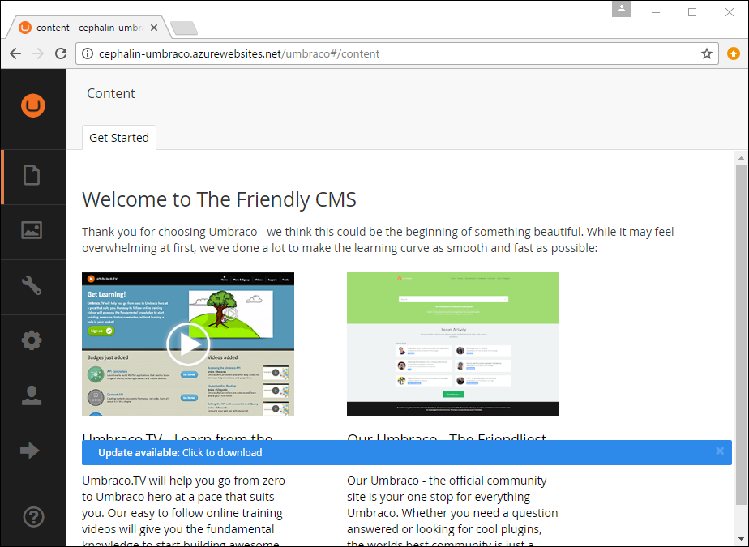
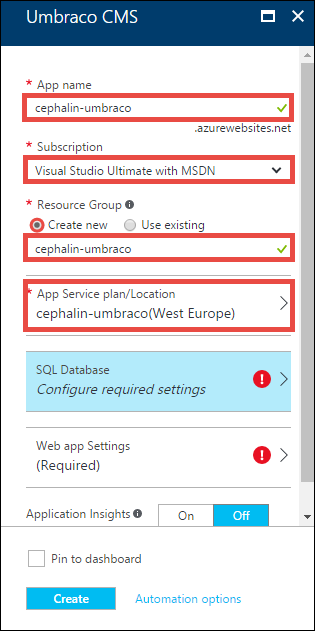
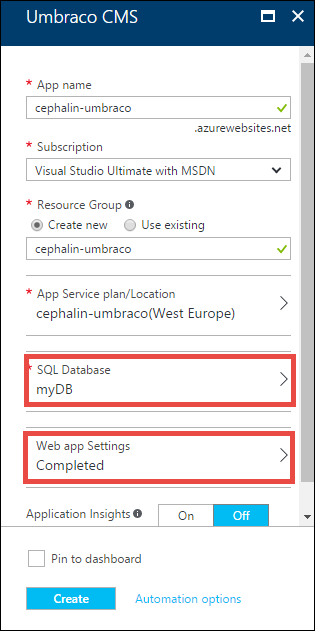
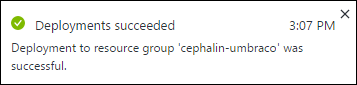
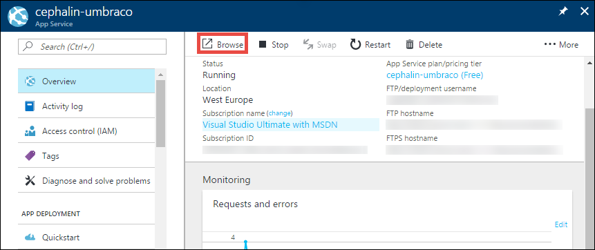
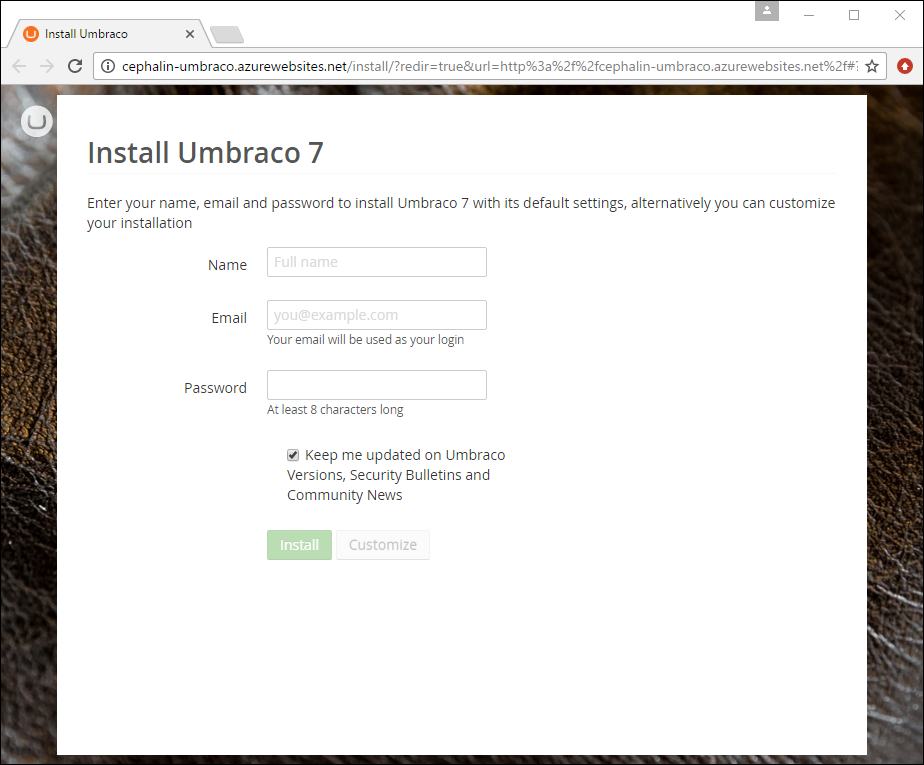

<properties
    pageTitle="Deploy an Umbraco web app in the Azure portal preview in five minutes | Azure"
    description="Learn how easy it is to run web apps in App Service by deploying a sample ASP.NET app. See your results immediately."
    services="app-service\web"
    documentationcenter=""
    author="cephalin"
    manager="erikre"
    editor="" />
<tags
    ms.assetid="b1e6bd58-48d1-4007-9d6c-53fd6db061e3"
    ms.service="app-service-web"
    ms.workload="web"
    ms.tgt_pltfrm="na"
    ms.devlang="na"
    ms.topic="hero-article"
    ms.date="02/10/2017"
    wacn.date=""
    ms.author="cephalin" />

# Deploy an Umbraco web app in the Azure portal preview in five minutes

This tutorial helps you deploy n [Umbraco](https://our.umbraco.org/) web app to [Azure App Service](/documentation/articles/app-service-value-prop-what-is/) in minutes.

## Prerequisites
You need a Azure account. If you don't have an account, you can 
[sign up for a trial](/pricing/1rmb-trial/?WT.mc_id=A261C142F) or 
[activate your Visual Studio subscriber benefits](https://azure.microsoft.com/pricing/member-offers/msdn-benefits-details/?WT.mc_id=A261C142F).

> [AZURE.NOTE]
> You can [Try App Service](https://azure.microsoft.com/try/app-service/) without an Azure account. Create a starter app and play with
> it for up to an hour--no credit card required, no commitments.
> 
> 

## Deploy the ASP.NET app
1. Sign in to the [Azure portal preview](https://portal.azure.cn).

2. Open [https://portal.azure.cn/#create/umbracoorg.UmbracoCMS](https://portal.azure.cn/#create/umbracoorg.UmbracoCMS).

    This link is a shortcut to immediately configure a new Umbraco app in the Azure portal preview.

3. In **App name**, type a web app name. You will see a green checkmark in the box if the name is unique in the `chinacloudsites.cn` domain.
   
5. In **Resource Group**, click **Create new** to create a new [resource group](/documentation/articles/resource-group-overview/), then give it a name.

7. Click **App Service plan/Location** > **Create New**. Configure the [App Service plan](/documentation/articles/azure-web-sites-web-hosting-plans-in-depth-overview/) as shown:

    - In **App Service plan**, type the desired name.
    - In **Location**, choose a location to host your plan.
    - Click **Pricing tier**, then select **F1 Free** or another tier that suits you, and then click **Select**.
    - Click **OK**.

    Your Umbraco CMS configuration should now look like the following screenshot:

    

12. Click **SQL Database** > **Create a new database**. Configure the SQL Database as shown:

    - In **Name**, type a name, such as **myDB**.
    - Click **Pricing tier**, then select **F Free** or another tier that suits you, and then click **Select**.
    - Click **Target server** > **Create a new server**. Configure the database server as shown:

        - In **Server name**, type a server name. You will see a green checkmark in the box if the name is unique in the `.database.chinacloudapi.cn` domain.
        - In **Server admin login**, type the desired admininistrator username.
        - In **Password** and **Confirm password**, type the desired password.
        - In Location, select the same location you use for the web app.
        - Make sure **Allow azure services to access server** is selected.
        - Click **Select**.
    
    - Click **Select**.

13. Click **Web app settings**, specify the database username and password, and click **OK**.

    Your Umbraco CMS configuration should now look like the following screenshot:

    

14. Click **Create**.
    
    Azure now creates your Umbraco app based on your configuration. You should see a **Deployment started...** notification.

    
   
## Launch and manage your Umrbaco web app

When Azure completes app deployment you see another notification.

1. Click the notification. If you missed it, you can always access it by clicking the notification bell 
().

    You should now see your web app's management [blade](/documentation/articles/resource-group-portal/#manage-resources) (*blade*: a portal page that opens horizontally).

3. In the top of the Overview page, click **Browse**.
   
    

    Now you see the Umbraco **Welcome** page. Configure the Umbraco installation and start playing with it!

    
    
## Next steps
* [Deploy an ASP.NET web app to Azure App Service, using Visual Studio](/documentation/articles/web-sites-dotnet-get-started/) - Learn how to create a 
new Azure web app from Visual Studio, using any one of the included application templates.
* [Deploy your code to Azure App Service](/documentation/articles/web-sites-deploy/)- Learn how to deploy from FTP or from source control repositories.
* [Add functionality to your first web app](/documentation/articles/app-service-web-get-started-2/) - Take your Azure app to the next level. Authenticate your users. 
Scale it based on demand. Set up some performance alerts. All with a few clicks.