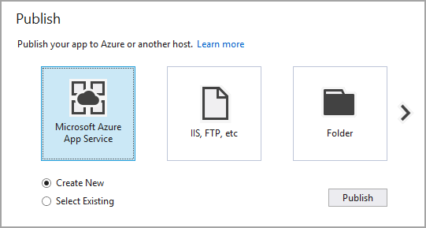
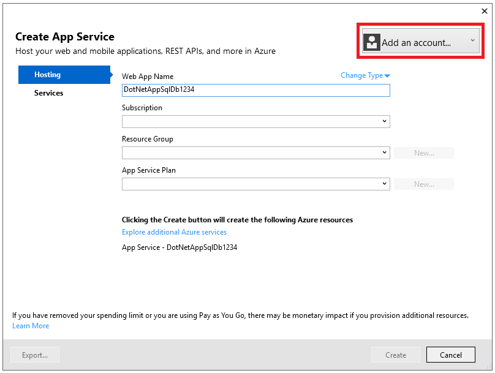
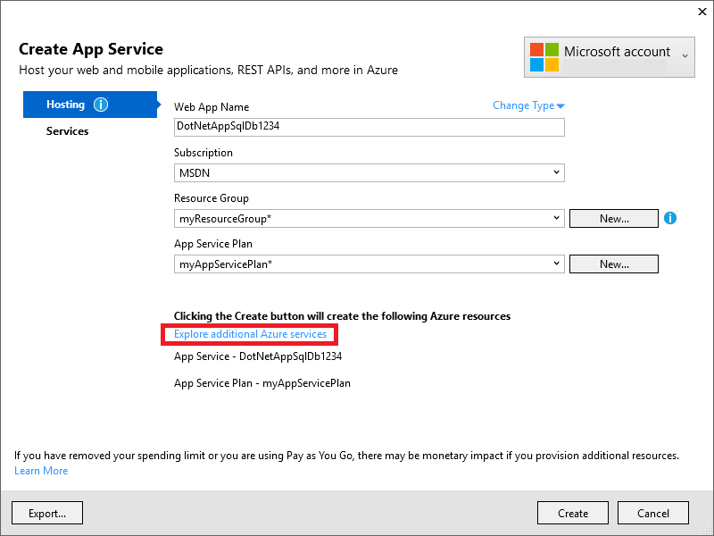
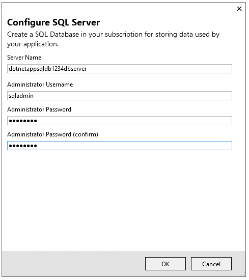

# Create an ASP.NET app in Azure with SQL Database

[!INCLUDE [azure-sdk-developer-differences](../../includes/azure-sdk-developer-differences.md)]

This tutorial shows you how to develop a data-driven ASP.NET web app in Azure. Connect your web app to Azure SQL Database in just a few minutes, and enable your data-driven functionality with minimal configuration. When you're finished, you'll have a data-driven ASP.NET web app running in [Azure App Service](../app-service/app-service-value-prop-what-is.md) and connected to SQL Database.

This tutorial uses the ASP.NET template with **Individual User Accounts**. This template uses [ASP.NET Entity Framework](https://docs.microsoft.com/aspnet/entity-framework) to manage user profiles in the web application. 


## Before you begin

This tutorial demonstrates how to use Visual Studio 2017 to build and deploy an ASP.NET web app to Azure. If you don't already have Visual Studio 2017 installed, you can download and use the **free** [Visual Studio 2017 Community Edition](https://www.visualstudio.com/downloads/). Make sure that you enable **Azure development** during the Visual Studio setup.

You also need to install [Git](http://www.git-scm.com/downloads).

## Step 1 - Set up the sample application
In this step, you set up the local ASP.NET project.

### Clone the sample application

Open a PowerShell window and `CD` to a working directory.

Run the following commands to clone the sample repository. This sample repository contains a standard [ASP.NET](http://asp.net) application.

```bash
git clone https://github.com/cephalin/DotNetAppSqlDb.git
```

### Run the application

From the repository root, launch `DotNetAppSqlDb.sln` in Visual Studio 2017.

Once the sample solution is opened, type `F5` to run the web app in the browser.

You should see a simple CRUD (create-read-update-delete) app in the homepage. Try to add a few todos to the empty list.


Your app uses ASP.NET Entity Framework to access the local database. The database context uses a connection string called `MyDbConnection`. This connection string is defined in `Web.config` and referenced in `Models\MyDatabaseContext.cs`. This connection string name is all you will need later when connecting your Azure web app to Azure SQL Database. 

## Publish to Azure

In the **Solution Explorer**, right-click your **myWebAppWithSqlDb** project and select **Publish**.


Make sure that **Azure App Service** is selected and click **Publish**.



This opens the **Create App Service** dialog, which helps you create all the Azure resources you need to run your ASP.NET web app in Azure.

### Sign in to Azure

[!INCLUDE [azure-sdk-developer-differences](../../includes/azure-visual-studio-login-guide.md)]

In the **Create App Service** dialog, click **Add an account**, and then sign in to your Azure subscription. If you're already signed into an Azure account, make sure that account holds your Azure subscription. If the signed-in Azure account doesn't have your Azure subscription, click it to add the correct account.



Once signed in, you're ready to create all the resources you need for your Azure web app in this dialog.

### Create a resource group

First, you need a _resource group_. 

> [!NOTE] 
> A resource group is a logical container into which Azure resources like web apps, databases and storage accounts are deployed and managed.
>
>

Next to **Resource Group**, click **New**.

Name your resource group **myResourceGroup** and click **OK**.

### Create an App Service plan

Your Azure web app also needs an _App Service plan_. 

> [!NOTE]
> An App Service plan represents the collection of physical resources used to host your apps. All apps assigned to an App Service plan share the resources defined by it, which enables you to save cost when hosting multiple apps. 
> <br/>
> App Service plans define:
> - Region (China North, China East)
> - Instance Size (Small, Medium, Large)
> - Scale Count (one, two or three instances, etc.) 
> - SKU (Free, Shared, Basic, Standard, Premium)
>
>

Next to **App Service Plan**, click **New**. 

In the **Configure App Service Plan** dialog, configure the new App Service plan with the following settings:

- **App Service Plan**: Type **myAppServicePlan**. 
- **Location**: Choose **China North**, or any other region you like.
- **Size**: Choose **Free**, or any other [pricing tier](https://www.azure.cn/pricing/details/app-service/) you like.

Click **OK**.


### Configure the web app name

In **Web App Name**, type a unique app name. This name will be used as part of the default DNS name for your app (`<app_name>.chinacloudsites.cn`), so it needs to be unique across all apps in Azure. You can later map a custom domain name to your app before you expose it to your users.

You can also accept the automatically generated name, which is already unique.



### Configure a SQL Database

Click **Explore additional Azure services**.

In the **Services** tab, click the **+** icon next to **SQL Database**. 

In the **Configure SQL Database** dialog, click **New** for a new database server. 

In **Server Name**, type a unique name. This name will be used as part of the default DNS name for your database server (`<server_name>.database.chinacloudapi.cn`), so it needs to be unique across all SQL database servers in Azure. 

Configure the rest of the fields as you like and click **OK**.



In **Database Name**, type `myToDoAppDb`, or any name you like.

In **Connection String Name**, type `MyDatabaseContext`. This name must match the connection string that is referenced in `Models\MyDatabaseContext.cs`.

## Create and publish the web app

Click **Create**. 

Once the wizard finishes creating the Azure resources, it automatically publishes your ASP.NET application to Azure for the first time, and then launches the published Azure web app in your default browser.

Try to add a few todos to the empty list.


Congratulations, your data-driven ASP.NET application is running live in Azure App Service.

## Next steps

Explore pre-created [Web apps PowerShell scripts](app-service-powershell-samples.md).