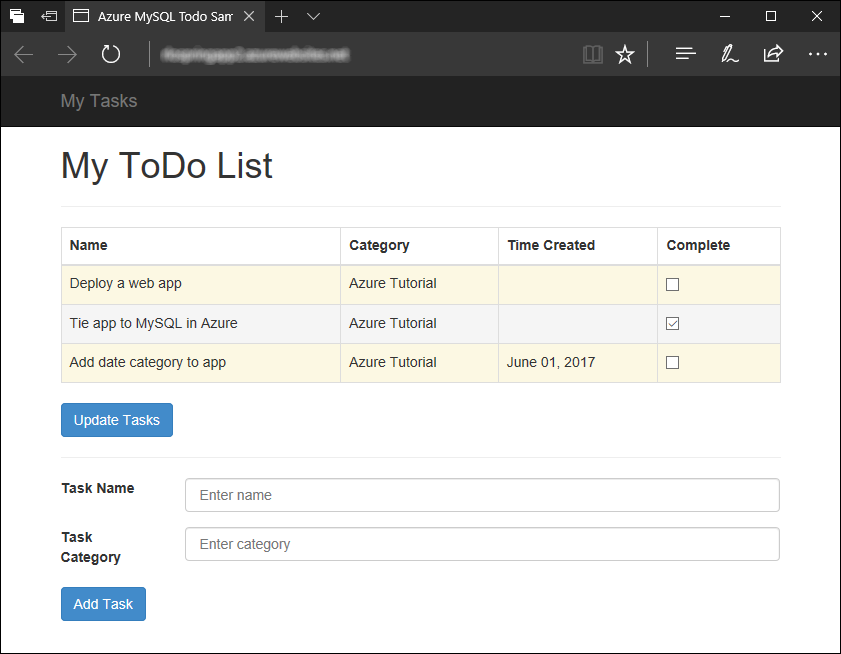
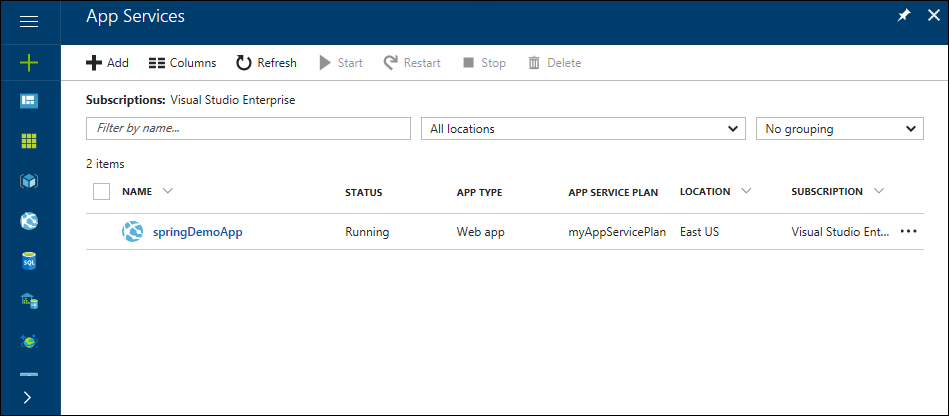
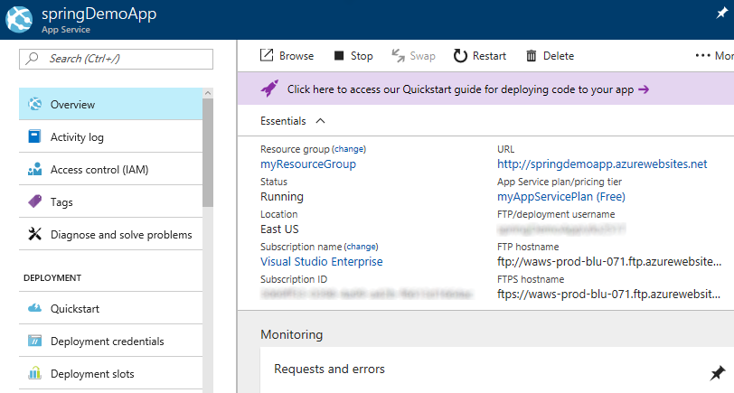

# Build a Java and MySQL web app in Azure

This tutorial shows you how to create a Java web app in Azure and connect it to a MySQL database. 
When you are finished, you will have a [Spring Boot](https://projects.spring.io/spring-boot/) application storing data in [Azure Database for MySQL](/mysql/overview) running on [Azure App Service Web Apps](/app-service-web/app-service-web-overview).


In this tutorial, you learn how to:

> [!div class="checklist"]
> * Create a MySQL database in Azure
> * Connect a sample app to the database
> * Deploy the app to Azure
> * Update and redeploy the app
> * Stream diagnostic logs from Azure
> * Monitor the app in the Azure portal

## Prerequisites

1. [Download and install git](https://git-scm.com/)
1. [Download and install the Java 7 JDK or above](http://www.oracle.com/technetwork/java/javase/downloads/index.html)
1. [Download, install, and start MySQL](https://dev.mysql.com/doc/refman/5.7/en/installing.html) 
1. [Install the Azure CLI 2.0](https://docs.microsoft.com/cli/azure/install-azure-cli)

[!INCLUDE [quickstarts-free-trial-note](../../includes/quickstarts-free-trial-note.md)]

## Prepare local MySQL 

In this step, you create a database in a local MySQL server for use in testing the app locally on your machine.

### Connect to MySQL server

Connect to your local MySQL server from the command line:

```bash
mysql -u root -p
```

If you're prompted for a password, enter the password for the `root` account. If you don't remember your root account password, see [MySQL: How to Reset the Root Password](https://dev.mysql.com/doc/refman/5.7/en/resetting-permissions.html).

If your command runs successfully, then your MySQL server is already running. If not, make sure that your local MySQL server is started by following the [MySQL post-installation steps](https://dev.mysql.com/doc/refman/5.7/en/postinstallation.html).

### Create a database 

In the `mysql` prompt, create a database and a table for the to-do items.

```sql
CREATE DATABASE tododb;
```

Exit your server connection by typing `quit`.

```sql
quit
```

## Create and run the sample app 

In this step, you clone sample Spring boot app, configure it to use the local MySQL database, and run it on your computer. 

### Clone the sample

From the command prompt, navigate to a working directory and clone the sample repository. 

```bash
git clone https://github.com/azure-samples/mysql-spring-boot-todo
```

### Configure the app to use the MySQL database

Update the `spring.datasource.password` and  value in *spring-boot-mysql-todo/src/main/resources/application.properties* with the same root password used to open the MySQL command prompt:

```
spring.datasource.password=mysqlpass
```

### Build and run the sample

Build and run the sample using the Maven wrapper included in the repo:

```bash
cd spring-boot-mysql-todo
mvnw package spring-boot:run
```

Open your browser to http://localhost:8080 to see in the sample in action. As you add tasks to the list,  use the following SQL commands in the MySQL command prompt to view the data stored in MySQL.

```SQL
use testdb;
select * from todo_item;
```

Stop the application by hitting `Ctrl`+`C` in the command prompt. 

## Create an Azure MySQL database

In this step, you create an Azure Database for MySQL instance using the [Azure CLI](https://docs.microsoft.com/cli/azure/install-azure-cli). You configure the sample application to use this database later on in the tutorial.

Use the Azure CLI 2.0 in a terminal window to create the resources needed to host your Java application in Azure appservice. Log in to your Azure subscription with the [az login](https://docs.microsoft.com/cli/azure/#login) command and follow the on-screen directions. 

```azurecli-interactive 
az login 
``` 

[!INCLUDE [azure-cli-2-azurechinacloud-environment-parameter](../../includes/azure-cli-2-azurechinacloud-environment-parameter.md)]

### Create a resource group

Create a [resource group](../azure-resource-manager/resource-group-overview.md) with the [az group create](https://docs.microsoft.com/cli/azure/group#create) command. An Azure resource group is a logical container where related resources like web apps, databases, and storage accounts are deployed and managed. 

The following example creates a resource group in the China North region:

```azurecli-interactive
az group create --name myResourceGroup  --location "China North"
```

To see the possible values you can use for `--location`, use the [az appservice list-locations](https://docs.microsoft.com/cli/azure/appservice#list-locations) command.

### Create a MySQL server

Create a server in Azure Database for MySQL (Preview) with the [az mysql server create](https://docs.microsoft.com/cli/azure/mysql/server#create) command.
Substitute your own unique MySQL server name where you see the `<mysql_server_name>` placeholder. This name is part of your MySQL server's hostname, `<mysql_server_name>.mysql.database.azure.com`, so it needs to be globally unique. Also substitute `<admin_user>` and `<admin_password>` with your own values.

```azurecli-interactive
az mysql server create --name <mysql_server_name> \ 
    --resource-group myResourceGroup \ 
    --location "China North" \
    --admin-user <admin_user> \ 
    --admin-password <admin_password>
```

When the MySQL server is created, the Azure CLI shows information similar to the following example:

```json
{
  "administratorLogin": "admin_user",
  "administratorLoginPassword": null,
  "fullyQualifiedDomainName": "mysql_server_name.mysql.database.azure.com",
  "id": "/subscriptions/00000000-0000-0000-0000-000000000000/resourceGroups/myResourceGroup/providers/Microsoft.DBforMySQL/servers/mysql_server_name",
  "location": "northeurope",
  "name": "mysql_server_name",
  "resourceGroup": "mysqlJavaResourceGroup",
  ...
  < Output has been truncated for readability >
}
```

### Configure server firewall

Create a firewall rule for your MySQL server to allow client connections by using the [az mysql server firewall-rule create](https://docs.microsoft.com/cli/azure/mysql/server/firewall-rule#create) command. 

```azurecli-interactive
az mysql server firewall-rule create \
    --name allIPs \
    --server <mysql_server_name>  \ 
    --resource-group myResourceGroup \ 
    --start-ip-address 0.0.0.0 \ 
    --end-ip-address 255.255.255.255
```

> [!NOTE]
> Azure Database for MySQL (Preview) does not currently automatically enable connections from Azure services. As IP addresses in Azure are dynamically assigned, it is better to enable all IP addresses for now. As the service continues its preview, better methods for securing your database will be enabled.

## Configure the Azure MySQL database

In the terminal window on your computer, connect to the MySQL server in Azure. Use the value you specified previously for `<admin_user>` and `<mysql_server_name>`.

```bash
mysql -u <admin_user>@<mysql_server_name> -h <mysql_server_name>.mysql.database.azure.com -P 3306 -p
```

### Create a database 

In the `mysql` prompt, create a database and a table for the to-do items.

```sql
CREATE DATABASE tododb;
```

### Create a user with permissions

Create a database user and give it all privileges in the `tododb` database. Replace the placeholders `<Javaapp_user>` and `<Javaapp_password>` with your own unique app name.

```sql
CREATE USER '<Javaapp_user>' IDENTIFIED BY '<Javaapp_password>'; 
GRANT ALL PRIVILEGES ON tododb.* TO '<Javaapp_user>';
```

Exit your server connection by typing `quit`.

```sql
quit
```

## Deploy the sample to Azure App Service

Create an Azure App Service plan with the **FREE** pricing tier using the  [az appservice plan create](https://docs.microsoft.com/cli/azure/appservice/plan#create) CLI command. The appservice plan defines the physical resources used to host your apps. All applications assigned to an appservice plan share these resources, allowing you to save cost when hosting multiple apps. 

```azurecli-interactive
az appservice plan create \
    --name myAppServicePlan \ 
    --resource-group myResourceGroup \
--sku FREE
```

When the plan is ready, the Azure CLI shows similar output to the following example:

```json 
{ 
  "adminSiteName": null,
  "appServicePlanName": "myAppServicePlan",
  "geoRegion": "China North",
  "hostingEnvironmentProfile": null,
  "id": "/subscriptions/0000-0000/resourceGroups/myResourceGroup/providers/Microsoft.Web/serverfarms/myAppServicePlan",
  "kind": "app",
  "location": "China North",
  "maximumNumberOfWorkers": 1,
  "name": "myAppServicePlan",
  ...
  < Output has been truncated for readability >
} 
``` 

### Create an Azure Web app

 Use the [az webapp create](https://docs.microsoft.com/cli/azure/webapp#create) CLI command to create a web app definition in the `myAppServicePlan` App Service plan. The web app definition provides a URL to access your application with and configures several options to deploy your code to Azure. 

```azurecli-interactive
az webapp create \
    --name <app_name> \ 
    --resource-group myResourceGroup \
    --plan myAppServicePlan
```

Substitute the `<app_name>` placeholder with your own unique app name. This unique name is part of the default domain name for the web app, so the name needs to be unique across all apps in Azure. You can map a custom domain name entry to the web app before you expose it to your users.

When the web app definition is ready, the Azure CLI shows information similar to the following example: 

```json 
{
  "availabilityState": "Normal",
  "clientAffinityEnabled": true,
  "clientCertEnabled": false,
  "cloningInfo": null,
  "containerSize": 0,
  "dailyMemoryTimeQuota": 0,
  "defaultHostName": "<app_name>.chinacloudsites.cn",
  "enabled": true,
   ...
  < Output has been truncated for readability >
    }
```

### Configure Java 

Set up the Java runtime configuration that your app needs with the  [az appservice web config update](https://docs.microsoft.com/cli/azure/webapp/config#update) command.

The following command configures the web app to run on a recent Java 8 JDK and [Apache Tomcat](http://tomcat.apache.org/) 8.0.

```azurecli-interactive
az webapp config set \ 
    --name <app_name> \
    --resource-group myResourceGroup \ 
    --java-version 1.8 \ 
    --java-container Tomcat \
    --java-container-version 8.0
```

### Configure the app to use the Azure SQL database

Before running the sample app, set application settings on the web app to use the Azure MySQL database you created in Azure. These properties are exposed to the web application as environment variables and override the values set in the application.properties inside the packaged web app. 

Set application settings using [az webapp config appsettings](https://docs.microsoft.com/cli/azure/webapp/config/appsettings) in the CLI:

```azurecli-interactive
az webapp config appsettings set \
    --settings SPRING_DATASOURCE_URL="jdbc:mysql://<mysql_server_name>.mysql.database.azure.com:3306/tododb?verifyServerCertificate=true&useSSL=true&requireSSL=false" \
    --resource-group myResourceGroup \
    --name <app_name>
```

```azurecli-interactive
az webapp config appsettings set \
    --settings SPRING_DATASOURCE_USERNAME=Javaapp_user@mysql_server_name  \
    --resource-group myResourceGroup \ 
    --name <app_name>
```

```azurecli-interactive
az webapp config appsettings set \
    --settings SPRING_DATASOURCE_URL=Javaapp_password \
    --resource-group myResourceGroup \ 
    --name <app_name>
```

### Get FTP deployment credentials 
You can deploy your application to Azure appservice in various ways including FTP, local Git, GitHub, Visual Studio Team Services, and BitBucket. 
For this example, FTP to deploy the .WAR file built previously on your local machine to Azure App Service.

To determine what credentials to pass along in an ftp command to the Web App, Use [az appservice web deployment list-publishing-profiles](https://docs.microsoft.com/cli/azure/webapp/deployment#list-publishing-profiles) command: 

```azurecli-interactive
az webapp deployment list-publishing-profiles \ 
    --name <app_name> \ 
    --resource-group myResourceGroup \
    --query "[?publishMethod=='FTP'].{URL:publishUrl, Username:userName,Password:userPWD}" \ 
    --output json
```

```JSON
[
  {
    "Password": "aBcDeFgHiJkLmNoPqRsTuVwXyZ",
    "URL": "ftp://waws-prod-blu-069.ftp.azurewebsites.chinacloudapi.cn/site/wwwroot",
    "Username": "app_name\\$app_name"
  }
]
```

### Upload the app using FTP

Use your favorite FTP tool to deploy the .WAR file to the */site/wwwroot/webapps* folder on the server address taken from the `URL` field in the previous command. Remove the existing default (ROOT) application directory and replace the existing ROOT.war with the .WAR file built in the earlier in the tutorial.

```bash
ftp waws-prod-blu-069.ftp.azurewebsites.chinacloudapi.cn
Connected to waws-prod-blu-069.drip.azurewebsites.chinacloudapi.cn.
220 Microsoft FTP Service
Name (waws-prod-blu-069.ftp.azurewebsites.chinacloudapi.cn:raisa): app_name\$app_name
331 Password required
Password:
cd /site/wwwroot/webapps
mdelete -i ROOT/*
rmdir ROOT/
put target/TodoDemo-0.0.1-SNAPSHOT.war ROOT.war
```

### Test the web app

Browse to `http://<app_name>.chinacloudsites.cn/` and add a few tasks to the list. 


**Congratulations!** You're running a data-driven Java app in Azure App Service.

## Update the app and redeploy

Update the application to include an additional column in the todo list for what day the item was created. Spring Boot handles updating the database schema for you as the data model changes without altering your existing database records.

1. On your local system, open up *src/main/java/com/example/fabrikam/TodoItem.java* and add the following imports to the class:   

    ```java
    import java.text.SimpleDateFormat;
    import java.util.Calendar;
    ```

2. Add a `String` property `timeCreated` to *src/main/java/com/example/fabrikam/TodoItem.java*, initializing it with a timestamp at object creation. Add getters/setters for the new `timeCreated` property while you are editing this file.

    ```java
    private String name;
    private boolean complete;
    private String timeCreated;
    ...

    public TodoItem(String category, String name) {
       this.category = category;
       this.name = name;
       this.complete = false;
       this.timeCreated = new SimpleDateFormat("MMMM dd, YYYY").format(Calendar.getInstance().getTime());
    }
    ...
    public void setTimeCreated(String timeCreated) {
       this.timeCreated = timeCreated;
    }

    public String getTimeCreated() {
        return timeCreated;
    }
    ```

3. Update *src/main/java/com/example/fabrikam/TodoDemoController.java* with a line in the `updateTodo` method to set the timestamp:

    ```java
    item.setComplete(requestItem.isComplete());
    item.setId(requestItem.getId());
    item.setTimeCreated(requestItem.getTimeCreated());
    repository.save(item);
    ```

4. Add support for the new field in the Thymeleaf template. Update *src/main/resources/templates/index.html* with a new table header for the timestamp, and a new field to display the value of the timestamp in each table data row.

    ```html
    <th>Name</th>
    <th>Category</th>
    <th>Time Created</th>
    <th>Complete</th>
    ...
    <td th:text="${item.category}">item_category</td><input type="hidden" th:field="*{todoList[__${i.index}__].category}"/>
    <td th:text="${item.timeCreated}">item_time_created</td><input type="hidden" th:field="*{todoList[__${i.index}__].timeCreated}"/>
    <td><input type="checkbox" th:checked="${item.complete} == true" th:field="*{todoList[__${i.index}__].complete}"/></td>
    ```

5. Rebuild the application:

    ```bash
    mvnw clean package 
    ```

6. FTP the updated .WAR as before, removing the existing *site/wwwroot/webapps/ROOT* directory and *ROOT.war*, then uploading the updated .WAR file as ROOT.war. 

When you refresh the app, a **Time Created** column is now visible. When you add a new task, the app will populate the timestamp automatically. Your existing tasks remain unchanged and work with the app even though the underlying data model has changed. 



## Stream diagnostic logs 

While your Java application runs in Azure App Service, you can get the console logs piped directly to your terminal. That way, you can get the same diagnostic messages to help you debug application errors.

To start log streaming, use the [az webapp log tail](https://docs.microsoft.com/cli/azure/webapp/log#tail) command.

```azurecli-interactive 
az webapp log tail \
    --name <app_name> \
    --resource-group myResourceGroup 
``` 

## Manage your Azure web app

Go to the Azure portal to see the web app you created.

To do this, sign in to [https://portal.azure.cn](https://portal.azure.cn).

From the left menu, click **App Service**, then click the name of your Azure web app.



By default, your web app's blade shows the **Overview** page. This page gives you a view of how your app is doing. Here, you can also perform management tasks like stop, start, restart, and delete. The tabs on the left side of the blade show the different configuration pages you can open.



These tabs in the blade show the many great features you can add to your web app. The following list gives you just a few of the possibilities:
* Map a custom DNS name
* Bind a custom SSL certificate
* Configure continuous deployment
* Scale up and out
* Add user authentication

## Clean up resources

If you don't need these resources for another tutorial (see [Next steps](#next)), you can delete them by running the following command: 

```azurecli-interactive
az group delete --name myResourceGroup 
``` 

<a name="next"></a>

## Next steps

> [!div class="checklist"]
> * Create a MySQL database in Azure
> * Connect a sample Java app to the MySQL
> * Deploy the app to Azure
> * Update and redeploy the app
> * Stream diagnostic logs from Azure
> * Manage the app in the Azure portal

Advance to the next tutorial to learn how to map a custom DNS name to the app.

> [!div class="nextstepaction"] 
> [Map an existing custom DNS name to Azure Web Apps](app-service-web-tutorial-custom-domain.md)
