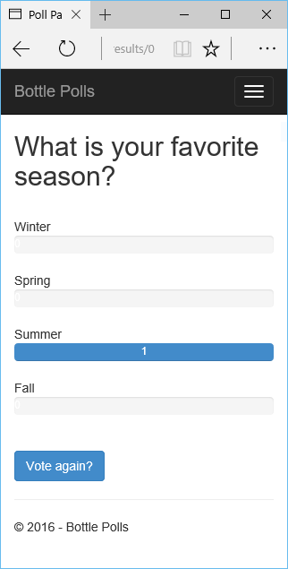
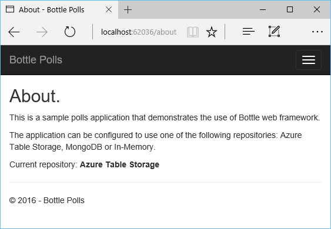

# Bottle and Azure Table Storage on Azure with Python Tools 2.2 for Visual Studio

In this tutorial, we'll use [Python Tools for Visual Studio] to create a simple polls web app using one of the PTVS sample templates.

The polls web app defines an abstraction for its repository, so you can easily switch between different types of repositories (In-Memory, Azure Table Storage, MongoDB).

We'll learn how to create an Azure Storage account, how to configure the web app to use Azure Table Storage, and how to publish the web app to [Azure App Service Web Apps](/app-service-web/app-service-changes-existing-services).

See the [Python Developer Center] for more articles that cover development of Azure App Service Web Apps with PTVS using Bottle, Flask and Django web frameworks, with MongoDB, Azure Table Storage, MySQL and SQL Database services. While this article focuses on App Service, the steps are similar when developing [Azure Cloud Services].

## Prerequisites
* Visual Studio 2015
* [Python Tools 2.2 for Visual Studio]
* [Python Tools 2.2 for Visual Studio Samples VSIX]
* [Azure SDK Tools for VS 2015]
* [Python 2.7 32-bit] or [Python 3.4 32-bit]

[!INCLUDE [create-account-and-websites-note](../../includes/create-account-and-websites-note.md)]

## Create the Project
In this section, we'll create a Visual Studio project using a sample template. We'll create a virtual environment and install required packages. Then we'll run the application locally using the default in-memory repository.

1. In Visual Studio, select **File**, **New Project**.
2. The project templates from the [Python Tools 2.2 for Visual Studio Samples VSIX] are available under **Python**, **Samples**. Select **Polls Bottle Web Project** and click OK to create the project.

     
3. You will be prompted to install external packages. Select **Install into a virtual environment**.

     
4. Select **Python 2.7** or **Python 3.4** as the base interpreter.

     
5. Confirm that the application works by pressing `F5`. By default, the application uses an in-memory repository which doesn't require any configuration. All data is lost when the web server is stopped.
6. Click **Create Sample Polls**, then click on a poll and vote.

     

## Create an Azure Storage Account
To use storage operations, you need an Azure storage account. You can create a storage account by following these steps.

1. Log into the [Azure Portal](https://portal.azure.cn/).
2. Click the **New** icon on the top left of the Portal, then click **Data + Storage** > **Storage Account**.  Click the **Create** button, then give the storage account a unique name and create a new [resource group](../azure-resource-manager/resource-group-overview.md) for it.

      

    When the storage account has been created, the **Notifications** button will flash a green **SUCCESS** and the storage account's blade is open to show that it belongs to the new resource group you created.
3. Click the **Access keys** part in the storage account's blade. Take note of the account name and key1.

      

    We will need this information to configure your project in the next section.

## Configure the Project
In this section, we'll configure our application to use the storage account we just created. Then we'll run the application locally.

1. In Visual Studio, right-click on your project node in Solution Explorer and select **Properties**. Click on the **Debug** tab.

     
2. Set the values of environment variables required by the application in **Debug Server Command**, **Environment**.

        REPOSITORY_NAME=azuretablestorage
        STORAGE_NAME=<storage account name>
        STORAGE_KEY=<primary access key>

    This will set the environment variables when you **Start Debugging**. If you want the variables to be set when you **Start Without Debugging**, set the same values under **Run Server Command** as well.

    Alternatively, you can define environment variables using the Windows Control Panel. This is a better option if you want to avoid storing credentials in source code / project file. Note that you will need to restart Visual Studio for the new environment values to be available to the application.
3. The code that implements the Azure Table Storage repository is in **models/azuretablestorage.py**. See the [documentation] for more information on how to use Table Service from Python.
4. Run the application with `F5`. Polls that are created with **Create Sample Polls** and the data submitted by voting will be serialized in Azure Table Storage.

    > [!NOTE]
    > The Python 2.7 Virtual Environment may cause an exception break in Visual Studio.  Press `F5` to continue loading the web project.
    > 
    > 
5. Browse to the **About** page to verify that the application is using the **Azure Table Storage** repository.

     

## Explore the Azure Table Storage
It's easy to view and edit storage tables using Cloud Explorer in Visual Studio. In this section we'll use Server Explorer to view the contents of the polls application tables.

> [!NOTE]
> This requires Azure Tools to be installed, which are available as part of the [Azure SDK for .NET].
> 
> 

1. Open **Cloud Explorer**. Expand **Storage Accounts**, your storage account, then **Tables**.

     
2. Double-click on the **polls** or **choices** table to view the contents of the table in a document window, as well as add/remove/edit entities.

     

## Publish the web app to Azure App Service
The Azure .NET SDK provides an easy way to deploy your web app to Azure App Service.

1. In **Solution Explorer**, right-click on the project node and select **Publish**.

     
2. Click on **Azure Web Apps**.
3. Click on **New** to create a new web app.
4. Fill in the following fields and click **Create**.

    * **Web App name**
    * **App Service plan**
    * **Resource group**
    * **Region**
    * Leave **Database server** set to **No database**
5. Accept all other defaults and click **Publish**.
6. Your web browser will open automatically to the published web app. If you browse to the about page, you'll see that it uses the **In-Memory** repository, not the **Azure Table Storage** repository.

    That's because the environment variables are not set on the Web Apps instance in Azure App Service, so it uses the default values specified in **settings.py**.

## Configure the Web Apps instance
In this section, we'll configure environment variables for the Web Apps instance.

1. In [Azure Portal], open the web app's blade by clicking **Browse** > **App Services** > your web app name.
2. In your web app's blade, click **All Settings**, then click **Application Settings**.
3. Scroll down to the **App settings** section and set the values for **REPOSITORY\_NAME**, **STORAGE\_NAME** and **STORAGE\_KEY** as described in the **Configure the project** section above.

     
4. Click on **Save**. After you've received the notifications that the changes were applied, click on **Browse** from the Web app main blade.
5. You should see the web app working as expected, using the **Azure Table Storage** repository.

    Congratulations!

    

## Next steps
Follow these links to learn more about Python Tools for Visual Studio, Bottle and Azure Table Storage.

* [Python Tools for Visual Studio Documentation]
    * [Web Projects]
    * [Cloud Service Projects]
    * [Remote Debugging on Azure]
* [Bottle Documentation]
* [Azure Storage]
* [Azure SDK for Python]
* [How to Use the Table Storage Service from Python]

## What's changed
* For a guide to the change from Websites to App Service see: [Azure App Service and Its Impact on Existing Azure Services](/app-service-web/app-service-changes-existing-services)

<!--Link references-->
[Python Developer Center]: /develop/python/
[Azure Cloud Services]: ../cloud-services/cloud-services-python-ptvs.md
[documentation]: ../storage/storage-python-how-to-use-table-storage.md
[How to Use the Table Storage Service from Python]: ../storage/storage-python-how-to-use-table-storage.md

<!--External Link references-->
[Azure Portal]: https://portal.azure.cn
[Azure SDK for .NET]: /downloads/
[Python Tools for Visual Studio]: http://aka.ms/ptvs
[Python Tools 2.2 for Visual Studio]: http://go.microsoft.com/fwlink/?LinkId=624025
[Python Tools 2.2 for Visual Studio Samples VSIX]: http://go.microsoft.com/fwlink/?LinkId=624025
[Azure SDK Tools for VS 2015]: http://go.microsoft.com/fwlink/?LinkId=518003
[Python 2.7 32-bit]: http://go.microsoft.com/fwlink/?LinkId=517190
[Python 3.4 32-bit]: http://go.microsoft.com/fwlink/?LinkId=517191
[Python Tools for Visual Studio Documentation]: http://aka.ms/ptvsdocs
[Bottle Documentation]: http://bottlepy.org/docs/dev/index.html
[Remote Debugging on Azure]: http://go.microsoft.com/fwlink/?LinkId=624026
[Web Projects]: http://go.microsoft.com/fwlink/?LinkId=624027
[Cloud Service Projects]: http://go.microsoft.com/fwlink/?LinkId=624028
[Azure Storage]: /storage/
[Azure SDK for Python]: https://github.com/Azure/azure-sdk-for-python