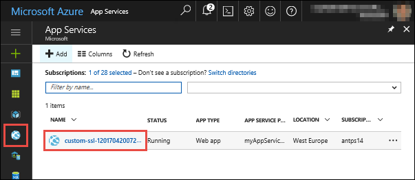
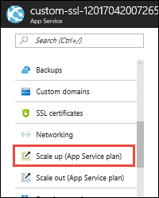
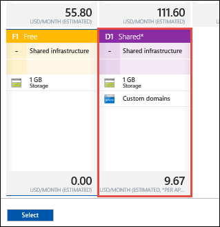
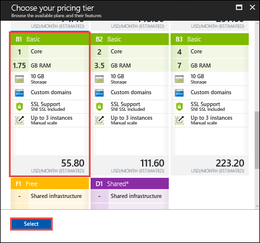
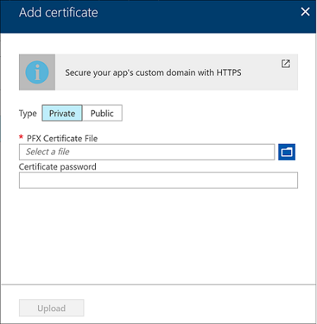
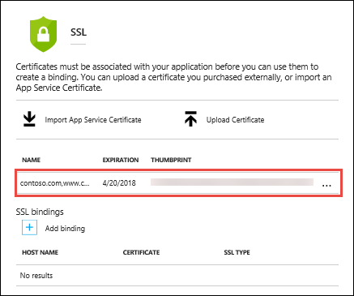
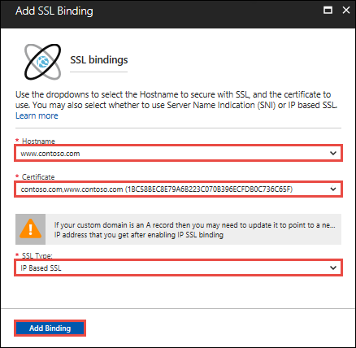
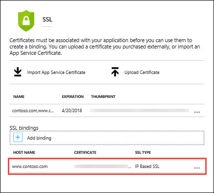
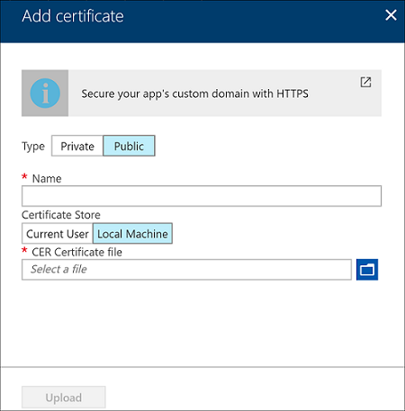

# Bind an existing custom SSL certificate to Azure Web Apps

Azure Web Apps provides a highly scalable, self-patching web hosting service. This tutorial shows you how to bind a custom SSL certificate that you purchased from a trusted certificate authority to [Azure Web Apps](app-service-web-overview.md). When you're finished, you'll be able to access your web app at the HTTPS endpoint of your custom DNS domain.


In this tutorial, you learn how to:

> [!div class="checklist"]
> * Upgrade your app's pricing tier
> * Bind your custom SSL certificate to App Service
> * Enforce HTTPS for your app
> * Automate SSL certificate binding with scripts

> [!NOTE]
> If you need to get a custom SSL certificate, you can get one in the Azure portal directly and bind it to your web app. Follow the [App Service Certificates tutorial](web-sites-purchase-ssl-web-site.md).
>
>

## Prerequisites

To complete this tutorial:

- [Create an App Service app](/app-service/)
- [Map a custom DNS name to your web app](app-service-web-tutorial-custom-domain.md)
- Acquire an SSL certificate from a trusted certificate authority
- Have the private key you used to sign the SSL certificate request

<a name="requirements"></a>

### Requirements for your SSL certificate

To use a certificate in App Service, the certificate must meet all the following requirements:

* Signed by a trusted certificate authority
* Exported as a password-protected PFX file
* Contains private key at least 2048 bits long
* Contains all intermediate certificates in the certificate chain

## Prepare your web app

To bind a custom SSL certificate to your web app, your [App Service plan](https://www.azure.cn/pricing/details/app-service/) must be in the **Basic**, **Standard**, or **Premium** tier. In this step, you make sure that your web app is in the supported pricing tier.

### Log in to Azure

Open the [Azure portal](https://portal.azure.cn).

### Navigate to your web app

From the left menu, click **App Services**, and then click the name of your web app.



You have landed in the management page of your web app.  

### Check the pricing tier

In the left-hand navigation of your web app page, scroll to the **Settings** section and select **Scale up (App Service plan)**.



Check to make sure that your web app is not in the **Free** or **Shared** tier. Your web app's current tier is highlighted by a dark blue box.



Custom SSL is not supported in the **Free** or **Shared** tier. If you need to scale up, follow the steps in the next section. Otherwise, close the **Choose your pricing tier** page and skip to [Upload and bind your SSL certificate](#upload).

### Scale up your App Service plan

Select one of the **Basic**, **Standard**, or **Premium** tiers.

Click **Select**.



When you see the following notification, the scale operation is complete.


<a name="upload"></a>

## Bind your SSL certificate

You are ready to upload your SSL certificate to your web app.

### Merge intermediate certificates

If your certificate authority gives you multiple certificates in the certificate chain, you need to merge the certificates in order. 

To do this, open each certificate you received in a text editor. 

Create a file for the merged certificate, called _mergedcertificate.crt_. In a text editor, copy the content of each certificate into this file. The order of your certificates should follow the order in the certificate chain, beginning with your certificate and ending with the root certificate. It looks like the following example:

```
-----BEGIN CERTIFICATE-----
<your entire Base64 encoded SSL certificate>
-----END CERTIFICATE-----

-----BEGIN CERTIFICATE-----
<The entire Base64 encoded intermediate certificate 1>
-----END CERTIFICATE-----

-----BEGIN CERTIFICATE-----
<The entire Base64 encoded intermediate certificate 2>
-----END CERTIFICATE-----

-----BEGIN CERTIFICATE-----
<The entire Base64 encoded root certificate>
-----END CERTIFICATE-----
```

### Export certificate to PFX

Export your merged SSL certificate with the private key that your certificate request was generated with.

If you generated your certificate request using OpenSSL, then you have created a private key file. To export your certificate to PFX, run the following command. Replace the placeholders _&lt;private-key-file>_ and _&lt;merged-certificate-file>_ with the paths to your private key and your merged certificate file.

```bash
openssl pkcs12 -export -out myserver.pfx -inkey <private-key-file> -in <merged-certificate-file>  
```

When prompted, define an export password. You'll use this password when uploading your SSL certificate to App Service later.

If you used IIS or _Certreq.exe_ to generate your certificate request, install the certificate to your local machine, and then [export the certificate to PFX](https://technet.microsoft.com/library/cc754329(v=ws.11).aspx).

### Upload your SSL certificate

To upload your SSL certificate, click **SSL certificates** in the left navigation of your web app.

Click **Upload Certificate**. 

In **PFX Certificate File**, select your PFX file. In **Certificate password**, type the password that you created when you exported the PFX file.

Click **Upload**.



When App Service finishes uploading your certificate, it appears in the **SSL certificates** page.



### Bind your SSL certificate

In the **SSL bindings** section, click **Add binding**.

In the **Add SSL Binding** page, use the dropdowns to select the domain name to secure, and the certificate to use.

> [!NOTE]
> If you have uploaded your certificate but don't see the domain name(s) in the **Hostname** dropdown, try refreshing the browser page.
>
>

In **SSL Type**, select whether to use **[Server Name Indication (SNI)](http://en.wikipedia.org/wiki/Server_Name_Indication)** or IP-based SSL.

- **SNI-based SSL** - Multiple SNI-based SSL bindings may be added. This option allows multiple SSL certificates to secure multiple domains on the same IP address. Most modern browsers (including Internet Explorer, Chrome, Firefox, and Opera) support SNI (find more comprehensive browser support information at [Server Name Indication](http://wikipedia.org/wiki/Server_Name_Indication)).
- **IP-based SSL** - Only one IP-based SSL binding may be added. This option allows only one SSL certificate to secure a dedicated public IP address. To secure multiple domains, you must secure them all using the same SSL certificate. This is the traditional option for SSL binding.

Click **Add Binding**.



When App Service finishes uploading your certificate, it appears in the **SSL bindings** sections.



## Remap A record for IP SSL

If you don't use IP-based SSL in your web app, skip to [Test HTTPS for your custom domain](#test).

By default, your web app uses a shared public IP address. When you bind a certificate with IP-based SSL, App Service creates a new, dedicated IP address for your web app.

If you have mapped an A record to your web app, update your domain registry with this new, dedicated IP address.

Your web app's **Custom domain** page is updated with the new, dedicated IP address. [Copy this IP address](app-service-web-tutorial-custom-domain.md#info), then [remap the A record](app-service-web-tutorial-custom-domain.md#map-an-a-record) to this new IP address.

<a name="test"></a>

## Test HTTPS

All that's left to do now is to make sure that HTTPS works for your custom domain. In various browsers, browse
to `https://<your.custom.domain>` to see that it serves up your web app.


> [!NOTE]
> If your web app gives you certificate validation errors, you're probably using a self-signed certificate.
>
> If that's not the case, you may have left out intermediate certificates when you export your certificate to the PFX file.

<a name="bkmk_enforce"></a>

## Enforce HTTPS

App Service does *not* enforce HTTPS, so anyone can still access your web app using HTTP. To enforce HTTPS for your web app, define a rewrite rule in the _web.config_ file for your web app. App Service uses this file, regardless of the language framework of your web app.

> [!NOTE]
> There is language-specific redirection of requests. ASP.NET MVC can use the [RequireHttps](http://msdn.microsoft.com/library/system.web.mvc.requirehttpsattribute.aspx) filter instead of the rewrite rule in _web.config_.

If you're a .NET developer, you should be relatively familiar with this file. It is in the root of your solution.

Alternatively, if you develop with PHP, Node.js, Python, or Java, there is a chance we generated this file on your behalf in App Service.

Connect to your web app's FTP endpoint by following the instructions at [Deploy your app to Azure App Service using FTP/S](app-service-deploy-ftp.md).

This file should be located in _/home/site/wwwroot_. If not, create a _web.config_ file in this folder with the following XML:

```xml   
<?xml version="1.0" encoding="UTF-8"?>
<configuration>
  <system.webServer>
    <rewrite>
      <rules>
        <!-- BEGIN rule ELEMENT FOR HTTPS REDIRECT -->
        <rule name="Force HTTPS" enabled="true">
          <match url="(.*)" ignoreCase="false" />
          <conditions>
            <add input="{HTTPS}" pattern="off" />
          </conditions>
          <action type="Redirect" url="https://{HTTP_HOST}/{R:1}" appendQueryString="true" redirectType="Permanent" />
        </rule>
        <!-- END rule ELEMENT FOR HTTPS REDIRECT -->
      </rules>
    </rewrite>
  </system.webServer>
</configuration>
```

For an existing _web.config_ file, copy the entire `<rule>` element into your _web.config_'s `configuration/system.webServer/rewrite/rules` element. If there are other `<rule>` elements in your _web.config_, place the copied `<rule>` element before the other `<rule>` elements.

This rule returns an HTTP 301 (permanent redirect) to the HTTPS protocol whenever the user makes an HTTP request to your web app. For example, it redirects from `http://contoso.com` to `https://contoso.com`.

For more information on the IIS URL Rewrite module, see the [URL Rewrite](http://www.iis.net/downloads/microsoft/url-rewrite) documentation.

## Enforce HTTPS for Web Apps on Linux

App Service on Linux does *not* enforce HTTPS, so anyone can still access your web app using HTTP. To enforce HTTPS for your web app, define a rewrite rule in the _.htaccess_ file for your web app. 

Connect to your web app's FTP endpoint by following the instructions at [Deploy your app to Azure App Service using FTP/S](app-service-deploy-ftp.md).

In _/home/site/wwwroot_, create an _.htaccess_ file with the following code:

```
RewriteEngine On
RewriteCond %{HTTP:X-ARR-SSL} ^$
RewriteRule ^(.*)$ https://%{HTTP_HOST}%{REQUEST_URI} [L,R=301]
```

This rule returns an HTTP 301 (permanent redirect) to the HTTPS protocol whenever the user makes an HTTP request to your web app. For example, it redirects from `http://contoso.com` to `https://contoso.com`.

## Automate with scripts

You can automate SSL bindings for your web app with scripts, using the [Azure CLI](https://docs.azure.cn/zh-cn/cli/install-azure-cli?view=azure-cli-lastest) or [Azure PowerShell](https://docs.microsoft.com/en-us/powershell/azure/overview).

### Azure CLI

The following command uploads an exported PFX file and gets the thumbprint.

```bash
thumbprint=$(az webapp config ssl upload \
    --name <app_name> \
    --resource-group <resource_group_name> \
    --certificate-file <path_to_PFX_file> \
    --certificate-password <PFX_password> \
    --query thumbprint \
    --output tsv)
```

The following command adds an SNI-based SSL binding, using the thumbprint from the previous command.

```bash
az webapp config ssl bind \
    --name <app_name> \
    --resource-group <resource_group_name>
    --certificate-thumbprint $thumbprint \
    --ssl-type SNI \
```

### Azure PowerShell

The following command uploads an exported PFX file and adds an SNI-based SSL binding.

```PowerShell
New-AzureRmWebAppSSLBinding `
    -WebAppName <app_name> `
    -ResourceGroupName <resource_group_name> `
    -Name <dns_name> `
    -CertificateFilePath <path_to_PFX_file> `
    -CertificatePassword <PFX_password> `
    -SslState SniEnabled
```
## Public Certificates (Optional)
You can upload [Public Certificates](https://blogs.msdn.microsoft.com/appserviceteam/2017/11/01/app-service-certificates-now-supports-public-certificates-cer/) to your web app. You can use Public Certificates with Web Apps on App Service or App Service Environment (ASE). If you need to store the certificate in the LocalMachine certificate store, you need to use a web app on App Service Enviroment. For more details, see [How to configure Public Certificates to your Web App](https://blogs.msdn.microsoft.com/appserviceteam/2017/11/01/app-service-certificates-now-supports-public-certificates-cer).



## Next steps

In this tutorial, you learned how to:

> [!div class="checklist"]
> * Upgrade your app's pricing tier
> * Bind your custom SSL certificate to App Service
> * Enforce HTTPS for your app
> * Automate SSL certificate binding with scripts

Advance to the next tutorial to learn how to use Azure Content Delivery Network.

> [!div class="nextstepaction"]
> [Add a Content Delivery Network (CDN) to an Azure App Service](app-service-web-tutorial-content-delivery-network.md)
