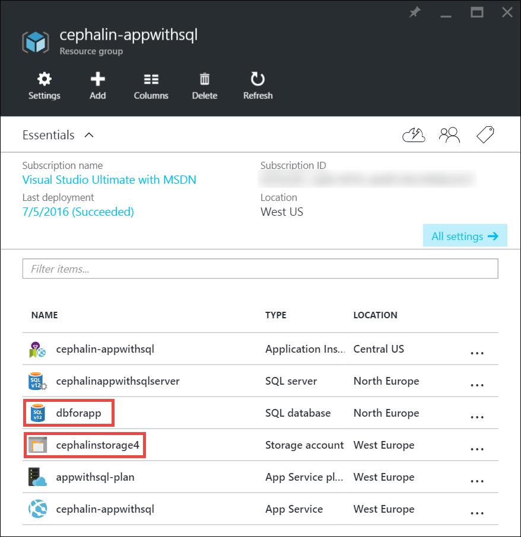

# Scale up an app in Azure
This article shows you how to scale your app in Azure App Service. There are two workflows for scaling, scale up and scale out, and this article explains the scale up workflow.

* [Scale up](https://en.wikipedia.org/wiki/Scalability#Horizontal_and_vertical_scaling): Get more CPU, memory, disk space, and extra features
  like dedicated virtual machines (VMs), custom domains and certificates, staging slots, autoscaling, and more. You scale up by changing the pricing tier of the
  App Service plan that your app belongs to.
* [Scale out](https://en.wikipedia.org/wiki/Scalability#Horizontal_and_vertical_scaling): Increase the number of VM instances that run your app.
  You can scale out to as many as 20 instances, depending on your pricing tier. For more information about scaling out, see
  [Scale instance count manually or automatically](../monitoring-and-diagnostics/insights-how-to-scale.md). There you find out how
  to use autoscaling, which is to scale instance count automatically based on predefined rules and schedules.

The scale settings take only seconds to apply and affect all apps in your [App Service plan](../app-service/azure-web-sites-web-hosting-plans-in-depth-overview.md).
They do not require you to change your code or redeploy your application.

For information about the pricing and features of individual App Service plans, see [App Service Pricing Details](https://www.azure.cn/pricing/details/app-service/).  

> [!NOTE]
> Before you switch an App Service plan from the **Free** tier, you must first remove the [spending limits](https://www.azure.cn/pricing/spending-limits/) in place for your Azure subscription. To view or change options for your Azure App Service subscription, see [Azure Subscriptions][azuresubscriptions].
> 
> 

## Scale up your pricing tier
1. In your browser, open the [Azure portal][portal].
2. In your App Service app page, click **All settings**, and then click **Scale Up**.
   
    ![Navigate to scale up your Azure app.][ChooseWHP]
3. Choose your tier, and then click **Select**.

    The **Notifications** tab will flash a green **SUCCESS** after the operation is complete.

## Scale related resources
If your app depends on other services, such as Azure SQL Database or Azure Storage, you can scale up these resources separately. These resources are not managed by the App Service plan.

1. In **Essentials**, click the **Resource group** link.

    
2. In the **Summary** part of the **Resource group** page, click a resource that you want to scale. The following screenshot
   shows a SQL Database resource and an Azure Storage resource.
   
    
3. For a SQL Database resource, click **Settings** > **Pricing tier** to scale the pricing tier.

    

    You can also turn on [geo-replication](../sql-database/sql-database-geo-replication-overview.md) for your SQL Database instance.

    For an Azure Storage resource, click **Settings** > **Configuration** to scale up your storage options.

    

## Compare pricing tiers
For detailed information, such as VM sizes for each pricing tier, see [App Service Pricing Details](https://www.azure.cn/pricing/details/web-sites/).

## Learn about other features
* For detailed information about all of the remaining features in the App Service plans, including pricing and features of interest to all users (including developers), see [App Service Pricing Details](https://www.azure.cn/pricing/details/app-service/).

## Next steps
* For information about pricing, support, and SLA, visit the following links.

    [Data Transfers Pricing Details](https://www.azure.cn/pricing/details/data-transfer/)

    [Azure Support Plans](https://www.azure.cn/support/plans/)

    [Service Level Agreements](https://www.azure.cn/support/legal/sla/)

    [SQL Database Pricing Details](https://www.azure.cn/pricing/details/sql-database/)

    [Virtual Machine and Cloud Service Sizes for Azure][vmsizes]

<!-- LINKS -->
[vmsizes]:https://www.azure.cn/pricing/details/app-service/
[SQLaccountsbilling]:https://www.azure.cn/pricing/details/sql-database/
[azuresubscriptions]:http://account.windowsazure.cn/subscriptions
[portal]: https://portal.azure.cn/

<!-- IMAGES -->
[ChooseWHP]: ./media/web-sites-scale/scale1ChooseWHP.png
[ResourceGroup]: ./media/web-sites-scale/scale10ResourceGroup.png
[ScaleDatabase]: ./media/web-sites-scale/scale11SQLScale.png
[GeoReplication]: ./media/web-sites-scale/scale12SQLGeoReplication.png