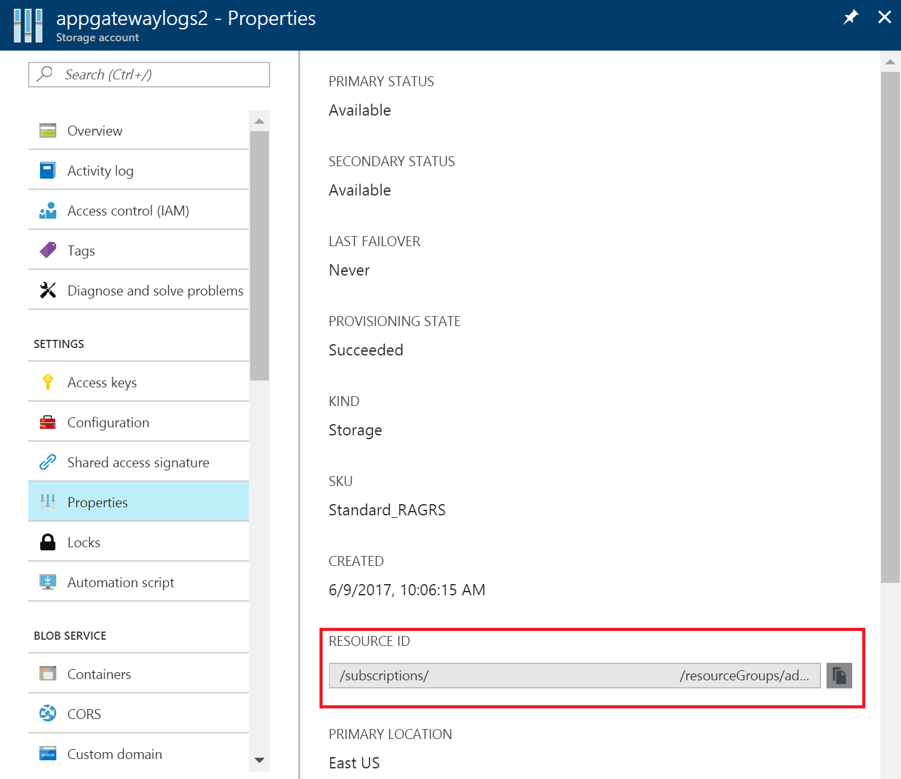
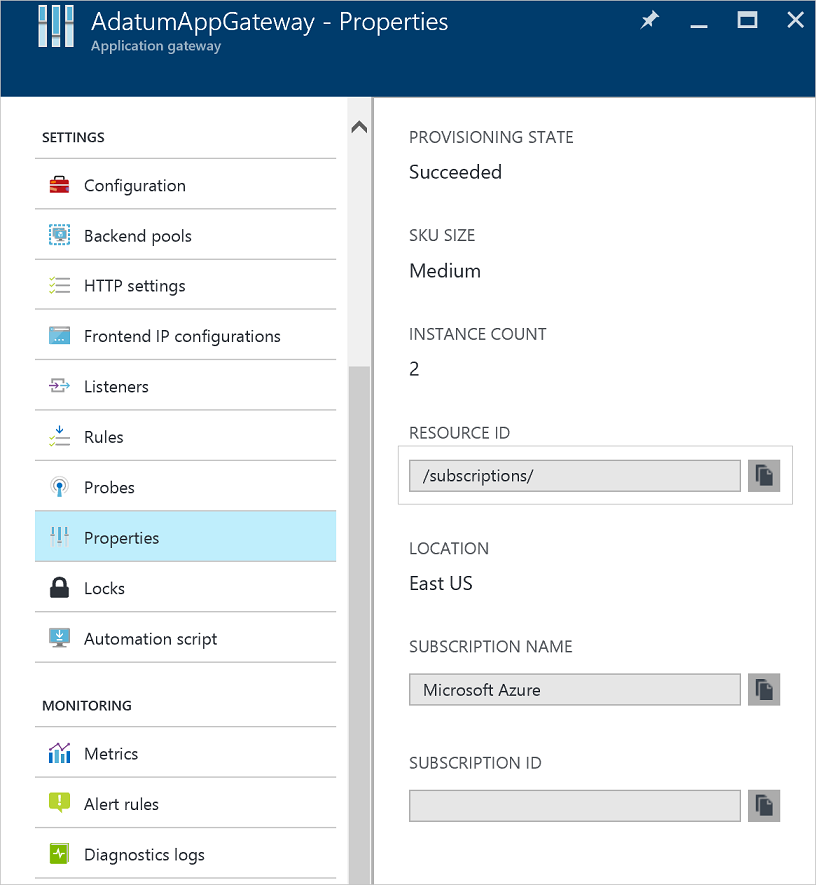

# Backend health, diagnostics logging and metrics for Application Gateway

Azure provides the capability to monitor resources with logging and metrics. Application Gateway provides these capabilities with backend health, logging, and metrics.

[**Backend health**](#backend-health) - Application gateway provides the capability to monitor the health of the servers in the backend pools through the portal and through powershell.

[**Logging**](#enable-logging-with-powershell) - Logging allows for access and other logs to be saved or consumed from a resource for monitoring purposes.

[**Metrics**](#metrics) - Application gateway currently has one metric. This metric measures the throughput of the application gateway in Bytes per second.

## Backend health

Application gateway provides the capability to monitor the health of individual members of the backend pools through the portal, PowerShell, and CLI. The backend health report reflects the output of the Application Gateway health probe to the backend instances. When probing is successful and the backend can be served traffic to, it is considered healthy, otherwise it is considered unhealthy.

> [!IMPORTANT]
> If there is an NSG on Application Gateway subnet, port ranges 65503-65534 should be opened on the Application Gateway subnet for Inbound traffic. These ports are required for the backend health API to work.

### View backend health through the portal

There is nothing that is needed to be done to view backend health. In an existing application gateway, navigate to **Monitoring** > **Backend health**. Each member in the backend pool is listed on this page (whether it is a NIC, IP or FQDN). Backend pool name, port, backend http settings name and health status are shown. Valid values for health status are "Healthy", "Unhealthy" and "Unknown".

> [!WARNING]
> If you see a backend health status as **Unknown**, ensure that the access to backend is not blocked by a Network Security Group (NSG) rule or by a custom DNS in the VNet.

![backend health][10]

### View backend health with PowerShell

Backend health is also available to be retrieved through PowerShell. The following PowerShell code shows how to pull the backend health with the `Get-AzureRmApplicationGatewayBackendHealth` cmdlet.

```powershell
Get-AzureRmApplicationGatewayBackendHealth -Name ApplicationGateway1 -ResourceGroupName Contoso
```

The results are returned, an example of the response is shown in the following snippet.

```json
{
"BackendAddressPool": {
    "Id": "/subscriptions/00000000-0000-0000-000000000000/resourceGroups/ContosoRG/providers/Microsoft.Network/applicationGateways/applicationGateway1/backendAddressPools/appGatewayBackendPool"
},
"BackendHttpSettingsCollection": [
    {
    "BackendHttpSettings": {
        "Id": "/00000000-0000-0000-000000000000/resourceGroups/ContosoRG/providers/Microsoft.Network/applicationGateways/applicationGateway1/backendHttpSettingsCollection/appGatewayBackendHttpSettings"
    },
    "Servers": [
        {
        "Address": "hostname.chinanorth.chinacloudapp.cn",
        "Health": "Healthy"
        },
        {
        "Address": "hostname.chinanorth.chinacloudapp.cn",
        "Health": "Healthy"
        }
    ]
    }
]
}
```

## Diagnostic logging

You can use different types of logs in Azure to manage and troubleshoot application gateways. Some of these logs can be accessed through the portal, and all logs can be extracted from an Azure blob storage, and viewed in different tools, such as Excel and PowerBI. You can learn more about the different types of logs from the following list:

* **Activity log:** You can use [Azure Activity Log](../monitoring-and-diagnostics/insights-debugging-with-events.md) (formerly known as Operational Logs and Audit Logs) to view all operations being submitted to your Azure subscription, and their status. Activity log entries are collected by default, and can be viewed in the Azure Portal.
* **Access logs:** You can use this log to view application gateway access pattern and analyze important information including caller's IP, URL requested, response latency, return code, bytes in and out. Access log is collected every 300 seconds. This log contains one record per instance of application gateway. The application gateway instance can be identified by 'instanceId' property.
* **Firewall logs:** You can use this log to view the requests that are logged through either detection or prevention mode of an application gateway that is configured with web application firewall.

> [!WARNING]
> Logs are only available for resources deployed in the Resource Manager deployment model. You cannot use logs for resources in the classic deployment model. For a better understanding of the two models, reference the [Understanding Resource Manager deployment and classic deployment](../azure-resource-manager/resource-manager-deployment-model.md) article.

For Logs, there are two different options to choose for storing your logs.

* Storage account - Storage accounts are best used for logs when logs are stored for a longer duration and reviewed when needed.
* Event hubs - Event hubs are a great option for integrating with other SEIM tools to get alerts on your resources

### Enable logging with PowerShell

Activity logging is automatically enabled for every Resource Manager resource. You must enable access logging to start collecting the data available through those logs. To enable logging, see the following steps:

1. Note your storage account's Resource ID, where the log data is stored. This value would be of the form: /subscriptions/\<subscriptionId\>/resourceGroups/\<resource group name\>/providers/Microsoft.Storage/storageAccounts/\<storage account name\>. Any storage account in your subscription can be used. You can use the Portal to find this information.

    

2. Note your application gateway's Resource ID for which logging is to be enabled. This value would be of the form: /subscriptions/\<subscriptionId\>/resourceGroups/\<resource group name\>/providers/Microsoft.Network/applicationGateways/\<application gateway name\>. You can use the Portal to find this information.

    

3. Enable diagnostics logging using the following powershell cmdlet:

    ```powershell
    Set-AzureRmDiagnosticSetting  -ResourceId /subscriptions/<subscriptionId>/resourceGroups/<resource group name>/providers/Microsoft.Network/applicationGateways/<application gateway name> -StorageAccountId /subscriptions/<subscriptionId>/resourceGroups/<resource group name>/providers/Microsoft.Storage/storageAccounts/<storage account name> -Enabled $true     
    ```

> [!TIP] 
>Activity logs do not require a separate storage account. The use of storage for access logging incurs service charges.

### Activity log

This log (formerly known as the "operational log") is generated by Azure by default.  The logs are preserved for 90 days in Azure's Event Logs store. Learn more about these logs by reading the [View events and activity  log](../monitoring-and-diagnostics/insights-debugging-with-events.md) article.

### Access log

This log is only generated if you've enabled it on a per Application Gateway basis as detailed in the preceding steps. The data is stored in the storage account you specified when you enabled the logging. Each access of Application Gateway is logged in JSON format, as seen in the following example:

```json
{
    "resourceId": "/SUBSCRIPTIONS/{subscriptionId}/RESOURCEGROUPS/{resourceGroupName}/PROVIDERS/MICROSOFT.NETWORK/APPLICATIONGATEWAYS/{applicationGatewayName}",
    "operationName": "ApplicationGatewayAccess",
    "time": "2016-04-11T04:24:37Z",
    "category": "ApplicationGatewayAccessLog",
    "properties": {
        "instanceId":"ApplicationGatewayRole_IN_0",
        "clientIP":"37.186.113.170",
        "clientPort":"12345",
        "httpMethod":"HEAD",
        "requestUri":"/xyz/portal",
        "requestQuery":"",
        "userAgent":"-",
        "httpStatus":"200",
        "httpVersion":"HTTP/1.0",
        "receivedBytes":"27",
        "sentBytes":"202",
        "timeTaken":"359",
        "sslEnabled":"off"
    }
}
```

### Firewall log

This log is only generated if you have enabled it on a per application gateway basis as detailed in the preceding steps. This log also requires that web application firewall is configured on an application gateway. The data is stored in the storage account you specified when you enabled the logging. The following data is logged:

```json
{
  "resourceId": "/SUBSCRIPTIONS/{subscriptionId}/RESOURCEGROUPS/{resourceGroupName}/PROVIDERS/MICROSOFT.NETWORK/APPLICATIONGATEWAYS/{applicationGatewayName}",
  "operationName": "ApplicationGatewayFirewall",
  "time": "2017-03-20T15:52:09.1494499Z",
  "category": "ApplicationGatewayFirewallLog",
  "properties": {
    "instanceId": "ApplicationGatewayRole_IN_0",
    "clientIp": "104.210.252.3",
    "clientPort": "4835",
    "requestUri": "/?a=%3Cscript%3Ealert(%22Hello%22);%3C/script%3E",
    "ruleSetType": "OWASP",
    "ruleSetVersion": "3.0",
    "ruleId": "941320",
    "message": "Possible XSS Attack Detected - HTML Tag Handler",
    "action": "Blocked",
    "site": "Global",
    "details": {
      "message": "Warning. Pattern match \"<(a|abbr|acronym|address|applet|area|audioscope|b|base|basefront|bdo|bgsound|big|blackface|blink|blockquote|body|bq|br|button|caption|center|cite|code|col|colgroup|comment|dd|del|dfn|dir|div|dl|dt|em|embed|fieldset|fn|font|form|frame|frameset|h1|head|h ...\" at ARGS:a.",
      "data": "Matched Data: <script> found within ARGS:a: <script>alert(\\x22hello\\x22);</script>",
      "file": "rules/REQUEST-941-APPLICATION-ATTACK-XSS.conf",
      "line": "865"
    }
  }
} 

```

### View and analyze the activity log

You can view and analyze activity log data using any of the following methods:

* **Azure tools:** Retrieve information from the activity log through Azure PowerShell, the Azure Command Line Interface (CLI), the Azure REST API, or the Azure Portal.  Step-by-step instructions for each method are detailed in the [Activity operations with Resource Manager](../azure-resource-manager/resource-group-audit.md) article.
* **Power BI:** If you don't already have a [Power BI](https://powerbi.microsoft.com/pricing) account, you can try it for free. Using the [Azure Activity Logs content pack for Power BI](https://powerbi.microsoft.com/documentation/powerbi-content-pack-azure-audit-logs/) you can analyze your data with pre-configured dashboards that you can use as-is, or customize.

## View and analyze the access and firewall log

You can connect to your storage account and retrieve the JSON log entries for access logs. Once you download the JSON files, you can convert them to CSV and view in Excel, PowerBI, or any other data visualization tool.

> [!TIP]
> If you are familiar with Visual Studio and basic concepts of changing values for constants and variables in C#, you can use the [log converter tools](https://github.com/Azure-Samples/networking-dotnet-log-converter) available from GitHub.
> 
> 

## Next steps

* [Visualize your Azure Activity Log with Power BI](http://blogs.msdn.com/b/powerbi/archive/2015/09/30/monitor-azure-audit-logs-with-power-bi.aspx) blog post.
* [View and analyze Azure Activity Log in Power BI and more](https://azure.microsoft.com/blog/analyze-azure-audit-logs-in-powerbi-more/) blog post.

[1]: ./media/application-gateway-diagnostics/figure1.png
[2]: ./media/application-gateway-diagnostics/figure2.png
[3]: ./media/application-gateway-diagnostics/figure3.png
[4]: ./media/application-gateway-diagnostics/figure4.png
[5]: ./media/application-gateway-diagnostics/figure5.png
[6]: ./media/application-gateway-diagnostics/figure6.png
[7]: ./media/application-gateway-diagnostics/figure7.png
[8]: ./media/application-gateway-diagnostics/figure8.png
[9]: ./media/application-gateway-diagnostics/figure9.png
[10]: ./media/application-gateway-diagnostics/figure10.png
