# Graphical authoring in Azure Automation
## Introduction
Graphical Authoring allows you to create runbooks for Azure Automation without the complexities of the underlying Windows PowerShell or PowerShell Workflow code. You add activities to the canvas from a library of cmdlets and runbooks, link them together and configure to form a workflow.  If you have ever worked with System Center Orchestrator or Service Management Automation (SMA), then this should look familiar to you.   

This article provides an introduction to graphical authoring and the concepts you need to get started in creating a graphical runbook.

## Graphical runbooks
All runbooks in Azure Automation are Windows PowerShell Workflows.  Graphical and Graphical PowerShell Workflow runbooks generate PowerShell code that is run by the Automation workers, but you are not able to view it or directly modify it.  A Graphical runbook can be converted to a Graphical PowerShell Workflow runbook and vice-versa, but they cannot be converted to a textual runbook. An existing textual runbook cannot be imported into the graphical editor.  

## Overview of graphical editor
You can open the graphical editor in the Azure portal by creating or editing a graphical runbook.

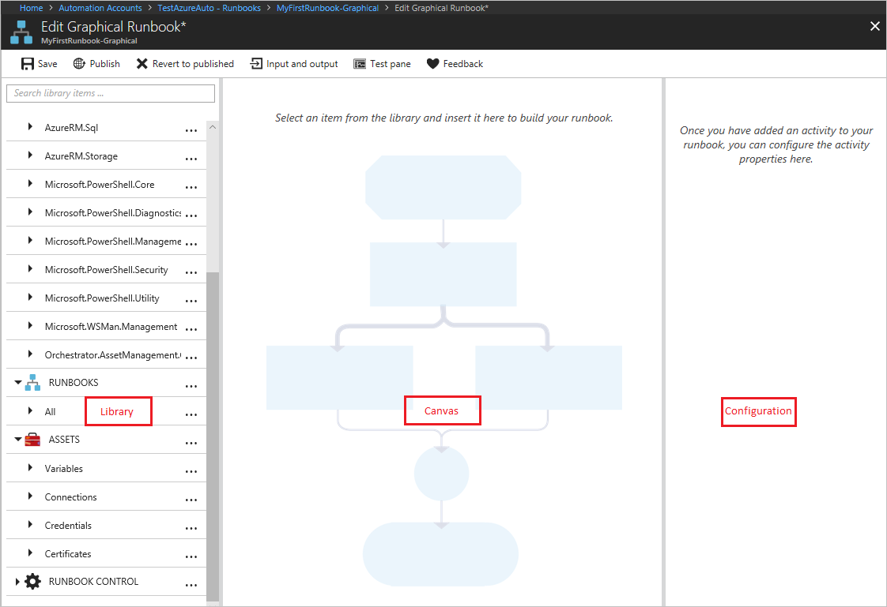

The following sections describe the controls in the graphical editor.

### Canvas
The Canvas is where you design your runbook.  You add activities from the nodes in the Library control to the runbook and connect them with links to define the logic of the runbook.

You can use the controls at the bottom of the canvas to zoom in and out.

### Library control
The Library control is where you select [activities](#activities) to add to your runbook.  You add them to the canvas where you connect them to other activities.  It includes four sections described in the following table.

| Section | Description |
|:--- |:--- |
| Cmdlets |Includes all the cmdlets that can be used in your runbook.  Cmdlets are organized by module.  All of the modules that you have installed in your automation account will be available. |
| Runbooks |Includes the runbooks in your automation account. These runbooks can be added to the canvas to be used as child runbooks. Only runbooks of the same core type as the runbook being edited are shown; for Graphical runbooks only PowerShell-based runbooks are shown, while for Graphical PowerShell Workflow runbooks only PowerShell-Workflow-based runbooks are shown. |
| Assets |Includes the [automation assets](/automation) in your automation account that can be used in your runbook.  When you add an asset to a runbook, it will add a workflow activity that gets the selected asset.  In the case of variable assets, you can select whether to add an activity to get the variable or set the variable. |
| Runbook Control |Includes runbook control activities that can be used in your current runbook. A *Junction* takes multiple inputs and waits until all have completed before continuing the workflow. A *Code* activity runs one or more lines of PowerShell or PowerShell Workflow code depending on the graphical runbook type.  You can use this activity for custom code or for functionality that is difficult to achieve with other activities. |

### Configuration control
The Configuration control is where you provide details for an object selected on the canvas. The properties available in this control will depend on the type of object selected.  When you select an option in the Configuration control, it will open additional blades in order to provide additional information.

### Test control
The Test control is not displayed when the graphical editor is first started. It is opened when you interactively [test a graphical runbook](#graphical-runbook-procedures).  

## Graphical runbook procedures
### Exporting and importing a graphical runbook
You can only export the published version of a graphical runbook.  If the runbook has not yet been published, then the **Export published** button will be disabled.  When you click the **Export published** button, the runbook is downloaded to your local computer.  The name of the file matches the name of the runbook with a *graphrunbook* extension.

You can import a Graphical or Graphical PowerShell Workflow runbook file by selecting the **Import** option when adding a runbook.   When you select the file to import, you can keep the same **Name** or provide a new one.  The Runbook Type field will display the type of runbook after it assesses the file selected and if you attempt to select a different type that is not correct, a message will be presented noting there are potential conflicts and during conversion, there could be syntax errors.  

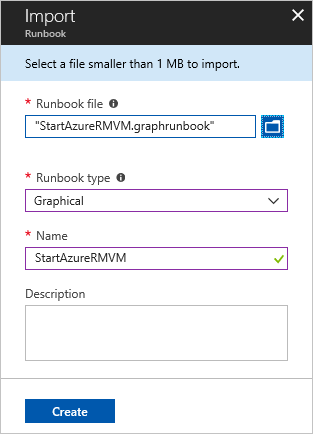

### Testing a graphical runbook
You can test the Draft version of a runbook in the Azure portal while leaving the published version of the runbook unchanged, or you can test a new runbook before it has been published. This allows you to verify that the runbook is working correctly before replacing the published version. When you test a runbook, the Draft runbook is executed and any actions that it performs are completed. No job history is created, but output is displayed in the Test Output Pane. 

Open the Test control for a runbook by opening the runbook for edit and then click on the **Test pane** button.

The Test control will prompt for any input parameters, and you can start the runbook by clicking on the **Start** button.

### Publishing a graphical runbook
Each runbook in Azure Automation has a Draft and a Published version. Only the Published version is available to be run, and only the Draft version can be edited. The Published version is unaffected by any changes to the Draft version. When the Draft version is ready to be available, then you publish it which overwrites the Published version with the Draft version.

You can publish a graphical runbook by opening the runbook for editing and then clicking on the **Publish** button.

When a runbook has not yet been published, it has a status of **New**.  When it is published, it has a status of **Published**.  If you edit the runbook after it has been published, and the Draft and Published versions are different, the runbook has a status of **In edit**.

 

You also have the option to revert to the Published version of a runbook.  This throws away any changes made since the runbook was last published and replaces the Draft version of the runbook with the Published version.

## Activities
Activities are the building blocks of a runbook.  An activity can be a PowerShell cmdlet, a child runbook, or a workflow activity.  You add an activity to the runbook by right clicking it in the Library control and selecting **Add to canvas**.  You can then click and drag the activity to place it anywhere on the canvas that you like.  The location of the of the activity on the canvas does not effect the operation of the runbook in any way.  You can layout your runbook however you find it most suitable to visualize its operation. 

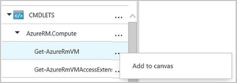

Select the activity on the canvas to configure its properties and parameters in the Configuration blade.  You can change the **Label** of the activity to something that is descriptive to you.  The original cmdlet is still being run, you are simply changing its display name that will be used in the graphical editor.  The label must be unique within the runbook. 

### Parameter sets
A parameter set defines the mandatory and optional parameters that will accept values for a particular cmdlet.  All cmdlets have at least one parameter set, and some have multiple.  If a cmdlet has multiple parameter sets, then you must select which one you will use before you can configure parameters.  The parameters that you can configure will depend on the parameter set that you choose.  You can change the parameter set used by an activity by selecting **Parameter Set** and selecting another set.  In this case, any parameter values that you configured are lost.

In the following example, the Get-AzureRmVM cmdlet has three parameter sets.  You cannot configure parameter values until you select one of the parameter sets.  The ListVirtualMachineInResourceGroupParamSet parameter set is for returning all virtual machines in a resource group and has a single optional parameter.  The GetVirtualMachineInResourceGroupParamSet is for specifying the virtual machine you want to return and has two mandatory and one optional parameter.

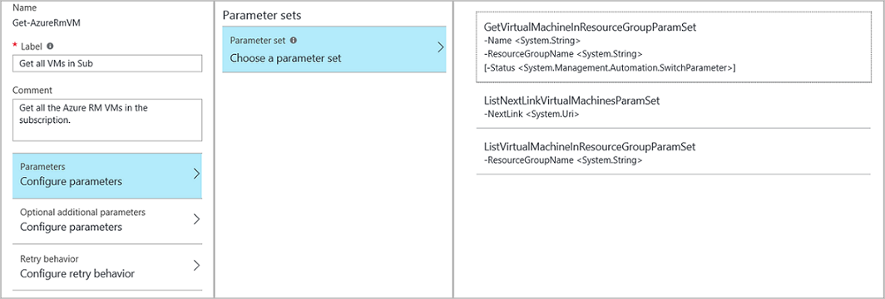

#### Parameter values
When you specify a value for a parameter, you select a data source to determine how the value will be specified.  The data sources that are available for a particular parameter will depend on the valid values for that parameter.  For example, Null will not be an available option for a parameter that does not allow null values.

| Data Source | Description |
|:--- |:--- |
| Constant Value |Type in a value for the parameter.  This is only available for the following data types: Int32,Int64,String,Boolean,DateTime,Switch. |
| Activity Output |Output from an activity that precedes the current activity in the workflow.  All valid activities will be listed.  Select just the activity to use its output for the parameter value.  If the activity outputs an object with multiple properties, then you can type in the name of the property after selecting the activity. |
| Runbook Input |Select a runbook input parameter as input to the activity parameter. |
| Variable Asset |Select an Automation Variable as input. |
| Credential Asset |Select an Automation Credential as input. |
| Certificate Asset |Select an Automation Certificate as input. |
| Connection Asset |Select an Automation Connection as input. |
| PowerShell Expression |Specify simple [PowerShell expression](#powershell-expressions).  The expression will be evaluated before the activity and the result used for the parameter value.  You can use variables to refer to the output of an activity or a runbook input parameter. |
| Not configured |Clears any value that was previously configured. |

#### Optional additional parameters
All cmdlets will have the option to provide additional parameters.  These are PowerShell common parameters or other custom parameters.  You are presented with a text box where you can provide parameters using PowerShell syntax.  For example, to use the **Verbose** common parameter, you would specify **"-Verbose:$True"**.

### Retry activity
**Retry Behavior** allows an activity to be run multiple times until a particular condition is met, much like a loop.  You can use this feature for activities that should run multiple times, are error prone and may need more than one attempt for success, or test the output information of the activity for valid data.    

When you enable retry for an activity, you can set a delay and a condition.  The delay is the time (measured in seconds or minutes) that the runbook will wait before it runs the activity again.  If no delay is specified, then the activity will run again immediately after it completes. 

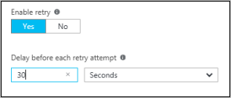

The retry condition is a PowerShell expression that is evaluated after each time the activity runs.  If the expression resolves to True, then the activity runs again.  If the expression resolves to False then the activity does not run again, and the runbook moves on to the next activity. 

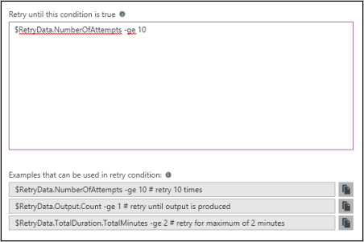

The retry condition can use a variable called $RetryData that provides access to information about the activity retries.  This variable has the properties in the following table.

| Property | Description |
|:--- |:--- |
| NumberOfAttempts |Number of times that the activity has been run. |
| Output |Output from the last run of the activity. |
| TotalDuration |Timed elapsed since the activity was started the first time. |
| StartedAt |Time in UTC format the activity was first started. |

Following are examples of activity retry conditions.

    # Run the activity exactly 10 times.
    $RetryData.NumberOfAttempts -ge 10 

    # Run the activity repeatedly until it produces any output.
    $RetryData.Output.Count -ge 1 

    # Run the activity repeatedly until 2 minutes has elapsed. 
    $RetryData.TotalDuration.TotalMinutes -ge 2

After you configure a retry condition for an activity, the activity includes two visual cues to remind you.  One is presented in the activity and the other is when you review the configuration of the activity.

### Workflow Script control
A Code control is a special activity that accepts PowerShell or PowerShell Workflow script depending on the type of graphical runbook being authored in order to provide functionality that may otherwise not be available.  It cannot accept parameters, but it can use variables for activity output and runbook input parameters.  Any output of the activity is added to the databus unless it has no outgoing link in which case it is added to the output of the runbook.

For example the following code performs date calculations using a runbook input variable called $NumberOfDays.  It then sends a calculated date time as output to be used by subsequent activities in the runbook.

    $DateTimeNow = (Get-Date).ToUniversalTime()
    $DateTimeStart = ($DateTimeNow).AddDays(-$NumberOfDays)}
    $DateTimeStart

## Links and workflow
A **link** in a graphical runbook connects two activities.  It is displayed on the canvas as an arrow pointing from the source activity to the destination activity.  The activities run in the direction of the arrow with the destination activity starting after the source activity completes.  

### Create a link
Create a link between two activities by selecting the source activity and clicking the circle at the bottom of the shape.  Drag the arrow to the destination activity and release.

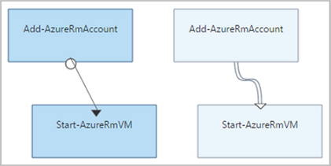

Select the link to configure its properties in the Configuration blade.  This will include the link type which is described in the following table.

| Link Type | Description |
|:--- |:--- |
| Pipeline |The destination activity is run once for each object output from the source activity.  The destination activity does not run if the source activity results in no output.  Output from the source activity is available as an object. |
| Sequence |The destination activity runs only once.  It receives an array of objects from the source activity.  Output from the source activity is available as an array of objects. |

### Starting activity
A graphical runbook will start with any activities that do not have an incoming link.  This will often be only one activity which would act as the starting activity for the runbook.  If multiple activities do not have an incoming link, then the runbook will start by running them in parallel.  It will then follow the links to run other activities as each completes.

### Conditions
When you specify a condition on a link, the destination activity is only run if the condition resolves to true.  You will typically use an $ActivityOutput variable in a condition to retrieve the output from the source activity.  

For a pipeline link, you specify a condition for a single object, and the condition is evaluated for each object output by the source activity.  The destination activity is then run for each object that satisfies the condition.  For example, with a source activity of Get-AzureRmVm, the following syntax could be used for a conditional pipeline link to retrieve only virtual machines in the resource group named *Group1*.  

    $ActivityOutput['Get Azure VMs'].Name -match "Group1"

For a sequence link, the condition is only evaluated once since a single array is returned containing all objects output from the source activity.  Because of this, a sequence link cannot be used for filtering like a pipeline link but will simply determine whether or not the next activity is run. Take for example the following set of activities in our Start VM runbook.   
There are three different sequence links that are verifying values were provided to two runbook input parameters representing VM name and Resource Group name in order to determine which is the appropriate action to take - start a single VM, start all VMs in the resouce group, or all VMs in a subscription.  For the sequence link between Connect to Azure and Get single VM, here is the condition logic:

    <# 
    Both VMName and ResourceGroupName runbook input parameters have values 
    #>
    (
    (($VMName -ne $null) -and ($VMName.Length -gt 0))
    ) -and (
    (($ResourceGroupName -ne $null) -and ($ResourceGroupName.Length -gt 0))
    )

When you use a conditional link, the data available from the source activity to other activities in that branch will be filtered by the condition.  If an activity is the source to multiple links, then the data available to activities in each branch will depend on the condition in the link connecting to that branch.

For example, the **Start-AzureRmVm** activity in the runbook below starts all virtual machines.  It has two conditional links.  The first conditional link uses the expression *$ActivityOutput['Start-AzureRmVM'].IsSuccessStatusCode -eq $true* to filter if the Start-AzureRmVm activity completed successfully.  The second uses the expression *$ActivityOutput['Start-AzureRmVM'].IsSuccessStatusCode -ne $true* to filter if the Start-AzureRmVm activity failed to start the virtual machine.  

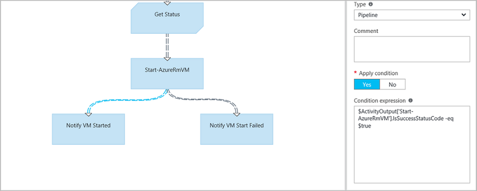

Any activity that follows the first link and uses the activity output from Get-AzureVM will only get the virtual machines that were started at the time that Get-AzureVM was run.  Any activity that follows the second link will only get the the virtual machines that were stopped at the time that Get-AzureVM was run.  Any activity following the third link will get all virtual machines regardless of their running state.

### Junctions
A junction is a special activity that will wait until all incoming branches have completed.  This allows you to run multiple activities in parallel and ensure that all have completed before moving on.

While a junction can have an unlimited number of incoming links, not more than one of those links can be a pipeline.  The number of incoming sequence links is not constrained.  You will be allowed to create the junction with multiple incoming pipeline links and save the runbook, but it will fail when it is run.

The example below is part of a runbook that starts a set of virtual machines while simultaneously downloading patches to be applied to those machines.  A junction is used to ensure that both processes are completed before the runbook continues.

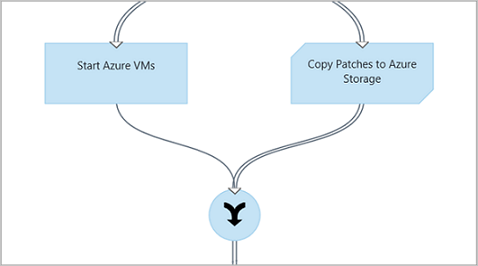

### Cycles
A cycle is when a destination activity links back to its source activity or to another activity that eventually links back to its source.  Cycles are currently not allowed in graphical authoring.  If your runbook has a cycle, it will save properly but will receive an error when it runs.

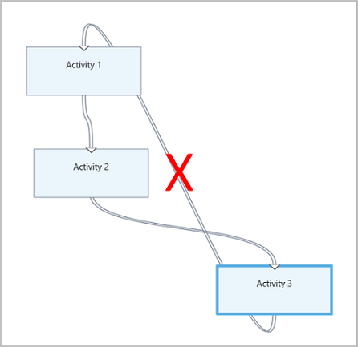

### Sharing data between activities
Any data that is output by an activity with an outgoing link is written to the *databus* for the runbook.  Any activity in the runbook can use data on the databus to populate parameter values or include in script code.  An activity can access the output of any previous activity in the workflow.     

How the data is written to the databus depends on the type of link on the activity.  For a **pipeline**, the data is output as multiples objects.  For a **sequence** link, the data is output as an array.  If there is only one value, it will be output as a single element array.

You can access data on the databus using one of two methods.  First is using an **Activity Output** data source to populate a parameter of another activity.  If the output is an object, you can specify a single property.

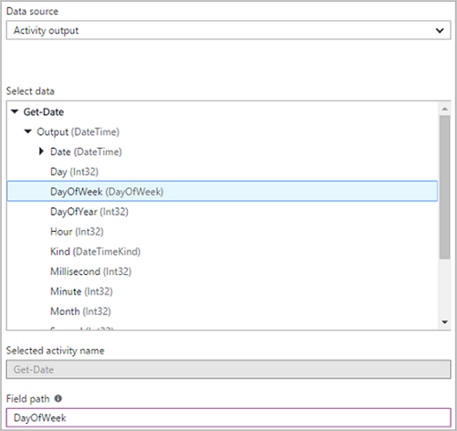

You can also retrieve the output of an activity in a **PowerShell Expression** data source or from a **Workflow Script** activity with an ActivityOutput variable.  If the output is an object, you can specify a single property.  ActivityOutput variables use the following syntax.

    $ActivityOutput['Activity Label']
    $ActivityOutput['Activity Label'].PropertyName 

### Checkpoints
You can set [checkpoints](automation-powershell-workflow.md#checkpoints) in a Graphical PowerShell Workflow runbook by selecting *Checkpoint runbook* on any activity.  This causes a checkpoint to be set after the activity runs.

Checkpoints are only enabled in Graphical PowerShell Workflow runbooks, it is not available in Graphical runbooks.  If the runbook uses Azure cmdlets, you should follow any checkpointed activity with an Add-AzureRMAccount in case the runbook is suspended and restarts from this checkpoint on a different worker. 

## Authenticating to Azure resources
Runbooks in Azure Automation that manage Azure resources will require authentication to Azure.  The [Run As account](automation-offering-get-started.md#creating-an-automation-account) (also referred to as a service principal) is the default method to access Azure Resource Manager resources in your subscription with Automation runbooks.  You can add this functionality to a graphical runbook by adding the **AzureRunAsConnection** Connection asset, which is using the PowerShell [Get-AutomationConnection](https://technet.microsoft.com/library/dn919922%28v=sc.16%29.aspx) cmdlet, and [Add-AzureRmAccount](https://msdn.microsoft.com/library/mt619267.aspx) cmdlet to the canvas. This is illustrated in the following example. 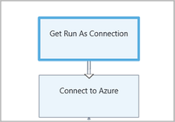 
The Get Run As Connection activity (i.e. Get-AutomationConnection), is configured with a constant value data source named AzureRunAsConnection.  
The next activity, Add-AzureRmAccount, adds the authenticated Run As account for use in the runbook. 
 
For the parameters **APPLICATIONID**, **CERTIFICATETHUMBPRINT**, and **TENANTID** you will need to specify the name of the property for the Field path because the activity outputs an object with multiple properties.  Otherwise when you execute the runbook, it will fail attempting to authenticate.  This is what you need at a minimum to authenticate your runbook with the Run As account.

To maintain backwards compatibility for subscribers who have created an Automation account using an [Azure AD User account](automation-create-aduser-account.md) to manage Azure classic deployment or for Azure Resource Manager resources, the method to authenticate is the Add-AzureAccount cmdlet with a [credential asset](automation-credentials.md) that represents an Active Directory user with access to the Azure account.

You can add this functionality to a graphical runbook by adding a credential asset to the canvas followed by an Add-AzureAccount activity.  Add-AzureAccount uses the credential activity for its input.  This is illustrated in the following example.

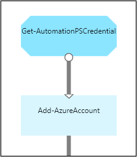

You have to authenticate at the start of the runbook and after each checkpoint.  This means adding an addition Add-AzureAccount activity after any Checkpoint-Workflow activity. You do not need an addition credential activity since you can use the same 

## Runbook input and output
### Runbook input
A runbook may require input either from a user when they start the runbook through the Azure portal or from another runbook if the current one is used as a child.
For example, if you have a runbook that creates a virtual machine, you may need to provide information such as the name of the virtual machine and other properties each time you start the runbook.  

You accept input for a runbook by defining one or more input parameters.  You provide values for these parameters each time the runbook is started.  When you start a runbook with the Azure portal, it will prompt you to provide values for the each of the runbook's input parameters.

You can access input parameters for a runbook by clicking the **Input and output** button on the runbook toolbar.  

 

This opens the **Input and Output** control where you can edit an existing input parameter or create a new one by clicking **Add input**. 

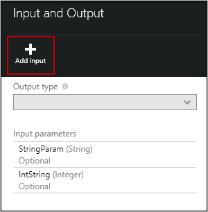

Each input parameter is defined by the properties in the following table.

| Property | Description |
|:--- |:--- |
| Name |The unique name of the parameter.  This can only contain alpha numeric characters and cannot contain a space. |
| Description |An optional description for the input parameter. |
| Type |Data type expected for the parameter value.  The Azure portal will provide an appropriate control for the data type for each parameter when prompting for input. |
| Mandatory |Specifies whether a value must be provided for the parameter.  The runbook cannot be started if you do not provide a value for each mandatory parameter that does not have a default value defined. |
| Default Value |Specifies what value is used for the parameter if one is not provided.  This can either be Null or a specific value. |

### Runbook output
Data created by any activity that does not have an outgoing link will be added to the [output of the runbook](automation-runbook-output-and-messages.md).  The output is saved with the runbook job and is available to a parent runbook when the runbook is used as a child.  

## PowerShell expressions
One of the advantages of graphical authoring is providing you with the ability to build a runbook with minimal knowledge of PowerShell.  Currently, you do need to know a bit of PowerShell though for populating certain [parameter values](#activities) and for setting [link conditions](#links-and-workflow).  This section provides a quick introduction to PowerShell expressions for those users who may not be familiar with it.  Full details of PowerShell are available at [Scripting with Windows PowerShell](http://technet.microsoft.com/library/bb978526.aspx). 

### PowerShell expression data source
You can use a PowerShell expression as a data source to populate the value of an [activity parameter](#activities) with the results of some PowerShell code.  This could be a single line of code that performs some simple function or multiple lines that perform some complex logic.  Any output from a command that is not assigned to a variable is output to the parameter value. 

For example, the following command would output the current date. 

    Get-Date

The following commands build a string from the current date and assign it to a variable.  The contents of the variable are then sent to the output 

    $string = "The current date is " + (Get-Date)
    $string

The following commands evaluate the current date and return a string indicating whether the current day is a weekend or weekday. 

    $date = Get-Date
    if (($date.DayOfWeek = "Saturday") -or ($date.DayOfWeek = "Sunday")) { "Weekend" }
    else { "Weekday" }

### Activity output
To use the output from a previous activity in the runbook, use the $ActivityOutput variable with the following syntax.

    $ActivityOutput['Activity Label'].PropertyName

For example, you may have an activity with a property that requires the name of a virtual machine in which case you could use the following expression.

    $ActivityOutput['Get-AzureVm'].Name

If the property that required the virtual machine object instead of just a property, then you would return the entire object using the following syntax.

    $ActivityOutput['Get-AzureVm']

You can also use the output of an activity in a more complex expression such as the following that concatenates text to the virtual machine name.

    "The computer name is " + $ActivityOutput['Get-AzureVm'].Name

### Conditions
Use [comparison operators](https://technet.microsoft.com/library/hh847759.aspx) to compare values or determine if a value matches a specified pattern.  A comparison returns a value of either $true or $false.

For example, the following condition determines whether the virtual machine from an activity named *Get-AzureVM* is currently *stopped*. 

    $ActivityOutput["Get-AzureVM"].PowerState –eq "Stopped"

The following condition checks whether the same virtual machine is in any state other than *stopped*.

    $ActivityOutput["Get-AzureVM"].PowerState –ne "Stopped"

You can join multiple conditions using a [logical operator](https://technet.microsoft.com/library/hh847789.aspx) such as **-and** or **-or**.  For example, the following condition checks whether the same virtual machine in the previous example is in a state of *stopped* or *stopping*.

    ($ActivityOutput["Get-AzureVM"].PowerState –eq "Stopped") -or ($ActivityOutput["Get-AzureVM"].PowerState –eq "Stopping") 

### Hashtables
[Hashtables](http://technet.microsoft.com/library/hh847780.aspx) are name/value pairs that are useful for returning a set of values.  Properties for certain activities may expect a hashtable instead of a simple value.  You may also see as hashtable referred to as a dictionary. 

You create a hashtable with the following syntax.  A hashtable can contain any number of entries but each is defined by a name and value.

    @{ <name> = <value>; [<name> = <value> ] ...}

For example, the following expression creates a hashtable to be used in the data source for an activity parameter that expected a hashtable with values for an internet search.

    $query = "Azure Automation"
    $count = 10
    $h = @{'q'=$query; 'lr'='lang_ja';  'count'=$Count}
    $h

The following example uses output from an activity called *Get Twitter Connection* to populate a hashtable.

    @{'ApiKey'=$ActivityOutput['Get Twitter Connection'].ConsumerAPIKey;
      'ApiSecret'=$ActivityOutput['Get Twitter Connection'].ConsumerAPISecret;
      'AccessToken'=$ActivityOutput['Get Twitter Connection'].AccessToken;
      'AccessTokenSecret'=$ActivityOutput['Get Twitter Connection'].AccessTokenSecret}

## Next Steps
* To get started with PowerShell workflow runbooks, see [My first PowerShell workflow runbook](automation-first-runbook-textual.md) 
* To get started with Graphical runbooks, see [My first graphical runbook](automation-first-runbook-graphical.md)
* To know more about runbook types, their advantages and limitations, see [Azure Automation runbook types](automation-runbook-types.md)
