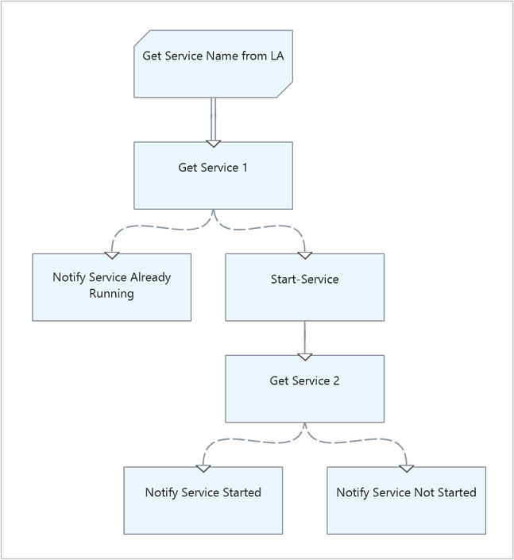
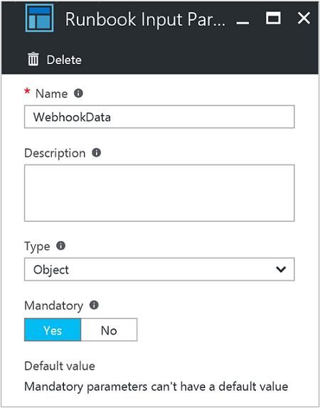

<!-- not suitable for Mooncake -->

---
title: Calling an Azure Automation Runbook from a Log Analytics Alert | Azure
description: This article provides an overview of how to invoke an Automation runbook from a Microsoft OMS Log Analytics alert.
services: automation
documentationcenter: ''
author: mgoedtel
manager: jwhit
editor: ''

ms.assetid: ''
ms.service: automation
ms.workload: tbd
ms.tgt_pltfrm: na
ms.devlang: na
ms.topic: get-started-article
ms.date: 01/31/2017
wacn.date: ''
ms.author: magoedte
---

# Calling an Azure Automation runbook from an OMS Log Analytics alert

When an alert is configured in Log Analytics to create an alert record if results match a particular criteria, such as a prolonged spike in processor utilization or a particular application process critical to the functionality of a business application fails and writes a corresponding event in the Windows event log, that alert can automatically run an Automation runbook in an attempt to auto-remediate the issue.  

There are two options to call a runbook when configuring the alert.  Specifically,

1. Using a Webhook.
    * This is the only option available if your OMS workspace is not linked to an Automation account.
    * If you already have an Automation account linked to an OMS workspace, this option is still available.  

2. Select a runbook directly.
    * This option is available only when the OMS workspace is linked to an Automation account.  

## Calling a runbook using a webhook

A webhook allows you to start a particular runbook in Azure Automation through a single HTTP request.  Before configuring the [Log Analytics alert](/documentation/articles/log-analytics-alerts/#creating-alert-rules) to call the runbook using a webhook as an alert action, you will need to first create a webhook for the runbook that will be called using this method.  Review and follow the steps in the [create a webhook](./automation-webhooks.md#creating-a-webhook) article and remember to record the webhook URL so that you can reference it while configuring the alert rule.   

## Calling a runbook directly

If you have the Automation & Control offering installed and configured in your OMS workspace, when configuring the Runbook actions option for the alert, you can view all runbooks from the **Select a runbook** dropdown list and select the specific runbook you want to run in response to the alert.  The selected runbook can run in a workspace in the Azure cloud or on a hybrid runbook worker.  When the alert is created using the runbook option, a webhook will be created for the runbook.  You can see the webhook if you go to the Automation account and navigate to the webhook blade of the selected runbook.  If you delete the alert, the webhook is not deleted, but the user can delete the webhook manually.  It is not a problem if the webhook is not deleted, it is just an orphaned item that will eventually need to be deleted in order to maintain an organized Automation account.  

## Characteristics of a runbook (for both options)

Both methods for calling the runbook from the Log Analytics alert have different behavior characteristics that need to be understood before you configure your alert rules.  

* You must have a runbook input parameter called **WebhookData** that is **Object** type.  It can be mandatory or optional.  The alert passes the search results to the runbook using this input parameter.

    ```
    param  
     (  
      [Parameter (Mandatory=$true)]  
      [object] $WebhookData  
     )
    ```

*  You must have code to convert the WebhookData to a PowerShell object.

    `$SearchResults = (ConvertFrom-Json $WebhookData.RequestBody).SearchResults.value`

    *$SearchResults* will be an array of objects; each object contains the fields with values from one search result

### WebhookData inconsistencies between the webhook option and runbook option

* When configuring an alert to call a Webhook, enter a webhook URL you created for a runbook, and click the **Test Webhook** button.  The resulting WebhookData sent to the runbook does not contain either *.SearchResult* or *.SearchResults*.

*  If you save that alert, when the alert triggers and calls the webhook, the WebhookData sent to the runbook contains *.SearchResult*.
* If you create an alert, and configure it to call a runbook (which also creates a webhook), when the alert triggers it sends WebhookData to the runbook that contains *.SearchResults*.

Thus in the code example above, you will need to get *.SearchResult* if the alert calls a webhook, and will need to get *.SearchResults* if the alert calls a runbook directly.

## Example walkthrough

We will demonstrate how this works by using the following example graphical runbook, which starts a Windows service.<br><br> <br>

The runbook has one input parameter of type **Object** that is called **WebhookData** and includes the webhook data passed from the alert containing *.SearchResults*.<br><br> <br>

For this example, in Log Analytics we created two custom fields, *SvcDisplayName_CF* and *SvcState_CF*, to extract the service display name and the state of the service (i.e. running or stopped) from the event written to the System event log.  We then create an alert rule with the following search query: `Type=Event SvcDisplayName_CF="Print Spooler" SvcState_CF="stopped"` so that we can detect when the Print Spooler service is stopped on the Windows system.  It can be any service of interest, but for this example we are referencing one of the pre-existing services that are included with the Windows OS.  The alert action is configured to execute our runbook used in this example and run on the Hybrid Runbook Worker, which are enabled on the target systems.   

The runbook code activity **Get Service Name from LA** will convert the JSON-formatted string into an object type and filter on the item *SvcDisplayName_CF* to extract the display name of the Windows service and pass this onto the next activity which will verify the service is stopped before attempting to restart it.  *SvcDisplayName_CF* is a [custom field](/documentation/articles/log-analytics-custom-fields/) created in Log Analytics to demonstrate this example.

```
$SearchResults = (ConvertFrom-Json $WebhookData.RequestBody).SearchResults.value
$SearchResults.SvcDisplayName_CF  
```

When the service stops, the alert rule in Log Analytics will detect a match and trigger the runbook and send the alert context to the runbook. The runbook will take action to verify the service is stopped, and if so attempt to restart the service and verify it started correctly and output the results.     

Alternatively if you don't have your Automation account linked to your OMS workspace, you would configure the alert rule with a webhook action to trigger the runbook and configure the runbook to convert the JSON-formatted string and filter on *.SearchResult* following the guidance mentioned earlier.    

## Next steps

* To learn more about alerts in Log Analytics and how to create one, see [Alerts in Log Analytics](/documentation/articles/log-analytics-alerts/).

* To understand how to trigger runbooks using a webhook, see [Azure Automation webhooks](./automation-webhooks.md).