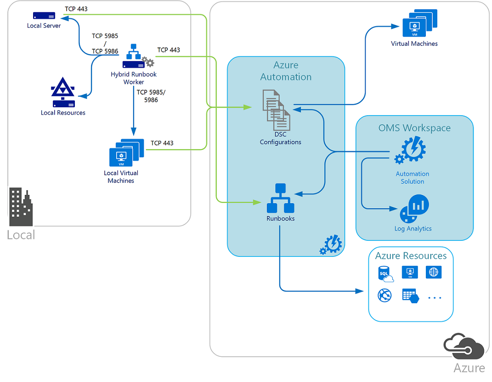

--- 
title:  Get Started with Azure Automation | Azure
description: This article provides an overview of Azure Automation service by reviewing the design and implementation details in preparation to onboard the offering from Azure Marketplace. 
services: automation
author: yunan2016
manager: digimobile
ms.service: automation
ms.workload: tbd
ms.tgt_pltfrm: na
ms.devlang: na
ms.topic: article
origin.date: 08/31/2017
ms.date: 01/15/2018
ms.author: v-nany

---

# Get started with Azure Automation

This article introduces core concepts related to the deployment of Azure Automation. If you are new to Automation in Azure or have experience with automation workflow software like System Center Orchestrator, you can learn how to prepare and onboard Automation. After you read this article, you'll be ready to begin developing runbooks to support your process automation needs. 

## Automation architecture overview

Azure Automation is a software as a service (SaaS) application that provides a scalable and reliable multitenant environment in which you can use runbooks to automate processes. You can use Desired State Configuration (DSC) in Azure, other cloud services, or in an on-premises environment to manage configuration changes to Windows and Linux systems. Entities in your Automation account, including runbooks, assets, and Run As accounts, are isolated from other Automation accounts in your subscription, and from other subscriptions.  

Runbooks that you run in Azure are executed on Automation sandboxes. Sandboxes are hosted in Azure platform as a service (PaaS) virtual machines. 

Automation sandboxes provide tenant isolation for all aspects of runbook execution, including modules, storage, memory, network communication, and job streams. This role is managed by the service. You can't access or manage the role from your Azure or Automation account.         

## Prerequisites

### Automation DSC
You can use Automation DSC to manage these machines:

* Azure virtual machines (classic) running Windows or Linux.
* Azure virtual machines running Windows or Linux.
* Amazon Web Services (AWS) virtual machines running Windows or Linux.
* Physical and virtual Windows computers that are on-premises or in a cloud other than Azure or AWS.
* Physical and virtual Linux computers that are on-premises or in a cloud other than Azure or AWS.

For Windows machines, the latest version of Windows Management Framework (WMF) 5 must be installed. For Linux machines, the latest version of the [PowerShell DSC agent for Linux](https://www.microsoft.com/en-us/download/details.aspx?id=49150) must be installed. The PowerShell DSC agent uses WMF 5 to communicate with Automation. 

### Hybrid Runbook Worker  
When you designate a computer to run hybrid runbook jobs, the computer must meet the following prerequisites:

* Windows Server 2012 or later.
* Windows PowerShell 4.0 or later. For increased reliability, we recommend Windows PowerShell 5.0. You can [download the new version](https://www.microsoft.com/download/details.aspx?id=50395) from the Microsoft Download Center.
* .NET Framework 4.6.2 or later.
* A  minimum of two cores.
* A minimum of 4 GB of RAM.

### Permissions required to create an Automation account
To create or update an Automation account, and to complete the tasks described in this article, you must have the following privileges and permissions:   
 
* To create an Automation account, your Azure Active Directory (Azure AD) user account must be added to a role with permissions equivalent to the Owner role for **Microsoft.Automation** resources. For more information, see [Role-Based Access Control in Azure Automation](automation-role-based-access-control.md).  
* In the Azure portal, under **Azure Active Directory** > **MANAGE** > **App registrations**, if **App registrations** is set to **Yes**, non-admin users in your Azure AD tenant can [register Active Directory applications](../azure-resource-manager/resource-group-create-service-principal-portal.md#check-azure-subscription-permissions). If **App registrations** is set to **No**, the user who performs this action must be a global administrator in Azure AD. 

If you aren't a member of the subscription’s Active Directory instance before you are added to the subscription's global administrator/coadministrator role, you are added to Active Directory as a guest. In this scenario, you see this message on the **Add Automation Account** page: “You do not have permissions to create." 

If a user is added to the global administrator/coadministrator role first, you can remove them from the subscription's Active Directory instance, and then re-add them to the full User role in Active Directory.

To verify user roles:
1. In the Azure portal, go to the **Azure Active Directory** pane.
2. Select **Users and groups**.
3. Select **All users**. 
4. After you select a specific user, select **Profile**. The value of the **User type** attribute under the user's profile should not be **Guest**.

## Plan for authentication
In Azure Automation, you can automate tasks against resources that are in Azure, on-premises, and in other cloud services. For a runbook to perform its required actions, it must have permissions to securely access the resources. It must have the minimal rights required within the subscription.  

### What is an Automation account 
All the automation tasks that you perform against resources by using the cmdlets in Azure Automation authenticate to Azure by using Azure AD organizational identity credentials-based authentication.  An Automation account is separate from the account that you use to sign in to the portal for configuring and using Azure resources. 

The following resources are included with an Automation account:

* **Certificates**. Contains a certificate that's used for authentication from a runbook or DSC configuration. You can also add certificates.
* **Connections**. Contains authentication and configuration information that's required to connect to an external service or application from a runbook or DSC configuration.
* **Credentials**. Contains a **PSCredential** object, which has security credentials such as a username and password. The credentials are required to authenticate from a runbook or DSC configuration.
* **Integration modules**. PowerShell modules that are included with an Automation account. Use the PowerShell modules to run cmdlets in runbooks and DSC configurations.
* **Schedules**. Contains schedules that start or stop a runbook at a specified time, including recurring frequencies.
* **Variables**. Contain values that are available from a runbook or DSC configuration.
* **DSC configurations**. PowerShell scripts that describe how to configure an operating system feature or setting, or how to install an application on a Windows or Linux computer.  
* **Runbooks**. A set of tasks that perform an automated process in Automation based on Windows PowerShell.    

Automation resources for each Automation account are associated with a single Azure region. However, you can use Automation accounts to manage all the resources in your subscription. Create Automation accounts in different regions if you have policies that require data and resources to be isolated to a specific region.

When you create an Automation account in the Azure portal, two authentication entities are automatically created:

* **Run As account**. This account does the following tasks:
  - Creates a service principal in Azure AD.
  - Creates a certificate.
  - Assigns the Contributor Role-Based Access Control (RBAC), which manages Azure Resource Manager resources by using runbooks.
* **Classic Run As account**. This account uploads a management certificate. The certificate is used to manage classic resources by using runbooks.

RBAC is available with Resource Manager to grant permitted actions to an Azure AD user account and Run As account. You can also use RBAC to authenticate that service principal. For more information, and for help developing a model for managing Automation permissions, see [Role-Based Access Control in Azure Automation article](automation-role-based-access-control.md).  

#### Authentication methods
The following table summarizes the authentication methods that you can use for each environment that Azure Automation supports.

| Method | Environment 
| --- | --- | 
| Azure Run As and Classic Run As account |Azure Resource Manager and Azure classic deployment |  
| Azure AD User account |Azure Resource Manager and Azure classic deployment |  
| Windows authentication |Local datacenter or other cloud services provider by using the Hybrid Runbook Worker role |  

The following articles provide overview and implementation steps to configure authentication for those environments. The articles describe using an existing and using a new account that you dedicate for that environment. 
* [Create a standalone Azure Automation account](automation-create-standalone-account.md)
* [Authenticate Runbooks with Azure classic deployment and Resource Manager](automation-create-aduser-account.md)
* [Update Automation Run As account](automation-create-runas-account.md)

For the Azure Run As and Classic Run As accounts, [Update Automation Run As account](automation-create-runas-account.md) describes how to update your existing Automation account with the Run As accounts from the portal. It also describes how to use PowerShell if the Automation account wasn't originally configured with a Run As or Classic Run As account. You can create a Run As account and a Classic Run As account by using a certificate that's issued by your enterprise certificate authority (CA). Review [Update Automation Run As account](automation-create-runas-account.md) to learn how to create the accounts by using this configuration.     
 
## Next steps
* Verify that your new Automation account can authenticate against Azure resources. For more information, see [Test Azure Automation Run As account authentication](automation-verify-runas-authentication.md).
* Learn how to get started with creating runbooks and related considerations before you begin authoring. For more information, see [Automation runbook types](automation-runbook-types.md).

