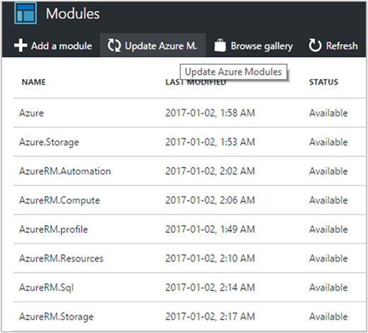
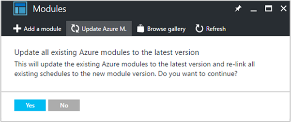
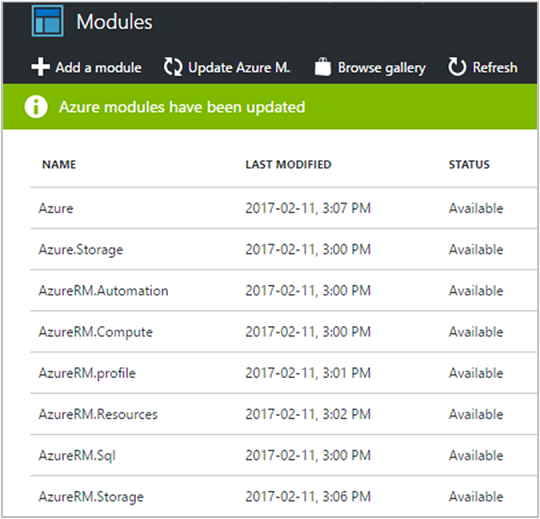

<!-- not suitable for Mooncake -->

<properties
    pageTitle="Update Azure modules in Azure Automation | Azure"
    description="This article describes how you can now update common Azure PowerShell modules provided by default in Azure Automation."
    services="automation"
    documentationcenter=""
    author="MGoedtel"
    manager="carmonm"
    editor="tysonn" />
<tags
    ms.assetid=""
    ms.service="automation"
    ms.devlang="na"
    ms.topic="article"
    ms.tgt_pltfrm="na"
    ms.workload="infrastructure-services"
    ms.date="02/13/2017"
    wacn.date=""
    ms.author="magoedte" />

# How to update Azure PowerShell modules in Azure Automation

The most common Azure PowerShell modules are provided by default in each Automation account.  The Azure team updates the Azure modules regularly, so in the Automation account we provide a way for you to update the modules in the account when new versions are available.

## Updating Azure Modules

1. In the Modules blade of your Automation account there is an option called **Update Azure Modules**.  It is always enabled.   

2. Click **Update Azure Modules** and you will be presented with a confirmation notification that asks you if you want to continue.   

3. Click **Yes** and the module update process will begin.  The update process takes about 15-20 minutes to update the following modules:

    * Azure
    *	Azure.Storage
    *	AzureRm.Automation
    *	AzureRm.Compute
    *	AzureRm.Profile
    *	AzureRm.Resources
    *	AzureRm.Sql
    * AzureRm.Storage

        If the modules are already up to date, then the process will complete in a few seconds.  When the update process completes you will be notified.   

As part of the update process, the schedules for any scheduled runbooks will be updated to use the latest module version.

If you use cmdlets from these Azure PowerShell modules in your runbooks to manage Azure resources, then you will want to perform this update process every month or so to assure that you have the latest modules.

## Next steps

To learn more about Integration Modules and how to create custom modules to further integrate Automation with other systems, services, or solutions, see [Integration Modules](/documentation/articles/automation-integration-modules/).