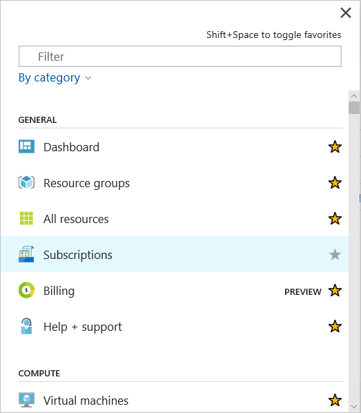
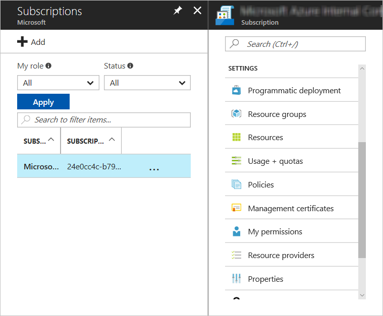
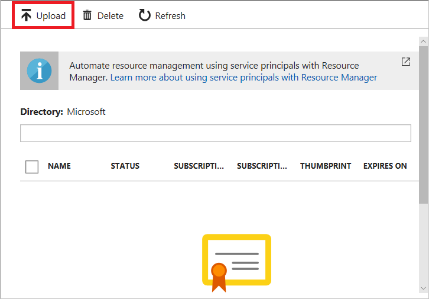
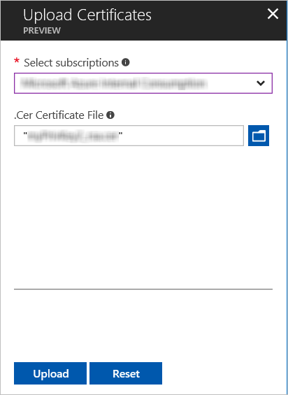

# Upload an Azure Management API Management Certificate
Management certificates allow you to authenticate with the classic deployment model provided by Azure. Many programs and tools (such as Visual Studio or the Azure SDK) use these certificates to automate configuration and deployment of various Azure services. 

> [!WARNING]
> Be careful! These types of certificates allow anyone who authenticates with them to manage the subscription they are associated with.
>
>

If you'd like more information about Azure certificates (including creating a self-signed certificate), see [Certificates overview for Azure Cloud Services](cloud-services/cloud-services-certs-create.md#what-are-management-certificates).

You can also use [Azure Active Directory](/active-directory/) to authenticate client-code for automation purposes.

**Note:** You must be a Co-administrator on the subscription to perform any operations under Management Certificates. [Learn More](https://go.microsoft.com/fwlink/?linkid=849300) on how to Add or Remove Co-Admins from new Azure Portal 

## Upload a management certificate
Once you have a management certificate created, (.cer file with only the public key) you can upload it into the portal. When the certificate is available in the portal, anyone with a matching certificate (private key) can connect through the Management API and access the resources for the associated subscription.

1. Log in to the [Azure portal](http://portal.azure.cn).
2. Click **More services** at the bottom Azure service list, then select **Subscriptions** in the _General_ service group.

    

3. Make sure to select the correct subscription that you want to associate with the certificate.     
4. After you have selected the correct subscription, press **Management certificates** in the _Settings_ group.

    

5. Press the **Upload** button.

    
6. Fill out the dialog information and press **Upload**.

    

## Next steps
Now that you have a management certificate associated with a subscription, you can (after you have installed the matching certificate locally) programmatically connect to the [classic deployment model REST API](https://msdn.microsoft.com/library/azure/mt420159.aspx) and automate the various Azure resources that are also associated with that subscription.

<!--Update_Description: wording update -->