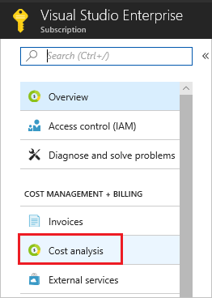
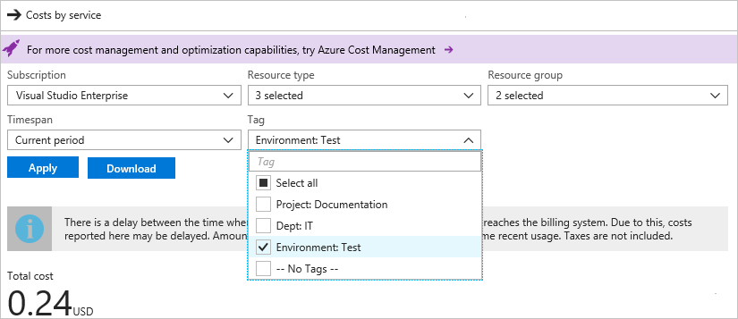

# Manage resources with Azure PowerShell

[!INCLUDE [Resource Manager governance introduction](../../includes/resource-manager-governance-intro.md)]

<!-- Not Avaiable on [!INCLUDE [cloud-shell-powershell.md](../../includes/cloud-shell-powershell.md)] -->

If you choose to install and use the PowerShell locally, see [Install Azure PowerShell module](https://docs.microsoft.com/powershell/azure/install-azurerm-ps). If you are running PowerShell locally, you also need to run `Login-AzureRmAccount -EnvironmentName AzureChinaCloud` to create a connection with Azure.

## Understand scope

[!INCLUDE [Resource Manager governance scope](../../includes/resource-manager-governance-scope.md)]

In this article, you apply all management settings to a resource group so you can easily remove those settings when done.

Let's create the resource group.

```azurepowershell-interactive
Set-AzureRmContext -Subscription <subscription-name>
New-AzureRmResourceGroup -Name myResourceGroup -Location ChinaEast
```

Currently, the resource group is empty.

## Role-based access control

[!INCLUDE [Resource Manager governance policy](../../includes/resource-manager-governance-rbac.md)]

### Assign a role

In this article, you deploy a virtual machine and its related virtual network. For managing virtual machine solutions, there are three resource-specific roles that provide commonly needed access:

<!--Pending role-based-access-control to Release -->
* [Virtual Machine Contributor](../role-based-access-control/built-in-roles.md#virtual-machine-contributor)
* [Network Contributor](../role-based-access-control/built-in-roles.md#network-contributor)
* [Storage Account Contributor](../role-based-access-control/built-in-roles.md#storage-account-contributor)
<!--Pending role-based-access-control to Release -->

Instead of assigning roles to individual users, it's often easier to [create an Azure Active Directory group](../active-directory/active-directory-groups-create-azure-portal.md) for users who need to take similar actions. Then, assign that group to the appropriate role. To simplify this article, you create an Azure Active Directory group without members. You can still assign this group to a role for a scope. 

The following example creates a group and assigns it to the Virtual Machine Contributor role for the resource group. To run the `New-AzureAdGroup` command, you must either use the [Azure Cloud Shell](/cloud-shell/overview) or [download the Azure AD PowerShell module](https://www.powershellgallery.com/packages/AzureAD/).

```azurepowershell-interactive
$adgroup = New-AzureADGroup -DisplayName VMDemoContributors `
  -MailNickName vmDemoGroup `
  -MailEnabled $false `
  -SecurityEnabled $true
New-AzureRmRoleAssignment -ObjectId $adgroup.ObjectId `
  -ResourceGroupName myResourceGroup `
  -RoleDefinitionName "Virtual Machine Contributor"
```

Typically, you repeat the process for **Network Contributor** and **Storage Account Contributor** to make sure users are assigned to manage the deployed resources. In this article, you can skip those steps.

<!-- Not Available on ## Azure policies -->

## Deploy the virtual machine

You have assigned roles and policies, so you're ready to deploy your solution. The default size is Standard_DS1_v2, which is one of your allowed SKUs. When running this step, you are prompted for credentials. The values that you enter are configured as the user name and password for the virtual machine.

```azurepowershell-interactive
New-AzureRmVm -ResourceGroupName "myResourceGroup" `
     -Name "myVM" `
     -Location "China East" `
     -VirtualNetworkName "myVnet" `
     -SubnetName "mySubnet" `
     -SecurityGroupName "myNetworkSecurityGroup" `
     -PublicIpAddressName "myPublicIpAddress" `
     -OpenPorts 80,3389
```

After your deployment finishes, you can apply more management settings to the solution.

## Lock resources

[!INCLUDE [Resource Manager governance locks](../../includes/resource-manager-governance-locks.md)]

### Lock a resource

To lock the virtual machine and network security group, use:

```azurepowershell-interactive
New-AzureRmResourceLock -LockLevel CanNotDelete `
  -LockName LockVM `
  -ResourceName myVM `
  -ResourceType Microsoft.Compute/virtualMachines `
  -ResourceGroupName myResourceGroup
New-AzureRmResourceLock -LockLevel CanNotDelete `
  -LockName LockNSG `
  -ResourceName myNetworkSecurityGroup `
  -ResourceType Microsoft.Network/networkSecurityGroups `
  -ResourceGroupName myResourceGroup
```

The virtual machine can only be deleted if you specifically remove the lock. That step is shown in [Clean up resources](#clean-up-resources).

## Tag resources

[!INCLUDE [Resource Manager governance tags](../../includes/resource-manager-governance-tags.md)]

### Tag resources

[!INCLUDE [Resource Manager governance tags Powershell](../../includes/resource-manager-governance-tags-powershell.md)]

To apply tags to a virtual machine, use:

```azurepowershell-interactive
$r = Get-AzureRmResource -ResourceName myVM `
  -ResourceGroupName myResourceGroup `
  -ResourceType Microsoft.Compute/virtualMachines
Set-AzureRmResource -Tag @{ Dept="IT"; Environment="Test"; Project="Documentation" } -ResourceId $r.ResourceId -Force
```

### Find resources by tag

To find resources with a tag name and value, use:

```azurepowershell-interactive
(Find-AzureRmResource -TagName Environment -TagValue Test).Name
```

You can use the returned values for management tasks like stopping all virtual machines with a tag value.

```azurepowershell-interactive
Find-AzureRmResource -TagName Environment -TagValue Test | Where-Object {$_.ResourceType -eq "Microsoft.Compute/virtualMachines"} | Stop-AzureRmVM
```

### View costs by tag values

After applying tags to resources, you can view costs for resources with those tags. It takes a while for cost analysis to show the latest usage, so you may not see the costs yet. When the costs are available, you can view costs for resources across resource groups in your subscription. Users must have [subscription level access to billing information](../billing/billing-manage-access.md) to see the costs.

To view costs by tag in the portal, select your subscription and select **Cost Analysis**.



Then, filter by the tag value, and select **Apply**.



You can also use the [Azure Billing APIs](../billing/billing-usage-rate-card-overview.md) to programmatically view costs.

## Clean up resources

The locked network security group can't be deleted until the lock is removed. To remove the lock, use:

```azurepowershell-interactive
Remove-AzureRmResourceLock -LockName LockVM `
  -ResourceName myVM `
  -ResourceType Microsoft.Compute/virtualMachines `
  -ResourceGroupName myResourceGroup
Remove-AzureRmResourceLock -LockName LockNSG `
  -ResourceName myNetworkSecurityGroup `
  -ResourceType Microsoft.Network/networkSecurityGroups `
  -ResourceGroupName myResourceGroup
```

When no longer needed, you can use the [Remove-AzureRmResourceGroup](https://docs.microsoft.com/powershell/module/azurerm.resources/remove-azurermresourcegroup) command to remove the resource group, VM, and all related resources.

```powershell
Remove-AzureRmResourceGroup -Name myResourceGroup
```

## Next steps
* To learn about monitoring your virtual machines, see [Monitor and update a Windows Virtual Machine with Azure PowerShell](../virtual-machines/windows/tutorial-monitoring.md).
<!-- Not Available on [Monitor virtual machine security by using Azure Security Center](../virtual-machines/windows/tutorial-azure-security.md) -->
* You can move existing resources to a new resource group. For examples, see [Move Resources to New Resource Group or Subscription](resource-group-move-resources.md).
* For guidance on how enterprises can use Resource Manager to effectively manage subscriptions, see [Azure enterprise scaffold - prescriptive subscription governance](resource-manager-subscription-governance.md).

<!--Update_Description: update meta properties, wording update, update link -->
<!--The parent file of includes file of resource-manager-governance-rbac.md-->
<!--ms.date:04/30/2018-->
