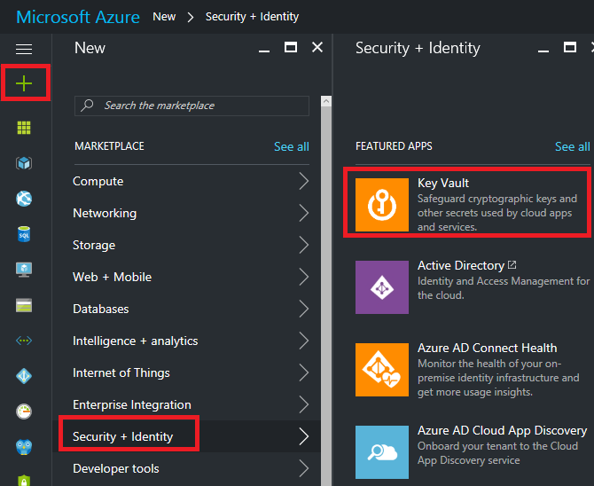
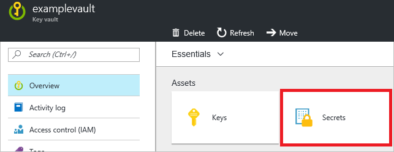
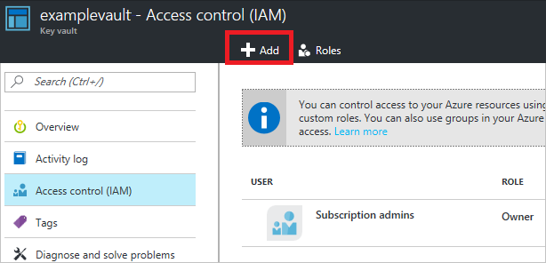

<properties
    pageTitle="Key Vault secret with Resource Manager template | Azure"
    description="Shows how to pass a secret from a key vault as a parameter during deployment."
    services="azure-resource-manager,key-vault"
    documentationcenter="na"
    author="tfitzmac"
    manager="timlt"
    editor="tysonn" />
<tags
    ms.assetid="c582c144-4760-49d3-b793-a3e1e89128e2"
    ms.service="azure-resource-manager"
    ms.devlang="na"
    ms.topic="article"
    ms.tgt_pltfrm="na"
    ms.workload="na"
    ms.date="12/09/2016"
    wacn.date=""
    ms.author="tomfitz" />

# Use Key Vault to pass secure parameter value during deployment

When you need to pass a secure value (like a password) as a parameter during deployment, you can retrieve the value from an [Azure Key Vault](/documentation/articles/key-vault-whatis/). You retrieve the value by referencing the key vault and secret in your parameter file. The value is never exposed because you only reference its key vault ID. You do not need to manually enter the value for the secret each time you deploy the resources. The key vault can exist in a different subscription than the resource group you are deploying to. When referencing the key vault, you include the subscription ID.

This topic shows you how to create a key vault and secret, configure access to the secret for a Resource Manager template, and pass the secret as a parameter. If you already have a key vault and secret, but need to check template and user access, go to the [Enable access to the secret](#enable-access-to-the-secret) section. If you already have the key vault and secret, and are sure it is configured for template and user access, go to the [Reference a secret with static id](#reference-a-secret-with-static-id) section. 

## Deploy a key vault and secret

You can deploy a key vault and secret through a Resource Manager template. For an example, see [Key vault template](/documentation/articles/resource-manager-template-keyvault/) and [Key vault secret template](/documentation/articles/resource-manager-template-keyvault-secret/). When creating the key vault, set the **enabledForTemplateDeployment** property to **true** so it can be referenced from other Resource Manager templates. 

Or, you can create the key vault and secret through the Azure portal preview. 

1. Select **New** -> **Security + Identity** -> **Key Vault**.

    

2. Provide values for the key vault. You can ignore the **Access policies** and **Advanced access policy** settings for now. Those settings are covered in the section. Select **Create**.

    

3. You now have a key vault. Select that key vault.

4. In the key vault blade, select **Secrets**.

    

5. Select **Add**.

    

6. Select **Manual** for upload options. Provide a name and value for secret. Select **Create**.

    

You have created your key vault and secret.

##  Enable access to the secret

Whether you are using a new key vault or an existing one, ensure that the user deploying the template can access the secret. The user deploying a template that references a secret must have the `Microsoft.KeyVault/vaults/deploy/action` permission for the key vault. The [Owner](/documentation/articles/role-based-access-built-in-roles/#owner) and [Contributor](/documentation/articles/role-based-access-built-in-roles/#contributor) roles both grant this access. You can also create a [custom role](/documentation/articles/role-based-access-control-custom-roles/) that grants this permission and add the user to that role. Also, you must grant Resource Manager the ability to access the key vault during deployment.

You can check or perform these steps through the portal.

1. Select **Access control (IAM)**.

    

2. If the account you intend to use for deploying templates is not already an Owner or Contributor (or added to a custom role that grants `Microsoft.KeyVault/vaults/deploy/action` permission), select **Add**

    

3. Select the Contributor or Owner role, and search for the identity to assign to that role. Select **Okay** to complete adding the identity to the role.

    

4. To enable access from a template during deployment, select **Advanced access control**. Select the option **Enable access to Azure Resource Manager for template deployment**.

    

##  Reference a secret with static id

You reference the secret from within a **parameters file (not the template)** that passes values to your template. You reference the secret by passing the resource identifier of the key vault and the name of the secret. In the following example, the key vault secret must already exist, and you provide a static value for its resource ID.

    {
        "$schema": "http://schema.management.azure.com/schemas/2015-01-01/deploymentParameters.json#",
        "contentVersion": "1.0.0.0",
        "parameters": {
          "sqlsvrAdminLoginPassword": {
            "reference": {
              "keyVault": {
                "id": "/subscriptions/{guid}/resourceGroups/{group-name}/providers/Microsoft.KeyVault/vaults/{vault-name}"
              },
              "secretName": "adminPassword"
            }
          },
          "sqlsvrAdminLogin": {
            "value": "exampleadmin"
          }
        }
    }

In the template, the parameter that accepts the secret should be a **securestring**. The following example shows the relevant sections of a template that deploys a SQL server that requires an administrator password.

    {
        "$schema": "https://schema.management.azure.com/schemas/2015-01-01/deploymentTemplate.json#",
        "contentVersion": "1.0.0.0",
        "parameters": {
            "sqlsvrAdminLogin": {
                "type": "string",
                "minLength": 4
            },
            "sqlsvrAdminLoginPassword": {
                "type": "securestring"
            },
            ...
        },
        "resources": [
            {
              "name": "[variables('sqlsvrName')]",
              "type": "Microsoft.Sql/servers",
              "location": "[resourceGroup().location]",
              "apiVersion": "2014-04-01-preview",
              "properties": {
                  "administratorLogin": "[parameters('sqlsvrAdminLogin')]",
                  "administratorLoginPassword": "[parameters('sqlsvrAdminLoginPassword')]"
              },
              ...
            }
        ],
        "variables": {
            "sqlsvrName": "[concat('sqlsvr', uniqueString(resourceGroup().id))]"
        },
        "outputs": { }
    }

## Reference a secret with dynamic id

The previous section showed how to pass a static resource ID for the key vault secret. However, in some scenarios, you need to reference a key vault secret that varies based on the current deployment. In that case, you cannot hard-code the resource ID in the parameters file. Unfortunately, you cannot dynamically generate the resource ID in the parameters file because template expressions are not permitted in the parameters file.

To dynamically generate the resource ID for a key vault secret, you must move the resource that needs the secret into a nested template. In your master template, you add the nested template and pass in a parameter that contains the dynamically generated resource ID.

    {
        "$schema": "https://schema.management.azure.com/schemas/2015-01-01/deploymentTemplate.json#",
        "contentVersion": "1.0.0.0",
        "parameters": {
          "vaultName": {
            "type": "string"
          },
          "secretName": {
            "type": "string"
          }
        },
        "resources": [
        {
          "apiVersion": "2015-01-01",
          "name": "nestedTemplate",
          "type": "Microsoft.Resources/deployments",
          "properties": {
            "mode": "incremental",
            "templateLink": {
              "uri": "https://www.contoso.com/AzureTemplates/newVM.json",
              "contentVersion": "1.0.0.0"
            },
            "parameters": {
              "adminPassword": {
                "reference": {
                  "keyVault": {
                    "id": "[concat(resourceGroup().id, '/providers/Microsoft.KeyVault/vaults/', parameters('vaultName'))]"
                  },
                  "secretName": "[parameters('secretName')]"
                }
              }
            }
          }
        }],
        "outputs": {}
    }

## Next steps
* For general information about key vaults, see [Get started with Azure Key Vault](/documentation/articles/key-vault-get-started/).
* For information about using a key vault with a Virtual Machine, see [Security considerations for Azure Resource Manager](/documentation/articles/best-practices-resource-manager-security/).
* For complete examples of referencing key secrets, see [Key Vault examples](https://github.com/rjmax/ArmExamples/tree/master/keyvaultexamples).