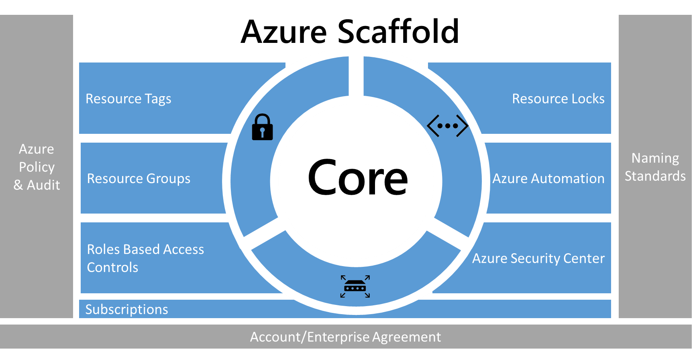
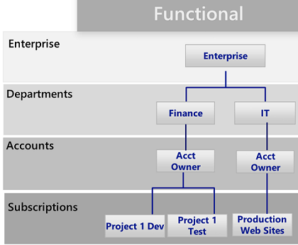
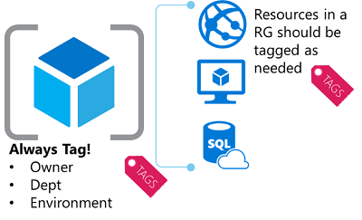
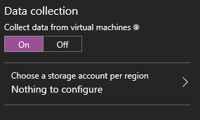

# Azure enterprise scaffold - prescriptive subscription governance
Enterprises are increasingly adopting the public cloud for its agility and flexibility. They are utilizing the cloud's strengths to generate revenue or optimize resources for the business. Azure provides a multitude of services that enterprises can assemble like building blocks to address a wide array of workloads and applications. 

But, knowing where to begin is often difficult. After deciding to use Azure, a few questions commonly arise:

* "How do I meet our legal requirements for data sovereignty in certain countries?"
* "How do I ensure that someone does not inadvertently change a critical system?"
* "How do I know what every resource is supporting so I can account for it and bill it back accurately?"

The prospect of an empty subscription with no guard rails is daunting. This blank space can hamper your move to Azure.

This article provides a starting point for technical professionals to address the need for governance, and balance it with the need for agility. It introduces the concept of an enterprise scaffold that guides organizations in implementing and managing their Azure subscriptions. 

## Need for governance
When moving to Azure, you must address the topic of governance early to ensure the successful use of the cloud within the enterprise. Unfortunately, the time and bureaucracy of creating a comprehensive governance system means some business groups go directly to vendors without involving enterprise IT. This approach can leave the enterprise open to vulnerabilities if the resources are not properly managed. The characteristics of the public cloud - agility, flexibility, and consumption-based pricing - are important to business groups that need to quickly meet the demands of customers (both internal and external). But, enterprise IT needs to ensure that data and systems are effectively protected.

In real life, scaffolding is used to create the basis of the structure. The scaffold guides the general outline, and provides anchor points for more permanent systems to be mounted. An enterprise scaffold is the same: a set of flexible controls and Azure capabilities that provide structure to the environment, and anchors for services built on the public cloud. It provides the builders (IT and business groups) a foundation to create and attach new services.

The scaffold is based on practices we have gathered from many engagements with clients of various sizes. Those clients range from small organizations developing solutions in the cloud to Fortune 500 enterprises and independent software vendors who are migrating and developing solutions in the cloud. The enterprise scaffold is "purpose-built" to be flexible to support both traditional IT workloads and agile workloads; such as, developers creating software-as-a-service (SaaS) applications based on Azure capabilities.

The enterprise scaffold is intended to be the foundation of each new subscription within Azure. It enables administrators to ensure workloads meet the minimum governance requirements of an organization without preventing business groups and developers from quickly meeting their own goals.

> [!IMPORTANT]
> Governance is crucial to the success of Azure. This article targets the technical implementation of an enterprise scaffold but only touches on the broader process and relationships between the components. Policy governance flows from the top down and is determined by what the business wants to achieve. Naturally, the creation of a governance model for Azure includes representatives from IT, but more importantly it should have strong representation from business group leaders, and security and risk management. In the end, an enterprise scaffold is about mitigating business risk to facilitate an organization's mission and objectives.
> 
> 

The following image describes the components of the scaffold. The foundation relies on a solid plan for departments, accounts, and subscriptions. The pillars consist of Resource Manager policies and strong naming standards. The rest of the scaffold comes from core Azure capabilities and features that enable a secure and manageable environment.

> [!NOTE]
> Azure has grown rapidly since its introduction in 2008. This growth required Microsoft engineering teams to rethink their approach for managing and deploying services. The Azure Resource Manager model was introduced in 2014 and replaces the classic deployment model. Resource Manager enables organizations to more easily deploy, organize, and control Azure resources. Resource Manager includes parallelization when creating resources for faster deployment of complex, interdependent solutions. It also includes granular access control, and the ability to tag resources with metadata. Azure recommends that you create all resources through the Resource Manager model. The enterprise scaffold is explicitly designed for the Resource Manager model.
> 
> 

## Define your hierarchy
The foundation of the scaffold is the Azure Enterprise Enrollment (and the Enterprise Portal). The enterprise enrollment defines the shape and use of Azure services within a company and is the core governance structure. Within the enterprise agreement, customers are able to further subdivide the environment into departments, accounts, and finally, subscriptions. An Azure subscription is the basic unit where all resources are contained. It also defines several limits within Azure, such as number of cores, resources, etc.

Every enterprise is different and the hierarchy in the previous image allows for significant flexibility in how Azure is organized within the company. Before implementing the guidance contained in this document, you should model your hierarchy and understand the impact on billing, resource access, and complexity.

The three common patterns for Azure Enrollments are:

* The **functional** pattern

    
* The **business unit** pattern 

    
* The **geographic** pattern

    

You apply the scaffold at the subscription level to extend the governance requirements of the enterprise into the subscription.

## Naming standards
The first pillar of the scaffold is naming standards. Well-designed naming standards enable you to identify resources in the portal, on a bill, and within scripts. Most likely, you already have naming standards for on-premises infrastructure. When adding Azure to your environment, you should extend those naming standards to your Azure resources. Naming standard facilitate more efficient management of the environment at all levels.

<!--Not Available on ../guidance/*.* such as guidance-naming-conventions.md -->
> [!TIP]
> For naming conventions:
> * Use camelCasing for names of resources (such as myResourceGroup and vnetNetworkName). Note: There are certain resources, such as storage accounts, where the only option is to use lower case (and no other special characters).
> * Consider using Azure Resource Manager policies (described in the next section) to enforce naming standards.
> 
> The preceding tips help you implement a consistent naming convention.

## Policies and auditing
The second pillar of the scaffold involves creating [Azure Resource Manager policies](resource-manager-policy.md) and [auditing the activity log](resource-group-audit.md). Resource Manager policies provide you with the ability to manage risk in Azure. You can define policies that ensure data sovereignty by restricting, enforcing, or auditing certain actions. 

* Policy is a default **allow** system. You control actions by defining and assigning policies to resources that deny or audit actions on resources.
* Policies are described by policy definitions in a policy definition language (if-then conditions).
* You create polices with JSON (Javascript Object Notation) formatted files. After defining a policy, you assign it to a particular scope: subscription, resource group, or resource.

Policies have multiple actions that allow for a fine-grained approach to your scenarios. The actions are:

* **Deny**: Blocks the resource request
* **Audit**: Allows the request but adds a line to the activity log (which can be used to provide alerts or to trigger runbooks)
* **Append**: Adds specified information to the resource. For example, if there is not a "CostCenter" tag on a resource, add that tag with a default value.

### Common uses of Resource Manager policies
Azure Resource Manager policies are a powerful tool in the Azure toolkit. They enable you to avoid unexpected costs, to identify a cost center for resources through tagging, and to ensure that compliancy requirements are met. When policies are combined with the built-in auditing features, you can fashion complex and flexible solutions. Policies allow companies to provide controls for "Traditional IT" workloads and "Agile" workloads; such as, developing customer applications. The most common patterns we see for policies are:

* **Geo-compliance/data sovereignty** - Azure provides regions across the world. Enterprises often wish to control where resources are created (whether to ensure data sovereignty or just to ensure resources are created close to the end consumers of the resources).
* **Cost management** - An Azure subscription can contain resources of many types and scale. Corporations often wish to ensure that standard subscriptions avoid using unnecessarily large resources, which can cost hundreds of dollars a month or more.
* **Default governance through required tags** - Requiring tags is one of the most common and highly desired features. Using Azure Resource Manager Policies enterprises are able to ensure that a resource is appropriately tagged. The most common tags are: Department, Resource Owner, and Environment type (for example - production, test, development)

**Examples**

"Traditional IT" subscription for line-of-business applications

* Enforce Department and Owner tags on all resources
* Restrict resource creation to the North American Region
* Restrict the ability to create G-Series VMs and HDInsight Clusters

"Agile" Environment for a business unit creating cloud applications

* To meet data sovereignty requirements, allow the creation of resources ONLY in a specific region.
* Enforce Environment tag on all resources. If a resource is created without a tag, append the **Environment: Unknown** tag to the resource.
* Audit when resources are created outside of North America but do not prevent.
* Audit when high-cost resources are created.

> [!TIP]
> The most common use of Resource Manager policies across organizations is to control *where* resources can be created and *what* types of resources can be created. In addition to providing controls on *where* and *what*, many enterprises use policies to ensure resources have the appropriate metadata to bill back for consumption. We recommend applying policies at the subscription level for:
> 
> * Geo-compliance/data sovereignty
> * Cost management
> * Required tags (Determined by business need, such as BillTo, Application Owner)
> 
> You can apply additional policies at lower levels of scope.
> 
> 

### Audit - what happened?
To view how your environment is functioning, you need to audit user activity. Most resource types within Azure create diagnostic logs that you can analyze through a log tool or in Azure Operations Management Suite. You can gather activity logs across multiple subscriptions to provide a departmental or enterprise view. Audit records are both an important diagnostic tool and a crucial mechanism to trigger events in the Azure environment.

Activity logs from Resource Manager deployments enable you to determine the **operations** that took place and who performed them. Activity logs can be collected and aggregated using tools like Log Analytics.

## Resource tags
As users in your organization add resources to the subscription, it becomes increasingly important to associate resources with the appropriate department, customer, and environment. You can attach metadata to resources through [tags](resource-group-using-tags.md). You use tags to provide information about the resource or the owner. Tags enable you to not only aggregate and group resources in various ways, but use that data for the purposes of chargeback. You can tag resources with up to 15 key:value pairs. 

Resource tags are flexible and should be attached to most resources. Examples of common resource tags are:

* BillTo
* Department (or Business Unit)
* Environment (Production, Stage, Development)
* Tier (Web Tier, Application Tier)
* Application Owner
* ProjectName

<!-- Not Available [Recommended naming conventions for Azure resources](../guidance/guidance-naming-conventions.md) -->
> [!TIP]
> Consider making a policy that mandates tagging for:
> 
> * Resource groups
> * Storage
> * Virtual Machines
> * Application Service Environments/web servers
> 
> This tagging strategy identifies across your subscriptions what metadata is needed for the business, finance, security, risk management, and overall management of the environment. 

## Resource group
Resource Manager enables you to put resources into meaningful groups for management, billing, or natural affinity. As mentioned earlier, Azure has two deployment models. In the earlier Classic model, the basic unit of management was the subscription. It was difficult to break down resources within a subscription, which led to the creation of large numbers of subscriptions. With the Resource Manager model, we saw the introduction of resource groups. Resource groups are containers of resources that have a common lifecycle or share an attribute such as "all SQL servers" or "Application A".

Resource groups cannot be contained within each other and resources can only belong to one resource group. You can apply certain actions on all resources in a resource group. For example, deleting a resource group removes all resources within the resource group. Typically, you place an entire application or related system in the same resource group. For example, a three tier application called Contoso Web Application would contain the web server, application server and SQL server in the same resource group.

> [!TIP]
> How you organize your resource groups may vary from "Traditional IT" workloads to "Agile IT" workloads:
> 
> * "Traditional IT" workloads are most commonly grouped by items within the same lifecycle, such as an application. Grouping by application allows for individual application management.
> * "Agile IT" workloads tend to focus on external customer-facing cloud applications. The resource groups should reflect the layers of deployment (such as Web Tier, App Tier) and management.
> 
> Understanding your workload helps you develop a resource group strategy.

## Role-based access control
You probably are asking yourself "who should have access to resources?" and "how do I control this access?" Allowing or disallowing access to the Azure portal, and controlling access to resources in the portal is crucial. 

When Azure was initially released, access controls to a subscription were basic: Administrator or Co-Administrator. Access to a subscription in the Classic model implied access to all the resources in the portal. This lack of fine-grained control led to the proliferation of subscriptions to provide a level of reasonable access control for an Azure Enrollment.

This proliferation of subscriptions is no longer needed. With role-based access control, you can assign users to standard roles (such as common "reader" and "writer" types of roles). You can also define custom roles.

> [!TIP]
> To implement role-based access control:
> * Connect your corporate identity store (most commonly Active Directory) to Azure Active Directory using the AD Connect tool.
> * Control the Admin/Co-Admin of a subscription using a managed identity. **Don't** assign Admin/Co-admin to a new subscription owner. Instead, use RBAC roles to provide **Owner** rights to a group or individual.
> * Add Azure users to a group (for example, Application X Owners) in Active Directory. Use the synced group to provide group members the appropriate rights to manage the resource group containing the application.
> * Follow the principle of granting the **least privilege** required to do the expected work. For example:
>   * Deployment Group: A group that is only able to deploy resources.
>   * Virtual Machine Management: A group that is able to restart VMs (for operations)
> 
> These tips help you manage user access across your subscription.

## Azure resource locks
As your organization adds core services to the subscription, it becomes increasingly important to ensure that those services are available to avoid business disruption. [Resource locks](resource-group-lock-resources.md) enable you to restrict operations on high-value resources where modifying or deleting them would have a significant impact on your applications or cloud infrastructure. You can apply locks to a subscription, resource group, or resource. Typically, you apply locks to foundational resources such as virtual networks, gateways, and storage accounts. 

Resource locks currently support two values: CanNotDelete and ReadOnly. CanNotDelete means that users (with the appropriate rights) can still read or modify a resource but cannot delete it. ReadOnly means that authorized users can't delete or modify a resource.

To create or delete management locks, you must have access to `Microsoft.Authorization/*` or `Microsoft.Authorization/locks/*` actions.
Of the built-in roles, only Owner and User Access Administrator are granted those actions.

> [!TIP]
> Core network options should be protected with locks. Accidental deletion of a gateway, site-to-site VPN would be disastrous to an Azure subscription. Azure doesn't allow you to delete a virtual network that is in use, but applying more restrictions is a helpful precaution. 
> 
> * Virtual Network: CanNotDelete
> * Network Security Group: CanNotDelete
> * Policies: CanNotDelete
> 
> Policies are also crucial to the maintenance of appropriate controls. We recommend that you apply a **CanNotDelete** lock to polices that are in use.

## Core networking resources
Access to resources can be either internal (within the corporation's network) or external (through the internet). It is easy for users in your organization to inadvertently put resources in the wrong spot, and potentially open them to malicious access. As with on-premises devices, enterprises must add appropriate controls to ensure that Azure users make the right decisions. For subscription governance, we identify core resources that provide basic control of access. The core resources consist of:

* **Virtual networks** are container objects for subnets. Though not strictly necessary, it is often used when connecting applications to internal corporate resources.
* **Network security groups** are similar to a firewall and provide rules for how a resource can "talk" over the network. They provide granular control over how/if a subnet (or virtual machine) can connect to the Internet or other subnets in the same virtual network.

> [!TIP]
> For networking:
> * Create virtual networks dedicated to external-facing workloads and internal-facing workloads. This approach reduces the chance of inadvertently placing virtual machines that are intended for internal workloads in an external facing space.
> * Configure network security groups to limit access. At a minimum, block access to the internet from internal virtual networks, and block access to the corporate network from external virtual networks.
> 
> These tips help you implement secure networking resources.

### Automation
Managing resources individually is both time-consuming and potentially error prone for certain operations. Azure provides various automation capabilities including Azure Automation, Logic Apps, and Azure Functions. [Azure Automation](../automation/automation-intro.md) enables administrators to create and define runbooks to handle common tasks in managing resources. You create runbooks by using either a PowerShell code editor or a graphical editor. You can produce complex multi-stage workflows. Azure Automation is often used to handle common tasks such as shutting down unused resources, or creating resources in response to a specific trigger without needing human intervention.

> [!TIP]
> For automation:
> * Create an Azure Automation account and review the available runbooks (both graphical and command line) available in the [Runbook Gallery](../automation/automation-runbook-gallery.md).
> * Import and customize key runbooks for your own use.
> 
> A common scenario is the ability to Start/Shutdown virtual machines on a schedule. There are example runbooks that are available in the Gallery that both handle this scenario and teach you how to expand it.
> 
> 

## Azure Security Center
Perhaps one of the biggest blockers to cloud adoption has been the concerns over security. IT risk managers and security departments need to ensure that resources in Azure are secure. 

<!-- Not Available on ../security-center/*.* -->
The Azure Security Center provides a central view of the security status of resources in the subscriptions, and provides recommendations that help prevent compromised resources. It can enable more granular policies (for example, applying policies to specific resource groups that allow the enterprise to tailor their posture to the risk they are addressing). Finally, Azure Security Center is an open platform that enables Microsoft partners and independent software vendors to create software that plugs into Azure Security Center to enhance its capabilities. 

> [!TIP]
> Azure Security Center is enabled by default in each subscription. However, you must enable data collection from virtual machines to allow Azure Security Center to install its agent and begin gathering data.
> 
> 
> 
> 

## Next steps
* Now that you have learned about subscription governance, it's time to see these recommendations in practice. See [Examples of implementing Azure subscription governance](resource-manager-subscription-examples.md).

<!--Update_Description: wording update-->