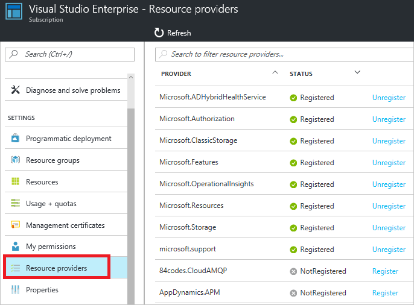
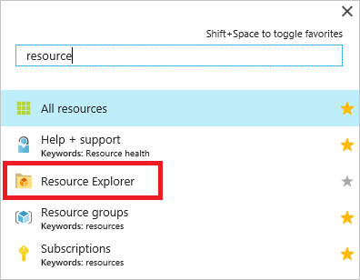
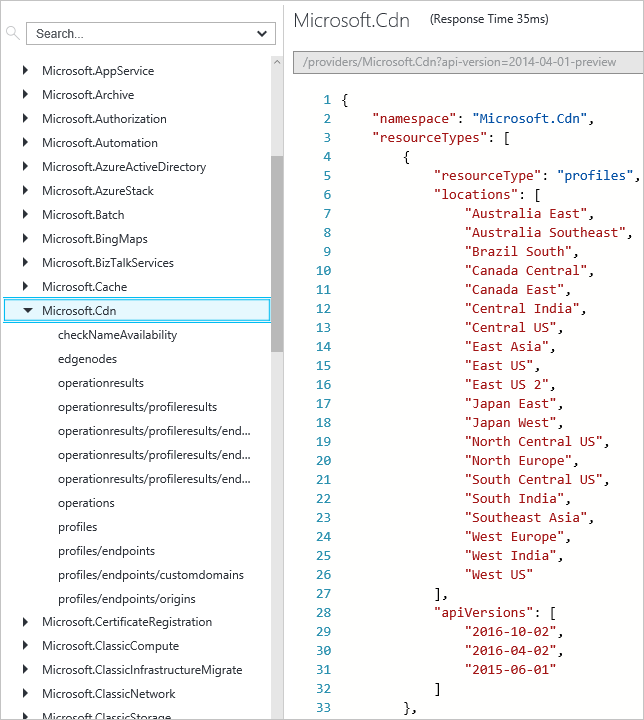

# Resource Manager providers, regions, API versions and schemas
This topic provides a list of resource providers that support Azure Resource Manager.

When deploying your resources, you also need to know which regions support those resources and which API versions are available for the resources. The section [Supported regions](#supported-regions) shows you how to find out which regions work for your subscription and resources. The section [Supported API versions](#supported-api-versions) shows you how to determine which API versions you can use.

To see which services are supported in the Azure Portal and Classic Management Portal, see [Azure portal availability chart](/support/service-dashboard/). To see which services support moving resources, see [Move resources to new resource group or subscription](resource-group-move-resources.md).

The following tables list which Microsoft services support deployment and management through Resource Manager and which do not. There are also many third-party resource providers that support Resource Manager. You learn how to see all the resource providers in the [Resource providers and types](#resource-providers-and-types) section.

## Compute
<!-- Not Available /templates/ -->
| Service | Resource Manager Enabled | REST API | Template format |
| --- | --- | --- | --- |
| Batch |Yes |[Batch REST](https://docs.microsoft.com/rest/api/batchservice) | |
| Dynamics Lifecycle Services |Yes | | |
| Scale Sets |Yes |[Scale Set REST](https://docs.microsoft.com/rest/api/virtualmachinescalesets/) |[Scale Set resources](https://github.com/Azure/azure-quickstart-templates/search?utf8=%E2%9C%93&q=virtualMachineScaleSets&type=Code) |
| Service Fabric |Yes |[Service Fabric Rest](https://docs.microsoft.com/rest/api/servicefabric) | [Service Fabric Schema](https://github.com/Azure/azure-resource-manager-schemas/blob/master/schemas/2016-09-01/Microsoft.ServiceFabric.json)  [Microsoft.ServiceFabric](https://github.com/Azure/azure-quickstart-templates/search?utf8=%E2%9C%93&q=%22Microsoft.ServiceFabric%22&type=Code) |
| Virtual Machines |Yes |[VM REST](https://docs.microsoft.com/rest/api/compute/virtualmachines) |[VM resources](https://github.com/Azure/azure-quickstart-templates/search?utf8=%E2%9C%93&q=%22Microsoft.Compute%2Fvirtualmachines%22&type=Code) |
| Virtual Machines (classic) |Limited |- |- |
| Cloud Services (classic) |Limited (see below) |- |- |

Virtual Machines (classic) refers to resources that were deployed through the classic deployment model, instead of through the Resource Manager deployment model. In general, these resources do not support Resource Manager operations, but there 
are some operations that have been enabled. For more information about these deployment models, see [Understanding Resource Manager deployment and classic deployment](resource-manager-deployment-model.md). 

Cloud Services (classic) can be used with other classic resources. However, classic resources do not take advantage of all Resource Manager features and are not a good option for future solutions. Instead, consider changing your application infrastructure to use resources from the Microsoft.Compute, Microsoft.Storage, and Microsoft.Network namespaces.

## Networking
| Service | Resource Manager Enabled | REST API | Template format |
| --- | --- | --- | --- |
| Application Gateway |Yes |[Application Gateway REST](https://msdn.microsoft.com/library/azure/mt684939.aspx) | [Application Gateway resources](https://github.com/Azure/azure-quickstart-templates/search?utf8=%E2%9C%93&q=%22Microsoft.Network%2FapplicationGateways%22&type=Code) |
| ExpressRoute |Yes |[ExpressRoute REST](https://msdn.microsoft.com/library/azure/mt586720.aspx) | [ExpressRoute resources](https://github.com/Azure/azure-quickstart-templates/search?utf8=%E2%9C%93&q=%22Microsoft.Network%2FexpressRouteCircuits%22&type=Code) |
| Load Balancer |Yes |[Load Balancer REST](https://msdn.microsoft.com/library/azure/mt163651.aspx) |[Load Balancer resources](https://github.com/Azure/azure-quickstart-templates/search?utf8=%E2%9C%93&q=%22Microsoft.Network%2Floadbalancers%22&type=Code) |
| Traffic Manager |Yes |[Traffic Manager REST](https://msdn.microsoft.com/library/azure/mt163667.aspx) |[Traffic Manager resources](https://github.com/Azure/azure-quickstart-templates/search?utf8=%E2%9C%93&q=%22Microsoft.Network%2Ftrafficmanagerprofiles%22&type=Code) |
| Virtual Networks |Yes |[Virtual Network REST](https://msdn.microsoft.com/library/azure/mt163650.aspx) | [Virtual Network resources](https://github.com/Azure/azure-quickstart-templates/search?utf8=%E2%9C%93&q=%22Microsoft.Network%2FvirtualNetworks%22&type=Code) |
| Network Gateway |Yes | | [Connection resources](https://github.com/Azure/azure-quickstart-templates/search?utf8=%E2%9C%93&q=%22Microsoft.Network%2Fconnections%22&type=Code) <b/> [Local Network Gateway resources](https://github.com/Azure/azure-quickstart-templates/search?utf8=%E2%9C%93&q=%22Microsoft.Network%2FlocalNetworkGateways%22&type=Code) <br /> [Virtual Network Gateway resources](https://github.com/Azure/azure-quickstart-templates/search?utf8=%E2%9C%93&q=%22Microsoft.Network%2FvirtualNetworkGateways%22&type=Code) |
<!--Not Available URL [Network Gateway REST](https://msdn.microsoft.com/library/azure/mt163859.aspx) -->

## Storage
| Service | Resource Manager Enabled | REST API | Template format |
| --- | --- | --- | --- |
| Storage |Yes |[Storage REST](https://docs.microsoft.com/rest/api/storagerp) |[Storage resources](https://github.com/Azure/azure-quickstart-templates/search?utf8=%E2%9C%93&q=%22Microsoft.Storage%22&type=Code) |

## Databases
| Service | Resource Manager Enabled | REST API | Template format |
| --- | --- | --- | --- |
| DocumentDB |Yes |[DocumentDB REST](https://docs.microsoft.com/rest/api/documentdbresourceprovider) |[DocumentDB resources](https://github.com/Azure/azure-quickstart-templates/search?utf8=%E2%9C%93&q=%22Microsoft.DocumentDb%22&type=Code) |
| Redis Cache |Yes | [Redis Cache REST](https://docs.microsoft.com/rest/api/redis) |[Redis resources](https://github.com/Azure/azure-quickstart-templates/search?utf8=%E2%9C%93&q=%22Microsoft.Cache%22&type=Code) |
| SQL Database |Yes |[SQL Database REST](https://docs.microsoft.com/rest/api/sql) |[SQL Database resources](https://github.com/Azure/azure-quickstart-templates/search?utf8=%E2%9C%93&q=%22Microsoft.Sql%22&type=Code) |
| SQL Data Warehouse |Yes | | |

## Web & Mobile
| Service | Resource Manager Enabled | REST API | Template format |
| --- | --- | --- | --- |
| API Apps |Yes | [App Service REST](https://docs.microsoft.com/rest/api/appservice) |[Web resources](https://github.com/Azure/azure-quickstart-templates/search?utf8=%E2%9C%93&q=%22kind%22%3A+%22apiApp%22&type=Code) |
| API Management |Yes |[API Management REST](https://docs.microsoft.com/rest/api/apimanagement) |[API Management resources](https://github.com/Azure/azure-quickstart-templates/search?utf8=%E2%9C%93&q=%22Microsoft.ApiManagement%22&type=Code) |
| Function App |Yes | [Function App REST](https://docs.microsoft.com/rest/api/appservice) |[Function App resources](https://github.com/Azure/azure-quickstart-templates/search?utf8=%E2%9C%93&q=%22functionApp%22&type=Code) |
| Logic Apps |Yes |[Logic Apps REST](https://docs.microsoft.com/rest/api/logic) |[Logic App resources](https://github.com/Azure/azure-quickstart-templates/search?utf8=%E2%9C%93&q=%22Microsoft.Logic%22&type=Code) |
| Mobile Apps |Yes | [App Service REST](https://docs.microsoft.com/rest/api/appservice) |[Mobile Apps resources](https://github.com/Azure/azure-quickstart-templates/search?utf8=%E2%9C%93&q=%22mobileApp%22&type=Code) |
| Mobile Engagements |Yes |[Mobile Engagement REST](https://msdn.microsoft.com/zh-cn/library/azure/mt683754.aspx) |[Mobile Engagements resources](https://github.com/Azure/azure-quickstart-templates/search?utf8=%E2%9C%93&q=%22Microsoft.MobileEngagement%22&type=Code) |
| Search |Yes |[Search REST](https://docs.microsoft.com/rest/api/searchservice) |[Search resources](https://github.com/Azure/azure-quickstart-templates/search?utf8=%E2%9C%93&q=%22Microsoft.Search%22&type=Code) |
| Web Apps |Yes | [Web Apps REST](https://docs.microsoft.com/rest/api/appservice/webapps) |[Web Apps Schema](https://github.com/Azure/azure-resource-manager-schemas/blob/master/schemas/2015-08-01/Microsoft.Web.json) |[Microsoft.Web](https://github.com/Azure/azure-quickstart-templates/search?utf8=%E2%9C%93&q=%22Microsoft.Web%22&type=Code) |

## Intelligence + Analytics
| Service | Resource Manager Enabled | REST API | Template format | 
| --- | --- | --- | --- |
| Cognitive Services |Yes | [Cognitive Services REST](https://docs.microsoft.com/rest/api/cognitiveservices) | |
| HDInsights |Yes |[HDInsights REST](https://docs.microsoft.com/rest/api/hdinsight) |[HDInsight resources](https://github.com/Azure/azure-quickstart-templates/search?utf8=%E2%9C%93&q=%22Microsoft.HDInsight%22&type=Code) |
| Stream Analytics |Yes |[Steam Analytics REST](https://docs.microsoft.com/rest/api/streamanalytics) | |
| Power BI |Yes |[Power BI Embedded REST](https://docs.microsoft.com/rest/api/powerbiembedded) | |

## Internet of Things
| Service | Resource Manager Enabled | REST API | Template format |
| --- | --- | --- | --- |
| Event Hub |Yes |[Event Hub REST](https://docs.microsoft.com/rest/api/eventhub) |[Event Hub resources](https://github.com/Azure/azure-quickstart-templates/search?utf8=%E2%9C%93&q=%22Microsoft.EventHub%22&type=Code) |
| IoTHubs |Yes |[IoT Hub REST](https://docs.microsoft.com/rest/api/iothub) |[IoT Hub resources](https://github.com/Azure/azure-quickstart-templates/search?utf8=%E2%9C%93&q=%22Microsoft.Devices%22&type=Code) |
| Notification Hubs |Yes |[Notification Hub REST](https://docs.microsoft.com/rest/api/notificationhubs) |[Notification Hub resources](https://github.com/Azure/azure-quickstart-templates/search?utf8=%E2%9C%93&q=%22Microsoft.NotificationHubs%22&type=Code) |

## Media & CDN
| Service | Resource Manager Enabled | REST API | Template format |
| --- | --- | --- | --- |
| CDN |Yes |[CDN REST](https://docs.microsoft.com/rest/api/cdn) |[CDN resources](https://github.com/Azure/azure-quickstart-templates/search?utf8=%E2%9C%93&q=%22Microsoft.Cdn%22&type=Code) |
| Media Service |Yes |[Media Services REST](https://docs.microsoft.com/rest/api/media) |[Media resources](https://github.com/Azure/azure-quickstart-templates/search?utf8=%E2%9C%93&q=%22Microsoft.Media%22&type=Code)  |

## Enterprise Integration
| Service | Resource Manager Enabled | REST API | Template format |
| --- | --- | --- | --- |
| Service Bus |Yes |[Service Bus REST](https://docs.microsoft.com/rest/api/servicebus) |[ServiceBus resources](https://github.com/Azure/azure-quickstart-templates/search?utf8=%E2%9C%93&q=%22Microsoft.ServiceBus%22&type=Code) |

## Identity & Access Management
Azure Active Directory works with Resource Manager to enable role-based access control for your subscription. To learn about using role-based access control and Active Directory, see [Azure Role-based Access Control](../active-directory/role-based-access-control-configure.md).

## Developer Services
| Service | Resource Manager Enabled | REST API | Template format |
| --- | --- | --- | --- |
| Monitor |Yes |[Monitor REST](https://docs.microsoft.com/rest/api/monitor) |[Insights resources](https://github.com/Azure/azure-quickstart-templates/search?utf8=%E2%9C%93&q=%22Microsoft.insights%22&type=Code) |

## Management and Security
| Service | Resource Manager Enabled | REST API | Template format |
| --- | --- | --- | --- |
| Automation |Yes |[Automation REST](https://msdn.microsoft.com/en-us/library/azure/mt662285.aspx) |[Automation resources](https://github.com/Azure/azure-quickstart-templates/search?utf8=%E2%9C%93&q=%22Microsoft.Automation%22&type=Code) |
| Key Vault |Yes |[Key Vault REST](https://docs.microsoft.com/rest/api/keyvault) |[Key Vault resources](https://github.com/Azure/azure-quickstart-templates/search?utf8=%E2%9C%93&q=%22Microsoft.KeyVault%22&type=Code) |
| Operational Insights |Yes | | |
| Recovery Service |Yes |[Recovery Services REST](https://docs.microsoft.com/rest/api/recoveryservices) |[Recovery Service resources](https://github.com/Azure/azure-quickstart-templates/search?utf8=%E2%9C%93&q=%22Microsoft.RecoveryServices%22&type=Code) |
| Scheduler |Yes |[Scheduler REST](https://docs.microsoft.com/rest/api/scheduler) |[Scheduler resources](https://github.com/Azure/azure-quickstart-templates/search?utf8=%E2%9C%93&q=%22Microsoft.Scheduler%22&type=Code) |
| Security |Yes |[Security REST](https://msdn.microsoft.com//library/azure/mt704034.aspx) |[Security resources](https://github.com/Azure/azure-quickstart-templates/search?utf8=%E2%9C%93&q=%22Microsoft.Security%22&type=Code) |

## Resource Manager
| Feature | Resource Manager Enabled | REST API | Template format |
| --- | --- | --- | --- |
| Authorization |Yes |[Authorization REST](https://docs.microsoft.com/rest/api/authorization) |[Resource lock](resource-manager-template-lock.md)<br /> [Microsoft.Authorization](https://github.com/Azure/azure-quickstart-templates/search?utf8=%E2%9C%93&q=%22Microsoft.Authorization%22&type=Code) |
| Resources |Yes |[Resources REST](https://docs.microsoft.com/rest/api/resources) | [Resource links](resource-manager-template-links.md) <br/> [Microsoft.Resources](https://github.com/Azure/azure-quickstart-templates/search?utf8=%E2%9C%93&q=%22Microsoft.Resources%22&type=Code) |
<!-- resource-manager-template-lock,resource-manager-template-links  Redirect with valid URI -->
<!-- resource-manager-template-role Redirect Unvalid URI -->

## <a name="resource-providers-and-types"></a> Resource providers and types
When deploying resources, you frequently need to retrieve information about the resource providers and types. You can retrieve this information through REST API, Azure PowerShell, or Azure CLI.

To work with a resource provider, that resource provider must be registered with your account. By default, many resource providers are automatically registered; however, you may need to manually register some resource providers. The examples in this section show how to get the registration status of a resource provider, and register the resource provider.

### Portal
You can easily see a list of supported resources providers by selecting **Resource providers** from the subscription blade. To register your subscription with a resource provider, select the **Register** link.



### REST API
To get all the available resource providers, including their types, locations, API versions, and registration status, use the [List all resource providers](https://docs.microsoft.com/rest/api/resources/providers#Providers_List) operation. If you need to register a resource provider, see [Register a subscription with a resource provider](https://docs.microsoft.com/rest/api/resources/providers#Providers_Register).

### PowerShell
The following example shows how to get all the available resource providers.

```powershell
Get-AzureRmResourceProvider -ListAvailable
```

The next example shows how to get the resource types for a particular resource provider.

```powershell
(Get-AzureRmResourceProvider -ProviderNamespace Microsoft.Web).ResourceTypes
```

To register a resource provider, provide the namespace:

```powershell
Register-AzureRmResourceProvider -ProviderNamespace Microsoft.ApiManagement
```

### Azure CLI
The following example shows how to get all the available resource providers.

```azurecli
az provider list
```

You can view the information for a particular resource provider with the following command:

```azurecli
az provider show --namespace Microsoft.Web
```

To register a resource provider, provide the namespace:

```azurecli
az provider register --namespace Microsoft.ServiceBus
```

<!-- supported regions not available in Azure.cn-->

### Portal
You can see the supported regions for a resource type through the following steps:

1. Select **More services** > **Resource Explorer**.

    
2. Open the **Providers** node.

    
3. Select a resource provider, and view the supported regions and API versions.

    

### REST API
To discover which regions are available for a particular resource type in your subscription, use the [List all resource providers](https://docs.microsoft.com/rest/api/resources/providers#Providers_List) operation. 

### PowerShell
The following example shows how to get the supported regions for web sites.

```powershell
((Get-AzureRmResourceProvider -ProviderNamespace Microsoft.Web).ResourceTypes | Where-Object ResourceTypeName -eq sites).Locations
```

### Azure CLI
The following example show how to get the supported locations for web sits.

```azurecli
az provider show --namespace Microsoft.Web --query "resourceTypes[?resourceType=='sites'].locations"
```

## Supported API versions
When you deploy a template, you must specify an API version to use for creating each resource. The API version corresponds to a version of REST API operations that are released by the resource provider. As a resource provider enables new features, it releases a new version of the REST API. Therefore, the version of the API you specify in your template affects which properties you can specify in the template. In general, you want to select the most recent API version when creating templates. For existing templates, you can decide whether you want to continue using an earlier API version, or update your template for the latest version to take advantage of new features.

### Portal
You determine the supported API versions in the same way you determined supported regions (shown previously).

### REST API
To discover which API versions are available for resource types, use the [List all resource providers](https://docs.microsoft.com/rest/api/resources/providers#Providers_List) operation. 

### PowerShell
The following example shows how to get the available API versions for a particular resource type.

```powershell
((Get-AzureRmResourceProvider -ProviderNamespace Microsoft.Web).ResourceTypes | Where-Object ResourceTypeName -eq sites).ApiVersions
```

The output is similar to:

```powershell
2015-08-01
2015-07-01
2015-06-01
2015-05-01
2015-04-01
2015-02-01
2014-11-01
2014-06-01
2014-04-01-preview
2014-04-01
```

### Azure CLI
You get the available API versions for a resource provider with the following command:

```azurecli
az provider show --namespace Microsoft.Web --query "resourceTypes[?resourceType=='sites'].apiVersions"
```

## Next steps
* To learn about creating Resource Manager templates, see [Authoring Azure Resource Manager templates](resource-group-authoring-templates.md).
* To learn about deploying resources, see [Deploy an application with Azure Resource Manager template](resource-group-template-deploy.md).