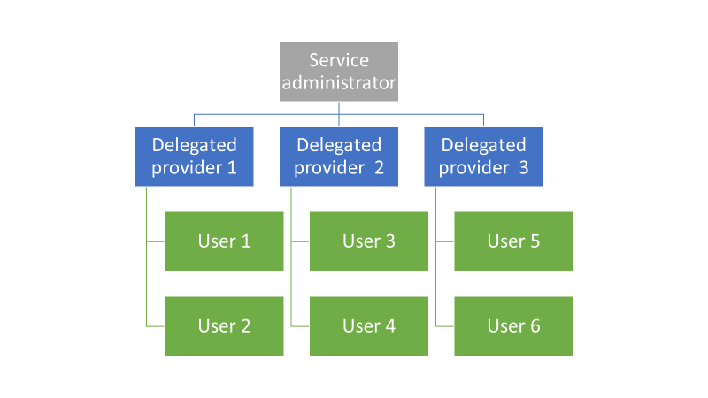
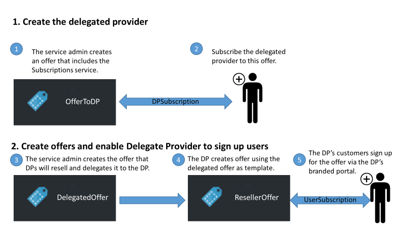
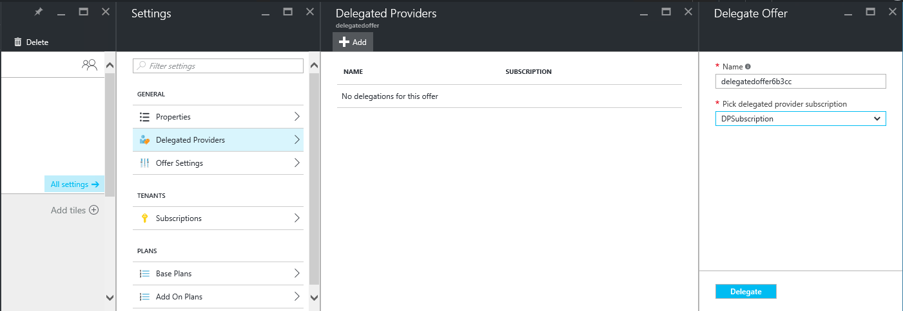
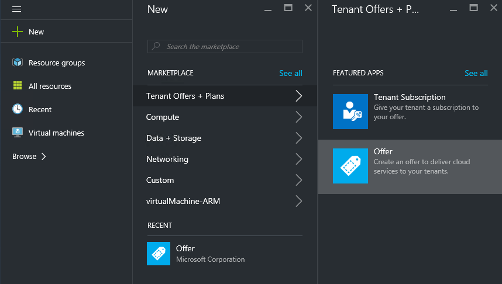
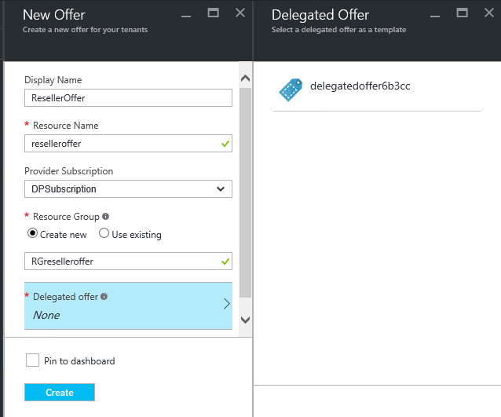
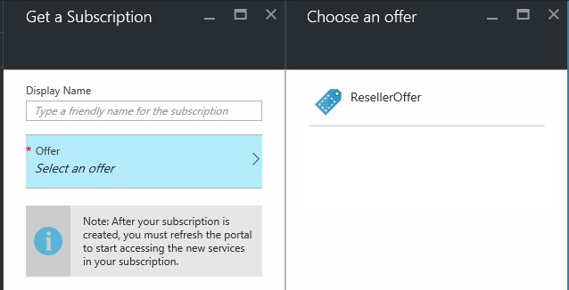

# Delegate offers in Azure Stack

*Applies to: Azure Stack integrated systems and Azure Stack Development Kit*

As the Azure Stack operator, you often want to put other people in charge
of creating offers and signing up users. For example, if you are a service provider, you might want resellers to sign up
customers and manage them on your behalf. Or if you're part of a central IT group in an enterprise, you might want subsidiaries to sign up users without your intervention.

Delegation helps you with these tasks by making it possible to reach and manage
more users than you can directly. The following
illustration shows one level of delegation, but Azure Stack supports
multiple levels. Delegated providers (DPs) can in turn delegate to other
providers, up to five levels.

Azure Stack operators can delegate the creation of offers and users to other users by using the delegation functionality.

## Roles and steps in delegation
To understand delegation, keep in mind that there are three roles
involved:

- The *Azure Stack operator* manages the Azure Stack
  infrastructure, creates an offer template, and delegates others to offer it to their users.

- The delegated Azure Stack operators are called *delegated providers*. They can belong to other organizations, such as other Azure Active Directory (Azure AD) users.

- *Users* sign up for the offers and use them for managing their
  workloads, creating VMs, storing data, and so on.

As shown in the following graphic, there are two steps to setting up
delegation.

1. *Identify the delegated providers*. You do this by subscribing them to an offer based on a plan that contains only the subscriptions service. Users who subscribe to this offer acquire some of the Azure Stack operator’s capabilities, including the ability to extend offers and sign users up for them.

2. *Delegate an offer to the delegated provider*. This offer functions as a template for what the delegated provider can offer. The delegated provider can now take the offer. Choose a name for it (but don't change its services and quotas), and offer it to customers.

To act as delegated providers, users need to establish a relationship
with the main provider. In other words, they need to create a
subscription. In this scenario, this subscription identifies the
delegated providers as having the right to present offers on behalf of
the main provider.

After this relationship has been established, the Azure Stack operator can delegate an offer to the delegated provider. The delegated provider is now able to take the offer, rename it (but not change its substance), and offer it to its customers.

The following sections describe how to establish a delegated provider, delegate an offer, and verify that users can sign up for it.

## Set up roles

To see a delegated provider at work, you need additional Azure AD accounts in addition to your Azure Stack operator
account. If you do not have them, create the two accounts. The accounts
can belong to any Azure AD user. We refer to them as the delegated
provider and the user.

| **Role** | **Organizational rights** |
| --- | --- |
| Delegated provider |User |
| User |User |

## Identify the delegated providers
1. Sign in as an Azure Stack operator.

2. Create the offer that enables users to become
   delegated providers:
   
   a.  [Create a plan](azure-stack-create-plan.md).
       This plan should include only the subscriptions service. In this
       article, we use a plan called **PlanForDelegation**.
   
   b.  [Create an offer](azure-stack-create-offer.md)
       based on this plan. In this article, we use an offer
       called **OfferToDP**.
   
   c.  After the creation of the offer is complete, add the delegated provider as a subscriber to this offer. Do this by selecting **Subscriptions** > **Add** > **New Tenant Subscription**.
   
   

> [!NOTE]
> As with all Azure Stack offers, you have the option of making
> the offer public and letting users sign up for it, or keeping it
> private and letting the Azure Stack operator manage the sign-up. Delegated
> providers are usually a small group. You want to control who is
> admitted to it, so keeping this offer private makes sense in most
> cases.
> 
> 

## Azure Stack operator creates the delegated offer

You have now established your delegated provider. The next step is to create the plan and offer that you are going to delegate, and which your customers will use. It's a good idea to define this offer exactly as you want the customers to see it because delegated provider won't be able to change the plans and quotas it includes.

1. As an Azure Stack operator, [create a
   plan](azure-stack-create-plan.md)
   and [an
   offer](azure-stack-create-offer.md)
   based on it. For this article, we use an offer
   called **DelegatedOffer.**
   
   > [!NOTE]
   > This offer does not have to be public. If you choose, you can make it public. In most cases, however, you only want delegated providers to have access to it. After you delegate a private offer as described in the following steps, the delegated provider has access to it.
   > 
   > 
1. Delegate the offer. Go to **DelegatedOffer.** Then, in the **Settings** pane,
   select **Delegated Providers** > **Add**.

2. Select the subscription for the delegated provider from the drop-down list box, and then select **Delegate**.

> 
> 
> 

## Delegated provider customizes the offer

Sign in to the user portal as the delegated provider. Then create a new offer by using the delegated offer as a template.

1. Select **New** > **Tenant Offers + Plans** > **Offer**.

    

1. Assign a name to the offer. Here we choose **ResellerOffer**. Select the delegated offer on which to base it, and then select **Create**.
   
   

    >[!NOTE] 
    > Note the difference compared to offer creation as experienced by the Azure Stack operator. The delegated provider does not construct the offer from base plans and add-on plans. They can only choose from offers that have been delegated to them, and can't make changes to those offers.

1. Make the offer public by selecting **Browse**, and then **Offers**. Select the offer, and then select **Change State**.

2. The delegated provider exposes these offers through their own portal URL. These offers are visible only through the delegated portal. To find and change this URL:
   
    a.  Select **Browse** > **More services** >  **Subscriptions**. Then select the delegated provider subscription. In our case, it's **DPSubscription** > **Properties**.
   
    b.  Copy the portal URL to a separate location, such as Notepad.
   
      
   
   You have now created a delegated offer as a delegated provider. Sign out as the delegated provider. Close the browser window you have been using.

## Sign up for the offer
1. In a new browser window, go to the delegated portal URL that you saved in
   the previous step. Sign in to the portal as a user. 
   
   >[!NOTE]
   > Use the delegated portal for this step. The delegated offers are not visible otherwise.

2. In the dashboard, select **Get a subscription**. You see that
   only the delegated offers that were created by the delegated provider are presented to the user:

> 
> 
> 

The process of offer delegation is complete. The user can now sign up for this offer by getting a subscription for it.

## Multiple-tier delegation

Multiple-tier delegation enables the delegated provider to delegate the offer to other entities. This allows, for example, the creation of deeper reseller channels, in which the provider that's managing Azure Stack delegates an offer to a distributor. That distributor, in turn, delegates to a reseller. Azure Stack supports up to five levels of delegation.

To create multiple tiers of offer delegation, the delegated provider in turn delegates the offer to the next provider. The process is the same
for the delegated provider as it was for the Azure Stack operator (see [Azure Stack operator creates the delegated offer](#cloud-operator-creates-the-delegated-offer)).

## Next steps
[Provision a VM](azure-stack-provision-vm.md)

