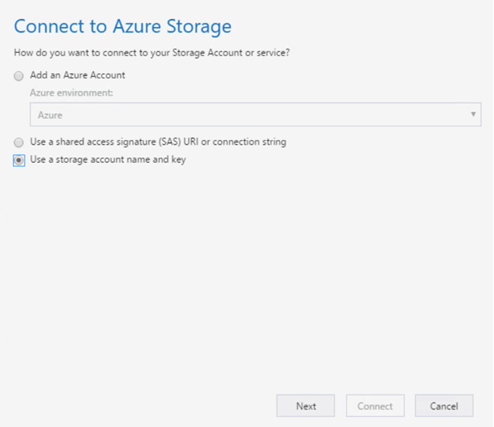
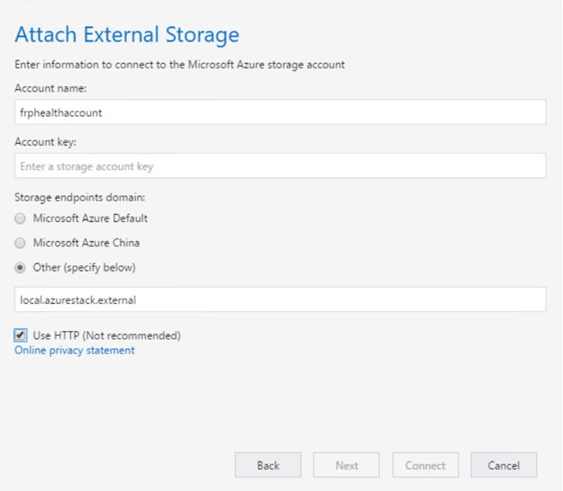
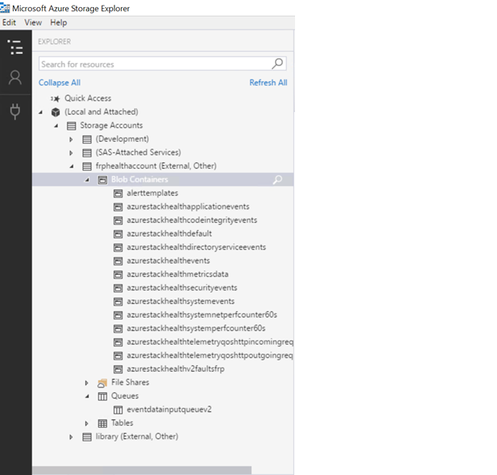

# Azure Stack datacenter integration - Security
Azure Stack was designed and built with security in mind. Azure Stack is a locked-down system, so software security agent installation is not supported.

This article helps you integrate Azure Stack's security features with the security solutions already deployed in your datacenter.

## Security logs

Azure Stack collects operating system and security events for infrastructure roles and scale unit nodes every two minutes. The logs are stored in storage account blob containers.

There’s one storage account per infrastructure role, and one general storage account for all the typical operating system events.

The health resource provider can be called via the REST protocol to retrieve the URL to the blob container. Third-party security solutions can use the API and storage accounts to retrieve events for processing.

### Use Azure Storage Explorer to view events

You can retrieve events collected by Azure Stack using a tool called Azure Storage Explorer. You can download Azure Storage Explorer from [http://storageexplorer.com](http://storageexplorer.com).

The following procedure is an example you can use to configure Azure Storage Explorer for Azure Stack:

1. Sign in to the Azure Stack administrator portal as an operator.
2. Browse **Storage accounts** and look for **frphealthaccount**. The **frphealthaccount** account is the general storage account used to store all operating system events.

   

3. Select **frphealthaccount**, then click **Access Keys**.

   

4. Copy the access key to your clipboard.
5. Open Azure Storage Explorer.
6. On the **Edit** menu, select **Target Azure Stack**.
7. Select **Add Account**, and then select **Use a storage account name and key**.

   

8. Click **Next**.
9. On the **Attach External Storage** page:

   a. Type the account name **frphealthaccount**.

   b. Paste the storage account access key.

   c. Under **Storage endpoints domain**, select **Other**, and specify the storage endpoint **[Region].[DomainName]**.

   d. Select the **Use HTTP** check box.

   

10. Click **Next**, review the summary, and **Finish** the Wizard.
11. You can now browse the individual blob containers and download the events.

   

### Use programming languages to access events

You can use various programming languages to access a storage account. Use the following documentation to pick an example that matches your language:

[https://azure.microsoft.com/resources/samples/?term=storage+account](https://azure.microsoft.com/resources/samples/?term=storage+account)

## Device access auditing

All physical devices in Azure Stack support the use of TACACS or RADIUS. This includes access to the baseboard management controller (BMC) and network switches.

Azure Stack solutions do not ship with either RADIUS or TACACS built in. However, the solutions have been validated to support the use of existing RADIUS or TACACS solutions available in the market.

For RADIUS only, MSCHAPv2 was validated. This represents the most secure implementation using RADIUS.
Consult with your OEM hardware vendor to enable TACAS or RADIUS in the devices included with your Azure Stack solution.

## Syslog

All physical devices in Azure Stack can send Syslog messages. Azure Stack solutions do not ship with a Syslog server. However, the solutions have been validated to support sending messages to existing Syslog solutions available in the market.

The Syslog destination address is an optional parameter collected for deployment, but it can also be added post deployment.

## Next steps

[Servicing policy](azure-stack-servicing-policy.md)

