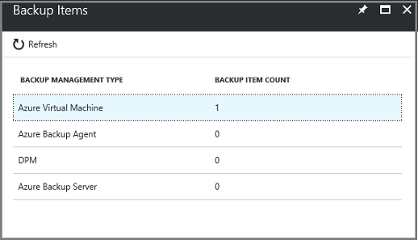
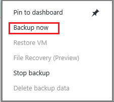
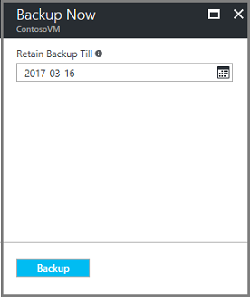
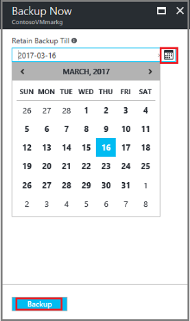
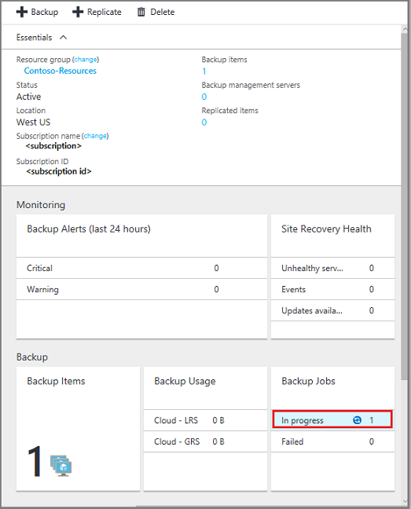

# Back up Azure virtual machines to a Recovery Services vault

This article details how to back up Azure VMs (both Resource Manager-deployed and Classic-deployed) to a Recovery Services vault. Most of the work for backing up VMs is the preparation. Before you can back up or protect a VM, you must complete the [prerequisites](backup-azure-arm-vms-prepare.md) to prepare your environment for protecting your VMs. Once you have completed the prerequisites, then you can initiate the backup operation to take snapshots of your VM.

[!INCLUDE [learn about backup deployment models](../../includes/backup-deployment-models.md)]

For more information, see the articles on [planning your VM backup infrastructure in Azure](backup-azure-vms-introduction.md) and [Azure virtual machines](/virtual-machines/).

## Triggering the backup job
The backup policy associated with the Recovery Services vault defines how often and when the backup operation runs. By default, the first scheduled backup is the initial backup. Until the initial backup occurs, the Last Backup Status on the **Backup Jobs** blade shows as **Warning(initial backup pending)**.

Unless your initial backup is due to begin soon, it is recommended that you run **Back up Now**. The following procedure starts from the vault dashboard. This procedure serves for running the initial backup job after you have completed all prerequisites. If the initial backup job has already been run, this procedure is not available. The associated backup policy determines the next backup job.  

To run the initial backup job:

1. On the vault dashboard, click the number under **Backup Items**, or click the **Backup Items** tile.  
  

  The **Backup Items** blade opens.

  

2. On the **Backup Items** blade, select the item.

  

  The **Backup Items** list opens.  

  

3. On the **Backup Items** list, click the ellipses **...** to open the Context menu.

  

  The Context menu appears.

  

4. On the Context menu, click **Backup now**.

  

  The Backup Now blade opens.

  

5. On the Backup Now blade, click the calendar icon, use the calendar control to select the last day this recovery point is retained, and click **Backup**.

  

  Deployment notifications let you know the backup job has been triggered, and that you can monitor the progress of the job on the Backup jobs page. Depending on the size of your VM, creating the initial backup may take a while.

6. To view or track the status of the initial backup, on the vault dashboard, on the **Backup Jobs** tile click **In progress**.

  

  The Backup Jobs blade opens.

  

  In the **Backup jobs** blade, you can see the status of all jobs. Check if the backup job for your VM is still in progress, or if it has finished. When a backup job is finished, the status is *Completed*.

  > [!NOTE]
  > As a part of the backup operation, the Azure Backup service issues a command to the backup extension in each VM to flush all writes and take a consistent snapshot.
  >
  >

## Troubleshooting errors
If you run into issues while backing up your virtual machine, see the [VM troubleshooting article](backup-azure-vms-troubleshoot.md) for help.

## Next steps
Now that you have protected your VM, see the following articles to learn about VM management tasks, and how to restore VMs.

- [Manage and monitor your virtual machines](backup-azure-manage-vms.md)
- [Restore virtual machines](backup-azure-arm-restore-vms.md)

<!--Update_Description: wording update -->