# Monitor and manage Azure recovery services vaults and servers for Windows machines
> [!div class="op_single_selector"]
> * [Resource Manager](backup-azure-manage-windows-server.md)
> * [Classic](backup-azure-manage-windows-server-classic.md)
>
>

In this article you'll find an overview of the backup monitor and management tasks available through the Azure portal and the Azure Backup agent. This article assumes you already have an Azure subscription and have created at least one Recovery Services vault.

[!INCLUDE [learn-about-deployment-models](../../includes/learn-about-deployment-models-rm-include.md)]


## Open a Recovery Services vault

The Recovery Services vault dashboard shows you the details or attributes of a Recovery Services vault.

1. Sign in to the [Azure Portal](https://portal.azure.cn/) using your Azure subscription.
2. On the Hub menu, click **More Services**.

    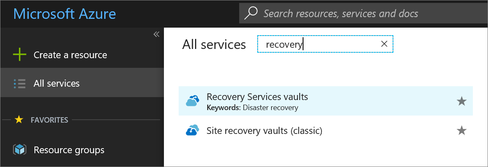 <br/>

3. You want to open a Recovery Services vault. In the dialog box, start typing **Recovery Services**. As you begin typing, the list will filter based on your input. Click **Recovery Services vaults** to display the list of Recovery Services vaults in your subscription.

    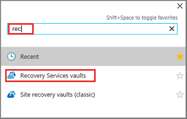 <br/>

    The list of Recovery Services vaults opens.

    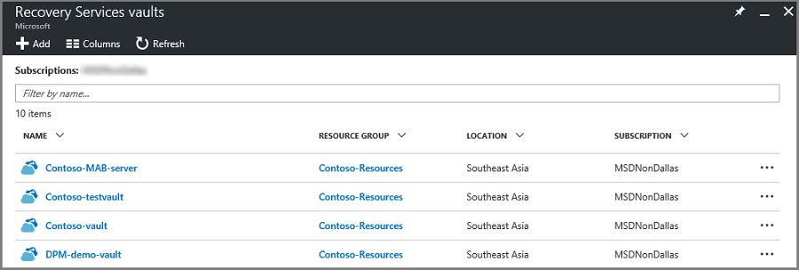 <br/>

4. From the list of vaults, select the name of the Recovery Services vault you want to open. The Recovery Services vault dashboard blade opens.

    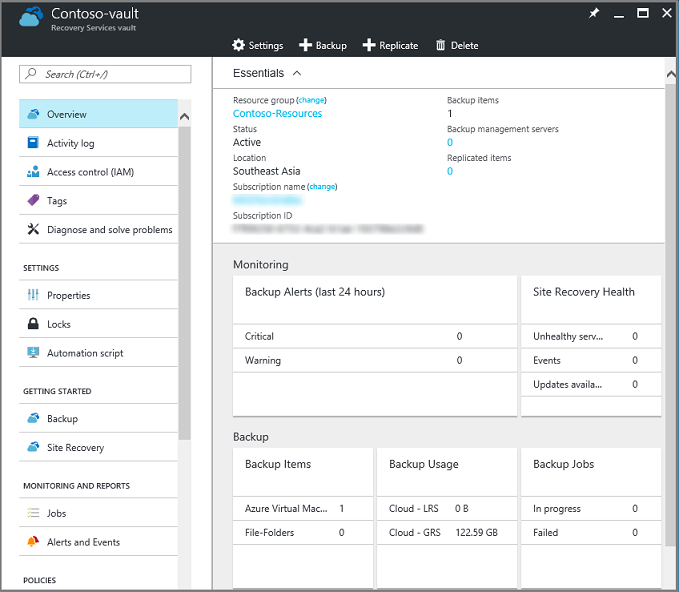 <br/>

    Now that you have opened the Recovery Services vault, try any of the monitoring or management tasks.

## Monitor backup jobs and alerts

You monitor jobs and alerts from the Recovery Services vault dashboard, where you see:

- Backup alerts details
- Files and folders, as well as Azure virtual machines protected in the cloud
- Total storage consumed in Azure
- Backup job status


Clicking the information in each of these tiles will open the associated blade where you manage related tasks.

From the top of the Dashboard:

- Settings provides access available backup tasks.
- Backup - helps you back up new files and folders (or Azure VMs) to the Recovery Services vault.
- Delete - If a recovery services vault is no longer being used, you can delete it to free up storage space. Delete is only enabled after all protected servers have been deleted from the vault.


## Alerts for backups using Azure backup agent:
| Alert Level | Alerts sent |
| --- | --- |
| Critical |Backup failure, recovery failure |
| Warning |Backup completed with warnings (when fewer than one hundred files are not backed up due to corruption issues, and more than one million files are successfully backed up) |
| Informational |None |

## Manage Backup alerts
Click the **Backup Alerts** tile to open the **Backup Alerts** blade and manage alerts.


The Backup Alerts tile shows you the number of:

- critical alerts unresolved in last 24 hours
- warning alerts unresolved in last 24 hours

Clicking on each of these links takes you to the **Backup Alerts** blade with a filtered view of these alerts (critical or warning).

For details about backup alerts, you can read [Backup Monitor vms](backup-azure-monitor-vms.md).

## Manage Backup items
Managing on-premises backups is now available in the management portal. In the Backup section of the dashboard, the **Backup Items** tile shows the number of backup items protected to the vault.

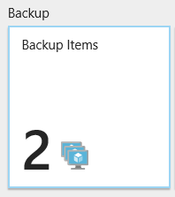

Click **Azure Backup Agent**.

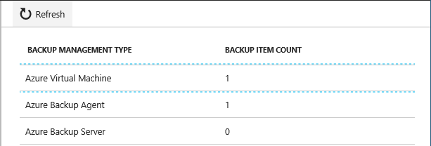

The Backup Items blade opens with the filter set to File-Folder where you see each specific backup item listed.


If you select a specific backup item from the list, you see the essential details for that item.

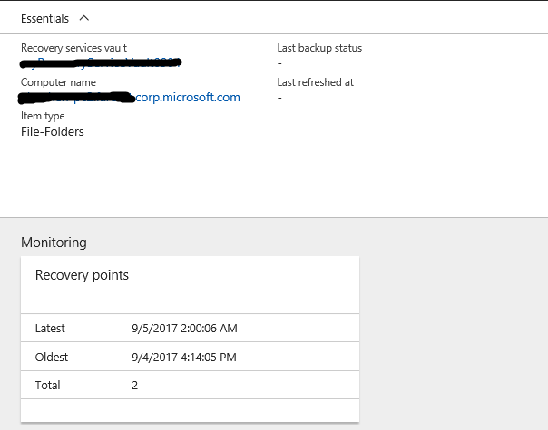

## Manage Backup jobs
Backup jobs for both on-premises (when the on-premises server is backing up to Azure) and Azure backups are visible in the dashboard.

In the Backup section of the dashboard, the Backup job tile shows the number of jobs:

- in progress
- failed in the last 24 hours.

To manage your backup jobs, click the **Backup Jobs** tile, which opens the Backup Jobs blade.


You modify the information available in the Backup Jobs blade with the **Choose columns** button at the top of the page.

Use the **Filter** button to select between Files and folders and Azure virtual machine backup.

If you don't see your backed up files and folders, click **Filter** button at the top of the page and select **Files and folders** from the Item Type menu.

> [!NOTE]
> From the **Settings** blade, you manage backup jobs by selecting **Monitoring and Reports > Jobs > Backup Jobs** and then selecting **File-Folders** from the drop down menu.
>
>

## Monitor Backup usage
In the Backup section of the dashboard, the Backup Usage tile shows the storage consumed in Azure. Storage usage is provided for:

- Cloud LRS storage usage associated with the vault
- Cloud GRS storage usage associated with the vault

## Manage your production servers
To manage your production servers, click **Settings**.

Under Manage click **Backup infrastructure > Production Servers**.

The Production Servers blade lists of all your available production servers. Click on a server in the list to open the server details.


## Open the Azure Backup agent
Open the **Azure Backup agent** (you find it by searching your machine for *Azure Backup*).


From the **Actions** available at the right of the backup agent console you perform the following management tasks:

- Register Server
- Schedule Backup
- Back Up now
- Change Properties


> [!NOTE]
> To **Recover Data**, see [Restore files to a Windows server or Windows client machine](backup-azure-restore-windows-server.md).
>
>

## Modify the backup schedule
1. In the Azure Backup agent click **Schedule Backup**.

    
2. In the **Schedule Backup Wizard** leave the **Make changes to backup items or times** option selected and click **Next**.

    
3. If you want to add or change items, on the **Select Items to Backup** screen click **Add Items**.

    You can also set **Exclusion Settings** from this page in the wizard. If you want to exclude files or file types read the procedure for adding [exclusion settings](#manage-exclusion-settings).
4. Select the files and folders you want to back up and click **Okay**.

    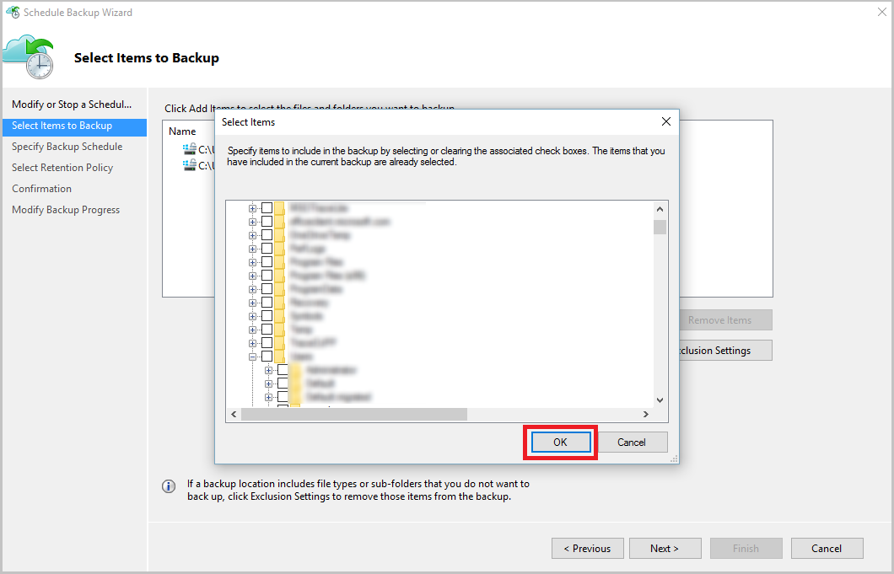
5. Specify the **backup schedule** and click **Next**.

    You can schedule daily (at a maximum of 3 times per day) or weekly backups.

    

   > [!NOTE]
   > Specifying the backup schedule is explained in detail in this [article](backup-azure-backup-cloud-as-tape.md).
   >

6. Select the **Retention Policy** for the backup copy and click **Next**.

    
7. On the **Confirmation** screen review the information and click **Finish**.
8. Once the wizard finishes creating the **backup schedule**, click **Close**.

    After modifying protection, you can confirm that backups are triggering correctly by going to the **Jobs** tab and confirming that changes are reflected in the backup jobs.

## Enable Network Throttling

The Azure Backup agent provides a Throttling tab which allows you to control how network bandwidth is used during data transfer. This control can be helpful if you need to back up data during work hours but do not want the backup process to interfere with other internet traffic. Throttling of data transfer applies to back up and restore activities.  

To enable throttling:

1. In the **Backup agent**, click **Change Properties**.
2. On the **Throttling tab, select **Enable internet bandwidth usage throttling for backup operations**.

    

    Once you have enabled throttling, specify the allowed bandwidth for backup data transfer during **Work hours** and **Non-work hours**.

    The bandwidth values begin at 512 kilobytes per second (Kbps) and can go up to 1023 megabytes per second (Mbps). You can also designate the start and finish for **Work hours**, and which days of the week are considered Work days. The time outside of the designated Work hours is considered to be non-work hours.
3. Click **OK**.

## Manage exclusion settings
1. Open the **Azure Backup agent** (you can find it by searching your machine for *Azure Backup*).

    
2. In the Azure Backup agent click **Schedule Backup**.

    
3. In the Schedule Backup Wizard leave the **Make changes to backup items or times** option selected and click **Next**.

    
4. Click **Exclusions Settings**.

    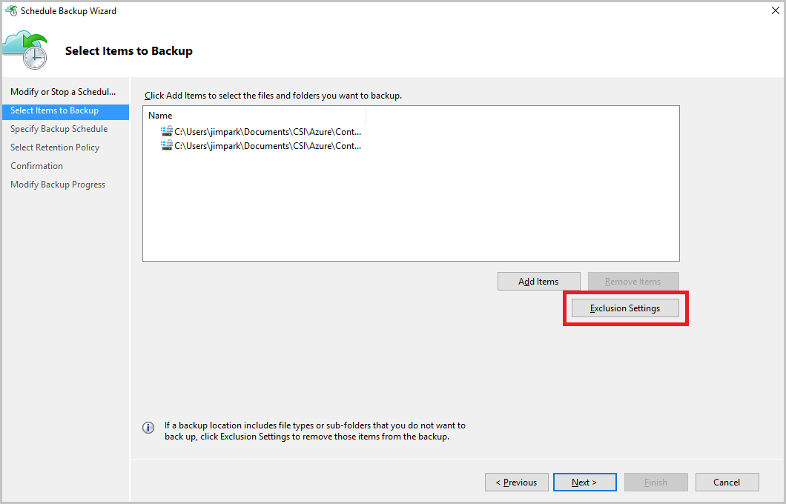
5. Click **Add Exclusion**.

    
6. Select the location and then, click **OK**.

    
7. Add the file extension in the **File Type** field.

    

    Adding an .mp3 extension

    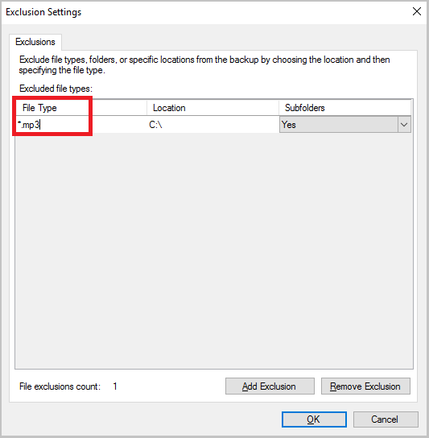

    To add another extension, click **Add Exclusion** and enter another file type extension (adding a .jpeg extension).

    
8. When you've added all the extensions, click **OK**.
9. Continue through the Schedule Backup Wizard by clicking **Next** until the **Confirmation page**, then click **Finish**.

    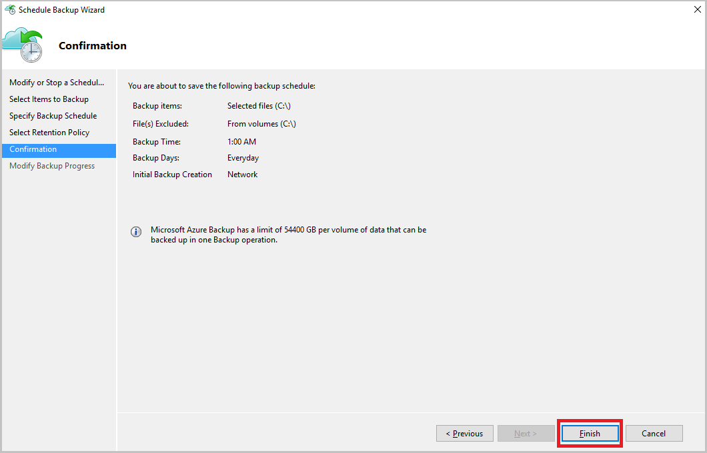

## Frequently asked questions
**Q1. The backup job status shows as completed in the Azure backup agent, why doesn't it get reflected immediately in portal?**

A1. There is at maximum delay of 15 mins between the backup job status reflected in the Azure backup agent and the Azure portal.

**Q.2 When a backup job fails, how long does it take to raise an alert?**

A.2 An alert is raised within 20 mins of the Azure backup failure.

**Q3. Is there a case where an email won’t be sent if notifications are configured?**

A3. Below are the cases when the notification will not be sent in order to reduce the alert noise:

- If notifications are configured hourly and an alert is raised and resolved within the hour
- Job is canceled.
- Second backup job failed because original backup job is in progress.

## Troubleshooting Monitoring Issues
**Issue:** Jobs and/or alerts from the Azure Backup agent do not appear in the portal.

**Troubleshooting steps:** The process, ```OBRecoveryServicesManagementAgent```, sends the job and alert data to the Azure Backup service. Occasionally this process can become stuck or shutdown.

1. To verify the process is not running, open **Task Manager** and check if the ```OBRecoveryServicesManagementAgent``` process is running.
2. Assuming that the process is not running, open **Control Panel** and browse the list of services. Start or restart **Azure Recovery Services Management Agent**.

    For further information, browse the logs at:<br/>
   `<AzureBackup_agent_install_folder>\Azure Recovery Services Agent\Temp\GatewayProvider*`
    For example:<br/>
   `C:\Program Files\Azure Recovery Services Agent\Temp\GatewayProvider0.errlog`

## Next steps
- [Restore Windows Server or Windows Client from Azure](backup-azure-restore-windows-server.md)
- To learn more about Azure Backup, see [Azure Backup Overview](backup-introduction-to-azure-backup.md)
- Visit the [Azure Backup Forum](http://go.microsoft.com/fwlink/p/?LinkId=290933)

