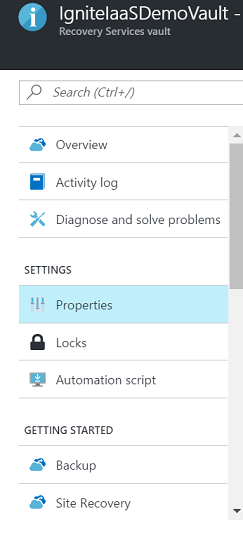
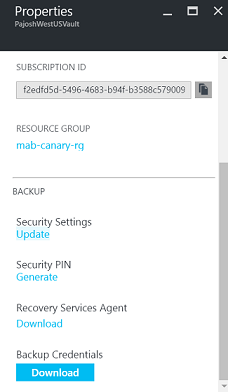
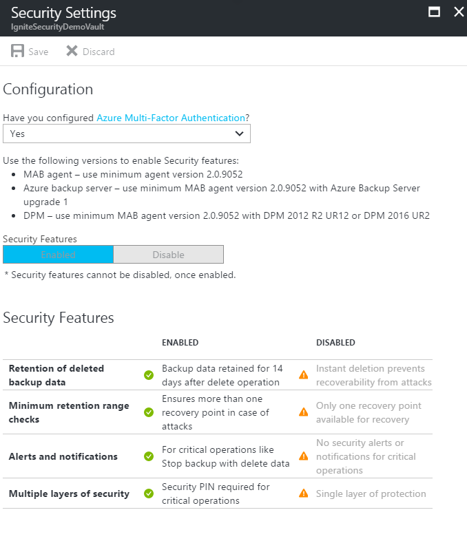

# Security features to help protect hybrid backups that use Azure Backup
Concerns about security issues, like malware, ransomware, and intrusion, are increasing. These security issues can be costly, in terms of both money and data. To guard against such attacks, Azure Backup now provides security features to help protect hybrid backups. This article covers how to enable and use these features, by using an Azure Recovery Services agent and Azure Backup Server. These features include:

- **Prevention**. An additional layer of authentication is added whenever a critical operation like changing a passphrase is performed. This validation is to ensure that such operations can be performed only by users who have valid Azure credentials.
- **Alerting**. An email notification is sent to the subscription admin whenever a critical operation like deleting backup data is performed. This email ensures that the user is notified quickly about such actions.
- **Recovery**. Deleted backup data is retained for an additional 14 days from the date of the deletion. This ensures recoverability of the data within a given time period, so there is no data loss even if an attack happens. Also, a greater number of minimum recovery points are maintained to guard against corrupt data.

> [!NOTE]
> Security features should not be enabled if you are using infrastructure as a service (IaaS) VM backup. These features are not yet available for IaaS VM backup, so enabling them will not have any impact. Security features should be enabled only if you are using:  
>  * **Azure Backup agent**. Minimum agent version 2.0.9052. After you have enabled these features, you should upgrade to this agent version to perform critical operations.  
>  * **Azure Backup Server**. Minimum Azure Backup agent version 2.0.9052 with Azure Backup Server update 1.  
>  * **System Center Data Protection Manager**. Minimum Azure Backup agent version 2.0.9052 with Data Protection Manager 2012 R2 UR12 or Data Protection Manager 2016 UR2.   

> [!NOTE]
> These features are available only for Recovery Services vault. All the newly created Recovery Services vaults have these features enabled by default. For existing Recovery Services vaults, users enable these features by using the steps mentioned in the following section. After the features are enabled, they apply to all the Recovery Services agent computers, Azure Backup Server instances, and Data Protection Manager servers registered with the vault. Enabling this setting is a one-time action, and you cannot disable these features after enabling them.
>

## Enable security features
If you are creating a Recovery Services vault, you can use all the security features. If you are working with an existing vault, enable security features by following these steps:

1. Sign in to the Azure portal by using your Azure credentials.
2. Select **Browse**, and type **Recovery Services**.

      

    The list of recovery services vaults appears. From this list, select a vault. The selected vault dashboard opens.
3. From the list of items that appears under the vault, under **Settings**, click **Properties**.

    
4. Under **Security Settings**, click **Update**.

    

    The update link opens the **Security Settings** blade, which provides a summary of the features and lets you enable them.
5. From the drop-down list **Have you configured Azure Multi-Factor Authentication?**, select a value to confirm if you have enabled [Azure Multi-Factor Authentication](../multi-factor-authentication/multi-factor-authentication.md). If it is enabled, you are asked to authenticate from another device (for example, a mobile phone) while signing in to the Azure portal.

   When you perform critical operations in Backup, you have to enter a security PIN, available on the Azure portal. Enabling Azure Multi-Factor Authentication adds a layer of security. Only authorized users with valid Azure credentials, and authenticated from a second device, can access the Azure portal.
6. To save security settings, select **Enable** and click **Save**. You can select **Enable** only after you select a value from the **Have you configured Azure Multi-Factor Authentication?** list in the previous step.

    

## Recover deleted backup data
Backup retains deleted backup data for an additional 14 days, and does not delete it immediately if the **Stop backup with delete backup data** operation is performed. To restore this data in the 14-day period, take the following steps, depending on what you are using:

For **Azure Recovery Services agent** users:

1. If the computer where backups were happening is still available, use [Recover data to the same machine](backup-azure-restore-windows-server.md#use-instant-restore-to-recover-data-to-the-same-machine) in Azure Recovery Services, to recover from all the old recovery points.
2. If this computer is not available, use [Recover to an alternate machine](backup-azure-restore-windows-server.md#use-instant-restore-to-restore-data-to-an-alternate-machine) to use another Azure Recovery Services computer to get this data.

For **Azure Backup Server** users:

1. If the server where backups were happening is still available, re-protect the deleted data sources, and use the **Recover Data** feature to recover from all the old recovery points.
2. If this server is not available, use [Recover data from another Azure Backup Server](backup-azure-alternate-dpm-server.md#recover-data-from-another-azure-backup-server) to use another Azure Backup Server instance to get this data.

For **Data Protection Manager** users:

1. If the server where backups were happening is still available, re-protect the deleted data sources, and use the **Recover Data** feature to recover from all the old recovery points.
2. If this server is not available, use [Add External DPM](backup-azure-alternate-dpm-server.md#recover-data-from-another-azure-backup-server) to use another Data Protection Manager server to get this data.

## Prevent attacks
Checks have been added to make sure only valid users can perform various operations. These include adding an extra layer of authentication, and maintaining a minimum retention range for recovery purposes.

### Authentication to perform critical operations
As part of adding an extra layer of authentication for critical operations, you are prompted to enter a security PIN when you perform **Stop Protection with Delete data** and **Change Passphrase** operations.

To receive this PIN:

1. Sign in to the Azure portal.
2. Browse to **Recovery Services vault** > **Settings** > **Properties**.
3. Under **Security PIN**, click **Generate**. This opens a blade that contains the PIN to be entered in the Azure Recovery Services agent user interface.
    This PIN is valid for only five minutes, and it gets generated automatically after that period.

### Maintain a minimum retention range
To ensure that there are always a valid number of recovery points available, the following checks have been added:

- For daily retention, a minimum of **seven** days of retention should be done.
- For weekly retention, a minimum of **four** weeks of retention should be done.
- For monthly retention, a minimum of **three** months of retention should be done.
- For yearly retention, a minimum of **one** year of retention should be done.

## Notifications for critical operations
Typically, when a critical operation is performed, the subscription admin is sent an email notification with details about the operation. You can configure additional email recipients for these notifications by using the Azure portal.

The security features mentioned in this article provide defense mechanisms against targeted attacks. More importantly, if an attack happens, these features give you the ability to recover your data.

## Troubleshooting errors
| Operation | Error details | Resolution |
| --- | --- | --- |
| Policy change |The backup policy could not be modified. Error: The current operation failed due to an internal service error [0x29834]. Please retry the operation after sometime. If the issue persists, please contact Microsoft support. |**Cause:** This error comes when security settings are enabled, you try to reduce retention range below the minimum values specified above and you are on unsupported  version (supported versions are specified in first note of this article).  **Recommended Action:**  In this case, you should set retention period above the minimum retention period specified (seven days for daily, four weeks for weekly, three weeks for monthly or one year for yearly) to proceed with policy related udpates. Optionally, preferred approach would be to update backup agent, Azure Backup Server and/or DPM UR to leverage all the security updates. |
| Change Passphrase |Security PIN entered is incorrect. (ID: 100130) Provide the correct Security PIN to complete this operation. |**Cause:**  This error comes when you enter invalid or expired Security PIN while performing critical operation (like change passphrase).  **Recommended Action:**  To complete the operation, you must enter valid Security PIN. To get the PIN, log in to Azure portal and navigate to Recovery Services vault > Settings > Properties > Generate Security PIN. Use this PIN to change passphrase. |
| Change Passphrase |Operation failed. ID: 120002 |**Cause:** This error comes when security settings are enabled, you try to change passphrase and you are on unsupported version (valid versions specified in first note of this article). **Recommended Action:**  To change passphrase, you must first update backup agent to minimum version minimum 2.0.9052, Azure Backup server to minimum update 1, and/or DPM to minimum DPM 2012 R2 UR12 or  DPM 2016 UR2 (download links below), then enter valid Security PIN. To get the PIN, log in to Azure portal and navigate to Recovery Services vault > Settings > Properties > Generate Security PIN. Use this PIN to change passphrase. |

## Next steps
- [Get started with Azure Recovery Services vault](backup-azure-vms-first-look-arm.md) to enable these features.
- [Download the latest Azure Recovery Services agent](http://aka.ms/azurebackup_agent) to help protect Windows computers and guard your backup data against attacks.
- [Download the latest Azure Backup Server](https://aka.ms/latest_azurebackupserver) to help protect workloads and guard your backup data against attacks.
- [Download UR12 for System Center 2012 R2 Data Protection Manager](https://support.microsoft.com/help/3209592/update-rollup-12-for-system-center-2012-r2-data-protection-manager) or [download UR2 for System Center 2016 Data Protection Manager](https://support.microsoft.com/help/3209593/update-rollup-2-for-system-center-2016-data-protection-manager) to help protect workloads and guard your backup data against attacks.

