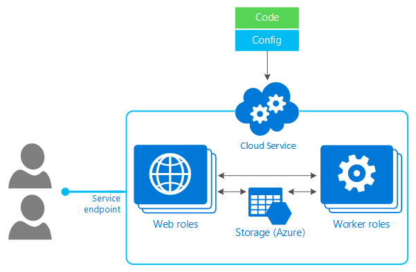

# Should I choose cloud services or something else?
Is Azure Cloud Services the choice for you? Azure provides different hosting models for running applications. Each one provides a different set of services, so which one you choose depends on exactly what you're trying to do.

[!INCLUDE [compute-table](../../includes/compute-options-table.md)]

## Tell me about cloud services

Cloud Services is an example of Platform-as-a-Service(PaaS). Like [App Service](../app-service/app-service-web-overview.md), this technology is designed to support applications that are scalable, reliable, and cheap to operate. Just like an App Service is hosted on VMs, so too are Cloud Services, however, you have more control over the VMs. You can install your own software on Cloud Service VMs and you can remote into them.

 

More control also means less ease of use. Unless you need the additional control options, it's typically quicker and easier to get a web application up and running in Web Apps in App Service compared to Cloud Services.

There are two types of Cloud Service roles. The only difference between the two is how your role is hosted on the virtual machine.

* **Web role**  
Automatically deploys and hosts your app through IIS.

* **Worker role**  
Does not use IIS and runs your app standalone.

For example, a simple application might use just a single web role, serving a website. A more complex application might use a web role to handle incoming requests from users, then pass those requests on to a worker role for processing. (This communication could use [Service Bus](../service-bus-messaging/service-bus-fundamentals-hybrid-solutions.md) or [Azure Queues](../storage/common/storage-introduction.md).)

As the preceding figure suggests, all the VMs in a single application run in the same cloud service. Users access the application through a single public IP address, with requests automatically load balanced across the application's VMs. The platform [scales and deploys](cloud-services-how-to-scale-portal.md) the VMs in a Cloud Services application in a way that avoids a single point of hardware failure.

Even though applications run in virtual machines, it's important to understand that Cloud Services provides PaaS, not IaaS. Here's one way to think about it: With IaaS, such as Azure Virtual Machines, you first create and configure the environment your application runs in, then deploy your application into this environment. You're responsible for managing much of this world, doing things such as deploying new patched versions of the operating system in each VM. In PaaS, by contrast, it's as if the environment already exists. All you have to do is deploy your application. Management of the platform it runs on, including deploying new versions of the operating system, is handled for you.

## Scaling and management
With Cloud Services, you don't create virtual machines. Instead, you provide a configuration file that tells Azure how many of each you'd like, such as **three web role instances** and **two worker role instances**, and the platform creates them for you.  You still choose [what size](cloud-services-sizes-specs.md) those backing VMs should be, but you don't explicitly create them yourself. If your application needs to handle a greater load, you can ask for more VMs, and Azure creates those instances. If the load decreases, you can shut down those instances and stop paying for them.

A Cloud Services application is typically made available to users via a two-step process. A developer first [uploads the application](cloud-services-how-to-create-deploy-portal.md) to the platform's staging area. When the developer is ready to make the application live, they use the Azure portal to swap staging with production. This [switch between staging and production](cloud-services-nodejs-stage-application.md) can be done with no downtime, which lets a running application be upgraded to a new version without disturbing its users.

## Monitoring
Cloud Services also provides monitoring. Like Azure Virtual Machines, it detects a failed physical server and restarts the VMs that were running on that server on a new machine. But Cloud Services also detects failed VMs and applications, not just hardware failures. Unlike Virtual Machines, it has an agent inside each web and worker role, and so it's able to start new VMs and application instances when failures occur.

The PaaS nature of Cloud Services has other implications, too. One of the most important is that applications built on this technology should be written to run correctly when any web or worker role instance fails. To achieve this, a Cloud Services application shouldn't maintain state in the file system of its own VMs. Unlike VMs created with Azure Virtual Machines, writes made to Cloud Services VMs aren't persistent; there's nothing like a Virtual Machines data disk. Instead, a Cloud Services application should explicitly write all state to SQL Database, blobs, tables, or some other external storage. Building applications this way makes them easier to scale and more resistant to failure, both important goals of Cloud Services.

## Next steps
[Create a cloud service app in .NET](./cloud-services-dotnet-get-started.md)  
[Create a cloud service app in Node.js](./cloud-services-nodejs-develop-deploy-app.md)  
[Create a cloud service app in PHP](../cloud-services-php-create-web-role.md)  
[Create a cloud service app in Python](./cloud-services-python-ptvs.md)