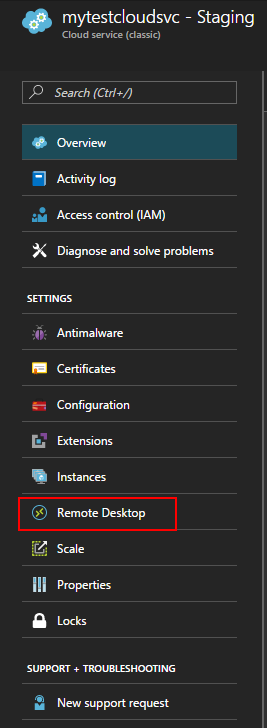

<properties
    pageTitle="Enable Remote Desktop Connection for a Role in Azure Cloud Services | Azure"
    description="How to configure your azure cloud service application to allow remote desktop connections"
    services="cloud-services"
    documentationcenter=""
    author="seanmck"
    manager="timlt"
    editor="" />
<tags
    ms.assetid="73ea1d64-1529-4d72-b58e-f6c10499e6bb"
    ms.service="cloud-services"
    ms.workload="tbd"
    ms.tgt_pltfrm="na"
    ms.devlang="na"
    ms.topic="article"
    ms.date="11/28/2016"
    wacn.date=""
    ms.author="seanmck" />

# Enable Remote Desktop Connection for a Role in Azure Cloud Services
>[AZURE.SELECTOR]
[Azure portal](/documentation/articles/cloud-services-role-enable-remote-desktop-new-portal/)
[Azure classic portal](/documentation/articles/cloud-services-role-enable-remote-desktop/)
[PowerShell](/documentation/articles/cloud-services-role-enable-remote-desktop-powershell/)
[Visual Studio](/documentation/articles/vs-azure-tools-remote-desktop-roles/)

Remote Desktop enables you to access the desktop of a role running in Azure. You can use a Remote Desktop connection to troubleshoot and diagnose problems with your application while it is running.

You can enable a Remote Desktop connection in your role during development by including the Remote Desktop modules in your service definition or you can choose to enable Remote Desktop through the Remote Desktop Extension. The preferred approach is to use the Remote Desktop extension as you can enable Remote Desktop even after the application is deployed without having to redeploy your application.

## Configure Remote Desktop from the Azure portal
The Azure portal uses the Remote Desktop Extension approach so you can enable Remote Desktop even after the application is deployed. The **Remote Desktop** blade for your cloud service allows you to enable Remote Desktop, change the local Administrator account used to connect to the virtual machines, the certificate used in authentication and set the expiration date.

1. Click **Cloud Services**, click the name of the cloud service, and then click **Remote Desktop**.

    

2. Choose whether you want to enable Remote Desktop for an individual role or for all roles, then change the value of the switcher to **Enabled**.

3. Fill in the required fields for user name, password, expiry, and certificate.

    

   > [AZURE.WARNING]
   > All role instances will be restarted when you first enable Remote Desktop and click OK (checkmark). To prevent a reboot, the certificate used to encrypt the password must be installed on the role. To prevent a restart, [upload a certificate for the cloud service](/documentation/articles/cloud-services-configure-ssl-certificate/#step-3-upload-a-certificate) and then return to this dialog.
   >
   >
3. In **Roles**, select the role you want to update or select **All** for all roles.

4. When you finish your configuration updates, click **Save**. It will take a few moments before your role instances are ready to receive connections.

## Remote into role instances
Once Remote Desktop is enabled on the roles, you can initiate a connection directly from the Azure Portal:

1. Click **Instances** to open the **Instances** blade.
2. Select a role instance that has Remote Desktop configured.
3. Click **Connect** to download an RDP file for the role instance.

    

4. Click **Open** and then **Connect** to start the Remote Desktop connection.

## Next steps

[How to Configure Cloud Services](/documentation/articles/cloud-services-how-to-configure/)
