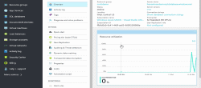

    <h1>Language Understanding Intelligent Services (LUIS) Documentation</h1>
    

        

            
Learn how to use Language Understanding Intelligent Services (LUIS) to enable developers to build smart applications that can understand human language and accordingly react to user requests.

        

        <a href="#">
            

                

                    
                

                

                    
Video title (03:03)

                

            

        </a>
    

<h2 style="margin-top: 18px; margin-bottom: 0px;">5-Minute Quickstarts</h2>

Deploy a Machine Learning application

    

        <a href="#">
            
            quickstart
        </a>
    

<h2 style="margin-top: 36px">Step-by-Step Tutorials</h2>

Learn how to create and manage a LUIS app

<ol>
    <li><a href="#">tutorial</a></li>
</ol>

<h2 style="margin-top: 36px">SDKs</h2>

<ul class="spaced">
    <li><a href="https://github.com/Microsoft/Cognitive-LUIS-Android">Android</a></li>
    <li><a href="https://github.com/Microsoft/Cognitive-LUIS-Node.js">Node.js</a></li>
    <li><a href="https://github.com/Microsoft/Cognitive-LUIS-Python">Python</a></li>
    <li><a href="https://github.com/Microsoft/Cognitive-LUIS-Windows">Windows</a></li>
</ul>

<h2 style="margin-top: 36px">Reference</h2>
<ul class="panelContent cardsW">
    <li>
        

            

                

                    

                        <h3>Top Topics</h3>
                        
<a href="/cognitive-services/luis/home">Overview</a>

                        
<a href="/cognitive-services/luis/plan-your-app">Plan your app</a>

                        
<a href="/cognitive-services/luis/create-new-app">Create your app</a>

                        
<a href="/cognitive-services/luis/app-dashboard">Dashboard</a>

                        
<a href="/cognitive-services/luis/train-test">Train + test the app</a>

                        
<a href="/cognitive-services/luis/publishapp">Publish the app</a>

                    

                

            

        

    </li>
    <li>
        

            

                

                    

                        <h3>Additional Support</h3>
                        
<a href="/cognitive-services/luis/add-intents">Add intents</a>

                        
<a href="/cognitive-services/luis/add-example-utterances">Add utterances</a>

                        
<a href="/cognitive-services/luis/add-entities">Add entities</a>

                        
<a href="/cognitive-services/luis/add-features">Add features</a>

                        
<a href="/cognitive-services/luis/label-suggested-utterances">Active Learning</a>

                        
<a href="/cognitive-services/luis/pre-builtentities">Pre-built entities</a>

                        
<a href="/cognitive-services/luis/cortana-prebuilt-app">Cortana pre-built app</a>

                        
<a href="/cognitive-services/luis/manage-keys">Key management</a>

                        
<a href="/cognitive-services/luis/azureibizasubscription">Create subscription keys</a>

                    

                

            

        

    </li>
</ul>

