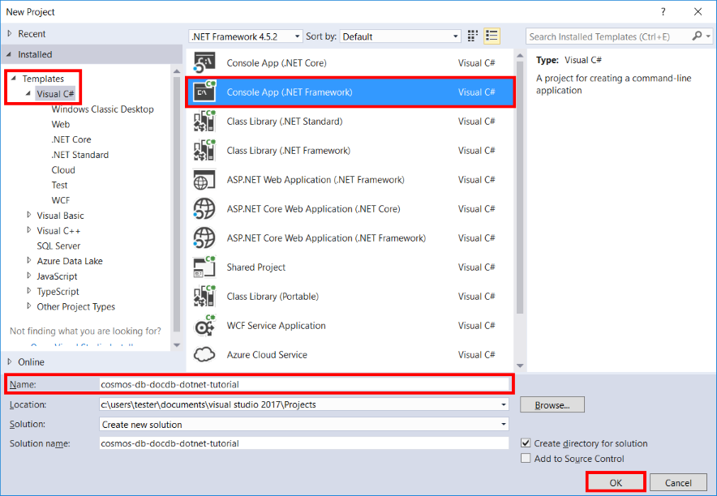
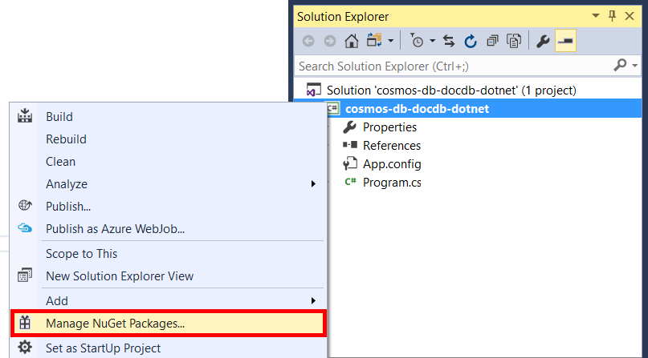

# Azure CosmosDB: Develop with the DocumentDB API in .NET

Azure Cosmos DB is Microsoft's globally distributed multi-model database service. You can quickly create and query document, key/value databases, all of which benefit from the global distribution and horizontal scale capabilities at the core of Azure Cosmos DB. 

This tutorial demonstrates how to create an Azure Cosmos DB account using the Azure portal, and then create a document database and collection with a [partition key](documentdb-partition-data.md#partition-keys) using the [DocumentDB .NET API](documentdb-introduction.md). By defining a partition key when you create a collection, your application is prepared to scale effortlessly as your data grows. 

This tutorial covers the following tasks by using the [DocumentDB .NET API](documentdb-sdk-dotnet.md):

> [!div class="checklist"]
> * Create an Azure Cosmos DB account
> * Create a database and collection with a partition key
> * Create JSON documents
> * Update a document
> * Query partitioned collections
> * Run stored procedures
> * Delete a document
> * Delete a database

## Prerequisites
Please make sure you have the following:

* An active Azure account. If you don't have one, you can sign up for a [free account](https://www.azure.cn/pricing/1rmb-trial/). 

  [!INCLUDE [cosmos-db-emulator-docdb-api](../../includes/cosmos-db-emulator-docdb-api.md)]

* If you don't already have Visual Studio 2017 installed, you can download and use the **free** [Visual Studio 2017 Community Edition](https://www.visualstudio.com/downloads/). Make sure that you enable **Azure development** during the Visual Studio setup.

## Create an Azure Cosmos DB account

Let's start by creating an Azure Cosmos DB account in the Azure portal.

> [!TIP]
> * Already have an Azure Cosmos DB account? If so, skip ahead to [Set up your Visual Studio solution](#SetupVS)
> * Did you have an Azure DocumentDB account? If so, your account is now an Azure Cosmos DB account and you can skip ahead to [Set up your Visual Studio solution](#SetupVS).  
> * If you are using the Azure Cosmos DB Emulator, please follow the steps at [Azure Cosmos DB Emulator](local-emulator.md) to setup the emulator and skip ahead to [Set up your Visual Studio Solution](#SetupVS). 
>
>

[!INCLUDE [cosmos-db-create-dbaccount](../../includes/cosmos-db-create-dbaccount.md)]

## <a id="SetupVS"></a>Set up your Visual Studio solution
1. Open **Visual Studio** on your computer.
2. On the **File** menu, select **New**, and then choose **Project**.
3. In the **New Project** dialog, select **Templates** / **Visual C#** / **Console App (.NET Framework)**, name your project, and then click **OK**.
   

4. In the **Solution Explorer**, right click on your new console application, which is under your Visual Studio solution, and then click **Manage NuGet Packages...**

    
5. In the **NuGet** tab, click **Browse**, and type **documentdb** in the search box.
<!---stopped here--->
6. Within the results, find **Microsoft.Azure.DocumentDB** and click **Install**.
   The package ID for the Azure Cosmos DB Client Library is [Microsoft.Azure.DocumentDB](https://www.nuget.org/packages/Microsoft.Azure.DocumentDB).
   

    If you get a message about reviewing changes to the solution, click **OK**. If you get a message about license acceptance, click **I accept**.

## <a id="Connect"></a>Add references to your project
The remaining steps in this tutorial provide the DocumentDB API code snippets required to create and update Azure Cosmos DB resources in your project.

First, add these references to your application.
<!---These aren't added by default when you install the pkg?--->

```csharp
using System.Net;
using Microsoft.Azure.Documents;
using Microsoft.Azure.Documents.Client;
using Newtonsoft.Json;
```

## <a id="add-references"></a>Connect your app

Next, add these two constants and your *client* variable in your application.

```csharp
private const string EndpointUrl = "<your endpoint URL>";
private const string PrimaryKey = "<your primary key>";
private DocumentClient client;
```

Then, head back to the [Azure portal](https://portal.azure.cn) to retrieve your endpoint URL and primary key. The endpoint URL and primary key are necessary for your application to understand where to connect to, and for Azure Cosmos DB to trust your application's connection.

In the Azure portal, navigate to your Azure Cosmos DB account, click **Keys**, and then click **Read-write Keys**.

Copy the URI from the portal and paste it over `<your endpoint URL>` in the program.cs file. Then copy the PRIMARY KEY from the portal and paste it over `<your primary key>`. Be sure to remove the `<` and `>` from your values.


## <a id="instantiate"></a>Instantiate the DocumentClient

Now, create a new instance of the **DocumentClient**.

```csharp
DocumentClient client = new DocumentClient(new Uri(EndpointUrl), PrimaryKey);
```

## <a id="create-database"></a>Create a database

Next, create an Azure Cosmos DB [database](documentdb-resources.md#databases) by using the [CreateDatabaseAsync](https://msdn.microsoft.com/library/azure/microsoft.azure.documents.client.documentclient.createdatabaseasync.aspx) method or [CreateDatabaseIfNotExistsAsync](https://msdn.microsoft.com/library/microsoft.azure.documents.client.documentclient.createdatabaseifnotexistsasync.aspx) method of the **DocumentClient** class from the [DocumentDB .NET SDK](documentdb-sdk-dotnet.md). A database is the logical container of JSON document storage partitioned across collections.

```csharp
await client.CreateDatabaseAsync(new Database { Id = "db" });
```
## Decide on a partition key 

Collections are containers for storing documents. They are logical resources and can [span one or more physical partitions](partition-data.md). A [partition key](documentdb-partition-data.md) is a property (or path) within your documents that is used to distribute your data among the servers or partitions. All documents with the same partition key are stored in the same partition. 

Determining a partition key is an important decision to make before you create a collection. Partition keys are a property (or path) within your documents that can be used by Azure Cosmos DB to distribute your data among multiple servers or partitions. Cosmos DB hashes the partition key value and uses the hashed result to determine the partition in which to store the document. All documents with the same partition key are stored in the same partition, and partition keys cannot be changed once a collection is created. 

For this tutorial, we're going to set the partition key to `/deviceId` so that the all the data for a single device is stored in a single partition. You want to choose a partition key that has a large number of values, each of which are used at about the same frequency to ensure Cosmos DB can load balance as your data grows and achieve the full throughput of the collection. 

For more information about partitioning, see [How to partition and scale in Azure Cosmos DB?](partition-data.md) 

## <a id="CreateColl"></a>Create a collection 

Now that we know our partition key, `/deviceId`, lets create a [collection](documentdb-resources.md#collections) by using the [CreateDocumentCollectionAsync](https://msdn.microsoft.com/library/azure/microsoft.azure.documents.client.documentclient.createdocumentcollectionasync.aspx) method or [CreateDocumentCollectionIfNotExistsAsync](https://msdn.microsoft.com/library/microsoft.azure.documents.client.documentclient.createdocumentcollectionifnotexistsasync.aspx) method of the **DocumentClient** class. A collection is a container of JSON documents and any associated JavaScript application logic. 

> [!WARNING]
> Creating a collection has pricing implications, as you are reserving throughput for the application to communicate with Azure Cosmos DB. For more details, please visit our [pricing page](https://www.azure.cn/pricing/details/cosmos-db/)
> 
> 

```csharp
// Collection for device telemetry. Here the JSON property deviceId is used  
// as the partition key to spread across partitions. Configured for 2500 RU/s  
// throughput and an indexing policy that supports sorting against any  
// number or string property. .
DocumentCollection myCollection = new DocumentCollection();
myCollection.Id = "coll";
myCollection.PartitionKey.Paths.Add("/deviceId");

await client.CreateDocumentCollectionAsync(
    UriFactory.CreateDatabaseUri("db"),
    myCollection,
    new RequestOptions { OfferThroughput = 2500 });
```

This method makes a REST API call to Azure Cosmos DB, and the service provisions a number of partitions based on the requested throughput. You can change the throughput of a collection as your performance needs evolve using the SDK or the [Azure portal](set-throughput.md).

## <a id="CreateDoc"></a>Create JSON documents
Let's insert some JSON documents into Azure Cosmos DB. A [document](documentdb-resources.md#documents) can be created by using the [CreateDocumentAsync](https://msdn.microsoft.com/library/microsoft.azure.documents.client.documentclient.createdocumentasync.aspx) method of the **DocumentClient** class. Documents are user-defined (arbitrary) JSON content. This sample class contains a device reading, and a call to CreateDocumentAsync to insert a new device reading into a collection.

```csharp
public class DeviceReading
{
    [JsonProperty("id")]
    public string Id;

    [JsonProperty("deviceId")]
    public string DeviceId;

    [JsonConverter(typeof(IsoDateTimeConverter))]
    [JsonProperty("readingTime")]
    public DateTime ReadingTime;

    [JsonProperty("metricType")]
    public string MetricType;

    [JsonProperty("unit")]
    public string Unit;

    [JsonProperty("metricValue")]
    public double MetricValue;
  }

// Create a document. Here the partition key is extracted 
// as "XMS-0001" based on the collection definition
await client.CreateDocumentAsync(
    UriFactory.CreateDocumentCollectionUri("db", "coll"),
    new DeviceReading
    {
        Id = "XMS-001-FE24C",
        DeviceId = "XMS-0001",
        MetricType = "Temperature",
        MetricValue = 105.00,
        Unit = "Fahrenheit",
        ReadingTime = DateTime.UtcNow
    });
```
## Read data

Let's read the document by its partition key and Id using the ReadDocumentAsync method. Note that the reads include a PartitionKey value (corresponding to the `x-ms-documentdb-partitionkey` request header in the REST API).

```csharp
// Read document. Needs the partition key and the Id to be specified
Document result = await client.ReadDocumentAsync(
  UriFactory.CreateDocumentUri("db", "coll", "XMS-001-FE24C"), 
  new RequestOptions { PartitionKey = new PartitionKey("XMS-0001") });

DeviceReading reading = (DeviceReading)(dynamic)result;
```

## Update data

Now let's update some data using the ReplaceDocumentAsync method.

```csharp
// Update the document. Partition key is not required, again extracted from the document
reading.MetricValue = 104;
reading.ReadingTime = DateTime.UtcNow;

await client.ReplaceDocumentAsync(
  UriFactory.CreateDocumentUri("db", "coll", "XMS-001-FE24C"), 
  reading);
```

## Delete data

Now lets delete a document by partition key and id by using the DeleteDocumentAsync method.

```csharp
// Delete a document. The partition key is required.
await client.DeleteDocumentAsync(
  UriFactory.CreateDocumentUri("db", "coll", "XMS-001-FE24C"), 
  new RequestOptions { PartitionKey = new PartitionKey("XMS-0001") });
```
## Query partitioned collections

When you query data in partitioned collections, Azure Cosmos DB automatically routes the query to the partitions corresponding to the partition key values specified in the filter (if there are any). For example, this query is routed to just the partition containing the partition key "XMS-0001".

```csharp
// Query using partition key
IQueryable<DeviceReading> query = client.CreateDocumentQuery<DeviceReading>(
    UriFactory.CreateDocumentCollectionUri("db", "coll"))
    .Where(m => m.MetricType == "Temperature" && m.DeviceId == "XMS-0001");
```

The following query does not have a filter on the partition key (DeviceId) and is fanned out to all partitions where it is executed against the partition's index. Note that you have to specify the EnableCrossPartitionQuery (`x-ms-documentdb-query-enablecrosspartition` in the REST API) to have the SDK to execute a query across partitions.

```csharp
// Query across partition keys
IQueryable<DeviceReading> crossPartitionQuery = client.CreateDocumentQuery<DeviceReading>(
    UriFactory.CreateDocumentCollectionUri("db", "coll"), 
    new FeedOptions { EnableCrossPartitionQuery = true })
    .Where(m => m.MetricType == "Temperature" && m.MetricValue > 100);
```

## Parallel query execution
The Azure Cosmos DB DocumentDB SDKs 1.9.0 and above support parallel query execution options, which allow you to perform low latency queries against partitioned collections, even when they need to touch a large number of partitions. For example, the following query is configured to run in parallel across partitions.

```csharp
// Cross-partition Order By queries
IQueryable<DeviceReading> crossPartitionQuery = client.CreateDocumentQuery<DeviceReading>(
    UriFactory.CreateDocumentCollectionUri("db", "coll"), 
    new FeedOptions { EnableCrossPartitionQuery = true, MaxDegreeOfParallelism = 10, MaxBufferedItemCount = 100})
    .Where(m => m.MetricType == "Temperature" && m.MetricValue > 100)
    .OrderBy(m => m.MetricValue);
```

You can manage parallel query execution by tuning the following parameters:

* By setting `MaxDegreeOfParallelism`, you can control the degree of parallelism i.e., the maximum number of simultaneous network connections to the collection's partitions. If you set this to -1, the degree of parallelism is managed by the SDK. If the `MaxDegreeOfParallelism` is not specified or set to 0, which is the default value, there will be a single network connection to the collection's partitions.
* By setting `MaxBufferedItemCount`, you can trade off query latency and client-side memory utilization. If you omit this parameter or set this to -1, the number of items buffered during parallel query execution is managed by the SDK.

Given the same state of the collection, a parallel query will return results in the same order as in serial execution. When performing a cross-partition query that includes sorting (ORDER BY and/or TOP), the DocumentDB SDK issues the query in parallel across partitions and merges partially sorted results in the client side to produce globally ordered results.

## Execute stored procedures
Lastly, you can execute atomic transactions against documents with the same device ID, e.g. if you're maintaining aggregates or the latest state of a device in a single document by adding the following code to your project.

```csharp
await client.ExecuteStoredProcedureAsync<DeviceReading>(
    UriFactory.CreateStoredProcedureUri("db", "coll", "SetLatestStateAcrossReadings"),
    new RequestOptions { PartitionKey = new PartitionKey("XMS-001") }, 
    "XMS-001-FE24C");
```

And that's it! those are the main components of an Azure Cosmos DB application that uses a partition key to efficiently scale data distribution across partitions.  

## Clean up resources

If you're not going to continue to use this app, delete all resources created by this tutorial in the Azure portal with the following steps:

1. From the left-hand menu in the Azure portal, click **Resource groups** and then click the unique name of the resource you created. 
2. On your resource group page, click **Delete**, type the name of the resource to delete in the text box, and then click **Delete**.

## Next steps

In this tutorial, you've done the following: 

> [!div class="checklist"]
> * Created an Azure Cosmos DB account
> * Created a database and collection with a partition key
> * Created JSON documents
> * Updated a document
> * Queried partitioned collections
> * Ran a stored procedure
> * Deleted a document
> * Deleted a database

You can now proceed to the next tutorial and import additional data to your Cosmos DB account. 

> [!div class="nextstepaction"]
> [Import data into Azure Cosmos DB](import-data.md)

<!--Update_Description: wording update-->