# Manage Azure Cosmos DB in Azure Storage Explorer (Preview)

Using Azure Cosmos DB in Azure Storage Explorer enables users to manage Azure Cosmos DB entities, manipulate data, update stored procedures and triggers along with other Azure entities like Storage blobs and queues. Now you can use the same tool to manage your different Azure entities in one place. At this time, Azure Storage Explorer supports SQL (DocumentDB) and MongoDB accounts.

In this article, you can learn how to use Storage Explorer to manage Azure Cosmos DB.

## Prerequisites

- An Azure Cosmos DB account for a SQL (DocumentDB) or MongoDB database. If you don't have an account, you can create one in the Azure portal, as described in [Azure Cosmos DB: Build a DocumentDB API web app with .NET and the Azure portal](create-documentdb-dotnet.md).
- Install the newest Azure Storage Explorer bits. You can install them using the following links: [Linux](https://go.microsoft.com/fwlink/?linkid=858559), [Mac](https://go.microsoft.com/fwlink/?linkid=858561), [Windows](https://go.microsoft.com/fwlink/?linkid=858562).

## Connect to an Azure subscription

1. After installing the **Azure Storage Explorer**, click the **plug-in** icon on the left as shown in the following image.

   

2. Select **Add an Azure Account**, and then click **Sign-in**.

   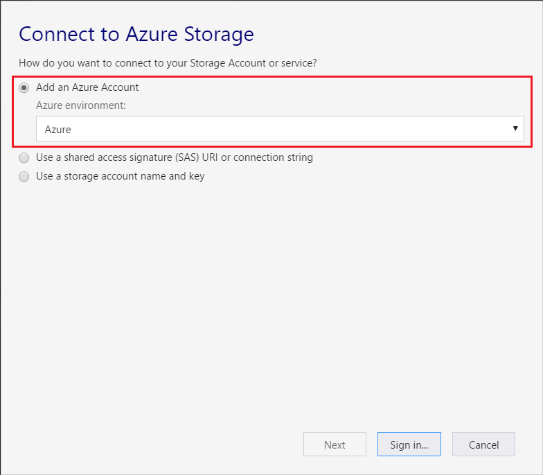

2. In the **Azure Sign in** dialog box, select **Sign in**, and then enter your Azure credentials.

    

3. Select your subscription from the list and then click **Apply**.

    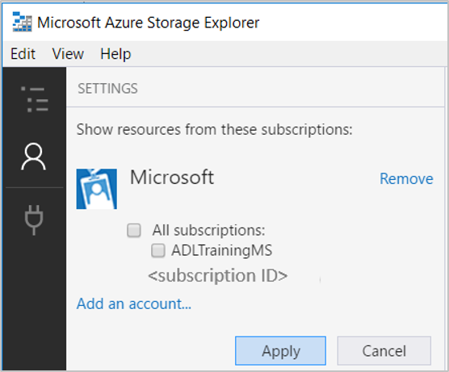

    The Explorer pane updates and displays the accounts in the selected subscription.

    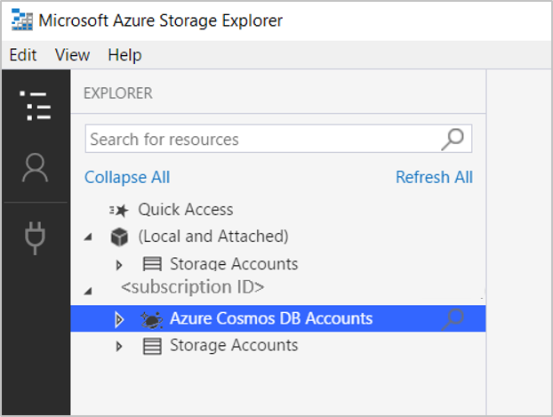

    You have successfully connected to your **Azure Cosmos DB account** to your Azure subscription.

## Connect to Azure Cosmos DB by using a connection string

An alternative way of connecting to an Azure Cosmos DB is to use a connection string. Use the following steps to connect using a connection string.

1. Find **Local and Attached** in the left tree, right-click **Azure Cosmos DB Accounts**, choose **Connect to Azure Cosmos DB...**

    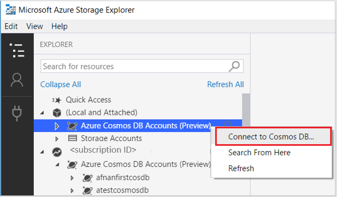

2. Choose the appropriate **Default Experience** for your account type, either **DocumentDB** or **MongoDB**, paste in your **Connection String**, and then click **OK** to connect Azure Cosmos DB account. For information on retrieving the connection string, see [Get the connection string](/cosmos-db/manage-account#get-the--connection-string).

    

## Azure Cosmos DB resource management

You can manage an Azure Cosmos DB account by doing following operations:
* Open the account in the Azure portal
* Add the resource to the Quick Access list
* Search and refresh resources
* Create and delete databases
* Create and delete collections
* Create, edit, delete, and filter documents
* Manage stored procedures, triggers, and user-defined functions

### Quick access tasks

By right-clicking on a subscription in the Explorer pane, you can perform many quick action tasks:

* Right-click an Azure Cosmos DB account or a database, you can choose **Open in Portal** and manage the resource in the browser on the Azure portal.

     

* You can also add Azure Cosmos DB account, database, collection to **Quick Access**.
* **Search from Here** enables keyword search under the selected path.

    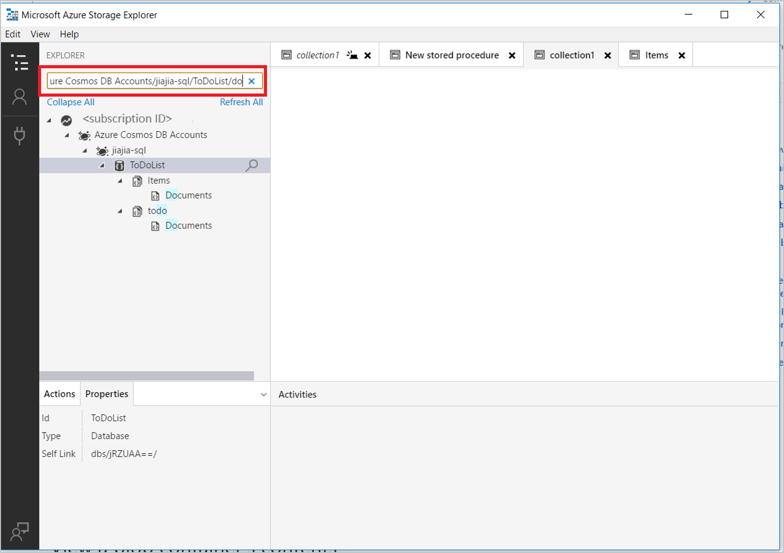 

### Database and collection management
#### Create a database 
Right-click the Azure Cosmos DB account, choose **Create Database**, input the database name, and press **Enter** to complete.

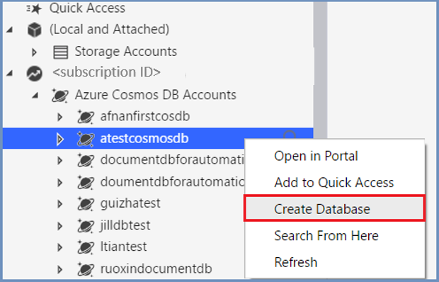 

#### Delete a database
Right-click the database, click **Delete Database**, and click **Yes** in the pop-up window. The database node is deleted, and the Azure Cosmos DB account refreshes automatically.

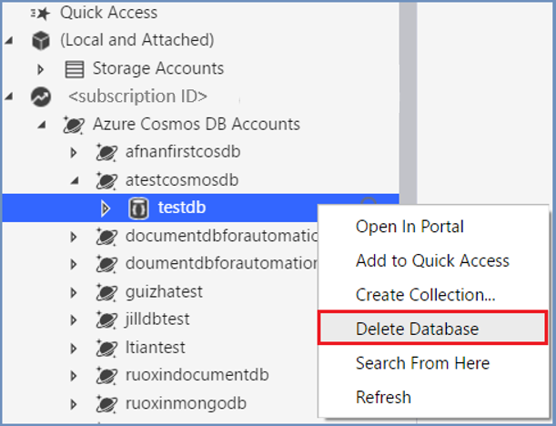  

 

#### Create a collection
Right-click your database, choose **Create Collection**, and then provide the following information like **Collection ID**, **Storage capacity**, etc. Click **OK** to finish. For information on partition key settings, see [Design for partitioning](partition-data.md#designing-for-partitioning).

If a partition key is used when creating a collection, once creation is completed, the partition key value can't be changed on the collection.

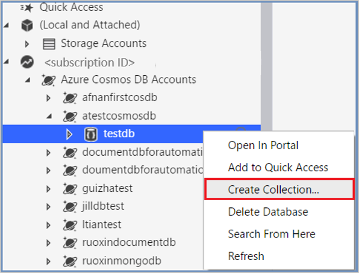

 

#### Delete a collection
Right-click the collection, click **Delete Collection**, and then click **Yes** in the pop-up window. 

The collection node is deleted, and the database refreshes automatically.  

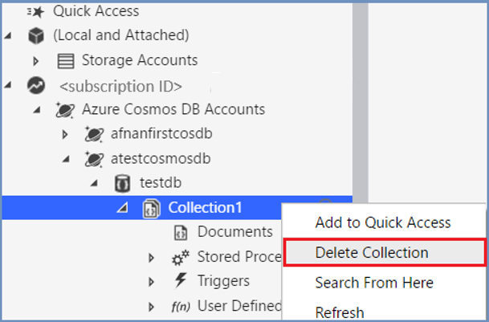 

### Document management

#### Create and modify documents
To create a new document, open **Documents** in the left window, click **New Document**, edit the contents in the right pane, then click **Save**. You can also update an existing document, and then click **Save**. Changes can be discarded by clicking **Discard**.

#### Delete a document
Click the **Delete** button to delete the selected document.
#### Query for documents
Edit the document filter by entering a [SQL query](documentdb-sql-query.md) and then click **Apply**.

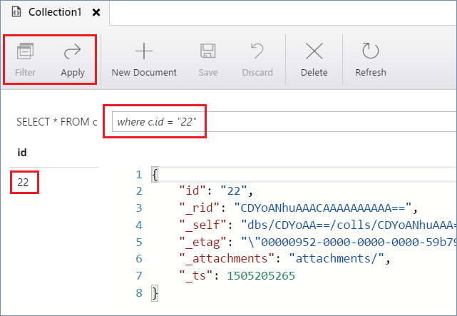

### Manage stored procedures, triggers, and UDFs
* To create a stored procedure, in the left tree, right-click **Stored Procedure**, choose **Create Stored Procedure**, enter a name in the left, type the stored procedure scripts in the right window, and then click **Create**. 
* You can also edit existing stored procedures by double-clicking, making the update, and then clicking **Update** to save, or click **Discard** to cancel the change.

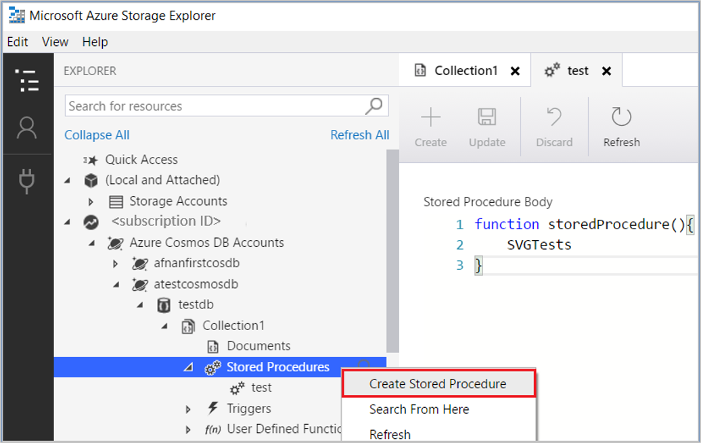

* The operations for **Triggers** and **UDF** are similar to those for **Stored Procedures**.

## Demo
* Watch the following video to see how to use Azure Cosmos DB in Azure Storage Explorer: [Use Azure Cosmos DB in Azure Storage Explorer](https://go.microsoft.com/fwlink/?linkid=858710).

## Next steps

Now that you have Azure Storage Explorer connected to your Azure Cosmos DB account, learn more about Storage Explorer and connect more services in [Get started with Storage Explorer (Preview)](/vs-azure-tools-storage-manage-with-storage-explorer).

<!--Update_Description: new articles on tutuorial in storage explorer -->

