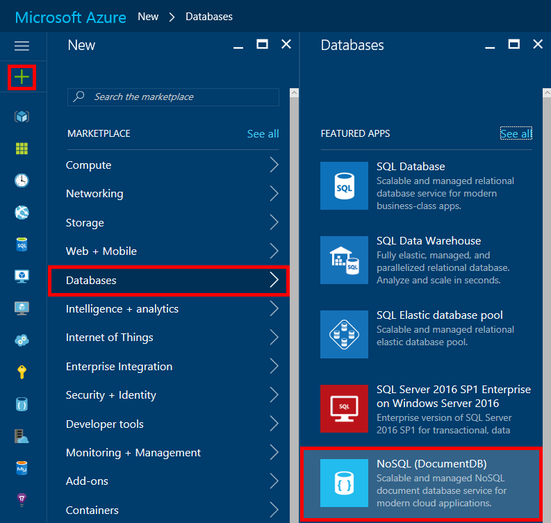

<properties
    pageTitle="How to create a DocumentDB account | Azure"
    description="Build a NoSQL database with Azure DocumentDB. Follow these instructions to create a DocumentDB account and start building your blazing fast, global-scale NoSQL database."
    keywords="build a database"
    services="documentdb"
    documentationcenter=""
    author="mimig1"
    manager="jhubbard"
    editor="monicar" />
<tags
    ms.assetid="0e7f8488-7bb7-463e-b6fd-3ae91a02c03a"
    ms.service="documentdb"
    ms.workload="data-services"
    ms.tgt_pltfrm="na"
    ms.devlang="na"
    ms.topic="get-started-article"
    ms.date="02/10/2017"
    wacn.date=""
    ms.author="mimig" />

# How to create a DocumentDB NoSQL account using the Azure portal
> [AZURE.SELECTOR]
- [Azure portal](/documentation/articles/documentdb-create-account/)
- [Azure CLI and Azure Resource Manager](/documentation/articles/documentdb-automation-resource-manager-cli/)

To build a database with Azure DocumentDB, you must:

- Have an Azure account. You can get a [Azure account](/pricing/1rmb-trial/) if you don't have one already.
- Create a DocumentDB account.  

You can create a DocumentDB account using either the Azure portal, Azure Resource Manager templates, or Azure command-line interface (CLI). This article shows how to create a DocumentDB account using the Azure portal. To create an account using Azure Resource Manager or Azure CLI, see [Automate DocumentDB database account creation](/documentation/articles/documentdb-automation-resource-manager-cli/).

1. Sign in to the [Azure portal](https://portal.azure.cn/).
2. On the left navigation, click **New**, click **Databases**, and then click **NoSQL (DocumentDB)**.

     
3. In the **New account** blade, specify the desired configuration for the DocumentDB account.

    

   - In the **ID** box, enter a name to identify the DocumentDB account.  When the **ID** is validated, a green check mark appears in the **ID** box. The **ID** value becomes the host name within the URI. The **ID** may contain only lowercase letters, numbers, and the '-' character, and must be between 3 and 50 characters. Note that *documents.azure.com* is appended to the endpoint name you choose, the result of which becomes your DocumentDB account endpoint.
   - In the **NoSQL API** box, select the programming model to use:

     - **DocumentDB**: The DocumentDB API is available via .NET, Java, Node.js, Python and JavaScript [SDKs](/documentation/articles/documentdb-sdk-dotnet/), as well as HTTP [REST](https://msdn.microsoft.com/zh-cn/library/azure/dn781481.aspx), and offers programmatic access to all the DocumentDB functionality.
     - **MongoDB**: DocumentDB also offers [protocol-level support](/documentation/articles/documentdb-protocol-mongodb/) for **MongoDB** APIs. When you choose the MongoDB API option, you can use existing MongoDB SDKs and [tools](/documentation/articles/documentdb-mongodb-mongochef/) to talk to DocumentDB. You can [move](/documentation/articles/documentdb-import-data/) your existing MongoDB apps to use DocumentDB, with [no code changes needed](/documentation/articles/documentdb-connect-mongodb-account/), and take advantage of a fully managed database as a service, with limitless scale, global replication, and other capabilities.
   - For **Subscription**, select the Azure subscription that you want to use for the DocumentDB account. If your account has only one subscription, that account is selected by default.
   - In **Resource Group**, select or create a resource group for your DocumentDB account.  By default, a new resource group is created. For more information, see [Using the Azure portal to manage your Azure resources](/documentation/articles/resource-group-portal/).
   - Use **Location** to specify the geographic location in which to host your DocumentDB account.
4. Once the new DocumentDB account options are configured, click **Create**. To check the status of the deployment, check the Notifications hub.  

     

   
5. After the DocumentDB account is created, it is ready for use with the default settings. The default consistency of the DocumentDB account is set to **Session**.  You can adjust the default consistency by clicking **Default Consistency** in the resource menu. To learn more about the consistency levels offered by DocumentDB, see [Consistency levels in DocumentDB](/documentation/articles/documentdb-consistency-levels/).

     

     

[How to: Create a DocumentDB account]: #Howto
[Next steps]: #NextSteps

## Next steps
Now that you have a DocumentDB account, the next step is to create a DocumentDB collection and database.

You can create a new collection and database by using one of the following:

- The Azure portal, as described in [Create a DocumentDB collection using the Azure portal](/documentation/articles/documentdb-create-collection/).
- The all-inclusive tutorials, which include sample data: [.NET](/documentation/articles/documentdb-get-started/), [.NET MVC](/documentation/articles/documentdb-dotnet-application/), [Java](/documentation/articles/documentdb-java-application/), [Node.js](/documentation/articles/documentdb-nodejs-application/), or [Python](/documentation/articles/documentdb-python-application/).
- The [.NET](/documentation/articles/documentdb-dotnet-samples/#database-examples/), [Node.js](/documentation/articles/documentdb-nodejs-samples/#database-examples/), or [Python](/documentation/articles/documentdb-python-samples/#database-examples/) sample code available in GitHub.
- The [.NET](/documentation/articles/documentdb-sdk-dotnet/), [.NET Core](/documentation/articles/documentdb-sdk-dotnet-core/), [Node.js](/documentation/articles/documentdb-sdk-node/), [Java](/documentation/articles/documentdb-sdk-java/), [Python](/documentation/articles/documentdb-sdk-python/), and [REST](https://msdn.microsoft.com/zh-cn/library/azure/mt489072.aspx) SDKs.

After creating your database and collection, you need to [add documents](/documentation/articles/documentdb-view-json-document-explorer/) to the collections.

After you have documents in a collection, you can use [DocumentDB SQL](/documentation/articles/documentdb-sql-query/) to [execute queries](/documentation/articles/documentdb-sql-query/#executing-sql-queries/) against your documents. You can execute queries by using the [Query Explorer](/documentation/articles/documentdb-query-collections-query-explorer/) in the portal, the [REST API](https://msdn.microsoft.com/zh-cn/library/azure/dn781481.aspx), or one of the [SDKs](/documentation/articles/documentdb-sdk-dotnet/).

### Learn more
To learn more about DocumentDB, explore these resources:

- [DocumentDB hierarchical resource model and concepts](/documentation/articles/documentdb-resources/)
