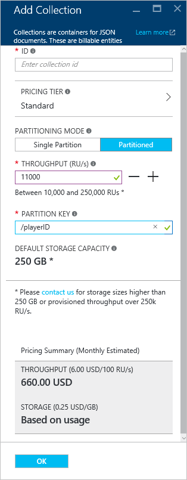
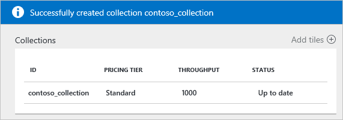

<properties
    pageTitle="Create a DocumentDB database and collection | Azure"
    description="Learn how to create NoSQL databases and JSON document collections using the online service portal for Azure DocumentDB, a cloud based document database. Get a trial today."
    services="documentdb"
    author="mimig1"
    manager="jhubbard"
    editor="monicar"
    documentationcenter="" />
<tags
    ms.assetid="b81ad2f6-df7f-4c6d-8ca9-f8a9982d647e"
    ms.service="documentdb"
    ms.workload="data-services"
    ms.tgt_pltfrm="na"
    ms.devlang="na"
    ms.topic="article"
    ms.date="02/08/2017"
    wacn.date=""
    ms.author="mimig" />

# How to create a DocumentDB collection and database using the Azure portal
To use Azure DocumentDB, you must have a [DocumentDB account](/documentation/articles/documentdb-create-account/), a database, a collection, and documents. This topic describes how to create a DocumentDB collection in the Azure portal.

Not sure what a collection is? See [What is a DocumentDB collection?](#what-is-a-documentdb-collection)

1. In the [Azure portal](https://portal.azure.cn/), in the Jumpbar, click **DocumentDB (NoSQL)**, and then in the **DocumentDB (NoSQL)** blade, select the account in which to add a collection. If you don't have any accounts listed, you'll need to [create a DocumentDB account](/documentation/articles/documentdb-create-account/).

   

   If **DocumentDB (NoSQL)** is not visible in the Jumpbar, click **More Services** and then click **DocumentDB (NoSQL)**. If you don't have any accounts listed, you'll need to [create a DocumentDB account](/documentation/articles/documentdb-create-account/).
2. In the **DocumentDB account** blade for the selected account, click **Add Collection**.

    
3. In the **Add Collection** blade, in the **Collection Id** box, enter the ID for your new collection. Collection names must be between 1 and 255 characters, and cannot contain `/ \ # ?` or a trailing space. When the name is validated, a green check mark appears in the ID box.

    
4. By default, **Storage Capacity** is set to **250 GB** to handle partitioned collections.

    Set storage capcity to **10 GB** if you want a [single partition collection](/documentation/articles/documentdb-partition-data/#single-partition-and-partitioned-collections/) with throughput levels from 400-10,000 request units/second (RU/s). One RU corresponds to the throughput of a read of a 1KB document. For more information about request units, see [Request units](/documentation/articles/documentdb-request-units/).

    Set storage capacity to **250 GB** if you want a [partitioned collection](/documentation/articles/documentdb-partition-data/#single-partition-and-partitioned-collections/) that can scale to handle an unlimited amount of storage over multiple partitions, and can have throughput levels starting at 2,500 RU/s.

    Set storage capacity to **Custom** if you want to provision an amount other than 10 GB or 250 GB. DocumentDB has virtually limitless scale, so please include your requested storage size and throughput value in the support request.

6. In the **Partition Key** box, enter a partition key for the collection. This is required for partitioned collections and optional for single partition collections. Selecting the correct partition key is important in creating a performant collection. For more information on selecting a partition key, see [Designing for partitioning](/documentation/articles/documentdb-partition-data/#designing-for-partitioning/).
7. In the **Database** blade, either create a new database or use an existing one. Database names must be between 1 and 255 characters, and cannot contain `/ \ # ?` or a trailing space. To validate the name, click outside the text box. When the name is validated, a green check mark appears in the box.
8. Click **OK** at the bottom of the screen to create the new collection.
9. The new collection now appears in the **Collections** lens on the **Overview** blade.

    
10. **Optional:** To modify the throughput of collection in the portal, click **Scale** on the Resource menu.

    

## What is a DocumentDB collection?
A collection is a container of JSON documents and the associated JavaScript application logic. A collection is a billable entity, where the [cost](/documentation/articles/documentdb-performance-levels/) is determined by the provisioned throughput of the collection. Collections can span one or more partitions/servers and can scale to handle practically unlimited volumes of storage or throughput.

Collections are automatically partitioned into one or more physical servers by DocumentDB. When you create a collection, you can specify the provisioned throughput in terms of request units per second and a partition key property. The value of this property will be used by DocumentDB to distribute documents among partitions and route requests like queries. The partition key value also acts as the transaction boundary for stored procedures and triggers. Each collection has a reserved amount of throughput specific to that collection, which is not shared with other collections in the same account. Therefore, you can scale out your application both in terms of storage and throughput.

Collections are not the same as tables in relational databases. Collections do not enforce schema, in fact DocumentDB does not enforce any schemas, it's a schema-free database. Therefore you can store different types of documents with diverse schemas in the same collection. You can choose to use collections to store objects of a single type like you would with tables. The best model depends only on how the data appears together in queries and transactions.

## Other ways to create a DocumentDB collection
Collections do not have to be created using the portal, you can also create them using the [DocumentDB SDKs](/documentation/articles/documentdb-sdk-dotnet/) and the REST API.

- For a C# code sample, see the [C# collection samples](/documentation/articles/documentdb-dotnet-samples/#collection-examples/).
- For a Node.js code sample, see the [Node.js collection samples](/documentation/articles/documentdb-nodejs-samples/#collection-examples/).
- For a Python code sample, see [Python collection samples](/documentation/articles/documentdb-python-samples/#collection-examples/).
- For a REST API sample, see [Create a Collection](https://msdn.microsoft.com/zh-cn/library/azure/mt489078.aspx).

## Troubleshooting
If **Add Collection** is disabled in the Azure portal, that means your account is currently disabled, which normally occurs when all the benefits credits for the month are used.    

## Next steps
Now that you have a collection, the next step is to add documents or import documents into the collection. When it comes to adding documents to a collection, you have a few choices:

- You can [add documents](/documentation/articles/documentdb-view-json-document-explorer/) by using the Document Explorer in the portal.
- You can [import documents and data](/documentation/articles/documentdb-import-data/) by using the DocumentDB Data Migration Tool, which enables you to import JSON and CSV files, as well as data from SQL Server, MongoDB, Azure Table storage, and other DocumentDB collections.
- Or you can add documents by using one of the [DocumentDB SDKs](/documentation/articles/documentdb-sdk-dotnet/). DocumentDB has .NET, Java, Python, Node.js, and JavaScript API SDKs. For C# code samples showing how to work with documents by using the DocumentDB .NET SDK, see the [C# document samples](/documentation/articles/documentdb-dotnet-samples/#document-examples/). For Node.js code samples showing how to work with documents by using the DocumentDB Node.js SDK, see the [Node.js document samples](/documentation/articles/documentdb-nodejs-samples/#document-examples/).

After you have documents in a collection, you can use [DocumentDB SQL](/documentation/articles/documentdb-sql-query/) to [execute queries](/documentation/articles/documentdb-sql-query/#executing-sql-queries/) against your documents by using the [Query Explorer](/documentation/articles/documentdb-query-collections-query-explorer/) in the portal, the [REST API](https://msdn.microsoft.com/zh-cn/library/azure/dn781481.aspx), or one of the [SDKs](/documentation/articles/documentdb-sdk-dotnet/). 
