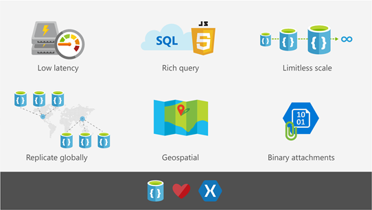
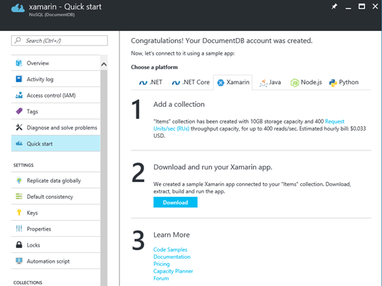
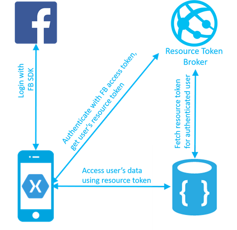
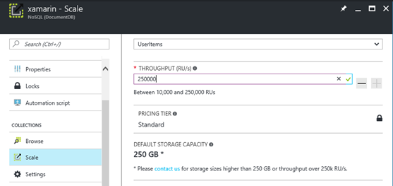
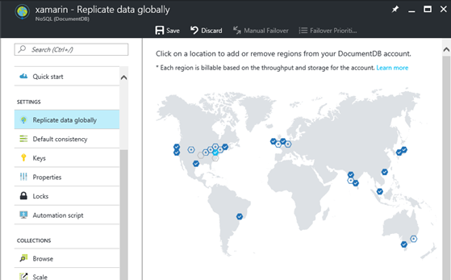

# Build mobile applications with Xamarin and DocumentDB
Most mobile apps need to store data in the cloud, and DocumentDB is a cloud database for mobile apps. It has everything a mobile developer needs. It is a fully managed database as a service that scales on demand. It can bring your data to your application transparently, wherever your users are located around the globe. By using the [DocumentDB .NET Core SDK](documentdb-sdk-dotnet-core.md), you can enable Xamarin mobile apps to interact directly with DocumentDB, without a middle tier.

This article provides a tutorial for building mobile apps with Xamarin and DocumentDB. You can find the complete source code for the tutorial at [Xamarin and DocumentDB on GitHub](https://github.com/Azure/azure-documentdb-dotnet/tree/master/samples/xamarin), including how to manage users and permissions.

## DocumentDB capabilities for mobile apps
DocumentDB provides the following key capabilities for mobile app developers:



- Rich queries over schemaless data. DocumentDB stores data as schemaless JSON documents in heterogeneous collections. It offers [rich and fast queries](documentdb-sql-query.md) without the need to worry about schemas or indexes.
- Fast throughput. It takes only a few milliseconds to read and write documents with DocumentDB. Developers can specify the throughput they need, and DocumentDB honors it with 99.99 percent SLAs.
- Limitless scale. Your DocumentDB collections [grow as your app grows](documentdb-partition-data.md). You can start with small data size and throughput of hundreds of requests per second. Your collections can grow to petabytes of data and arbitrarily large throughput with hundreds of millions of requests per second.
- Globally distributed. Mobile app users are on the go, often across the world. DocumentDB is a [globally distributed database](documentdb-distribute-data-globally.md). Click the map to make your data accessible to your users.
- Built-in rich authorization. With DocumentDB, you can easily implement popular patterns like [per-user data](https://aka.ms/documentdb-xamarin-todouser) or multiuser shared data, without complex custom authorization code.
- Geospatial queries. Many mobile apps offer geo-contextual experiences today. With first-class support for [geospatial types](documentdb-geospatial.md), DocumentDB makes creating these experiences easy to accomplish.
- Binary attachments. Your app data often includes binary blobs. Native support for attachments makes it easier to use DocumentDB as a one-stop shop for your app data.

## DocumentDB and Xamarin tutorial
The following tutorial shows how to build a mobile application by using Xamarin and DocumentDB. You can find the complete source code for the tutorial at [Xamarin and DocumentDB on GitHub](https://github.com/Azure/azure-documentdb-dotnet/tree/master/samples/xamarin).

### Get started
It's easy to get started with DocumentDB. Go to the Azure portal, and create a new DocumentDB account. Click the **Quick start** tab. Download the Xamarin Forms to-do list sample that is already connected to your DocumentDB account. 



Or if you have an existing Xamarin app, you can add the [DocumentDB NuGet package](documentdb-sdk-dotnet-core.md). DocumentDB supports Xamarin.IOS, Xamarin.Android, and Xamarin Forms shared libraries.

### Work with data
Your data records are stored in DocumentDB as schemaless JSON documents in heterogeneous collections. You can store documents with different structures in the same collection:

```cs
    var result = await client.CreateDocumentAsync(collectionLink, todoItem);
```

In your Xamarin projects, you can use language-integrated queries over schemaless data:

```cs
    var query = await client.CreateDocumentQuery<ToDoItem>(collectionLink)
                    .Where(todoItem => todoItem.Complete == false)
                    .AsDocumentQuery();

    Items = new List<TodoItem>();
    while (query.HasMoreResults) {
        Items.AddRange(await query.ExecuteNextAsync<TodoItem>());
    }
```
### Add users
Like many get started samples, the DocumentDB sample you downloaded authenticates to the service by using a master key hardcoded in the app's code. This default is not a good practice for an app you intend to run anywhere except on your local emulator. If an unauthorized user obtained the master key, all the data across your DocumentDB account could be compromised. Instead, you want your app to access only the records for the signed-in user. DocumentDB allows developers to grant application read or read/write permission to a collection, a set of documents grouped by a partition key, or a specific document. 

Follow these steps to modify the to-do list app to a multiuser to-do list app: 

  1. Add Login to your app by using Facebook, Active Directory, or any other provider.

  2. Create a DocumentDB UserItems collection with **/userId** as the partition key. Specifying the partition key for your collection allows DocumentDB to scale infinitely as the number of your app users grows, while continuing to offer fast queries.

  3. Add DocumentDB Resource Token Broker. This simple Web API authenticates users and issues short-lived tokens to signed-in users with access only to the documents within their partition. In this example, Resource Token Broker is hosted in App Service.

  4. Modify the app to authenticate to Resource Token Broker with Facebook, and request the resource tokens for the signed-in Facebook users. You can then access their data in the UserItems collection.  

You can find a complete code sample of this pattern at [Resource Token Broker on GitHub](http://aka.ms/documentdb-xamarin-todouser). This diagram illustrates the solution:



If you want two users to have access to the same to-do list, you can add additional permissions to the access token in Resource Token Broker.

### Scale on demand
DocumentDB is a managed database as a service. As your user base grows, you don't need to worry about provisioning VMs or increasing cores. All you need to tell DocumentDB is how many operations per second (throughput) your app needs. You can specify the throughput via the **Scale** tab by using a measure of throughput called Request Units (RUs) per second. For example, a read operation on a 1-KB document requires 1 RU. You can also add alerts to the **Throughput** metric to monitor the traffic growth and programmatically change the throughput as alerts fire.



### Go planet scale
As your app gains popularity, you might gain users across the globe. Or maybe you want to be prepared for unforeseen events. Go to the Azure portal, and open your DocumentDB account. Click the map to make your data continuously replicate to any number of regions across the world. This capability makes your data available wherever your users are. You can also add failover policies to be prepared for contingencies.



Congratulations. You have completed the solution and have a mobile app with Xamarin and DocumentDB. Follow similar steps to build Cordova apps by using the DocumentDB JavaScript SDK and native iOS/Android apps by using DocumentDB REST APIs.

## Next steps
- View the source code for [Xamarin and DocumentDB on GitHub](https://github.com/Azure/azure-documentdb-dotnet/tree/master/samples/xamarin).
- Download the [DocumentDB .NET Core SDK](documentdb-sdk-dotnet-core.md).
- Find more code samples for [.NET applications](documentdb-dotnet-samples.md).
- Learn about [DocumentDB rich query capabilities](documentdb-sql-query.md).
- Learn about [geospatial support in DocumentDB](documentdb-geospatial.md).


