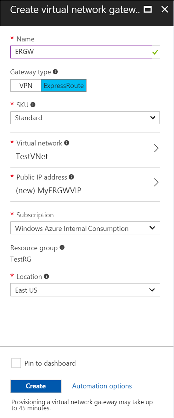

# Configure a virtual network gateway for ExpressRoute using the Azure portal
> [!div class="op_single_selector"]
> * [Resource Manager - Azure portal](./expressroute-howto-add-gateway-portal-resource-manager.md)
> * [Resource Manager - PowerShell](./expressroute-howto-add-gateway-resource-manager.md)
> * [Classic - PowerShell](./expressroute-howto-add-gateway-classic.md)
> 
> 

This article walks you through the steps to add a virtual network gateway for a pre-existing VNet. This article walks you through the steps to add, resize, and remove a virtual network (VNet) gateway for a pre-existing VNet. The steps for this configuration are specifically for VNets that were created using the Resource Manager deployment model that will be used in an ExpressRoute configuration. For more information about virtual network gateways and gateway configuration settings for ExpressRoute, see [About virtual network gateways for ExpressRoute](./expressroute-about-virtual-network-gateways.md). 

## Before beginning

The steps for this task use a VNet based on the values in the following configuration reference list. We use this list in our example steps. You can copy the list to use as a reference, replacing the values with your own.

**Configuration reference list**

* Virtual Network Name = "TestVNet"
* Virtual Network address space = 192.168.0.0/16
* Subnet Name = "FrontEnd" 
	* Subnet address space = "192.168.1.0/24"
* Resource Group = "TestRG"
* Location = "China East"
* Gateway Subnet name: "GatewaySubnet" You must always name a gateway subnet *GatewaySubnet*.
	* Gateway Subnet address space = "192.168.200.0/26"
* Gateway Name = "ERGW"
* Gateway IP Name = "MyERGWVIP"
* Gateway type = "ExpressRoute" This type is required for an ExpressRoute configuration.
* Gateway Public IP Name = "MyERGWVIP"

## Create the gateway subnet

1. In the [portal](http://portal.azure.cn), navigate to the Resource Manager virtual network for which you want to create a virtual network gateway.
2. In the **Settings** section of your VNet blade, click **Subnets** to expand the Subnets blade.
3. On the **Subnets** blade, click **+Gateway subnet** to open the **Add subnet** blade. 
   
    

4. The **Name** for your subnet is automatically filled in with the value 'GatewaySubnet'. This value is required in order for Azure to recognize the subnet as the gateway subnet. Adjust the auto-filled **Address range** values to match your configuration requirements. We recommend creating a gateway subnet with a /27 or larger (/26, /25, etc.). Then, click **OK** to save the values and create the gateway subnet.

    

## Create the virtual network gateway

1. In the portal, on the left side, click **+** and type 'Virtual Network Gateway' in search. Locate **Virtual network gateway** in the search return and click the entry. On the **Virtual network gateway** blade, click **Create** at the bottom of the blade. This opens the **Create virtual network gateway** blade.
2. On the **Create virtual network gateway** blade, fill in the values for your virtual network gateway.

    
3. **Name**: Name your gateway. This is not the same as naming a gateway subnet. It's the name of the gateway object you are creating.
4. **Gateway type**: Select **ExpressRoute**.
5. **SKU**: Select the gateway SKU from the dropdown.
6. **Location**: Adjust the **Location** field to point to the location where your virtual network is located. If the location is not pointing to the region where your virtual network resides, the virtual network doesn't appear in the 'Choose a virtual network' dropdown.
7. Choose the virtual network to which you want to add this gateway. Click **Virtual network** to open the **Choose a virtual network** blade. Select the VNet. If you don't see your VNet, make sure the **Location** field is pointing to the region in which your virtual network is located.
9. Choose a public IP address. Click **Public IP address** to open the **Choose public IP address** blade. Click **+Create New** to open the **Create public IP address blade**. Input a name for your public IP address. This blade creates a public IP address object to which a public IP address will be dynamically assigned. Click **OK** to save your changes to this blade.
10. **Subscription**: Verify that the correct subscription is selected.
11. **Resource group**: This setting is determined by the Virtual Network that you select.
12. Don't adjust the **Location** after you've specified the previous settings.
13. Verify the settings. If you want your gateway to appear on the dashboard, you can select **Pin to dashboard** at the bottom of the blade.
14. Click **Create** to begin creating the gateway. The settings are validated and the gateway deploys. Creating virtual network gateway can take up to 45 minutes to complete.

## Next steps
After you have created the VNet gateway, you can link your VNet to an ExpressRoute circuit. See [Link a Virtual Network to an ExpressRoute circuit](./expressroute-howto-linkvnet-portal-resource-manager.md).