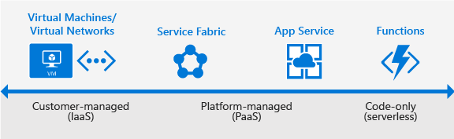

# Get started guide for Azure in China developers

## What is Azure?

Azure is a complete cloud platform that can host your existing applications, streamline the development of new applications, and even enhance on-premises applications. Azure integrates the cloud services that you need to develop, test, deploy, and manage your applications—while taking advantage of the efficiencies of cloud computing.

By hosting your applications in Azure, you can start small and easily scale your application as your customer demand grows. Azure also offers the reliability that’s needed for high-availability applications, even including failover between different regions. The [Azure portal](https://portal.azure.cn) lets you easily manage all your Azure services. You can also manage your services programmatically by using service-specific APIs and templates.

**Who should read this**: This guide is an introduction to the Azure platform for application developers. It provides guidance and direction that you need to start building new applications in Azure or migrating existing applications to Azure.

## Where do I start?

With all the services that Azure offers, it can be a daunting task to figure out which services you need to support your solution architecture. This section highlights the Azure services that developers commonly use. For a list of all Azure services, see the [Azure documentation](../../index.md).

First, you must decide on how to host your application in Azure. Do you need to manage your entire infrastructure as a virtual machine (VM). Can you use the platform management facilities that Azure provides? Maybe you need a serverless framework to host code execution only?

Your application needs cloud storage, which Azure provides several options for. You can take advantage of Azure's enterprise authentication. There are also tools for cloud-based development and monitoring, and most hosting services offer DevOps integration.

Now, let's look at some of the specific services that we recommend investigating for your applications.

### Application hosting

Azure provides several cloud-based compute offerings to run your application so that you don't have to worry about the infrastructure details. You can easily scale up or scale out your resources as your application usage grows.

Azure offers services that support your application development and hosting needs. Azure provides infrastructure-as-a-service (IaaS) to give you full control over your application hosting. Azure's platform-as-a-service (PaaS) offerings provide the fully managed  services needed to power your apps. There is even true serverless hosting in Azure where all you need to do is write your code.

#### Azure App Service 

When you want the quickest path to publish your web-based projects, consider Azure App Service. App Service makes it easy to extend your web apps to support your mobile clients and publish easily consumed REST APIs. This platform provides authentication by using social providers, traffic-based autoscaling, testing in production, and continuous and container-based deployments.

You can create web apps, mobile app back ends, and API apps.

Because all three app types share the App Service runtime, you can host a website, support mobile clients, and expose your APIs in Azure, all from the same project or solution. To learn more about App Service, see [What is Azure Web Apps](../../app-service-web/app-service-web-overview.md).

App Service has been designed with DevOps in mind. It supports various tools for publishing and continuous integration deployments, including GitHub webhooks, Jenkins, Visual Studio Team Services, TeamCity, and others.

>**Get started**: App Service makes it easy to create and deploy your first [web app](../../app-service-web/web-sites-dotnet-get-started.md), [mobile app](../../app-service-mobile/app-service-mobile-ios-get-started.md), or [API app](../../app-service-api/app-service-api-dotnet-get-started.md).

#### Azure Virtual Machines

As an infrastructure-as-a-service (IaaS) provider, Azure lets you deploy to or migrate your application to either Windows or Linux VMs. Together with Azure Virtual Network, Azure Virtual Machines supports the deployment of Windows or Linux VMs to Azure. With VMs, you have total control over the configuration of the machine. When using VMs, you’re responsible for all server software installation, configuration, maintenance, and operating system patches.

Because of the level of control that you have with VMs, you can run a wide range of server workloads on Azure that don’t fit into a PaaS model. These workloads include database servers, Windows Server Active Directory, and Microsoft SharePoint. For more information, see the Virtual Machines documentation for either [Linux](/virtual-machines/linux/) or [Windows](/virtual-machines/windows/).

>**When to use**: Use Virtual Machines when you want full control over your application infrastructure or to migrate on-premises application workloads to Azure without having to make changes.

>**Get started**: Create a [Linux VM](../../virtual-machines/linux/quick-create-portal.md) or [Windows VM](../../virtual-machines/windows/quick-create-portal.md) from the Azure portal.

#### Azure Functions (serverless)

>[!NOTE]
> Azure Functions is not available in China yet.

Rather than of worrying about building out and managing a whole application or the infrastructure to run your code. What if you could just write your code and have it run in response to events or on a schedule?  Azure Functions is a "serverless"-style offering that lets you write just the code you need. With Functions, code execution is triggered by HTTP requests, webhooks, cloud service events, or on a schedule. You can code in your development language of choice, such as C\#, F\#, Node.js, Python, or PHP. With consumption-based billing, you pay only for the time that your code executes, and Azure scales as needed.

>**When to use**: Use Azure Functions when you have code that is triggered by other Azure services, by web-based events, or on a schedule. You can also use Functions when you don't need the overhead of a complete hosted project or when you only want to pay for the time that your code runs. 

#### Azure Service Fabric

Azure Service Fabric is a distributed systems platform that makes it easy to build, package, deploy, and manage scalable and reliable microservices. It also provides comprehensive application management capabilities for provisioning, deploying, monitoring, upgrading/patching, and deleting deployed applications. Apps, which run on a shared pool of machines, can start small and scale to hundreds or thousands of machines as needed.

Service Fabric supports WebAPI with Open Web Interface for .NET (OWIN) and ASP.NET Core. It provides SDKs for building services on Linux in both .NET Core and Java. To learn more about Service Fabric, see the [Service Fabric Documentation](/service-fabric/).

>**When to use:** Service Fabric is a good choice when you’re creating an application or rewriting an existing application to use a microservice architecture. Use Service Fabric when you need more control over, or direct access to, the underlying infrastructure.

>**Get started:** [Create your first Azure Service Fabric application](../../service-fabric/service-fabric-create-your-first-application-in-visual-studio.md).

### Enhance your applications with Azure services

In addition to application hosting, Azure provides service offerings that can enhance the functionality, development, and maintenance of your applications, both in the cloud and on-premises.

#### Hosted storage and data access

Most applications must store data, so regardless of how you decide to host your application in Azure, consider one or more of the following storage and data services.

-   **Azure SQL Database**: An Azure-based version of the Microsoft SQL Server engine for storing relational tabular data in the cloud. SQL Database provides predictable performance, scalability with no downtime, business continuity, and data protection.

	>**When to use**: When your application requires data storage with referential integrity, transactional support, and support for TSQL queries.

    >**Get started**: [Create a SQL database in minutes by using the Azure portal](../../sql-database/sql-database-get-started.md).

-   **Azure Storage**: Offers durable, highly available storage for blobs, queues, files, and other kinds of nonrelational data. Storage provides the storage foundation for VMs.

	>**When to use**: When your app stores nonrelational data, such as key-value pairs (tables), blobs, files shares, or messages (queues).

    >**Get started**: Choose from one of these types storage: [blobs](../../storage/blobs/storage-dotnet-how-to-use-blobs.md), [tables](../../cosmos-db/table-storage-how-to-use-dotnet.md),     [queues](../../storage/queues/storage-dotnet-how-to-use-queues.md), or [files](../../storage/files/storage-dotnet-how-to-use-files.md).

-   **Azure DocumentDB**: A fully managed and scalable NoSQL database service, which features SQL queries over object data. You can access DocumentDB by using existing MongoDB drivers.
	>**When to use:** When your application needs to be able to execute SQL queries over JSON documents, or if you’re using MongoDB.

    >**Get started**: [Build a DocumentDB C# console application](../../cosmos-db/documentdb-get-started.md). If you’re a MongoDB developer, see [DocumentDB protocol support for
    MongoDB](../../cosmos-db/mongodb-introduction.md).

You can use Azure Data Factory to move existing on-premises data to Azure. If you aren't ready to move data to the cloud, Hybrid Connections in BizTalk Services lets you connect your App Service hosted app to on-premises resources. You can also connect to Azure data and storage services from your on-premises applications.

>[!NOTE]
>Azure Data Factory and BizTalk Services Hybrid Connections are not available in China.
>
>

#### Docker support

>[!NOTE]
>Docker and Container Service are not available in China.
>
>

Docker containers, a form of OS virtualization, let you deploy applications in a more efficient and predictable way. A containerized application works in production the same way as on your development and test systems. You can manage containers by using standard Docker tools. You can use your existing skills and popular open-source tools to deploy and manage container-based applications on Azure.

Azure provides several ways to use containers in your applications.

-   **Azure Docker VM extension**: Lets you configure your VM with Docker tools to act as a Docker host.

	>**When to use**: When you want to generate consistent container deployments for your applications on a VM, or when you want to use [Docker Compose](https://docs.docker.com/compose/overview/).

-   **Azure Container Service**: Lets you create, configure, and manage a cluster of virtual machines  that are preconfigured to run containerized applications. 

	>**When to use**: When you need to build production-ready, scalable environments that provide additional scheduling and management tools, or when you’re deploying a Docker Swarm cluster.

-   **Docker Machine**: Lets you install and manage a Docker Engine on virtual hosts by using docker-machine commands.

	>**When to use**: When you need to quickly prototype an app by creating a single Docker host.

-   **Custom Docker image for App Service**: Lets you use Docker containers from a container registry or a customer     container when you deploy a web app on Linux.

	>**When to use**: When deploying a web app on Linux to a Docker image.

### Authentication

It's crucial to not only know who is using your applications, but also to prevent unauthorized access to your resources. Azure provides several ways to authenticate your app clients.

-   **Azure Active Directory (Azure AD)**: The Microsoft multitenant, cloud-based identity and access management service. You can add single-sign on (SSO) to your applications by integrating with Azure AD. You can access directory properties by using the Azure AD Graph API directly or the Microsoft Graph API. You can integrate with Azure AD support for the OAuth2.0 authorization framework and Open ID Connect by using native HTTP/REST endpoints and the multiplatform Azure AD authentication libraries.

	>**When to use**: When you want to provide an SSO experience, work with Graph-based data, or authenticate domain-based users.

    >**Get started**: To learn more, see the [Azure Active Directory developer's guide](../../active-directory/develop/active-directory-developers-guide.md).

-   **App Service Authentication**: When you choose App Service to host your app, you also get built-in    authentication support for Azure AD.

	>**When to use**: When you want to enable authentication in an App Service app by using Azure AD, social identity providers, or both.

    >**Get started**: To learn more about authentication in App Service, see [Authentication and authorization in Azure App Service](../../app-service/app-service-authentication-overview.md).

### Monitoring

With your application up and running in Azure, you need to be able to monitor performance, watch for issues, and see how customers are using your app. Azure provides several monitoring options.

-   **Visual Studio Application Insights**: An Azure-hosted extensible analytics service that integrates with Visual Studio to monitor your live web applications. It gives you the data that you need to continuously improve the performance and usability of your apps, whether they’re hosted on Azure or not.
>[!NOTE]
>Application Insights is not available in China.
>
>

-	**Azure Monitor**: A service that helps you to visualize, query, route, archive, and act on the metrics and logs that are generated by your Azure infrastructure and resources. Monitor provides the data views that you see in the Azure portal and is a single source for monitoring Azure resources.
 

### DevOps integration

Whether it's provisioning VMs or publishing your web apps with continuous integration, Azure integrates with most of the popular DevOps tools. With support for tools like Jenkins, GitHub, Puppet, Chef, TeamCity, Ansible, VSTS, and others, you can work with the tools that you already have and maximize your existing experience.

>**Get started**: To see DevOps options for an App Service app, see [Continuous Deployment to Azure App Service](../../app-service-web/app-service-continuous-deployment.md).

## Azure regions

Azure is a global cloud platform that is generally available in many regions around the world. When you provision a service, application, or VM in Azure, you are asked to select a region, which represents a specific datacenter where your application runs or where your data is stored. These regions correspond to specific locations, which are
published on the [Azure regions](https://azure.microsoft.com/regions/) page.

>[!NOTE]
>Azure China is available in two regions: China East and China North.

### Choose the best region for your application and data

One of the benefits of using Azure is that you can deploy your applications to various datacenters around the globe. The region that you choose can affect the performance of your application. For example, it's better to choose a region that’s closer to most of your customers to reduce latency in network requests. You might also
want to select your region to meet the legal requirements for distributing your app in certain countries. It's always a best practice to store application data in the same datacenter or in a datacenter as near as possible to the datacenter that is hosting your application.

### Multi-region apps

Although unlikely, it’s not impossible for an entire datacenter to go offline because of an event such as a natural disaster or Internet failure. It’s a best practice to host vital business applications in more than one datacenter to provide maximum availability. Using multiple regions can also reduce latency for global users and provide additional opportunities for flexibility when updating applications.

Some services, such as Virtual Machine and App Services, use [Azure Traffic Manager](../../traffic-manager/traffic-manager-overview.md) to enable multi-region support with failover between regions to support high-availability enterprise applications. 

>**When to use**: When you have enterprise and high-availability applications that benefit from failover and replication.

## How do I manage my applications and projects?

Azure provides a rich set of experiences for you to create and manage your Azure resources, applications, and projects—both programmatically and in the [Azure portal](https://portal.azure.cn/).

### Command-line interfaces and PowerShell

Azure provides two ways to manage your applications and services from the command line by using Bash, Terminal, the command prompt, or your command-line tool of choice. Usually, you can perform the same tasks from the command line as in the Azure portal—such as creating and configuring virtual machines, virtual networks, web apps, and other services.

-   [Azure Command-Line Interface (CLI)](../../xplat-cli-install.md): Lets you connect to an Azure subscription and program various tasks against Azure resources from the command line.

-   [Azure PowerShell](../../powershell-install-configure.md): Provides a set of modules with cmdlets that enable you to manage Azure resources by using Windows PowerShell.

### Azure portal

The Azure portal is a web-based application that you can use to create, manage, and remove Azure resources and services. The Azure portal is located at <https://portal.azure.cn>. It includes a customizable dashboard, tools for managing Azure resources, and access to subscription settings and billing information. For more information, see the [Azure portal overview](../../azure-portal-overview.md).

### REST APIs

Azure is built on a set of REST APIs that support the Azure portal UI. Most of these REST APIs are also supported to let you programmatically provision and manage your Azure resources and applications from any Internet-enabled device. For the complete set of REST API documentation, see the [Azure REST SDK reference](https://docs.microsoft.com/rest/api/).

### APIs

In addition to REST APIs, many Azure services also let you programmatically manage resources from your applications by using platform-specific Azure SDKs, including SDKs for the following development platforms:

-   [.NET](https://go.microsoft.com/fwlink/?linkid=834925)
-   [Node.js](http://azure.github.io/azure-sdk-for-node/)
-   [Java](/java/api/overview/)
-   [PHP](https://github.com/Azure/azure-sdk-for-php/blob/master/README.md)
-   [Python](http://azure-sdk-for-python.readthedocs.io/en/latest/)
-   [Ruby](https://github.com/Azure/azure-sdk-for-ruby/blob/master/README.md)

Services such as [Mobile Apps](../../app-service-mobile/app-service-mobile-dotnet-how-to-use-client-library.md)
and [Azure Media Services](../../media-services/media-services-dotnet-how-to-use.md) provide client-side SDKs to let you access services from web and mobile client apps.

### Azure Resource Manager 
 	
Running your app on Azure likely involves working with multiple Azure services, all of which follow the same life cycle and can be thought of as a logical unit. For example, a web app might use Web Apps, SQL Database, Storage, Azure Redis Cache, and Azure Content Delivery Network services. [Azure Resource Manager](../../azure-resource-manager/resource-group-overview.md) lets you work with the resources in your application as a group. You can deploy, update, or delete all the resources in a single, coordinated operation.

In addition to logically grouping and managing related resources, Azure Resource Manager includes deployment capabilities that let you customize the deployment and configuration of related resources. For example, by using Resource Manager, you can deploy and configure an application that consists of multiple virtual machines, a load balancer, and an Azure SQL database as a single unit.

You develop these deployments by using an Azure Resource Manager template, which is a JSON-formatted document. Templates let you define a deployment and manage your applications by using declarative templates, rather than scripts. Your templates can work for different environments, such as testing, staging, and production. For example, by using templates, you can add a button to a GitHub repo that deploys the code in the repo to a set of Azure services with a single click.

>**When to use**: Use Resource Manager templates when you want a template-based deployment for your app that you can manage programmatically by using REST APIs, the Azure CLI, and Azure PowerShell.

>**Get started**: To get started using templates, see [Authoring Azure Resource Manager templates](../../azure-resource-manager/resource-group-authoring-templates.md).
